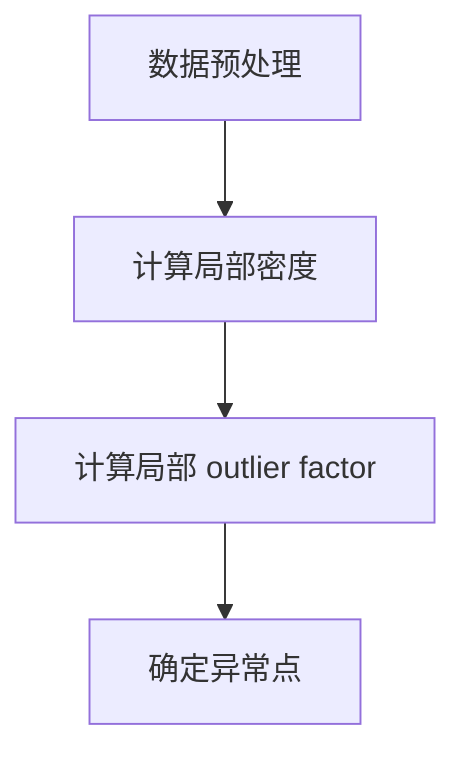
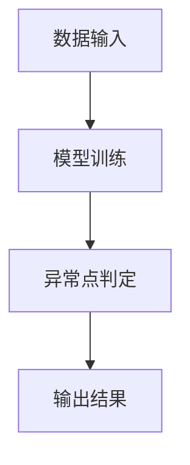
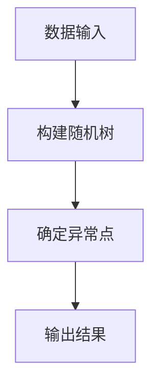
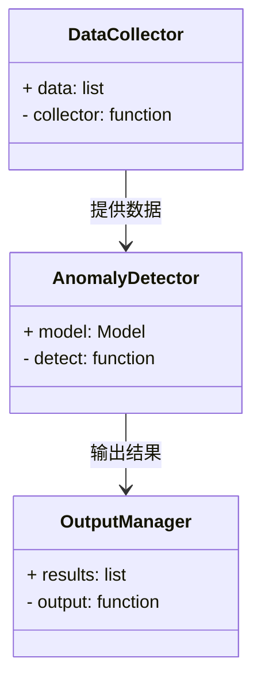
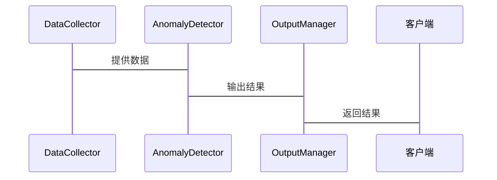

                 


## 第三部分: 异常检测算法原理

## 第3章: 异常检测算法原理

### 3.1 基于统计的异常检测

#### 3.1.1 LOF（局部 outlier factor）算法

##### LOF算法的数学模型

$$LOF = \frac{d_{\text{min}}}{d_{\text{mean}}}$$

其中：
- $d_{\text{min}}$：样本点的局部密度
- $d_{\text{mean}}$：区域的平均密度

##### LOF算法步骤（Mermaid流程图）



##### Python代码实现

```python
from sklearn.neighbors import NearestNeighbors

def lof_outlier_detection(X, n_neighbors=5):
    # 训练LOF模型
    clf = NearestNeighbors(n_neighbors=n_neighbors)
    clf.fit(X)
    
    # 计算每个点的局部密度和平均密度
    distances, _ = clf.kneighbors(X)
    avg_distances = distances.mean(axis=1)
    min_distances = np.min(distances, axis=1)
    
    # 计算LOF
    lof_scores = min_distances / avg_distances
    
    # 确定异常点（假设阈值为2）
    threshold = 2
    outliers = np.where(lof_scores > threshold)[0]
    
    return outliers
```

#### 3.1.2 LOF算法的优缺点

- **优点**：
  - 可以处理高维数据
  - 对局部异常敏感
- **缺点**：
  - 计算复杂度较高
  - 参数选择敏感

### 3.2 基于机器学习的异常检测

#### 3.2.1 One-Class SVM算法

##### One-Class SVM的数学模型

$$\text{minimize} \quad \frac{1}{2}\|w\|^2 + \xi$$

其中：
- $w$：法向量
- $\xi$：松弛变量

##### One-Class SVM算法步骤（Mermaid流程图）



##### Python代码实现

```python
from sklearn.svm import OneClassSVM

def one_class_svm_outlier_detection(X):
    # 训练One-Class SVM模型
    clf = OneClassSVM()
    clf.fit(X)
    
    # 预测异常点
    y_pred = clf.predict(X)
    outliers = np.where(y_pred == -1)[0]
    
    return outliers
```

#### 3.2.2 One-Class SVM的优缺点

- **优点**：
  - 适用于低维数据
  - 对正常数据分布建模能力强
- **缺点**：
  - 对异常点数量敏感
  - 需要调整参数

### 3.3 基于深度学习的异常检测

#### 3.3.1 Isolation Forest算法

##### Isolation Forest的数学模型

$$\text{异常概率} = \frac{1}{(2^{h})}$$

其中：
- $h$：树的高度

##### Isolation Forest算法步骤（Mermaid流程图）



##### Python代码实现

```python
from sklearn.ensemble import IsolationForest

def isolation_forest_outlier_detection(X, n_estimators=100):
    # 训练Isolation Forest模型
    clf = IsolationForest(n_estimators=n_estimators)
    clf.fit(X)
    
    # 预测异常点
    y_pred = clf.predict(X)
    outliers = np.where(y_pred == -1)[0]
    
    return outliers
```

#### 3.3.2 Isolation Forest的优缺点

- **优点**：
  - 对异常点检测能力强
  - 适用于高维数据
- **缺点**：
  - 对异常点数量敏感
  - 需要调整参数

---

## 第四部分: 系统分析与架构设计

## 第4章: 系统分析与架构设计

### 4.1 问题场景介绍

- **系统目标**：构建一个具有异常检测能力的AI Agent，能够实时监控数据流并检测异常。
- **主要问题**：数据流的实时性、异常检测的准确性、系统的可扩展性。

### 4.2 项目介绍

- **项目名称**：异常检测AI Agent系统
- **项目目标**：实现一个能够实时检测异常的AI Agent
- **项目范围**：数据采集、异常检测、结果输出

### 4.3 系统功能设计

#### 4.3.1 领域模型（Mermaid类图）



#### 4.3.2 系统架构设计（Mermaid架构图）

```mermaid
container 容器 {
    DataCollector
    AnomalyDetector
    OutputManager
}

DataCollector --> AnomalyDetector: 数据流
AnomalyDetector --> OutputManager: 结果流
```

#### 4.3.3 系统接口设计

- **数据接口**：数据输入格式、数据处理接口
- **结果接口**：异常结果输出格式、结果存储接口

#### 4.3.4 系统交互（Mermaid序列图）



---

## 第五部分: 项目实战

## 第5章: 项目实战

### 5.1 环境安装

```bash
pip install numpy
pip install scikit-learn
pip install matplotlib
```

### 5.2 系统核心实现源代码

```python
import numpy as np
import matplotlib.pyplot as plt
from sklearn.neighbors import NearestNeighbors
from sklearn.svm import OneClassSVM
from sklearn.ensemble import IsolationForest

# 数据生成
X = np.random.randn(100, 2)
X_outliers = np.random.uniform(-3, -1, size=(10, 2))
X = np.vstack((X, X_outliers))

# LOF算法实现
def lof_outlier_detection(X, n_neighbors=5):
    clf = NearestNeighbors(n_neighbors=n_neighbors)
    clf.fit(X)
    distances, _ = clf.kneighbors(X)
    avg_distances = distances.mean(axis=1)
    min_distances = np.min(distances, axis=1)
    lof_scores = min_distances / avg_distances
    threshold = 2
    outliers = np.where(lof_scores > threshold)[0]
    return outliers

# One-Class SVM实现
def one_class_svm_outlier_detection(X):
    clf = OneClassSVM()
    clf.fit(X)
    y_pred = clf.predict(X)
    outliers = np.where(y_pred == -1)[0]
    return outliers

# Isolation Forest实现
def isolation_forest_outlier_detection(X, n_estimators=100):
    clf = IsolationForest(n_estimators=n_estimators)
    clf.fit(X)
    y_pred = clf.predict(X)
    outliers = np.where(y_pred == -1)[0]
    return outliers

# 可视化
def visualize(X, outliers):
    plt.scatter(X[:, 0], X[:, 1], c='blue', s=10)
    plt.scatter(X[outliers, 0], X[outliers, 1], c='red', s=30, marker='^')
    plt.title('Anomaly Detection')
    plt.show()

# 主程序
def main():
    outliers_lof = lof_outlier_detection(X)
    outliers_svm = one_class_svm_outlier_detection(X)
    outliers_if = isolation_forest_outlier_detection(X)
    
    print("LOF检测到的异常点索引:", outliers_lof)
    print("One-Class SVM检测到的异常点索引:", outliers_svm)
    print("Isolation Forest检测到的异常点索引:", outliers_if)
    
    visualize(X, outliers_lof)

if __name__ == "__main__":
    main()
```

### 5.3 案例分析与详细讲解

- **数据生成**：生成包含异常点的数据集
- **算法实现**：分别使用LOF、One-Class SVM和Isolation Forest检测异常点
- **结果可视化**：将正常点和异常点标记出来，便于观察

### 5.4 项目小结

- **系统实现**：实现了三种异常检测算法，并进行了可视化展示
- **结果对比**：不同算法在不同数据集上的表现有所差异
- **优化方向**：可以根据具体场景选择合适的算法，并进行参数调优

---

## 第六部分: 最佳实践与总结

## 第6章: 最佳实践

### 6.1 总结与回顾

- **核心内容**：异常检测算法原理、AI Agent系统架构设计、项目实战
- **关键点**：选择合适的算法、设计合理的系统架构、进行充分的实验验证

### 6.2 注意事项

- **数据预处理**：异常检测对数据质量要求较高，需要进行充分的数据清洗和预处理
- **算法选择**：根据具体场景和数据特点选择合适的异常检测算法
- **系统优化**：考虑系统的可扩展性、可维护性和性能优化

### 6.3 tips与经验分享

- **算法调优**：通过网格搜索（Grid Search）进行参数优化
- **结果验证**：使用混淆矩阵、ROC曲线等方法验证算法性能
- **持续学习**：关注最新的异常检测算法和技术动态

### 6.4 拓展阅读

- **推荐书籍**：
  - 《Anomaly Detection: Methods and Applications》
  - 《Deep Learning for Anomaly Detection》
- **推荐论文**：
  - "Isolation Forest" by Liu et al.
  - "One-Class SVM" by Schölkopf et al.

---

## 附录

### 附录A: 术语表

- **异常检测**：识别数据中的异常点
- **AI Agent**：智能代理，能够感知环境、做出决策并执行动作
- **LOF**：局部异常因子，用于衡量数据点的局部密度
- **One-Class SVM**：一种基于支持向量机的异常检测算法
- **Isolation Forest**：一种基于隔离森林的异常检测算法

### 附录B: 参考文献

1. Liu, F. T., & Motwani, R. (2008). *Isolation forest*. Proceedings of the 2008 SIAM international conference on data mining.
2. Schölkopf, B., & Smola, A. J. (2002). *Learning with kernels: Support vector machines, regularization, optimization, and beyond*. MIT press.
3. Hawkins, S., & KRUEGER, T. (2002). *The detection of fraud in credit card transactions: a comparative review of classification techniques*. Journal of defrauding the bank.

---

# 结束语

通过本文的详细讲解，我们了解了异常检测在AI Agent中的重要性，学习了多种异常检测算法的原理与实现，并通过实际案例展示了如何构建一个具有异常检测能力的AI Agent系统。希望本文能够为读者提供有价值的参考与启发，帮助他们在实际项目中更好地应用这些技术。

--- 

**（完）**

