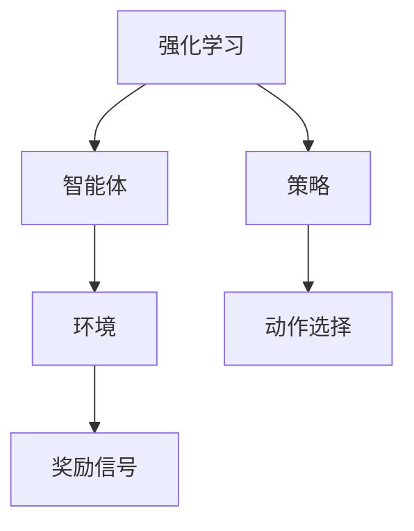
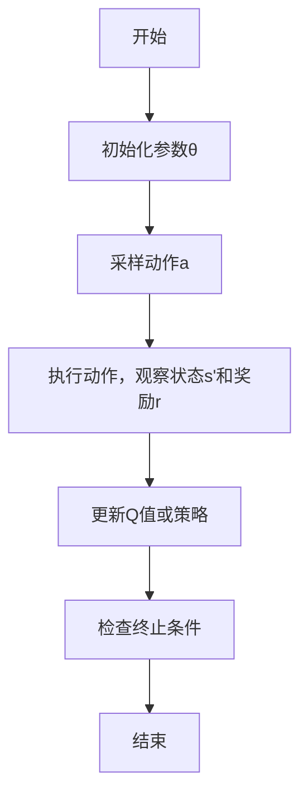
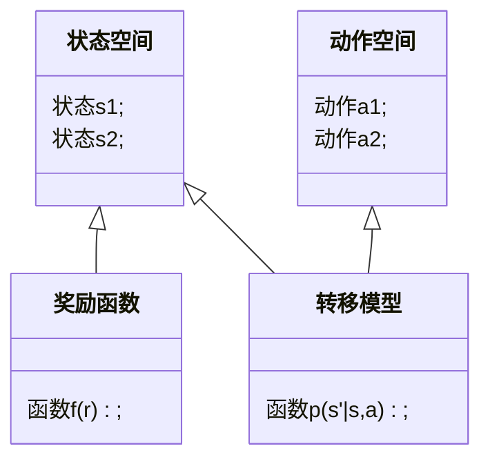
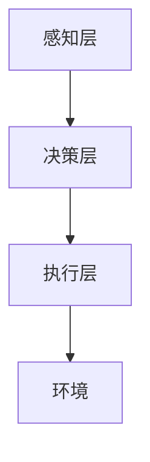

                 


# 构建具有强化学习能力的AI Agent

> 关键词：强化学习，AI Agent，深度强化学习，算法原理，系统架构，项目实战

> 摘要：本文详细探讨了构建具有强化学习能力的AI Agent的过程，从背景介绍到核心概念，再到算法原理、系统架构、项目实战和最佳实践，为读者提供全面的指导。

---

## 第1章: 强化学习与AI Agent的背景介绍

### 1.1 问题背景与问题描述

在现代人工智能领域，强化学习（Reinforcement Learning, RL）作为一种重要的机器学习范式，广泛应用于游戏AI、机器人控制、推荐系统等领域。AI Agent，即智能体，通过与环境交互，学习最优策略以实现目标。然而，传统的强化学习方法在复杂环境和高维状态空间中表现受限，需要结合深度学习技术进行优化。

### 1.2 强化学习的核心问题解决方法

强化学习通过智能体与环境的交互，学习最优策略。智能体通过选择动作，观察环境反馈的状态和奖励，逐步优化策略。本文将探讨如何结合深度学习技术，构建高效的AI Agent。

### 1.3 强化学习的边界与外延

强化学习与监督学习和无监督学习有显著区别。监督学习基于标注数据，无监督学习发现数据结构，而强化学习依赖于与环境的交互和奖励反馈。本文将重点探讨强化学习在AI Agent中的应用，包括算法优化和系统设计。

### 1.4 强化学习的概念结构与核心要素组成

强化学习的核心要素包括智能体、环境、动作、状态和奖励。本文将详细分析这些要素，并结合AI Agent的设计，探讨如何构建高效的学习系统。

---

## 第2章: 强化学习的核心概念与联系

### 2.1 强化学习的基本原理

#### 2.1.1 马尔可夫决策过程（MDP）

MDP是强化学习的基础模型，包括状态、动作、转移概率和奖励函数。本文将通过实例分析，帮助读者理解MDP的核心概念。

#### 2.1.2 Q-learning算法

Q-learning是一种经典的值迭代算法，通过更新Q表，学习最优策略。本文将详细解释Q-learning的数学模型和实现步骤。

#### 2.1.3 策略梯度方法

策略梯度方法直接优化策略，通过梯度上升寻找最优策略。本文将探讨策略梯度的核心思想和实现方法。

### 2.2 AI Agent与强化学习的关系

#### 2.2.1 AI Agent作为强化学习的主体

AI Agent通过强化学习与环境交互，学习最优策略。本文将探讨AI Agent在强化学习中的角色和作用。

#### 2.2.2 强化学习如何赋予AI Agent决策能力

强化学习通过奖励机制，帮助AI Agent学习最优决策策略。本文将分析强化学习在AI Agent决策中的应用。

#### 2.2.3 AI Agent与监督学习、无监督学习的对比

本文将对比强化学习与其他机器学习方法的异同，帮助读者更好地理解强化学习的特点。

### 2.3 核心概念对比表格

| 概念         | 强化学习          | 监督学习          | 无监督学习        |
|--------------|-------------------|-------------------|------------------|
| 数据来源     | 环境反馈          | 标签数据          | 未标记数据        |
| 学习目标     | 最优策略          | 预测或分类         | 数据结构发现       |
| 交互方式     | 主动与环境交互     | 无交互            | 无交互            |
| 典型算法     | Q-learning, DQN   | 线性回归, SVM      | K-means, t-SNE   |

### 2.4 ER实体关系图

使用 Mermaid 绘制的强化学习核心概念关系图：



---

## 第3章: 深度强化学习的算法原理

### 3.1 深度强化学习的数学模型

#### 3.1.1 神经网络结构

深度强化学习通过神经网络近似价值函数或策略。本文将介绍常用的神经网络结构，包括卷积神经网络和循环神经网络。

#### 3.1.2 损失函数

深度强化学习的损失函数通常包括价值损失和策略损失。本文将详细推导损失函数的数学表达式。

#### 3.1.3 优化算法

常用的优化算法包括Adam和RMSprop。本文将探讨优化算法在深度强化学习中的应用。

### 3.2 算法原理的详细讲解

#### 3.2.1 Q-learning的数学公式

Q-learning的更新公式为：
$$ Q(s, a) = Q(s, a) + \alpha (r + \gamma \max Q(s', a') - Q(s, a)) $$

#### 3.2.2 策略梯度方法的数学公式

策略梯度方法的目标函数为：
$$ J(\theta) = \mathbb{E}_{\tau \sim \pi_\theta} [\sum_{t} r_t] $$

梯度计算为：
$$ \nabla \theta J(\theta) = \mathbb{E}_{\tau \sim \pi_\theta} [\sum_{t} \nabla_\theta \log \pi_\theta(a_t|s_t) Q_\theta(s_t, a_t)] $$

### 3.3 使用 Mermaid 绘制的算法流程图



---

## 第4章: 系统架构设计与实现

### 4.1 问题场景介绍

本文将通过构建一个AI Agent来实现强化学习，应用于游戏AI的训练。通过分析问题场景，设计系统的功能模块和架构。

### 4.2 项目介绍

本项目旨在构建一个基于强化学习的AI Agent，实现游戏中的自动决策。通过深度强化学习算法，优化AI Agent的决策策略。

### 4.3 系统功能设计

#### 4.3.1 领域模型

领域模型包括状态空间、动作空间、奖励函数和转移模型。本文将使用Mermaid类图展示领域模型。



#### 4.3.2 系统架构设计

系统架构包括感知层、决策层和执行层。本文将使用Mermaid架构图展示系统架构。



#### 4.3.3 系统接口设计

系统接口包括状态输入、动作输出和奖励反馈。本文将使用Mermaid序列图展示系统接口设计。

```mermaid
sequenceDiagram
参与者 智能体
参与者 环境
智能体 ->> 环境: 发送动作a
环境 ->> 智能体: 返回状态s'和奖励r
智能体 ->> 环境: 发送动作a'
环境 ->> 智能体: 返回状态s''和奖励r'
```

---

## 第5章: 项目实战与代码实现

### 5.1 环境安装与配置

本文将指导读者如何安装和配置强化学习环境，包括安装Python、TensorFlow和OpenAI Gym等库。

### 5.2 核心代码实现

#### 5.2.1 神经网络模型

```python
import tensorflow as tf
class DQN(tf.keras.Model):
    def __init__(self, state_space, action_space):
        super(DQN, self).__init__()
        self.fc1 = tf.keras.layers.Dense(64, activation='relu')
        self.fc2 = tf.keras.layers.Dense(64, activation='relu')
        self.fc3 = tf.keras.layers.Dense(action_space, activation='linear')
        
    def call(self, x):
        x = self.fc1(x)
        x = self.fc2(x)
        x = self.fc3(x)
        return x
```

#### 5.2.2 训练过程

```python
import numpy as np
from collections import deque
import gym

class DQNAgent:
    def __init__(self, env):
        self.env = env
        self.memory = deque(maxlen=1000)
        self.gamma = 0.99
        self.epsilon = 1.0
        self.epsilon_min = 0.01
        self.batch_size = 64
        self.model = DQN(env.observation_space.shape[0], env.action_space.n)
        self.optimizer = tf.keras.optimizers.Adam(learning_rate=0.001)
    
    def remember(self, state, action, reward, next_state):
        self.memory.append((state, action, reward, next_state))
    
    def act(self, state):
        if np.random.random() < self.epsilon:
            return self.env.action_space.sample()
        else:
            q_values = self.model(tf.convert_to_tensor([state], dtype=tf.float32))
            return np.argmax(q_values.numpy()[0])
    
    def replay(self):
        if len(self.memory) < self.batch_size:
            return
        batch = np.random.choice(len(self.memory), self.batch_size)
        states = []
        actions = []
        rewards = []
        next_states = []
        for i in batch:
            state, action, reward, next_state = self.memory[i]
            states.append(state)
            actions.append(action)
            rewards.append(reward)
            next_states.append(next_state)
        states = tf.convert_to_tensor(states, dtype=tf.float32)
        next_states = tf.convert_to_tensor(next_states, dtype=tf.float32)
        q_values = self.model(states)
        next_q_values = self.model(next_states)
        targets = q_values.numpy()
        for i in range(self.batch_size):
            targets[i][actions[i]] = rewards[i] + self.gamma * np.max(next_q_values.numpy()[i])
        with tf.GradientTape() as tape:
            loss = tf.keras.losses.mse(targets, q_values)
        grads = tape.gradient(loss, self.model.trainable_variables)
        self.optimizer.apply_gradients(zip(grads, self.model.trainable_variables))
        if self.epsilon > self.epsilon_min:
            self.epsilon *= 0.99
```

#### 5.2.3 训练与测试

```python
def train():
    env = gym.make('CartPole-v1')
    agent = DQNAgent(env)
    for episode in range(1000):
        state = env.reset()
        total_reward = 0
        while True:
            action = agent.act(state)
            next_state, reward, done, _ = env.step(action)
            agent.remember(state, action, reward, next_state)
            agent.replay()
            total_reward += reward
            state = next_state
            if done:
                break
        print(f'Episode {episode}, Reward: {total_reward}')
    env.close()

train()
```

### 5.3 实际案例分析

本文将通过训练一个AI Agent在CartPole环境中平衡杆子的案例，展示强化学习的应用。通过逐步训练，AI Agent能够学会在复杂环境中做出最优决策。

### 5.4 项目小结

本项目通过实际案例，展示了如何构建和训练具有强化学习能力的AI Agent。代码实现详细解释了神经网络模型和训练过程，帮助读者理解深度强化学习的核心思想。

---

## 第6章: 最佳实践与总结

### 6.1 最佳实践

- **算法选择**：根据问题场景选择合适的强化学习算法。
- **环境设计**：合理设计奖励机制，引导AI Agent学习正确的策略。
- **超参数调整**：通过实验调整学习率、折扣因子等超参数，优化训练效果。

### 6.2 项目总结

本文详细探讨了构建具有强化学习能力的AI Agent的过程，从算法原理到系统设计，再到项目实战，为读者提供了全面的指导。通过实际案例，展示了深度强化学习在复杂环境中的应用。

### 6.3 注意事项

- **计算资源**：深度强化学习需要大量计算资源，建议使用GPU加速训练。
- **数据处理**：合理处理和存储训练数据，避免数据溢出和损坏。
- **模型评估**：通过回放和测试，评估AI Agent的性能，确保模型的有效性。

### 6.4 未来展望

未来，随着计算能力的提升和算法的优化，强化学习将在更多领域得到应用。AI Agent将更加智能化，能够处理更复杂的任务，为人类创造更大的价值。

---

## 附录: 扩展阅读

- **论文推荐**：
  1. "Deep Reinforcement Learning with Double Q-learning" by H. W. N. de Winter and others.
  2. "Actor-Critic Methods" by Richard S. Sutton and others.

- **工具与库**：
  - OpenAI Gym
  - TensorFlow
  - Keras
  - PyTorch

通过本文的学习，读者可以系统地掌握构建具有强化学习能力的AI Agent的方法，为深入研究和实践打下坚实的基础。

--- 

**全文完**。

