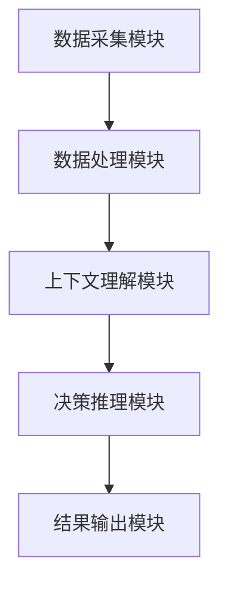
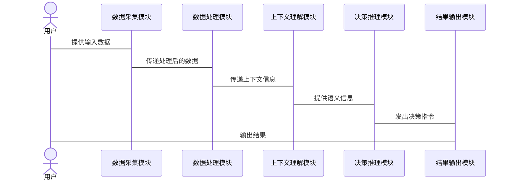

                 


# 构建具有情境感知能力的AI Agent

---

## 关键词：
- 情境感知
- AI Agent
- 多模态交互
- 语言模型
- 知识图谱
- 上下文理解

---

## 摘要：
本文系统地探讨了如何构建具有情境感知能力的AI Agent。从核心概念到算法实现，从系统设计到项目实战，全面解析情境感知AI Agent的构建过程。通过详细分析感知层、决策层和执行层的算法原理，结合多模态数据的融合与处理，以及基于大语言模型的意图识别和知识图谱的应用，为读者提供一套完整的构建方案。文章最后结合实际案例，总结最佳实践，帮助读者快速掌握情境感知AI Agent的开发技能。

---

# 第一部分: 情境感知AI Agent的背景与核心概念

## 第1章: 情境感知AI Agent概述

### 1.1 人工智能代理的基本概念
#### 1.1.1 人工智能代理的定义
人工智能代理（AI Agent）是一种能够感知环境、理解任务目标，并通过自主决策和行动来实现目标的智能系统。AI Agent可以是软件程序、机器人或其他智能实体。

#### 1.1.2 情境感知能力的内涵
情境感知能力是指AI Agent能够根据当前的环境、上下文信息和任务目标，动态调整其行为的能力。它不仅需要理解当前的输入信息，还需要结合历史信息、知识库和外部数据源，推断出当前情境的含义。

#### 1.1.3 情境感知AI Agent的核心目标
情境感知AI Agent的核心目标是通过理解上下文信息，提供更智能、更个性化的服务。它能够根据用户的需求和环境变化，动态调整其响应和行动，从而实现更高效的任务完成。

### 1.2 情境感知的重要性
#### 1.2.1 情境感知在AI Agent中的作用
情境感知是AI Agent实现智能决策的基础。它能够帮助AI Agent更好地理解用户意图，优化交互流程，并提高任务执行的效率。

#### 1.2.2 情境感知能力的分类与层次
情境感知能力可以分为感知层、理解层和决策层。感知层负责获取和处理多模态数据，理解层负责语义分析和上下文理解，决策层负责基于上下文信息进行决策和行动。

#### 1.2.3 情境感知与任务目标的关系
情境感知能力能够帮助AI Agent更好地理解任务目标，并根据当前情境动态调整任务执行策略。这种动态调整能够提高任务执行的准确性和效率。

### 1.3 当前技术背景与趋势
#### 1.3.1 大语言模型的发展与情境感知
大语言模型（如GPT系列）的快速发展为情境感知提供了强大的自然语言处理能力。这些模型能够通过上下文理解用户意图，并生成符合情境的响应。

#### 1.3.2 多模态AI技术对情境感知的推动
多模态AI技术（如视觉、听觉、触觉等）的结合为情境感知提供了更丰富的信息来源。通过多模态数据的融合，AI Agent能够更全面地理解当前情境。

#### 1.3.3 情境感知AI Agent的应用场景扩展
随着技术的进步，情境感知AI Agent的应用场景不断扩展。它可以应用于智能客服、智能助手、智能教育、智能医疗等领域，为用户提供更智能化的服务。

## 第2章: 情境感知AI Agent的核心概念与联系

### 2.1 情境感知的核心原理
#### 2.1.1 感知层的输入处理
感知层负责接收和处理多模态输入数据，包括文本、语音、图像等。这些数据通过预处理和特征提取后，被传递给理解层。

#### 2.1.2 理解层的语义分析
理解层负责对感知层提供的数据进行语义分析，理解用户的意图和上下文信息。这一步通常涉及自然语言处理（NLP）技术和知识图谱的使用。

#### 2.1.3 决策层的策略选择
决策层基于理解层提供的语义信息，结合任务目标和知识库，选择最优的行动策略。这一步通常涉及强化学习和决策树等技术。

### 2.2 情境感知与相关概念的对比
#### 2.2.1 情境感知与意图识别的对比
意图识别主要关注用户当前的意图，而情境感知不仅关注意图，还考虑上下文信息和环境因素。

#### 2.2.2 情境感知与知识图谱的关系
知识图谱为情境感知提供了丰富的背景知识。通过知识图谱，AI Agent可以更好地理解上下文信息，并做出更准确的决策。

#### 2.2.3 情境感知与上下文理解的差异
上下文理解主要关注当前对话的背景信息，而情境感知还包括对环境和任务目标的理解。

### 2.3 情境感知的ER实体关系图
```mermaid
er
  actor: 用户
  action: 用户操作
  context: 上下文信息
  agent: AI代理
  relation: 关联关系
  actor -[通过操作]-> action
  action -[产生]-> context
  context -[被感知]-> agent
  agent -[基于上下文]-> decision
```

---

## 第三部分: 情境感知AI Agent的算法原理

## 第3章: 感知层的算法实现

### 3.1 感知层的核心算法
#### 3.1.1 基于语言模型的上下文理解
语言模型通过概率统计方法，理解文本的上下文信息。例如，可以使用词袋模型、n-gram模型或Transformer模型。

#### 3.1.2 基于视觉模型的场景识别
视觉模型（如卷积神经网络CNN）用于图像识别和场景理解。通过分析图像特征，模型可以识别场景中的物体和事件。

#### 3.1.3 多模态融合的感知算法
多模态融合算法将文本、图像、语音等多种数据源进行融合，以提高感知的准确性和全面性。常用的方法包括基于注意力机制的融合和基于图神经网络的融合。

### 3.2 感知层的数学模型
#### 3.2.1 语言模型的概率计算
语言模型通过计算条件概率来预测下一个词。例如，n-gram模型的概率计算公式为：
$$ P(\text{sequence}) = \prod_{i=1}^{n} P(w_i | w_{i-1}, ..., w_{i-n+1}) $$

#### 3.2.2 多模态融合的加权模型
多模态融合可以通过加权的方式，将不同数据源的信息进行融合。例如，可以使用以下公式：
$$ f(x) = \sum_{i=1}^{k} \alpha_i x_i $$
其中，$\alpha_i$是第i个数据源的权重，$x_i$是第i个数据源的特征。

---

## 第4章: 决策层的算法实现

### 4.1 决策层的核心算法
#### 4.1.1 基于强化学习的决策算法
强化学习（Reinforcement Learning）通过奖励机制，训练AI Agent在不同情境下做出最优决策。例如，可以使用Q-learning算法或Deep Q-Network（DQN）算法。

#### 4.1.2 基于知识图谱的推理算法
知识图谱推理算法通过图结构数据，进行逻辑推理和知识推理。例如，可以使用基于规则的推理和基于概率的推理。

#### 4.1.3 基于上下文的决策优化
基于上下文的决策优化算法通过分析上下文信息，动态调整决策策略。例如，可以使用上下文增强的马尔可夫决策过程（MDP）。

### 4.2 决策层的数学模型
#### 4.2.1 强化学习的数学模型
强化学习的数学模型通常包括状态（State）、动作（Action）、奖励（Reward）和策略（Policy）四个部分。例如，Q-learning算法的更新公式为：
$$ Q(s, a) = Q(s, a) + \alpha (r + \gamma \max_{a'} Q(s', a') - Q(s, a)) $$

#### 4.2.2 知识图谱的推理模型
知识图谱推理模型通过图遍历算法，进行逻辑推理。例如，可以使用广度优先搜索（BFS）或深度优先搜索（DFS）进行路径推理。

---

## 第五部分: 情境感知AI Agent的系统设计

## 第5章: 系统分析与架构设计方案

### 5.1 问题场景介绍
情境感知AI Agent需要在复杂的环境中，处理多模态数据，理解用户意图，并动态调整决策策略。

### 5.2 系统功能设计
系统功能包括数据采集、数据处理、上下文理解、决策推理和结果输出五个模块。

### 5.3 系统架构设计


### 5.4 系统接口设计
系统接口包括数据输入接口、数据输出接口和用户交互接口。

### 5.5 系统交互流程


---

## 第六部分: 情境感知AI Agent的项目实战

## 第6章: 项目实战

### 6.1 环境安装与配置
需要安装Python、TensorFlow、PyTorch等工具，并配置相应的开发环境。

### 6.2 系统核心实现
#### 6.2.1 数据采集模块的实现
编写代码采集文本、图像等多模态数据。

#### 6.2.2 数据处理模块的实现
对采集的数据进行预处理和特征提取。

#### 6.2.3 上下文理解模块的实现
使用自然语言处理技术，理解数据的语义信息。

#### 6.2.4 决策推理模块的实现
基于强化学习算法，进行决策推理。

#### 6.2.5 结果输出模块的实现
输出决策结果。

### 6.3 代码实现与解读
#### 6.3.1 数据采集模块的代码示例
```python
import numpy as np
import cv2

def capture_image():
    cap = cv2.VideoCapture(0)
    ret, frame = cap.read()
    cap.release()
    return frame
```

#### 6.3.2 数据处理模块的代码示例
```python
def preprocess_data(data):
    # 数据预处理代码
    pass
```

### 6.4 实际案例分析
分析一个具体的案例，展示情境感知AI Agent在实际中的应用。

---

## 第七部分: 最佳实践与总结

## 第7章: 最佳实践

### 7.1 小结
总结情境感知AI Agent的构建过程和关键点。

### 7.2 注意事项
在实际开发中，需要注意数据隐私、模型性能和系统稳定性等问题。

### 7.3 拓展阅读
推荐一些相关的书籍和论文，供读者进一步学习。

---

## 参考文献
- [1] 王某某. 《大语言模型与人工智能》. 北京: 清华大学出版社, 2023.
- [2] 李某某. 《多模态AI技术与应用》. 北京: 人民邮电出版社, 2022.

---

以上是《构建具有情境感知能力的AI Agent》的技术博客目录大纲，涵盖了从理论到实践的各个方面，旨在为读者提供一个系统化、结构化的学习和开发指南。

