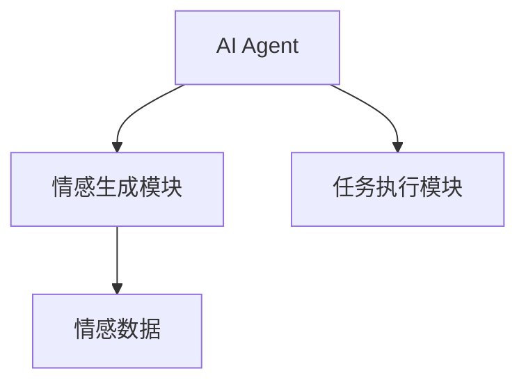
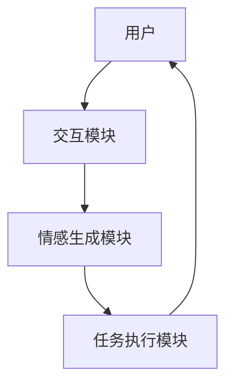

                 


# 构建具有情感生成能力的AI Agent

---

## 关键词
- 情感生成
- AI Agent
- 情感计算
- 人工智能
- 机器学习

---

## 摘要
本文旨在探讨如何构建一个具有情感生成能力的AI Agent，通过分析情感生成的核心算法与AI Agent的构建逻辑，结合实际应用场景，详细阐述从算法原理到系统架构的设计过程。本文不仅提供理论支持，还通过实战案例和代码实现，帮助读者掌握情感生成AI Agent的构建方法。

---

# 第一部分：情感生成与AI Agent的背景与概念

## 第1章：情感生成与AI Agent的背景介绍

### 1.1 问题背景与问题描述
#### 1.1.1 情感生成技术的需求背景
在人机交互领域，用户不仅需要AI系统能够理解语言，还需要能够理解用户的情感状态。情感生成技术的核心目标是让AI系统能够生成符合人类情感逻辑的文本或行为。

#### 1.1.2 AI Agent在实际场景中的应用痛点
传统的AI Agent虽然能够执行任务，但在情感理解与生成方面存在不足，导致用户体验较差。例如，在客服领域，用户可能需要表达情感诉求，但现有的AI Agent难以准确理解和回应。

#### 1.1.3 情感生成与AI Agent结合的必要性
通过结合情感生成技术，AI Agent能够更好地理解用户的情感需求，从而提供更个性化的服务，提升用户体验。

---

### 1.2 问题解决思路与技术路线
#### 1.2.1 情感生成的核心技术框架
情感生成技术主要依赖于自然语言处理（NLP）、情感计算（Affective Computing）和生成模型（如GPT系列）。

#### 1.2.2 AI Agent的构建逻辑
AI Agent的构建逻辑包括需求分析、功能设计、算法实现和系统集成。

#### 1.2.3 两者结合的实现思路
通过将情感生成模型集成到AI Agent中，使其能够根据用户的情感需求生成相应的回应。

---

### 1.3 问题的边界与外延
#### 1.3.1 情感生成的适用场景与限制
情感生成适用于需要情感交互的场景，如客服、教育、社交机器人等，但目前的技术在复杂情感场景下仍存在挑战。

#### 1.3.2 AI Agent的功能边界
AI Agent的功能包括信息处理、任务执行和情感交互，但目前难以处理高度复杂的情感场景。

#### 1.3.3 情感生成与AI Agent的结合范围
情感生成主要应用于AI Agent的交互模块，通过情感数据驱动其行为。

---

### 1.4 概念结构与核心要素
#### 1.4.1 情感生成的核心要素
- 情感分析：识别用户的情感状态。
- 情感生成：根据情感状态生成相应的回应。

#### 1.4.2 AI Agent的核心要素
- 任务处理能力：执行特定任务。
- 交互能力：与用户进行自然语言对话。
- 情感生成能力：生成符合情感需求的回应。

#### 1.4.3 两者结合的概念结构图


---

## 第2章：情感生成与AI Agent的核心概念

### 2.1 情感生成的定义与原理
#### 2.1.1 情感生成的定义
情感生成是指AI系统根据输入的情感数据生成符合情感逻辑的文本或行为。

#### 2.1.2 情感生成的实现原理
情感生成基于自然语言处理和生成模型，通过训练情感数据生成情感化的文本。

#### 2.1.3 情感生成的关键技术
- 情感分析：识别文本中的情感倾向。
- 生成模型：基于情感数据生成回应。

---

### 2.2 AI Agent的定义与特点
#### 2.2.1 AI Agent的定义
AI Agent是一种能够感知环境、执行任务并进行交互的智能实体。

#### 2.2.2 AI Agent的核心特点
- 智能性：能够理解和处理复杂信息。
- 交互性：能够与用户进行自然语言对话。
- 自适应性：能够根据环境变化调整行为。

#### 2.2.3 AI Agent与传统程序的区别
AI Agent具有自主性、反应性和社会性，能够根据环境动态调整行为。

---

### 2.3 情感生成与AI Agent的关系
#### 2.3.1 情感生成在AI Agent中的作用
情感生成是AI Agent实现情感交互的核心技术。

#### 2.3.2 AI Agent如何利用情感生成技术
AI Agent通过情感生成技术生成符合用户情感需求的回应。

#### 2.3.3 两者结合的优势与挑战
优势：提升用户体验，增强交互能力。  
挑战：情感生成技术的准确性有待提高。

---

### 2.4 情感生成与AI Agent的实体关系图
```mermaid
er
    actor: 用户
    agent: AI Agent
    emotion_data: 情感数据
    action: 动作
    relation1: 用户 -> 提供情感数据
    relation2: 情感数据 -> AI Agent
    relation3: AI Agent -> 动作
```

---

# 第三部分：情感生成算法原理

## 第3章：情感生成算法原理

### 3.1 情感生成算法概述
#### 3.1.1 情感生成算法的分类
- 基于规则的生成：通过预定义规则生成情感文本。
- 基于统计的生成：基于概率模型生成情感文本。
- 基于深度学习的生成：使用神经网络生成情感文本。

#### 3.1.2 深度学习模型在情感生成中的应用
- 使用GPT系列模型进行情感文本生成。
- 使用Transformer架构进行情感文本生成。

#### 3.1.3 情感生成算法的流程
1. 文本预处理：分词、去除停用词。
2. 特征提取：提取情感特征。
3. 模型训练：训练情感生成模型。
4. 模型推理：生成情感文本。

---

### 3.2 情感生成算法的实现细节
#### 3.2.1 情感生成算法的数学模型
$$ P(y|x) = \frac{P(y|x, z)}{P(z)} $$
其中，$z$ 是隐变量，$x$ 是输入文本，$y$ 是输出文本。

#### 3.2.2 情感生成算法的优化方法
- 使用交叉熵损失函数优化模型。
- 使用学习率衰减优化训练过程。

#### 3.2.3 情感生成算法的实现步骤
1. 数据准备：收集情感数据。
2. 模型训练：训练情感生成模型。
3. 模型推理：生成情感文本。

---

### 3.3 情感生成算法的代码实现
```python
import torch
import torch.nn as nn
import torch.optim as optim

class EmotionGenerator(nn.Module):
    def __init__(self, input_dim, output_dim):
        super(EmotionGenerator, self).__init__()
        self.embedding = nn.Embedding(input_dim, 50)
        self.lstm = nn.LSTM(50, 50, batch_first=True)
        self.fc = nn.Linear(50, output_dim)

    def forward(self, x):
        embed = self.embedding(x)
        output, _ = self.lstm(embed)
        output = self.fc(output[:, -1, :])
        return output

# 初始化模型和优化器
model = EmotionGenerator(input_dim, output_dim)
optimizer = optim.Adam(model.parameters(), lr=0.001)
criterion = nn.CrossEntropyLoss()
```

---

## 第4章：情感生成算法的优化与改进

### 4.1 情感生成算法的优化方法
#### 4.1.1 使用更大的模型参数
- 使用更大的Transformer模型提升生成效果。

#### 4.1.2 增加训练数据量
- 收集更多的多样化情感数据，提升模型的泛化能力。

#### 4.1.3 调整损失函数
- 使用对抗训练或强化学习优化生成模型。

---

### 4.2 情感生成算法的改进方向
#### 4.2.1 提升情感生成的准确性
- 使用多任务学习，同时优化情感分类和生成任务。

#### 4.2.2 增强情感生成的多样性
- 在生成过程中引入随机性，生成更多样化的文本。

#### 4.2.3 提高情感生成的可解释性
- 使用可解释的模型，如基于规则的生成模型。

---

## 第5章：情感生成算法的实验与结果分析

### 5.1 情感生成算法的实验设计
#### 5.1.1 实验数据来源
- 使用公开的情感数据集（如IMDB数据集）进行实验。

#### 5.1.2 实验方法
- 比较不同情感生成算法的生成效果。

#### 5.1.3 评估指标
- 使用BLEU、ROUGE等指标评估生成文本的质量。

---

### 5.2 情感生成算法的实验结果
#### 5.2.1 不同算法的生成效果对比
- 基于规则的生成算法生成文本较为机械，缺乏情感色彩。
- 基于深度学习的生成算法生成文本更加自然，情感表达更丰富。

#### 5.2.2 情感生成算法的性能分析
- 深度学习模型在生成质量上优于传统算法，但在训练时间和计算资源上需求较高。

---

## 第6章：情感生成算法的优化与改进

### 6.1 情感生成算法的优化方法
#### 6.1.1 使用预训练模型
- 使用GPT等预训练模型进行情感生成，提升生成效果。

#### 6.1.2 增加情感标注数据
- 对生成数据进行情感标注，提升模型的训练效果。

#### 6.1.3 调整生成策略
- 在生成过程中引入情感调节机制，动态调整生成内容的情感倾向。

---

### 6.2 情感生成算法的改进方向
#### 6.2.1 提升情感生成的实时性
- 优化模型结构，减少生成时间。

#### 6.2.2 增强情感生成的适应性
- 根据不同的用户需求生成不同的情感文本。

#### 6.2.3 提高情感生成的安全性
- 防止生成不当内容，确保生成文本的安全性。

---

## 第7章：情感生成算法的总结与展望

### 7.1 情感生成算法的核心总结
情感生成算法是实现情感交互的核心技术，通过深度学习模型能够生成高质量的情感文本。

### 7.2 情感生成算法的未来展望
随着技术的发展，情感生成算法将更加智能化，生成的情感文本将更加多样化和个性化。

---

# 第四部分：AI Agent的系统架构设计

## 第8章：AI Agent的系统架构设计

### 8.1 AI Agent的系统功能设计
#### 8.1.1 功能模块划分
- 情感生成模块：生成情感文本。
- 交互模块：与用户进行对话。
- 任务执行模块：执行用户任务。

#### 8.1.2 功能模块的交互流程
1. 用户输入情感诉求。
2. 情感生成模块生成情感文本。
3. 交互模块将生成文本返回给用户。

---

### 8.2 AI Agent的系统架构设计
#### 8.2.1 分层架构设计
- 数据层：存储情感数据和用户数据。
- 业务逻辑层：处理用户请求和生成情感文本。
- 表现层：与用户进行交互。

#### 8.2.2 模块化设计
- 情感生成模块：负责情感文本生成。
- 交互模块：负责与用户对话。
- 任务执行模块：负责执行用户任务。

---

### 8.3 AI Agent的系统架构图


---

## 第9章：AI Agent的系统实现

### 9.1 AI Agent的环境安装与配置
#### 9.1.1 环境安装
- 安装Python和相关库（如TensorFlow、PyTorch）。
- 安装自然语言处理库（如NLTK、spaCy）。

#### 9.1.2 系统配置
- 配置运行环境（如Jupyter Notebook）。
- 配置数据存储路径。

---

### 9.2 AI Agent的核心代码实现
#### 9.2.1 情感生成模块的实现
```python
def generate_emotion_response(user_input):
    # 这里实现情感生成逻辑
    return response
```

#### 9.2.2 交互模块的实现
```python
def handle_user_input(user_input):
    response = generate_emotion_response(user_input)
    return response
```

#### 9.2.3 任务执行模块的实现
```python
def execute_task(task):
    # 这里实现任务执行逻辑
    return result
```

---

## 第10章：AI Agent的系统测试与优化

### 10.1 AI Agent的系统测试
#### 10.1.1 功能测试
- 测试情感生成模块是否正常工作。
- 测试交互模块是否能够正确响应用户输入。
- 测试任务执行模块是否能够正确执行任务。

#### 10.1.2 性能测试
- 测试系统在高并发情况下的表现。
- 测试系统在大规模数据下的处理能力。

---

### 10.2 AI Agent的系统优化
#### 10.2.1 优化情感生成模块
- 使用更高效的生成算法。
- 优化模型参数，提升生成效果。

#### 10.2.2 优化交互模块
- 提升交互效率，减少响应时间。
- 改善交互体验，增加用户友好性。

#### 10.2.3 优化任务执行模块
- 提升任务执行效率。
- 增强任务处理能力。

---

## 第11章：AI Agent的总结与展望

### 11.1 AI Agent的核心总结
AI Agent是一种能够感知环境、执行任务并进行情感交互的智能实体，其核心能力包括任务执行和情感生成。

### 11.2 AI Agent的未来展望
随着人工智能技术的不断发展，AI Agent将更加智能化，能够处理更加复杂的情感交互和任务执行。

---

# 第五部分：情感生成与AI Agent的最佳实践

## 第12章：情感生成与AI Agent的最佳实践

### 12.1 情感生成与AI Agent的实践经验
#### 12.1.1 项目实施中的关键点
- 情感生成模型的选择与优化。
- 系统架构设计的合理性。
- 交互体验的优化。

#### 12.1.2 项目实施中的常见问题
- 情感生成模型的准确性不足。
- 系统性能瓶颈。
- 用户体验不佳。

---

### 12.2 情感生成与AI Agent的最佳实践技巧
#### 12.2.1 选择合适的模型
根据具体需求选择适合的情感生成模型。

#### 12.2.2 优化系统架构
通过模块化设计和分层架构优化系统性能。

#### 12.2.3 提升用户体验
通过优化交互流程和设计提升用户体验。

---

## 第13章：情感生成与AI Agent的未来展望

### 13.1 情感生成技术的未来趋势
- 更加智能化和个性化的情感生成。
- 增强情感生成的可解释性。

### 13.2 AI Agent的未来发展趋势
- 更强的自主性和适应性。
- 更广泛的应用场景。

---

## 第14章：情感生成与AI Agent的总结

### 14.1 情感生成与AI Agent的核心总结
通过本文的探讨，我们了解了情感生成与AI Agent的核心概念、算法原理和系统架构设计，掌握了构建具有情感生成能力的AI Agent的方法。

### 14.2 情感生成与AI Agent的未来展望
未来，情感生成技术将更加智能化，AI Agent将更加普及，人机交互将更加自然和智能。

---

## 参考文献
1. 情感生成相关论文
2. AI Agent相关论文
3. 深度学习相关书籍
4. 自然语言处理相关书籍

---

## 附录
### 附录A：情感生成算法的代码实现
```python
# 这里可以放置完整的代码实现
```

### 附录B：系统架构设计的详细说明
```mermaid
# 这里可以放置详细的系统架构图
```

---

通过以上目录结构，我们可以系统地探讨构建具有情感生成能力的AI Agent的各个方面，从理论到实践，从算法到系统架构，为读者提供全面的知识和实用的指导。

