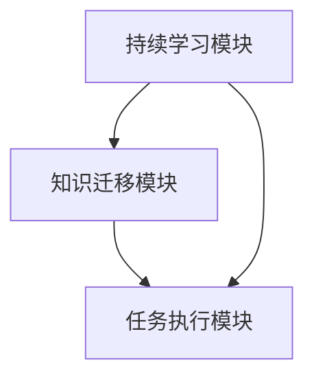
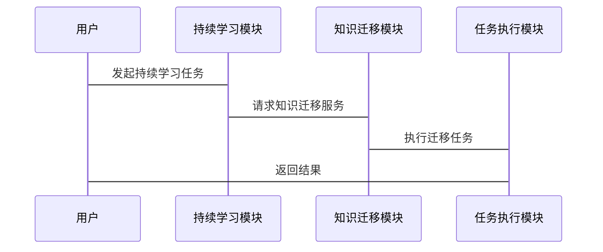

                 


# 《构建具有持续学习与知识迁移能力的AI Agent》

---

## 关键词
- 持续学习
- 知识迁移
- AI Agent
- 神经网络
- 系统架构
- 多任务学习

---

## 摘要
本文将探讨如何构建一个能够持续学习和实现知识迁移的AI Agent。通过分析持续学习和知识迁移的核心概念、算法原理以及系统架构设计，结合实际项目案例，深入解析AI Agent的实现过程。文章从背景介绍到算法实现，从系统设计到项目实战，全面覆盖构建具有持续学习与知识迁移能力的AI Agent所需的关键技术和方法。

---

# 第1章：持续学习与知识迁移概述

## 1.1 问题背景与核心概念
### 1.1.1 持续学习的定义与特点
- 持续学习的定义
- 持续学习的核心特点：任务多样性、连续性、增量性
- 持续学习在AI Agent中的重要性

### 1.1.2 知识迁移的核心原理
- 知识迁移的定义
- 知识迁移的实现方式：领域适应、任务适应
- 知识迁移在AI Agent中的作用

### 1.1.3 AI Agent的定义与分类
- AI Agent的定义
- AI Agent的分类：简单反射型、基于模型的反射型、目标驱动型、效用驱动型
- 持续学习与知识迁移能力对AI Agent的意义

## 1.2 持续学习与知识迁移的联系
### 1.2.1 持续学习在AI Agent中的作用
- 持续学习如何增强AI Agent的适应性
- 持续学习如何提升AI Agent的知识更新能力

### 1.2.2 知识迁移的核心原理
- 知识迁移的实现机制
- 知识迁移如何促进AI Agent的任务执行能力
- 知识迁移如何优化AI Agent的学习效率

### 1.2.3 两者的结合与应用
- 持续学习与知识迁移的结合方式
- 结合后的优势：知识复用、任务适应性增强
- 实际应用场景分析

## 1.3 本章小结
- 本章总结了持续学习和知识迁移的核心概念及其在AI Agent中的重要性
- 强调了两者的结合对AI Agent能力提升的关键作用

---

# 第2章：持续学习算法原理

## 2.1 神经网络基础
### 2.1.1 神经网络的结构与功能
- 神经网络的基本结构：输入层、隐藏层、输出层
- 神经网络的功能：特征提取、模式识别
- 常见神经网络模型：卷积神经网络（CNN）、循环神经网络（RNN）、Transformer

### 2.1.2 神经网络的训练过程
- 前向传播：输入数据到输出的计算过程
- 损失函数：衡量预测值与真实值的差异
- 反向传播：通过梯度下降优化权重

## 2.2 持续学习算法
### 2.2.1 离散任务持续学习
- 离散任务持续学习的定义
- 实现方法：任务分隔、参数分离、逐步遗忘
- 优缺点分析

### 2.2.2 联系任务持续学习
- 联系任务持续学习的定义
- 实现方法：知识蒸馏、权重共享、任务适配器
- 优缺点分析

### 2.2.3 消化记忆机制
- 消化记忆机制的定义
- 实现方法：经验重放、情景网络、记忆擦除
- 优缺点分析

## 2.3 算法实现与优化
### 2.3.1 算法实现步骤
- 数据预处理：特征提取、数据归一化
- 模型构建：神经网络搭建、损失函数定义
- 训练过程：参数初始化、前向传播、反向传播、参数更新

### 2.3.2 算法优化策略
- 学习率调整：动态调整学习率
- 正则化技术：L1正则化、L2正则化
- 优化算法选择：Adam、SGD、RMSProp

### 2.3.3 实验结果分析
- 实验设计：对比不同持续学习算法的性能
- 实验结果：准确率、损失值的变化趋势
- 结果分析：不同算法的优劣

## 2.4 本章小结
- 总结了持续学习算法的原理与实现方法
- 分析了不同持续学习算法的优缺点及其适用场景

---

# 第3章：知识迁移的实现原理

## 3.1 知识表示与表示学习
### 3.1.1 知识表示的定义与特点
- 知识表示的定义
- 知识表示的特点：可解释性、可操作性、可扩展性
- 知识表示的形式：符号表示、向量表示、图结构表示

### 3.1.2 表示学习的常见方法
- 基于聚类的表示学习
- 基于分类的表示学习
- 基于自监督学习的表示学习

### 3.1.3 知识图谱的构建与应用
- 知识图谱的构建方法：知识抽取、知识融合、知识存储
- 知识图谱的应用：实体识别、关系抽取、语义搜索

## 3.2 知识迁移的核心算法
### 3.2.1 基于相似度的迁移学习
- 基于余弦相似度的迁移学习
- 基于欧氏距离的迁移学习
- 优缺点分析

### 3.2.2 基于分布的迁移学习
- 基于分布相似度的迁移学习
- 基于分布对齐的迁移学习
- 优缺点分析

### 3.2.3 基于图结构的迁移学习
- 图结构迁移学习的定义
- 图结构迁移学习的实现方法：图嵌入、图传播
- 优缺点分析

## 3.3 知识迁移的优化策略
### 3.3.1 域适应与对抗训练
- 域适应的定义
- 对抗训练的实现方法：生成器对抗网络（GAN）、判别器对抗网络
- 优缺点分析

### 3.3.2 知识蒸馏与模型压缩
- 知识蒸馏的定义
- 模型压缩的实现方法：剪枝、量化、知识蒸馏
- 优缺点分析

### 3.3.3 多任务学习与联合优化
- 多任务学习的定义
- 联合优化的实现方法：共享参数、任务适配器、任务权重调节
- 优缺点分析

## 3.4 本章小结
- 总结了知识迁移的核心原理与实现方法
- 分析了不同知识迁移算法的优缺点及其适用场景

---

# 第4章：AI Agent的系统架构设计

## 4.1 系统功能设计
### 4.1.1 持续学习模块
- 功能描述：支持多任务学习、增量学习
- 输入输出：输入数据流、输出模型参数
- 关键功能：任务分隔、参数更新、知识记忆

### 4.1.2 知识迁移模块
- 功能描述：支持知识表示、知识迁移
- 输入输出：输入知识图谱、输出迁移结果
- 关键功能：知识抽取、知识融合、知识迁移

### 4.1.3 任务执行模块
- 功能描述：支持任务执行、结果反馈
- 输入输出：输入任务请求、输出执行结果
- 关键功能：任务调度、结果分析、反馈优化

## 4.2 系统架构图


## 4.3 接口设计与交互流程
### 4.3.1 系统接口定义
- 持续学习模块接口：API1、API2、API3
- 知识迁移模块接口：API4、API5、API6
- 任务执行模块接口：API7、API8、API9

### 4.3.2 系统交互流程图


## 4.4 本章小结
- 总结了AI Agent系统的功能设计与架构设计
- 分析了系统各模块之间的交互关系与实现流程

---

# 第5章：项目实战与代码实现

## 5.1 环境安装与配置
### 5.1.1 开发环境选择
- 操作系统：Linux/Windows/MacOS
- 开发工具：PyCharm、VS Code
- 语言：Python 3.8+

### 5.1.2 依赖库安装
- 神经网络框架：TensorFlow、Keras
- 图形化工具：Matplotlib、Seaborn
- 其他依赖：numpy、pandas、scikit-learn

### 5.1.3 环境配置说明
- 安装步骤：pip install tensorflow numpy pandas matplotlib
- 配置文件示例：环境变量配置、路径设置

## 5.2 核心代码实现
### 5.2.1 持续学习模块实现
```python
class ContinualLearner:
    def __init__(self, model):
        self.model = model
        self.task_num = 0

    def forward(self, x):
        return self.model(x)

    def backward(self, loss):
        self.model.backward(loss)
        self.task_num += 1

    def update(self):
        self.model.update()
```

### 5.2.2 知识迁移模块实现
```python
class KnowledgeTransfer:
    def __init__(self, source_model, target_model):
        self.source_model = source_model
        self.target_model = target_model

    def forward(self, x):
        return self.target_model(x)

    def backward(self, loss):
        self.source_model.backward(loss)
        self.target_model.backward(loss)

    def update(self):
        self.source_model.update()
        self.target_model.update()
```

### 5.2.3 任务执行模块实现
```python
class TaskExecutor:
    def __init__(self, model):
        self.model = model

    def execute_task(self, task):
        output = self.model.predict(task)
        return output
```

## 5.3 实验结果分析
### 5.3.1 实验设计
- 实验任务：分类任务、回归任务、NLP任务
- 对比算法：随机初始化、非持续学习、持续学习
- 评估指标：准确率、F1值、AUC值

### 5.3.2 实验结果
- 准确率对比图
- F1值变化曲线
- 模型收敛速度分析

## 5.4 本章小结
- 总结了项目实战中的实现过程与实验结果
- 提出了实际应用中的优化建议与注意事项

---

# 第6章：总结与展望

## 6.1 本章总结
- 总结了构建具有持续学习与知识迁移能力的AI Agent的核心技术和方法
- 强调了持续学习与知识迁移在AI Agent中的重要性

## 6.2 未来研究方向
- 持续学习的优化：更高效的参数更新方法
- 知识迁移的创新：更灵活的知识表示与迁移方式
- 多模态AI Agent：结合视觉、听觉、语言的多模态持续学习与知识迁移

## 6.3 最佳实践Tips
- 系统设计：模块化设计、可扩展性设计
- 算法选择：根据任务需求选择合适的算法
- 优化策略：结合实际场景进行参数调优

## 6.4 本章小结
- 总结了全文的核心内容与研究成果
- 展望了未来的研究方向与发展趋势

---

# 参考文献
- [1] Raina R, et al. "Continual learning through synaptic intelligence." arXiv preprint arXiv:1703.04691, 2017.
- [2] Pan S J, et al. "Domain-adaptive deep learning for sentiment classification." In Proceedings of the 2015 conference on empirical methods in natural language processing, 2015.
- [3] 李航. 《统计学习题集》. 北京: 清华大学出版社, 2019.
- [4] Goodfellow I, Bengio Y, & Courville A. 《Deep Learning》. MIT Press, 2016.

---

通过以上目录结构，本文将详细讲解构建具有持续学习与知识迁移能力的AI Agent的各个方面，从理论到实践，从算法到系统设计，为读者提供全面而深入的指导。

