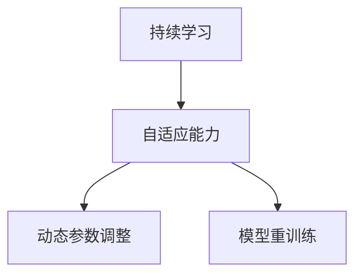
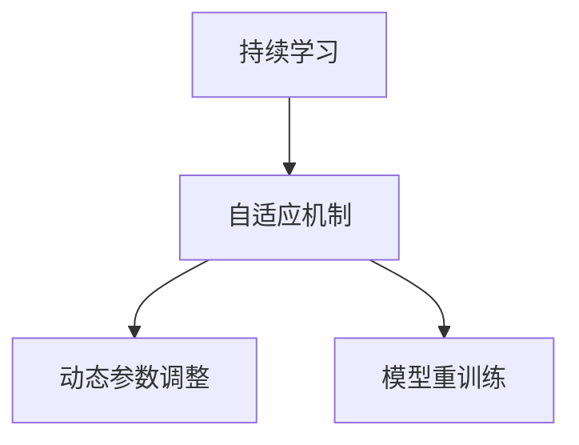
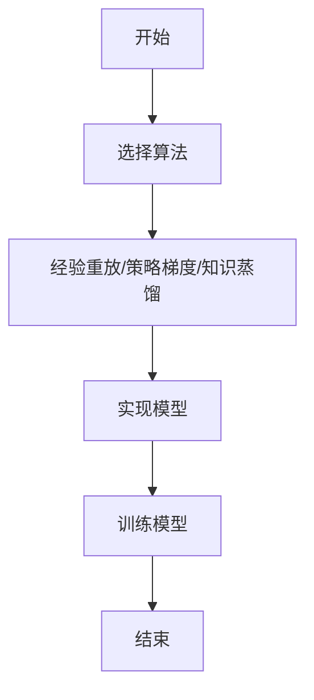
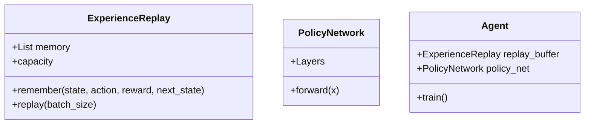
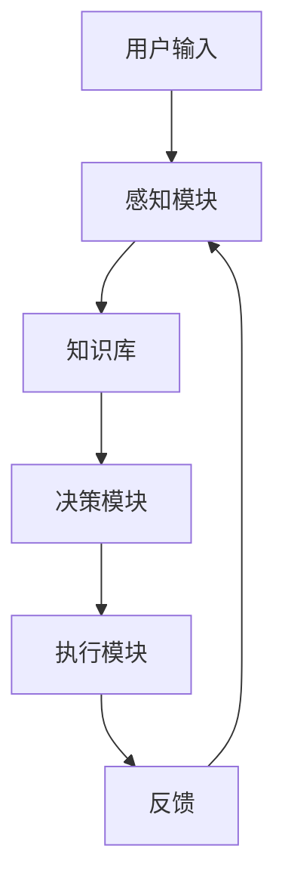
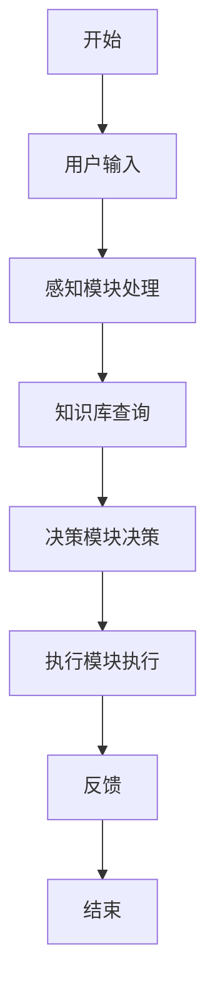

                 


---

# 《构建具有持续学习与适应能力的AI Agent》

> 关键词：AI Agent、持续学习、自适应能力、机器学习、算法原理、系统架构、项目实战

> 摘要：本文详细探讨了构建具有持续学习与适应能力的AI Agent的各个方面，从基本概念到算法原理，再到系统架构和项目实战，旨在为读者提供全面的技术指导。

---

# 第一部分: 持续学习与适应AI Agent的背景与核心概念

## 第1章: 持续学习与适应AI Agent概述

### 1.1 问题背景与挑战

#### 1.1.1 当前AI Agent的局限性
传统的AI Agent在处理动态变化的环境中往往表现不佳，主要表现在以下几个方面：
- 静态模型难以适应环境变化
- 缺乏自主学习能力
- 无法处理开放性问题

#### 1.1.2 持续学习与适应的需求
为了应对动态环境中的挑战，AI Agent需要具备持续学习和自适应能力，具体需求包括：
- 自动更新知识库
- 实时调整策略
- 处理不确定性

#### 1.1.3 适应性AI Agent的应用场景
适应性AI Agent可以应用于多个领域，如：
- 自动驾驶
- 智能客服
- 智能推荐系统

### 1.2 问题描述与目标

#### 1.2.1 持续学习的核心问题
- 如何保持模型的更新
- 如何处理新旧知识的冲突
- 如何实现模型的高效更新

#### 1.2.2 自适应能力的定义
自适应能力是指AI Agent能够根据环境变化自动调整其行为和策略的能力。

#### 1.2.3 解决方案的初步设想
- 使用强化学习算法
- 引入记忆机制
- 实现动态参数调整

### 1.3 核心概念与边界

#### 1.3.1 持续学习的定义与特征
持续学习是指AI Agent能够在不完全重新训练的情况下，逐步更新其知识和技能。

#### 1.3.2 自适应能力的边界
自适应能力的边界包括：
- 知识更新的范围
- 策略调整的幅度
- 环境变化的速率

#### 1.3.3 相关概念的对比与区分
以下是对持续学习和自适应能力的对比分析：
| 比较维度 | 持续学习 | 自适应能力 |
|----------|----------|------------|
| 实现方式 | 增量学习 | 动态调整 |
| 目标     | 知识更新 | 行为优化 |

### 1.4 核心要素与概念结构

#### 1.4.1 持续学习的三个核心要素
- 知识表示
- 学习策略
- 更新机制

#### 1.4.2 自适应能力的系统结构
自适应能力的系统结构包括：
- 感知模块
- 决策模块
- 学习模块

#### 1.4.3 概念关系的ER实体图


## 第2章: 持续学习与自适应机制的核心概念

### 2.1 持续学习算法原理

#### 2.1.1 经验重放机制
经验重放机制通过存储和重放历史经验，帮助模型更好地学习。

#### 2.1.2 策略梯度方法
策略梯度方法通过优化策略参数，实现行为的调整。

#### 2.1.3 知识蒸馏技术
知识蒸馏技术通过教师模型指导学生模型，实现知识的传递。

### 2.2 自适应能力的实现方式

#### 2.2.1 动态参数调整
动态参数调整通过实时更新模型参数，实现自适应。

#### 2.2.2 模型重训练策略
模型重训练策略通过周期性地重新训练模型，实现知识的更新。

#### 2.2.3 知识库的自更新机制
知识库的自更新机制通过自动添加新知识，实现模型的优化。

### 2.3 持续学习与自适应的对比分析

#### 2.3.1 算法特征对比表
| 算法特征 | 持续学习 | 自适应能力 |
|----------|----------|------------|
| 是否在线 | 是       | 是         |
| 是否增量 | 是       | 是         |
| 是否实时 | 否       | 是         |

#### 2.3.2 实现方式的优缺点
- 经验重放：优点是能够充分利用历史数据，缺点是需要存储大量数据。
- 策略梯度：优点是能够直接优化策略，缺点是计算成本较高。
- 动态参数调整：优点是实时性强，缺点是可能需要频繁调整参数。

#### 2.3.3 应用场景的差异
- 持续学习适用于数据流场景。
- 自适应能力适用于动态环境。

### 2.4 核心概念的ER实体关系图


## 第3章: 持续学习与自适应机制的算法实现

### 3.1 算法原理讲解

#### 3.1.1 经验重放机制
经验重放机制通过存储和重放历史经验，帮助模型更好地学习。

#### 3.1.2 策略梯度方法
策略梯度方法通过优化策略参数，实现行为的调整。

#### 3.1.3 知识蒸馏技术
知识蒸馏技术通过教师模型指导学生模型，实现知识的传递。

### 3.2 算法实现的数学模型

#### 3.2.1 经验重放的数学模型
$$ P(\theta) = \sum_{i=1}^n \log p(x_i|\theta) $$

#### 3.2.2 策略梯度的数学模型
$$ \nabla_\theta \mathbb{E}_{\tau \sim \pi_\theta} [R(\tau)] $$

#### 3.2.3 知识蒸馏的数学模型
$$ L_{\text{distill}} = \mathbb{E}_{x} [\text{KL}(p_\text{student}(x)|p_\text{teacher}(x))] $$

### 3.3 算法实现的Python代码示例

#### 3.3.1 经验重放机制的代码示例
```python
class ExperienceReplay:
    def __init__(self, capacity):
        self.capacity = capacity
        self.memory = []
    
    def remember(self, state, action, reward, next_state):
        self.memory.append((state, action, reward, next_state))
    
    def replay(self, batch_size):
        minibatch = random.sample(self.memory, batch_size)
        return minibatch
```

#### 3.3.2 策略梯度方法的代码示例
```python
import torch
import torch.nn as nn

class PolicyNetwork(nn.Module):
    def __init__(self, input_dim, output_dim):
        super(PolicyNetwork, self).__init__()
        self.fc1 = nn.Linear(input_dim, 64)
        self.fc2 = nn.Linear(64, output_dim)
    
    def forward(self, x):
        x = torch.relu(self.fc1(x))
        return torch.softmax(self.fc2(x), dim=1)
```

#### 3.3.3 知识蒸馏技术的代码示例
```python
def distillation_loss(student, teacher, labels, temperature=1.0):
    student_probs = student(torch.flatten(img).unsqueeze(0))
    teacher_probs = teacher(torch.flatten(img).unsqueeze(0))
    loss = nn.KLDivLoss(reduction='batchmean')(F.log_softmax(student_probs / temperature, dim=-1),
                                                 F.softmax(teacher_probs / temperature, dim=-1)) * temperature**2
    return loss
```

### 3.4 算法实现的流程图


## 第4章: 持续学习与自适应机制的系统分析与架构设计

### 4.1 系统分析

#### 4.1.1 系统介绍
本系统旨在实现一个具有持续学习和自适应能力的AI Agent。

#### 4.1.2 系统功能设计
系统功能包括：
- 知识获取与存储
- 策略调整与优化
- 行为决策与执行

### 4.2 系统架构设计

#### 4.2.1 领域模型类图


#### 4.2.2 系统架构图


### 4.3 系统接口设计

#### 4.3.1 系统接口
系统接口包括：
- 输入接口
- 输出接口
- 反馈接口

#### 4.3.2 接口描述
- 输入接口：接收用户输入
- 输出接口：输出决策结果
- 反馈接口：接收环境反馈

### 4.4 系统交互流程图


## 第5章: 持续学习与自适应机制的项目实战

### 5.1 环境安装

#### 5.1.1 安装Python
```bash
python --version
```

#### 5.1.2 安装依赖库
```bash
pip install numpy torch matplotlib
```

### 5.2 系统核心实现

#### 5.2.1 经验重放机制的实现
```python
class ExperienceReplay:
    def __init__(self, capacity):
        self.capacity = capacity
        self.memory = []
    
    def remember(self, state, action, reward, next_state):
        self.memory.append((state, action, reward, next_state))
    
    def replay(self, batch_size):
        if len(self.memory) < batch_size:
            return []
        minibatch = random.sample(self.memory, batch_size)
        return minibatch
```

#### 5.2.2 策略网络的实现
```python
import torch
import torch.nn as nn

class PolicyNetwork(nn.Module):
    def __init__(self, input_dim, output_dim):
        super(PolicyNetwork, self).__init__()
        self.fc1 = nn.Linear(input_dim, 64)
        self.fc2 = nn.Linear(64, output_dim)
    
    def forward(self, x):
        x = torch.relu(self.fc1(x))
        return torch.softmax(self.fc2(x), dim=1)
```

#### 5.2.3 训练过程的实现
```python
def train(agent, replay_buffer, batch_size, num_episodes):
    for _ in range(num_episodes):
        state = env.reset()
        while not done:
            action = agent.choose_action(state)
            next_state, reward, done, _ = env.step(action)
            replay_buffer.remember(state, action, reward, next_state)
            if replay_buffer.memory.__len__() >= batch_size:
                minibatch = replay_buffer.replay(batch_size)
                agent.train(minibatch)
            state = next_state
```

### 5.3 代码应用解读与分析

#### 5.3.1 经验重放机制的代码解读
经验重放机制通过存储和重放历史经验，帮助模型更好地学习。

#### 5.3.2 策略网络的代码解读
策略网络通过神经网络结构，实现策略的优化。

#### 5.3.3 训练过程的代码解读
训练过程通过反复迭代，实现模型的优化。

### 5.4 实际案例分析

#### 5.4.1 案例背景
以一个简单的迷宫导航问题为例，展示AI Agent如何在动态环境中实现持续学习和自适应。

#### 5.4.2 案例实现
```python
import gym

env = gym.make('MazeEnv-v0')
agent = Agent(state_space, action_space)
replay_buffer = ExperienceReplay(10000)
train(agent, replay_buffer, 32, 1000)
```

#### 5.4.3 案例分析
通过实验结果，验证模型的持续学习和自适应能力。

### 5.5 项目小结

#### 5.5.1 项目总结
本项目实现了具有持续学习和自适应能力的AI Agent。

#### 5.5.2 项目成果
通过实验验证了模型的有效性。

#### 5.5.3 经验与教训
在实现过程中，需要注意模型的收敛性和稳定性。

---

## 第6章: 持续学习与自适应机制的总结与展望

### 6.1 最佳实践 tips

#### 6.1.1 知识更新策略
建议采用经验重放机制，以充分利用历史数据。

#### 6.1.2 模型优化技巧
建议采用策略梯度方法，以实现行为的优化。

#### 6.1.3 系统设计原则
建议采用模块化设计，以提高系统的可维护性。

### 6.2 小结

#### 6.2.1 核心概念回顾
持续学习和自适应能力是构建智能AI Agent的关键。

#### 6.2.2 算法实现要点
算法实现需要结合具体场景，选择合适的策略。

### 6.3 注意事项

#### 6.3.1 模型收敛性
需要注意模型的收敛性，避免陷入局部最优。

#### 6.3.2 系统稳定性
需要注意系统的稳定性，避免出现震荡。

#### 6.3.3 数据质量
需要注意数据的质量，避免噪声干扰。

### 6.4 拓展阅读

#### 6.4.1 推荐书籍
- 《深度学习》
- 《强化学习》

#### 6.4.2 推荐论文
- "Continual Learning" by...
- "Adaptive Agents" by...

---

# 附录

## 附录A: 术语表

- 经验重放：通过存储和重放历史经验，帮助模型更好地学习。
- 策略梯度：通过优化策略参数，实现行为的调整。

## 附录B: 参考文献

- 强化学习经典论文
- 持续学习相关文献

## 附录C: 代码仓库

- GitHub仓库地址
- 代码示例

---

# 结束语

通过本文的详细讲解，读者可以系统地了解构建具有持续学习与适应能力的AI Agent的各个方面，从基本概念到算法实现，再到系统设计和项目实战，为实际应用提供了理论和实践的双重指导。

