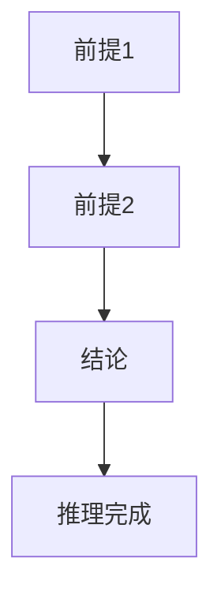

                 


# 构建具有推理能力的AI Agent

## 关键词：AI Agent, 推理能力, 逻辑推理, 贝叶斯网络, 自然语言处理, 系统架构, 项目实战

## 摘要：  
本文详细探讨了构建具有推理能力的AI Agent的全过程，从基础概念到算法实现，再到系统架构和项目实战。文章首先介绍了AI Agent的基本概念和推理能力的重要性，随后深入分析了逻辑推理和概率推理的原理及应用，探讨了自然语言处理和知识表示在推理中的作用。接着，文章详细讲解了AI Agent的系统架构设计和接口实现，并通过一个具体的项目案例展示了如何构建一个简单的推理AI Agent。最后，文章总结了构建具有推理能力的AI Agent的关键点，并展望了未来的发展方向。

---

# 第一部分: 构建具有推理能力的AI Agent背景与概念

## 第1章: AI Agent基础概念

### 1.1 AI Agent的定义与分类

#### 1.1.1 什么是AI Agent
AI Agent（人工智能代理）是指能够感知环境并采取行动以实现特定目标的智能实体。它可以是一个软件程序，也可以是嵌入在物理设备中的智能系统。AI Agent的核心在于其自主性和智能性，它能够根据环境信息做出决策并执行操作。

#### 1.1.2 反应式与基于模型的Agent
- **反应式Agent**：基于当前感知的信息做出反应，不依赖于内部状态或模型。例如，实时聊天机器人可以根据用户的输入立即生成回复。
- **基于模型的Agent**：依赖于内部维护的状态或模型来做出决策。例如，自动驾驶汽车会根据车辆状态、道路状况和环境信息进行综合推理。

#### 1.1.3 AI Agent的类型与应用场景
- **简单反射型Agent**：仅根据当前输入做出反应，适用于简单的任务，如自动回复邮件。
- **基于模型的规划型Agent**：具有复杂推理能力，适用于需要长期规划和决策的任务，如智能客服系统。
- **学习增强型Agent**：能够通过学习不断优化其推理和决策能力，如智能音箱的语音识别系统。

### 1.2 推理能力的核心作用

#### 1.2.1 推理能力的定义
推理能力是指AI Agent能够从已有信息中推导出新的结论或理解隐藏信息的能力。它是实现智能决策的关键。

#### 1.2.2 推理在AI Agent中的重要性
推理能力使AI Agent能够：
- 理解复杂问题并找到解决方案。
- 处理不确定性，做出最优决策。
- 与人类进行有效沟通和协作。

#### 1.2.3 推理能力的边界与外延
推理能力的边界在于其知识和数据的限制。外延则涉及从简单逻辑推理到复杂知识图谱的应用。

---

## 第2章: 推理机制与AI Agent的关系

### 2.1 推理机制的原理
推理机制是AI Agent实现智能决策的核心。逻辑推理和概率推理是两种主要的推理机制。

### 2.2 推理与AI Agent行为决策的关系
推理直接影响AI Agent的行为决策。例如，在自动驾驶中，推理系统会根据传感器数据和环境信息决定车辆的转向和加速。

### 2.3 推理能力对AI Agent智能水平的影响
推理能力越强，AI Agent的智能水平越高。强大的推理能力使AI Agent能够处理复杂任务并适应多样化环境。

---

# 第二部分: 推理机制与算法原理

## 第3章: 逻辑推理与AI Agent

### 3.1 逻辑推理的基本原理
逻辑推理基于逻辑规则，从已知前提推导出结论。例如，如果“所有人类都是会思考的”，且“小明是人类”，则可以推导出“小明会思考”。

#### 逻辑推理的数学模型
$$
\text{如果 } P \rightarrow Q \text{ 且 } P \text{ 为真，则 } Q \text{ 为真。}
$$

### 3.2 逻辑推理在AI Agent中的应用
- 自然语言理解：通过逻辑推理理解文本含义。
- 知识图谱构建：通过逻辑推理连接数据点。

### 3.3 逻辑推理的算法实现


---

## 第4章: 概率推理与贝叶斯网络

### 4.1 概率推理的概念与特点
概率推理基于概率论，处理不确定性问题。例如，医疗诊断系统可以通过概率推理分析患者的症状和疾病之间的关系。

### 4.2 贝叶斯网络的构建与应用
贝叶斯网络是一种概率推理模型，通过节点表示变量，边表示变量之间的依赖关系。

#### 贝叶斯网络的构建步骤
1. 确定变量：识别问题中的相关变量。
2. 确定依赖关系：分析变量之间的关系。
3. 构建网络：绘制变量和依赖关系的图形。
4. 定义概率分布：为每个节点分配概率。

### 4.3 贝叶斯推理在AI Agent中的实现
- 医疗诊断：根据症状推断疾病。
- 风险评估：根据市场数据预测股票走势。

#### 贝叶斯推理的数学模型
$$
P(A|B) = \frac{P(B|A) \cdot P(A)}{P(B)}
$$

---

## 第5章: 机器学习中的推理

### 5.1 机器学习与推理的关系
机器学习通过数据训练模型，推理是模型的应用过程。

### 5.2 基于深度学习的推理方法
- Transformer模型：用于自然语言处理任务。
- 图神经网络：用于复杂关系推理。

### 5.3 知识图谱与推理
知识图谱将实体和关系以图结构表示，推理过程涉及路径分析和模式匹配。

---

# 第三部分: 自然语言处理与知识表示

## 第6章: 自然语言处理在AI Agent中的应用

### 6.1 NLP技术与AI Agent的结合
- 语义理解：通过NLP理解用户意图。
- 生成回复：通过NLP生成自然语言回复。

### 6.2 基于Transformer的推理模型
- Transformer模型：用于编码和解码任务。
- 推理过程：通过注意力机制捕捉上下文信息。

### 6.3 NLP在对话系统中的应用
- 自然语言理解：识别用户意图。
- 对话生成：生成自然语言回复。

---

## 第7章: 知识表示与推理

### 7.1 知识表示的基本方法
- 概念图：将知识表示为概念和关系。
- 本体论：定义概念和关系的正式表示。

### 7.2 知识图谱的构建与推理
- 知识图谱构建：通过爬取和抽取数据构建知识图谱。
- 图推理：通过图遍历进行推理。

### 7.3 基于知识图谱的推理算法
- 路径查询：通过查询图中的路径进行推理。
- 类比推理：通过概念间的相似性进行推理。

---

# 第四部分: AI Agent系统架构与设计

## 第8章: AI Agent的系统架构

### 8.1 基于模块化的系统设计
- 模块划分：将系统划分为感知模块、推理模块和执行模块。
- 模块交互：模块之间通过接口进行通信。

### 8.2 系统架构的分层设计
- 感知层：负责感知环境信息。
- 推理层：负责逻辑推理和概率推理。
- 执行层：负责执行决策。

### 8.3 系统架构的可扩展性设计
- 模块化设计：便于功能扩展。
- 可插拔接口：便于功能模块的更换。

---

## 第9章: 接口设计与系统交互

### 9.1 系统接口的设计原则
- 明确接口定义：确保接口的功能和参数明确。
- 标准化接口：使用标准化接口规范。

### 9.2 系统交互的流程设计
- 用户输入：用户与系统交互的起点。
- 系统处理：系统根据输入进行推理和决策。
- 用户反馈：用户对系统输出的反馈。

### 9.3 接口实现的注意事项
- 接口文档：提供详细的接口文档。
- 错误处理：处理接口调用中的异常情况。

---

# 第五部分: 项目实战与应用

## 第10章: 项目实战: 构建一个简单的推理AI Agent

### 10.1 环境搭建与工具安装
- 安装Python和必要的库（如TensorFlow、PyTorch）。
- 安装NLP处理工具（如spaCy、NLTK）。

### 10.2 系统核心模块实现
- 感知模块：负责接收输入。
- 推理模块：负责逻辑推理和概率推理。
- 执行模块：负责输出结果。

### 10.3 代码实现与解读
```python
# 推理模块示例代码
def logical_inference(prems, goal):
    # 简单的逻辑推理实现
    if all(p in prems for p in goal['premises']):
        return True
    else:
        return False
```

### 10.4 项目小结
通过本项目，读者可以掌握AI Agent的基本构建方法，理解推理能力在实际应用中的重要性。

---

# 结语

构建具有推理能力的AI Agent是一个复杂而有趣的任务。从基础概念到算法实现，再到系统设计和项目实战，每一步都需要仔细思考和实践。通过本文的指导，读者可以逐步掌握构建具有推理能力的AI Agent的核心技术，并将其应用于实际场景中。未来，随着技术的进步，AI Agent的推理能力将更加智能化和多样化。

