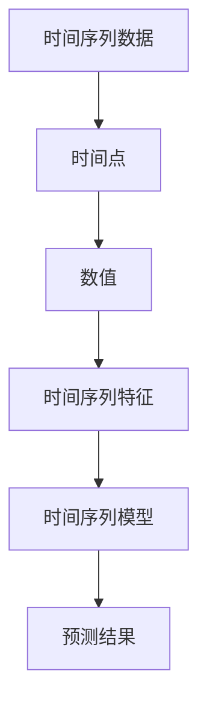
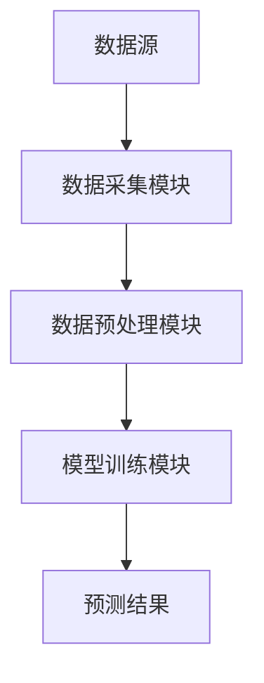

                 


# 《构建具有时间序列分析能力的AI Agent》

> 关键词：时间序列分析、AI Agent、机器学习、深度学习、预测模型、系统架构

> 摘要：本文详细探讨了构建具有时间序列分析能力的AI Agent的过程，从背景介绍、核心概念、算法原理到系统架构和项目实战，全面解析了如何将时间序列分析应用于AI Agent中，实现智能预测和决策。

---

## 第一部分: 时间序列分析与AI Agent概述

### 第1章: 时间序列分析与AI Agent的背景介绍

#### 1.1 时间序列分析的基本概念
时间序列分析是一种通过分析数据随时间变化的模式，预测未来趋势的方法。它关注数据在不同时间点上的分布和变化，常用于金融、经济、气象等领域。

#### 1.2 AI Agent的基本概念
AI Agent是一种智能体，能够感知环境、自主决策并执行任务。AI Agent需要具备处理动态数据的能力，而时间序列分析正是处理此类数据的关键技术。

#### 1.3 问题背景与问题描述
传统数据分析无法有效处理时间依赖性问题，而时间序列分析能够捕捉数据的时序特征。AI Agent需要集成时间序列分析能力，以在动态环境中做出准确预测。

#### 1.4 时间序列分析与AI Agent的结合
时间序列分析为AI Agent提供了动态数据处理能力，使其能够进行实时预测和决策。AI Agent的时间序列分析能力增强了其智能化水平，使其能够应对复杂场景。

---

## 第二部分: 时间序列分析的核心概念与原理

### 第2章: 时间序列分析的核心概念与联系

#### 2.1 时间序列分析的核心原理
时间序列分析通过建模数据的时序特征，如趋势、周期性和季节性，预测未来值。其核心在于识别数据中的模式和结构。

#### 2.2 核心概念的属性对比表格
| 概念            | 时间序列分析       | 传统数据分析       | 机器学习         |
|-----------------|--------------------|--------------------|------------------|
| 数据类型        | 时间序列数据       | 任意数据类型       | 结构化和非结构化数据 |
| 主要目标        | 预测未来值          | 描述性分析         | 数据模式识别     |
| 处理方式        | 基于时间依赖性      | 基于统计特征       | 基于模型学习     |

#### 2.3 实体关系图（ER图）


---

## 第三部分: 时间序列分析的算法原理

### 第3章: 时间序列分析的主要算法

#### 3.1 ARIMA模型
ARIMA（自回归积分滑动平均模型）适用于非季节性和季节性数据的预测。

- **数学公式**：ARIMA(p, d, q)，其中p为自回归阶数，d为差分阶数，q为移动平均阶数。
- **实现流程**：数据预处理、模型参数估计、模型验证。
- **优缺点**：优点是简单高效，缺点是假设线性关系，难以处理复杂模式。

#### 3.2 LSTM网络
LSTM（长短时记忆网络）通过门控机制捕捉长期依赖关系。

- **结构**：输入门、遗忘门、输出门。
- **数学公式**：$$f(t) = \sigma(W_f \cdot [h_{t-1}, x_t] + b_f)$$
- **优缺点**：优点是处理复杂时序数据能力强，缺点是训练时间较长。

#### 3.3 Prophet模型
Prophet模型由Facebook开源，适合非专业用户使用。

- **结构**：分解趋势、周期性、噪声。
- **数学公式**：$$y(t) = g(t) + h(t) + \epsilon_t$$
- **优缺点**：优点是易用性高，缺点是预测范围有限。

---

## 第四部分: 时间序列分析的系统架构

### 第4章: AI Agent的时间序列分析系统架构

#### 4.1 问题场景介绍
AI Agent需要实时处理和预测动态数据，例如股票价格预测。

#### 4.2 系统功能设计
- 数据采集模块：从数据库获取时序数据。
- 数据预处理模块：清洗和转换数据。
- 模型训练模块：训练时间序列预测模型。
- 预测执行模块：生成预测结果。

#### 4.3 系统架构设计


#### 4.4 接口设计与交互
- API接口：RESTful API用于数据输入和预测输出。
- 交互流程：用户请求预测，系统返回结果。

---

## 第五部分: 项目实战

### 第5章: 时间序列分析AI Agent的实现

#### 5.1 环境安装
安装Python和相关库：
```bash
pip install numpy pandas scikit-learn keras prophet
```

#### 5.2 核心代码实现
```python
import pandas as pd
from prophet import Prophet
from sklearn.metrics import mean_absolute_error

# 数据加载
data = pd.read_csv('stock.csv')
data['Date'] = pd.to_datetime(data['Date'])
data = data.set_index('Date')

# 数据准备
df = data[['Adj Close']].rename(columns={'Adj Close': 'y'})
df['ds'] = df.index

# 模型训练
model = Prophet()
model.fit(df)

# 预测
future = model.make_future_dataframe(periods=30, freq='D')
forecast = model.predict(future)

# 评估
mae = mean_absolute_error(data['Adj Close'], forecast['yhat'])
print(f"MAE: {mae}")
```

#### 5.3 案例分析
以股票价格预测为例，展示模型预测结果和评估指标，分析预测的准确性和误差来源。

#### 5.4 项目小结
总结项目的实现过程，讨论优缺点，提出改进建议。

---

## 第六部分: 最佳实践

### 第6章: 构建AI Agent的最佳实践

#### 6.1 小结
构建AI Agent的时间序列分析能力需要综合考虑算法选择、数据预处理和系统架构设计。

#### 6.2 注意事项
- 数据质量：确保数据的完整性和准确性。
- 模型选择：根据场景选择合适的算法。
- 系统优化：提升模型训练和预测的效率。

#### 6.3 扩展阅读
推荐学习时间序列分析的深入资料和AI Agent的最新研究。

---

## 结语
构建具有时间序列分析能力的AI Agent是一个复杂但 rewarding 的过程。通过本文的系统介绍，读者可以掌握核心概念、算法原理和系统架构设计，为实际应用打下坚实基础。未来，随着AI技术的发展，AI Agent的时间序列分析能力将更加智能化和高效化。

