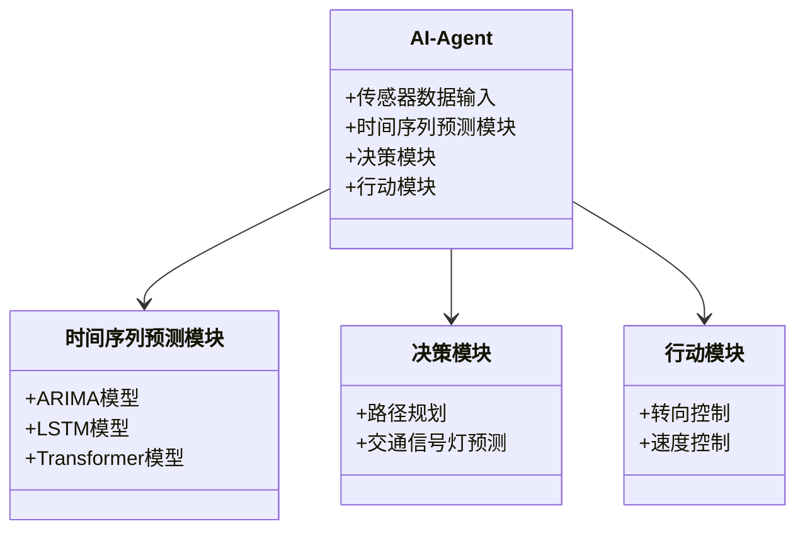
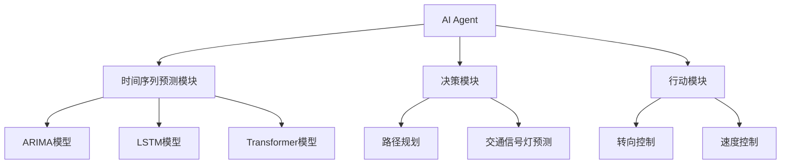
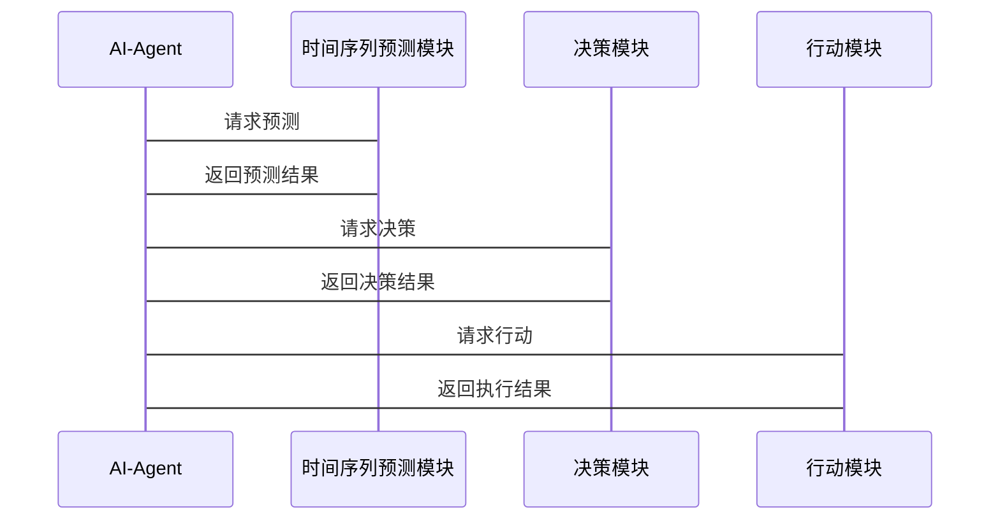

                 


# 构建具有时间序列预测能力的AI Agent

> 关键词：时间序列预测、AI Agent、深度学习、机器学习、系统架构设计

> 摘要：本文详细探讨了构建具有时间序列预测能力的AI Agent的方法，从时间序列预测的基本概念到AI Agent的系统架构设计，再到具体算法实现和项目实战，系统性地分析了如何将时间序列预测技术应用于AI Agent的构建中。文章结合理论与实践，深入讲解了ARIMA、LSTM和Transformer等主流算法，并通过实际案例展示了如何设计和实现一个具有时间序列预测能力的AI Agent系统。

---

# 第一部分: 时间序列预测与AI Agent概述

## 第1章: 时间序列预测与AI Agent概述

### 1.1 时间序列预测的基本概念

#### 1.1.1 时间序列预测的定义
时间序列预测是一种通过历史数据预测未来趋势的技术，广泛应用于金融、气象、交通等领域。其核心是利用数据的时间依赖性，通过建模和算法来捕捉数据中的模式和趋势。

#### 1.1.2 时间序列预测的核心要素
- **时间依赖性**：数据点之间存在依赖关系，例如温度、股票价格等。
- **趋势与周期性**：数据可能包含长期趋势和季节性波动。
- **噪声**：数据中可能存在的随机干扰。

#### 1.1.3 时间序列预测的应用场景
- **金融领域**：股票价格预测、外汇汇率预测。
- **交通领域**：交通流量预测、自动驾驶路径规划。
- **气象领域**：天气预测、气候模型构建。
- **工业领域**：设备故障预测、生产优化。

### 1.2 AI Agent的基本概念

#### 1.2.1 AI Agent的定义
AI Agent（智能体）是一种能够感知环境并采取行动以实现目标的实体。它可以是一个软件程序，也可以是一个物理设备，具备自主决策和学习能力。

#### 1.2.2 AI Agent的核心功能
- **感知**：通过传感器或数据输入获取环境信息。
- **决策**：基于感知信息做出决策。
- **行动**：执行决策，影响环境或输出结果。
- **学习**：通过经验改进性能。

#### 1.2.3 AI Agent与时间序列预测的结合
AI Agent可以通过时间序列预测技术来提高其决策能力，例如在自动驾驶中预测交通流量变化，在金融领域预测市场趋势。

### 1.3 时间序列预测在AI Agent中的作用

#### 1.3.1 时间序列预测的实时性要求
AI Agent通常需要实时处理数据，时间序列预测算法必须具备实时性或近实时性。

#### 1.3.2 AI Agent如何利用时间序列预测
- **输入处理**：将时间序列数据作为输入，供AI Agent进行分析。
- **决策依据**：时间序列预测结果作为决策的依据。
- **动态调整**：根据预测结果动态调整行为策略。

#### 1.3.3 时间序列预测对AI Agent决策的影响
时间序列预测结果直接影响AI Agent的决策质量，准确的预测可以提高系统的效率和安全性。

### 1.4 本章小结
本章介绍了时间序列预测的基本概念及其在AI Agent中的作用，为后续内容奠定了基础。

---

# 第二部分: 时间序列预测的核心概念与联系

## 第2章: 时间序列预测的核心概念

### 2.1 时间序列预测的数学模型

#### 2.1.1 线性模型与非线性模型
- **线性模型**：假设数据之间存在线性关系，例如ARIMA模型。
- **非线性模型**：假设数据之间存在复杂关系，例如LSTM和Transformer模型。

#### 2.1.2 时间依赖性与自回归模型
自回归模型（AR模型）通过当前值与过去值之间的关系进行预测，是时间序列预测的核心方法之一。

#### 2.2.3 移动平均模型与滑动窗口方法
移动平均模型（MA模型）通过过去误差的加权平均来预测未来值，滑动窗口方法用于处理时序数据的局部性。

### 2.2 时间序列预测的算法原理

#### 2.2.1 常见时间序列预测算法对比
| 算法名称 | 核心思想 | 适用场景 | 优缺点 |
|----------|----------|----------|--------|
| ARIMA    | 自回归与移动平均结合 | 线性时间序列 | 易实现，但假设数据符合正态分布 |
| LSTM     | 长短期记忆网络 | 非线性时间序列 | 能捕捉长期依赖关系，但实现复杂 |
| Transformer | 自注意力机制 | 非线性时间序列 | 高效，但计算资源消耗大 |

#### 2.2.2 递归结构与非递归结构
- **递归结构**：通过递归方式处理时间序列数据，适用于短序列预测。
- **非递归结构**：通过并行计算处理时间序列数据，适用于长序列预测。

#### 2.2.3 时间序列预测的误差分析
误差分析是评估时间序列预测模型性能的重要手段，常用均方误差（MSE）和平均绝对误差（MAE）等指标。

### 2.3 AI Agent与时间序列预测的关系

#### 2.3.1 AI Agent如何处理时间序列数据
AI Agent通过时间序列预测技术，将历史数据转化为未来趋势，辅助决策。

#### 2.3.2 时间序列预测对AI Agent决策的影响
准确的预测结果可以提高AI Agent的决策效率和准确性，例如在自动驾驶中提前预测交通流量变化。

#### 2.3.3 时间序列预测的实时性要求
AI Agent需要实时处理时间序列数据，时间序列预测算法必须具备实时性或近实时性。

### 2.4 本章小结
本章深入分析了时间序列预测的核心概念和算法原理，并探讨了其在AI Agent中的应用。

---

# 第三部分: 时间序列预测的算法原理

## 第3章: 时间序列预测的主流算法

### 3.1 ARIMA模型

#### 3.1.1 ARIMA模型的定义
ARIMA（自回归积分滑动平均模型）是一种经典的线性时间序列预测模型，适用于具有趋势和周期性的数据。

#### 3.1.2 ARIMA模型的数学公式
ARIMA模型的数学公式如下：
$$ ARIMA(p, d, q) = y_t = \phi_1 y_{t-1} + \dots + \phi_p y_{t-p} + \theta_1 \epsilon_{t-1} + \dots + \theta_q \epsilon_{t-q} + \epsilon_t $$
其中，$p$ 是自回归阶数，$d$ 是差分阶数，$q$ 是移动平均阶数。

#### 3.1.3 ARIMA模型的实现步骤
1. 数据预处理：检查数据的平稳性。
2. 参数选择：确定ARIMA模型的参数。
3. 模型训练：基于训练数据拟合ARIMA模型。
4. 模型预测：利用训练好的模型进行预测。

#### 3.1.4 ARIMA模型的优缺点
- 优点：简单易实现，适合线性时间序列数据。
- 缺点：对非线性数据表现不佳。

### 3.2 LSTM模型

#### 3.2.1 LSTM模型的定义
LSTM（长短期记忆网络）是一种基于深度学习的时间序列预测模型，能够捕捉长期依赖关系。

#### 3.2.2 LSTM模型的数学公式
LSTM模型的核心组件包括输入门、遗忘门和输出门，数学公式如下：
$$ i_t = \sigma(W_i x_t + U_i h_{t-1}) $$
$$ f_t = \sigma(W_f x_t + U_f h_{t-1}) $$
$$ o_t = \sigma(W_o x_t + U_o h_{t-1}) $$
$$ h_t = i_t \cdot \tanh(W_c x_t + U_c h_{t-1}) $$
其中，$i_t$ 是输入门，$f_t$ 是遗忘门，$o_t$ 是输出门，$h_t$ 是隐藏状态。

#### 3.2.3 LSTM模型的实现步骤
1. 数据预处理：将时间序列数据转换为适合LSTM模型的格式。
2. 模型构建：定义LSTM模型的网络结构。
3. 模型训练：利用训练数据拟合LSTM模型。
4. 模型预测：利用训练好的模型进行预测。

#### 3.2.4 LSTM模型的优缺点
- 优点：能够捕捉长期依赖关系，适合非线性时间序列数据。
- 缺点：实现复杂，需要大量的计算资源。

### 3.3 Transformer模型

#### 3.3.1 Transformer模型的定义
Transformer是一种基于自注意力机制的时间序列预测模型，广泛应用于自然语言处理领域，也可以用于时间序列预测。

#### 3.3.2 Transformer模型的数学公式
Transformer模型的核心是自注意力机制，数学公式如下：
$$ \text{Attention}(Q, K, V) = \text{softmax}\left(\frac{QK^T}{\sqrt{d_k}}\right)V $$
其中，$Q$ 是查询向量，$K$ 是键向量，$V$ 是值向量，$d_k$ 是向量的维度。

#### 3.3.3 Transformer模型的实现步骤
1. 数据预处理：将时间序列数据转换为适合Transformer模型的格式。
2. 模型构建：定义Transformer模型的网络结构。
3. 模型训练：利用训练数据拟合Transformer模型。
4. 模型预测：利用训练好的模型进行预测。

#### 3.3.4 Transformer模型的优缺点
- 优点：高效，适合长序列预测。
- 缺点：计算资源消耗大，实现复杂。

### 3.4 本章小结
本章详细讲解了ARIMA、LSTM和Transformer等主流时间序列预测算法的原理和实现步骤。

---

# 第四部分: 系统分析与架构设计方案

## 第4章: 系统分析与架构设计方案

### 4.1 问题场景介绍
以自动驾驶中的交通流量预测为例，AI Agent需要实时预测交通流量变化，优化路径规划。

### 4.2 项目介绍
构建一个具有时间序列预测能力的AI Agent系统，用于自动驾驶中的交通流量预测。

### 4.3 系统功能设计

#### 4.3.1 领域模型设计
使用Mermaid绘制领域模型类图，展示系统的主要功能模块。



### 4.4 系统架构设计

#### 4.4.1 系统架构设计
使用Mermaid绘制系统架构图，展示系统的整体架构。



### 4.5 系统接口设计

#### 4.5.1 系统接口设计
系统接口设计包括数据输入接口、模型调用接口和决策输出接口。

#### 4.5.2 接口描述
- 数据输入接口：接收传感器数据和历史数据。
- 模型调用接口：调用时间序列预测模块进行预测。
- 决策输出接口：输出决策结果，例如转向控制和速度控制。

### 4.6 系统交互设计

#### 4.6.1 系统交互流程
使用Mermaid绘制系统交互序列图，展示系统的主要交互流程。



### 4.7 本章小结
本章详细分析了AI Agent系统的功能设计、架构设计和交互设计，为后续实现奠定了基础。

---

# 第五部分: 项目实战

## 第5章: 项目实战

### 5.1 环境安装

#### 5.1.1 安装Python
安装Python 3.8或更高版本。

#### 5.1.2 安装依赖库
安装以下依赖库：
- `numpy`
- `pandas`
- `scikit-learn`
- `keras`
- `tensorflow`

### 5.2 系统核心实现源代码

#### 5.2.1 时间序列预测模块
实现ARIMA、LSTM和Transformer模型的时间序列预测功能。

##### ARIMA模型实现
```python
from statsmodels.tsa.arima.model import ARIMA

# 数据预处理
data = ...  # 输入数据

# 模型训练
model = ARIMA(data, order=(p, d, q))
model_fit = model.fit()

# 模型预测
forecast = model_fit.forecast(steps=10)
```

##### LSTM模型实现
```python
import keras
from keras.layers import LSTM, Dense
from keras.models import Sequential

# 数据预处理
data = ...  # 输入数据
X_train = ...
y_train = ...

# 模型构建
model = Sequential()
model.add(LSTM(50, input_shape=(timesteps, features)))
model.add(Dense(1))
model.compile(loss='mean_squared_error', optimizer='adam')

# 模型训练
model.fit(X_train, y_train, epochs=100, batch_size=32)

# 模型预测
X_test = ...
y_pred = model.predict(X_test)
```

##### Transformer模型实现
```python
import tensorflow as tf
from tensorflow import keras
from tensorflow.keras.layers import Dense, Input, MultiHeadAttention, LayerNormalization, Add

# 数据预处理
data = ...  # 输入数据

# 模型构建
inputs = Input(shape=(timesteps, features))
x = MultiHeadAttention(heads=8, head_size=64)(inputs, inputs)
x = Add()([x, inputs])
x = LayerNormalization()(x)
x = Dense(1)(x)
model = keras.Model(inputs=inputs, outputs=x)

# 模型训练
model.compile(loss='mean_squared_error', optimizer='adam')
model.fit(data, y_train, epochs=100, batch_size=32)

# 模型预测
y_pred = model.predict(data)
```

#### 5.2.2 决策模块实现
实现路径规划和交通信号灯预测功能。

##### 路径规划实现
```python
import numpy as np

# 数据预处理
traffic_data = ...  # 交通流量数据

# 路径规划算法
def path_planning(traffic_data):
    # 算法实现
    pass

# 调用路径规划算法
optimized_path = path_planning(traffic_data)
```

##### 交通信号灯预测实现
```python
import keras
from keras.layers import Dense, LSTM, Input, TimeDistributed
from keras.models import Sequential

# 数据预处理
signal_data = ...  # 交通信号数据

# 模型构建
model = Sequential()
model.add(LSTM(50, input_shape=(timesteps, features)))
model.add(Dense(1))
model.compile(loss='binary_crossentropy', optimizer='adam')

# 模型训练
model.fit(X_train, y_train, epochs=100, batch_size=32)

# 模型预测
y_pred = model.predict(signal_data)
```

#### 5.2.3 行动模块实现
实现转向控制和速度控制功能。

##### 转向控制实现
```python
def steering_control(predicted_traffic):
    # 算法实现
    pass

# 调用转向控制算法
steering_angle = steering_control(predicted_traffic)
```

##### 速度控制实现
```python
def speed_control(predicted_traffic):
    # 算法实现
    pass

# 调用速度控制算法
speed = speed_control(predicted_traffic)
```

### 5.3 代码应用解读与分析

#### 5.3.1 时间序列预测模块的实现
时间序列预测模块是AI Agent的核心部分，包括ARIMA、LSTM和Transformer三种算法。每种算法都有其优缺点，适用于不同场景。

#### 5.3.2 决策模块的实现
决策模块负责根据时间序列预测结果进行路径规划和交通信号灯预测，优化AI Agent的行动策略。

#### 5.3.3 行动模块的实现
行动模块根据决策模块的输出进行转向控制和速度控制，实现自动驾驶的核心功能。

### 5.4 实际案例分析和详细讲解剖析

#### 5.4.1 案例背景
以自动驾驶中的交通流量预测为例，AI Agent需要实时预测交通流量变化，优化路径规划。

#### 5.4.2 数据预处理
对交通流量数据进行清洗、归一化等预处理，确保模型输入格式正确。

#### 5.4.3 模型训练与预测
利用历史交通流量数据训练时间序列预测模型，预测未来交通流量变化。

#### 5.4.4 决策与行动
根据预测结果，AI Agent调整路径规划和车速，避开拥堵路段，提高行驶效率。

### 5.5 项目小结
本章通过实际案例展示了如何设计和实现一个具有时间序列预测能力的AI Agent系统，详细讲解了系统的各个模块及其交互过程。

---

# 第六部分: 总结与展望

## 第6章: 总结与展望

### 6.1 最佳实践
- **数据预处理**：确保数据质量，选择合适的模型。
- **算法选择**：根据数据特性选择合适的算法，线性数据选择ARIMA，非线性数据选择LSTM或Transformer。
- **系统架构**：设计合理的系统架构，确保系统的实时性和可扩展性。

### 6.2 小结
本文详细探讨了构建具有时间序列预测能力的AI Agent的方法，从理论到实践，系统性地分析了如何将时间序列预测技术应用于AI Agent的构建中。

### 6.3 注意事项
- **数据依赖性**：时间序列预测模型依赖于历史数据，数据不足时可能影响预测准确性。
- **模型调优**：需要根据实际场景调整模型参数，优化预测性能。
- **实时性要求**：AI Agent需要实时处理数据，时间序列预测算法必须具备实时性或近实时性。

### 6.4 拓展阅读
- **深度学习**：进一步学习深度学习技术，探索更先进的时间序列预测模型。
- **强化学习**：结合强化学习，提高AI Agent的决策能力。
- **边缘计算**：研究边缘计算在AI Agent中的应用，提升系统的实时性和响应速度。

### 6.5 本章小结
本文总结了构建具有时间序列预测能力的AI Agent的关键点，并展望了未来的研究方向。

---

# 结语

构建具有时间序列预测能力的AI Agent是一个复杂而有趣的过程，需要结合理论与实践，不断优化算法和系统架构。希望本文能够为读者提供有价值的参考和启发，帮助他们在实际项目中更好地应用时间序列预测技术。

---

# 参考文献

（此处列出相关书籍、论文和在线资源，供读者进一步学习和研究。）

