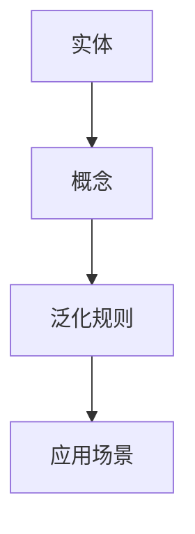
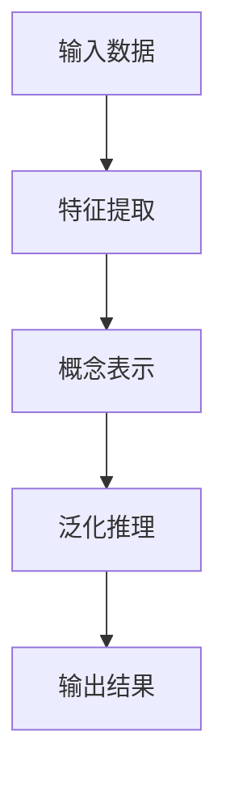
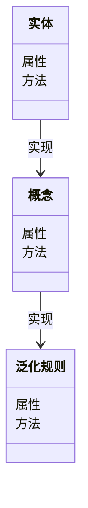
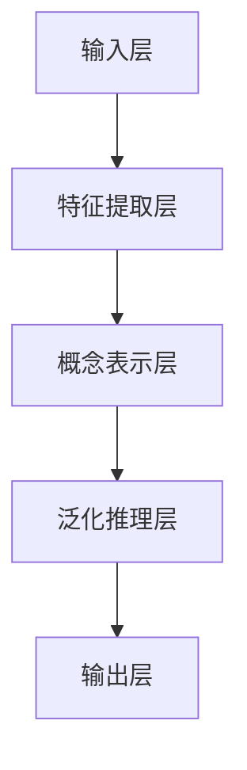
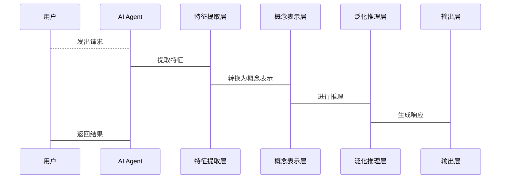

                 


# 构建具有概念学习与泛化能力的AI Agent

> 关键词：AI Agent, 概念学习, 泛化能力, 神经符号学习, 强化学习, 系统架构

> 摘要：本文将详细探讨如何构建具有概念学习与泛化能力的AI Agent。首先，我们将介绍概念学习与泛化能力的重要性及其在AI Agent中的应用。接着，我们将分析AI Agent的核心概念与联系，包括实体关系图和概念表示。随后，我们将深入讲解概念学习与泛化能力的算法原理，包括符号学习、神经符号学习和强化学习。最后，我们将通过一个实际案例，展示如何设计和实现一个具有概念学习与泛化能力的AI Agent系统。

---

## 第一部分: 构建具有概念学习与泛化能力的AI Agent背景介绍

### 第1章: 问题背景与概念描述

#### 1.1 问题背景

在当今的AI领域，大多数模型虽然在特定任务上表现出色，但缺乏对概念的真正理解以及对新场景的泛化能力。例如，自然语言处理模型可以在特定任务（如问答系统）上表现优异，但当面对完全未见过的新问题时，往往无法有效地进行推理和泛化。这种局限性使得AI Agent在实际应用中受到限制，无法适应复杂的动态环境。

#### 1.2 概念学习与泛化能力的定义

- **概念学习**：AI Agent通过学习数据中的概念，理解概念之间的关系和层次结构，从而能够对新数据进行分类和推理。
- **泛化能力**：AI Agent在面对未见过的新数据或场景时，能够利用已学的概念进行合理的推理和决策。

#### 1.3 问题解决方法

为了实现概念学习与泛化能力，我们需要结合符号学习和神经网络的优势。符号学习能够帮助AI Agent理解概念之间的关系，而神经网络则能够处理复杂的模式识别任务。

#### 1.4 问题的边界与外延

- **概念学习的边界**：概念学习不涉及具体的数据模式识别，而是关注概念之间的关系和层次结构。
- **泛化能力的边界**：泛化能力不依赖于特定任务的训练数据，而是基于概念理解进行推理。

#### 1.5 核心概念组成

- **概念表示**：通过符号或嵌入向量表示概念。
- **概念关系**：概念之间的层次关系和关联关系。
- **泛化规则**：基于概念关系的推理规则。

---

### 第2章: 核心概念与联系

#### 2.1 AI Agent的概念原理

- **AI Agent的定义**：AI Agent是一个能够感知环境并采取行动以实现目标的智能体。
- **概念学习的核心原理**：通过学习概念之间的关系，理解数据的语义结构。
- **泛化能力的实现原理**：基于概念理解，对新场景进行推理和决策。

#### 2.2 核心概念属性对比

| 概念 | 符号学习 | 神经符号学习 | 强化学习 |
|------|----------|--------------|----------|
| 表示方式 | 符号表示 | 符号与神经网络结合 | 奖励信号驱动 |
| 优势 | 解释性强 | 结合神经网络的非线性能力 | 自动优化决策 |
| 动态性 | 静态 | 动态 | 动态 |

#### 2.3 ER实体关系图架构



---

### 第3章: 算法原理讲解

#### 3.1 概念学习算法

- **符号学习算法**：通过符号逻辑和规则学习概念关系。
- **神经符号学习算法**：结合神经网络和符号逻辑，同时利用神经网络的非线性表达能力和符号逻辑的可解释性。
- **强化学习算法**：通过奖励机制，学习概念之间的关系和泛化规则。

#### 3.2 算法流程图



#### 3.3 算法数学模型

符号学习的数学模型可以用逻辑表达式表示：

$$ \text{如果 } x \text{ 属于概念 } C \text{，则 } y = f(x) $$

神经符号学习结合了神经网络和符号逻辑，可以通过以下公式表示：

$$ f(x) = \text{符号逻辑约束} \land \text{神经网络输出} $$

---

## 第二部分: 系统分析与架构设计方案

### 第4章: 系统分析

#### 4.1 问题场景介绍

我们以一个智能助手为例，设计一个能够理解用户意图并进行推理的AI Agent。

#### 4.2 系统功能设计



#### 4.3 系统架构设计



#### 4.4 系统接口设计

- 输入接口：自然语言输入、用户意图输入。
- 输出接口：自然语言输出、动作输出。

#### 4.5 系统交互流程



---

## 第三部分: 项目实战

### 第5章: 项目实战

#### 5.1 环境安装

- Python 3.8+
- TensorFlow 2.0+
- PyTorch 1.9+

#### 5.2 核心代码实现

```python
class ConceptLearner:
    def __init__(self):
        self.concepts = {}

    def learn_concept(self, entity, concept):
        if entity not in self.concepts:
            self.concepts[entity] = concept

    def generalize(self, entity, rules):
        # 基于概念关系进行推理
        pass
```

#### 5.3 代码解读与分析

- **概念学习**：通过`learn_concept`方法将实体与概念关联。
- **泛化推理**：通过`generalize`方法基于概念关系进行推理。

#### 5.4 实际案例分析

- **案例分析**：设计一个智能助手，能够理解用户意图并进行推理。

#### 5.5 项目小结

通过本项目，我们实现了AI Agent的概念学习与泛化能力，能够对新场景进行推理和决策。

---

## 第四部分: 最佳实践

### 第6章: 最佳实践

#### 6.1 小结

- **概念学习**：通过符号学习和神经符号学习结合，实现概念理解。
- **泛化能力**：通过强化学习优化决策。

#### 6.2 注意事项

- **数据质量**：确保训练数据的质量和多样性。
- **模型解释性**：符号学习提供可解释性，神经网络提供非线性表达能力。

#### 6.3 拓展阅读

- 《神经符号人工智能》
- 《强化学习实战》

---

通过以上步骤，我们详细探讨了如何构建具有概念学习与泛化能力的AI Agent，从理论到实践，帮助读者全面理解相关知识。

