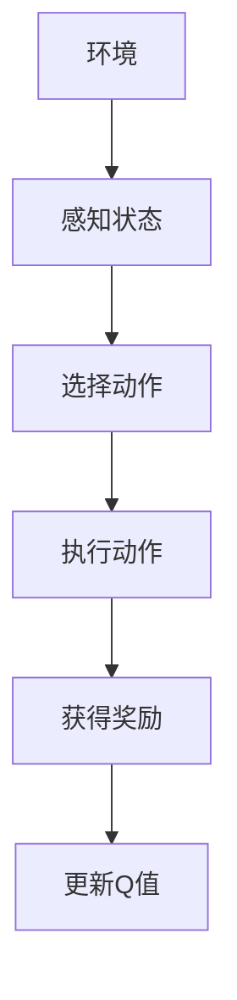
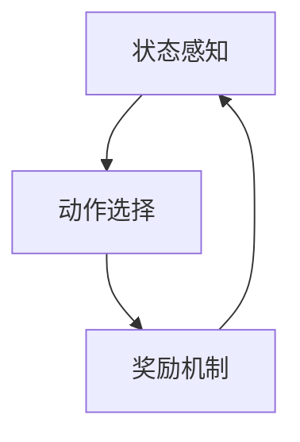

                 


# 构建具有深度强化学习能力的AI Agent

> 关键词：深度强化学习，AI Agent，神经网络，强化学习，算法实现

> 摘要：本文将详细介绍如何构建一个具有深度强化学习能力的AI Agent。通过分析深度强化学习的核心概念、算法原理、系统架构设计以及实际项目实战，帮助读者全面理解并掌握构建此类AI Agent的能力。文章从基础概念开始，逐步深入到算法实现，最后通过具体案例展示实际应用。

---

# 第一部分: 深度强化学习与AI Agent基础

## 第1章: 深度强化学习概述

### 1.1 深度强化学习的背景与概念

#### 1.1.1 人工智能与强化学习的演进
- 从传统AI到机器学习的演变
- 强化学习在游戏、机器人等领域的应用
- 深度强化学习的兴起及其重要性

#### 1.1.2 AI Agent的基本定义与特点
- AI Agent的定义
- 强化学习中的Agent角色
- 深度强化学习如何提升Agent的能力

#### 1.1.3 深度强化学习的核心概念
- 状态、动作、奖励的定义与作用
- 马尔可夫决策过程（MDP）
- 策略与值函数的定义

### 1.2 强化学习的基本原理

#### 1.2.1 Q-learning算法的数学模型
- Q-learning的核心公式
- 动作值函数的更新过程
- Q表的构建与更新

#### 1.2.2 深度强化学习的优势
- 处理高维状态空间的能力
- 神经网络在强化学习中的作用
- 实际应用中的案例分析

---

## 第2章: 深度强化学习的核心算法

### 2.1 Q-learning与Deep Q-Networks（DQN）

#### 2.1.1 DQN算法的流程图


#### 2.1.2 DQN的数学模型
$$Q(s,a) = \theta \cdot \phi(s,a)$$
其中，$\theta$是参数，$\phi(s,a)$是特征函数。

### 2.2 策略梯度方法

#### 2.2.1 策略梯度的基本原理
$$\nabla J(\theta) = \mathbb{E}[ \nabla \log \pi(a|s) \cdot Q(s,a) ]$$

#### 2.2.2 基于策略梯度的算法实现

### 2.3 算法对比分析

---

## 第3章: 深度强化学习的数学模型与公式

### 3.1 状态值函数与动作值函数

#### 3.1.1 状态值函数的定义
$$V(s) = \max_a Q(s,a)$$

#### 3.1.2 动作值函数的定义
$$Q(s,a) = r + \gamma \max_{a'} Q(s',a')$$

### 3.2 神经网络在DRL中的应用

#### 3.2.1 神经网络的输入输出
- 输入：状态s
- 输出：动作值Q(s,a)

#### 3.2.2 神经网络的损失函数
$$\mathcal{L} = \mathbb{E}[(Q(s,a) - y)^2]$$
其中，$y = r + \gamma \max Q(s',a')$

---

## 第4章: 深度强化学习的系统架构设计

### 4.1 问题场景介绍

#### 4.1.1 系统功能设计
- 状态感知模块
- 动作选择模块
- 奖励机制模块

### 4.2 系统架构设计

#### 4.2.1 系统架构图


#### 4.2.2 系统接口设计
- 输入接口：接收状态s
- 输出接口：输出动作a
- 奖励接口：计算奖励r

---

## 第5章: 项目实战

### 5.1 环境搭建

#### 5.1.1 安装Python与深度学习框架（如TensorFlow或PyTorch）
```bash
pip install numpy tensorflow
```

### 5.2 核心代码实现

#### 5.2.1 DQN算法实现
```python
import numpy as np
import tensorflow as tf

class DQN:
    def __init__(self, state_dim, action_dim):
        self.state_dim = state_dim
        self.action_dim = action_dim
        self.model = self.build_model()
        self.target_model = self.build_model()
        self.memory = []

    def build_model(self):
        model = tf.keras.Sequential()
        model.add(tf.keras.layers.Dense(64, activation='relu'))
        model.add(tf.keras.layers.Dense(64, activation='relu'))
        model.add(tf.keras.layers.Dense(self.action_dim))
        return model

    def update_target_model(self):
        self.target_model.set_weights(self.model.get_weights())

    def remember(self, state, action, reward, next_state):
        self.memory.append((state, action, reward, next_state))

    def act(self, state, epsilon=0.1):
        if np.random.random() < epsilon:
            return np.random.randint(self.action_dim)
        q_values = self.model.predict(state)
        return np.argmax(q_values[0])

    def replay(self, batch_size, gamma=0.99):
        mini_batch = random.sample(self.memory, batch_size)
        states = np.array([sample[0] for sample in mini_batch])
        actions = np.array([sample[1] for sample in mini_batch])
        rewards = np.array([sample[2] for sample in mini_batch])
        next_states = np.array([sample[3] for sample in mini_batch])

        q_target = self.target_model.predict(next_states)
        q_target = rewards + gamma * np.max(q_target, axis=1)
        q_predict = self.model.predict(states)

        y = np.zeros((batch_size, self.action_dim))
        indices = np.array([i for i in range(batch_size)])
        y[indices, actions] = q_target

        self.model.fit(states, y, epochs=1, verbose=0)
```

---

## 第6章: 总结与展望

### 6.1 总结

#### 6.1.1 核心概念回顾
- 深度强化学习的基本概念
- 神经网络在DRL中的应用
- 算法实现的关键步骤

### 6.2 展望

#### 6.2.1 深度强化学习的未来方向
- 更复杂的任务处理
- 多智能体协作
- 连续动作空间的优化

### 6.3 最佳实践 tips

#### 6.3.1 算法调参建议
- 学习率的调整
- 网络结构的优化
- 奖励机制的设计

#### 6.3.2 系统优化建议
- 状态压缩技术
- 动作选择的优化
- 神经网络模型的改进

---

通过以上目录结构，您可以按照章节逐步深入地构建一个具有深度强化学习能力的AI Agent。每一章都涵盖了必要的理论知识和实际操作步骤，确保读者能够从基础到实战全面掌握相关技能。

