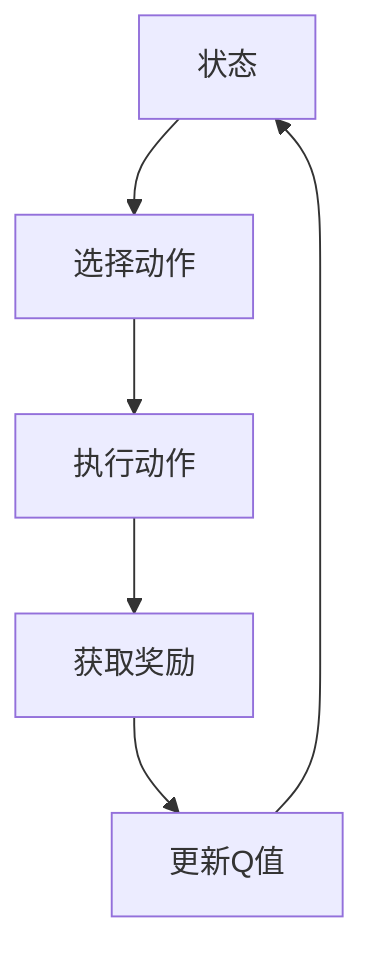
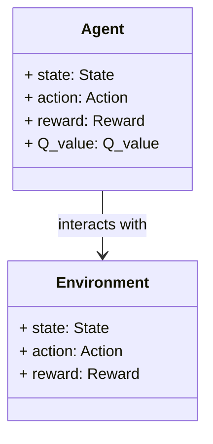
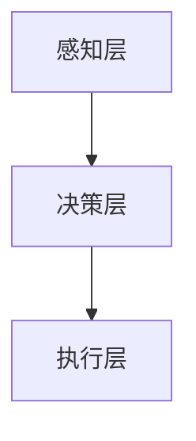
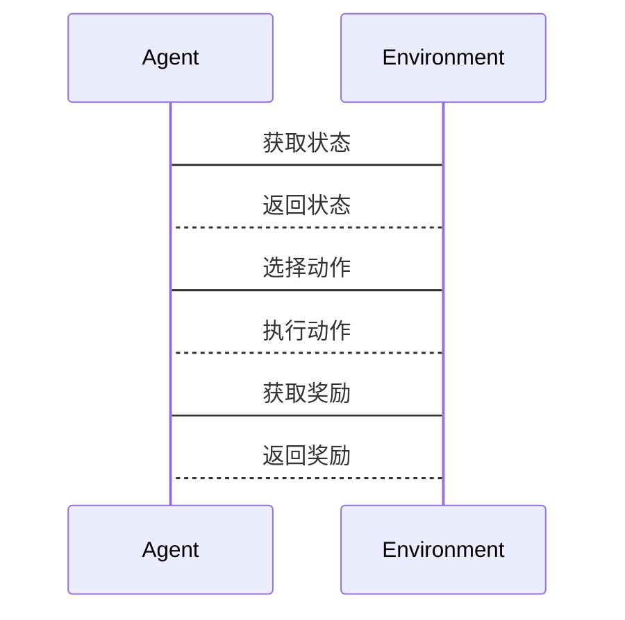

                 


# 构建具有终身学习能力的AI Agent

## 关键词：
- AI Agent
- 终身学习
- 强化学习
- 系统架构
- 项目实战

## 摘要：
构建具有终身学习能力的AI Agent是一个复杂而有趣的过程，涉及多个方面的知识和技能。本文将从基础概念、核心算法、系统架构到项目实战，全面解析如何构建一个能够持续学习和适应变化的AI Agent。通过详细讲解强化学习算法、系统设计和实际案例，帮助读者掌握构建终身学习AI Agent的核心技术和方法。

# 第一部分：构建具有终身学习能力的AI Agent基础

## 第1章：AI Agent与终身学习概述

### 1.1 AI Agent的基本概念

#### 1.1.1 AI Agent的定义与特点
AI Agent（人工智能代理）是一种智能体，能够感知环境并采取行动以实现特定目标。AI Agent的特点包括自主性、反应性、目标导向和学习能力。

#### 1.1.2 终身学习的定义与重要性
终身学习是指AI Agent能够不断学习和适应新知识，而不仅仅依赖于初始训练数据。终身学习的重要性在于使其能够应对动态变化的环境，提高其适应性和智能性。

#### 1.1.3 构建具有终身学习能力的AI Agent的必要性
在动态和不确定性环境中，传统的静态模型难以应对变化，构建具有终身学习能力的AI Agent能够使其在实际应用中更具灵活性和实用性。

### 1.2 AI Agent的分类与应用场景

#### 1.2.1 基于任务的AI Agent
这类AI Agent专注于完成特定任务，如自动交易、智能客服等。

#### 1.2.2 基于知识的AI Agent
这类AI Agent侧重于知识的积累和应用，如专家系统、智能 tutoring系统等。

#### 1.2.3 基于学习的AI Agent
这类AI Agent通过机器学习算法不断优化自身性能，如推荐系统、游戏AI等。

#### 1.2.4 AI Agent在不同领域的应用案例
包括自动驾驶、智能家居、金融投资等领域。

### 1.3 终身学习的核心理念

#### 1.3.1 终身学习的定义与特点
终身学习是指AI Agent能够持续从新数据中学习，不断更新和优化自身的知识和技能。

#### 1.3.2 终身学习与传统机器学习的区别
传统机器学习基于固定训练数据，而终身学习是在线学习，能够适应新数据和变化的环境。

#### 1.3.3 终身学习在AI Agent中的应用价值
使AI Agent能够更好地适应动态环境，提高其智能性和实用性。

### 1.4 本章小结
本章介绍了AI Agent的基本概念、分类及其在终身学习中的应用价值，为后续章节打下基础。

## 第2章：终身学习AI Agent的核心概念

### 2.1 终身学习AI Agent的定义与特点

#### 2.1.1 终身学习AI Agent的定义
终身学习AI Agent是一种能够持续从新数据中学习并适应变化的智能体。

#### 2.1.2 终身学习AI Agent的核心特点
包括自适应学习、知识表示与推理、环境感知与交互、自我优化与进化等。

### 2.2 终身学习AI Agent的核心要素

#### 2.2.1 自适应学习机制
AI Agent能够根据新数据调整其学习策略和模型。

#### 2.2.2 知识表示与推理
AI Agent需要能够表示和推理复杂知识，以便做出决策。

#### 2.2.3 环境感知与交互
AI Agent能够感知环境并与其进行有效交互，以获取新信息。

#### 2.2.4 自我优化与进化
AI Agent能够不断优化自身性能，适应变化的环境。

### 2.3 终身学习AI Agent的体系结构

#### 2.3.1 分层架构
将AI Agent的功能分为感知层、决策层和执行层。

#### 2.3.2 模块化架构
将AI Agent划分为多个功能模块，如学习模块、推理模块等。

#### 2.3.3 面向服务的架构
基于服务导向架构（SOA），将AI Agent的功能分解为多个服务。

### 2.4 本章小结
本章详细阐述了终身学习AI Agent的核心概念和体系结构，为后续章节的算法和系统设计奠定基础。

# 第二部分：终身学习AI Agent的算法原理

## 第3章：终身学习AI Agent的算法原理

### 3.1 强化学习算法

#### 3.1.1 强化学习的基本原理
强化学习是一种通过试错机制来优化决策策略的学习方法。AI Agent通过与环境交互，获得奖励或惩罚，从而优化其策略。

#### 3.1.2 Q-learning算法
Q-learning是一种基于值函数的强化学习算法，通过更新Q表来学习最优策略。

#### 3.1.3 Deep Q-Networks (DQN)算法
DQN算法将Q-learning与深度神经网络结合，能够处理高维状态空间。

#### 3.1.4 算法的数学模型与公式
Q-learning的更新公式为：
$$ Q(s, a) = r + \gamma \max_{a'} Q(s', a') $$

#### 3.1.5 算法的实现步骤与流程图


#### 3.1.6 代码示例
```python
import numpy as np
import gym

env = gym.make('CartPole-v0')
env.seed(123)
np.random.seed(123)

gamma = 0.99
epsilon = 1.0
epsilon_min = 0.01
epsilon_decay = 0.995

Q = np.zeros([env.observation_space.shape[0], env.action_space.n])

for episode in range(1000):
    state = env.reset()
    done = False
    while not done:
        if np.random.random() < epsilon:
            action = np.random.randint(0, env.action_space.n)
        else:
            action = np.argmax(Q[state])
        
        next_state, reward, done, info = env.step(action)
        
        if not done:
            Q[next_state][action] = Q[next_state][action] + gamma * (reward + gamma * np.max(Q[next_state]))
        else:
            Q[next_state][action] = Q[next_state][action] + gamma * reward
        
        epsilon = max(epsilon_min, epsilon * epsilon_decay)
```

### 3.2 其他终身学习算法

#### 3.2.1 监督学习算法
监督学习算法如支持向量机（SVM）、随机森林等，适用于分类和回归任务。

#### 3.2.2 半监督学习算法
半监督学习结合了监督学习和无监督学习，适用于标注数据较少的情况。

#### 3.2.3 对抗学习算法
对抗学习通过生成器和判别器的博弈，优化生成模型。

#### 3.2.4 迁移学习算法
迁移学习将知识从源任务迁移到目标任务，适用于新任务的数据不足的情况。

### 3.3 终身学习算法的挑战与解决方案

#### 3.3.1 概念漂移（Concept Drift）
概念漂移是指数据分布的变化，终身学习需要能够检测并适应这种变化。

#### 3.3.2 计算效率
终身学习需要在实时或近实时的情况下进行，需要高效的算法和计算资源。

#### 3.3.3 数据质量
终身学习需要处理噪声和偏差，保持数据质量以确保模型的准确性。

### 3.4 本章小结
本章详细介绍了终身学习AI Agent的核心算法，包括强化学习和监督学习等，并讨论了终身学习算法的挑战与解决方案。

# 第三部分：终身学习AI Agent的系统架构设计

## 第4章：系统分析与架构设计方案

### 4.1 问题场景介绍

#### 4.1.1 动态环境下的AI Agent
AI Agent需要在动态环境中适应变化，如自动驾驶需要实时处理交通变化。

#### 4.1.2 不确定性环境下的AI Agent
AI Agent需要处理不确定性，如机器人需要应对不可预测的环境。

### 4.2 项目介绍

#### 4.2.1 项目目标
构建一个能够在动态环境中不断学习和适应的AI Agent。

#### 4.2.2 项目范围
包括感知、决策、学习和执行四个模块。

### 4.3 系统功能设计

#### 4.3.1 领域模型设计
使用Mermaid类图展示各模块之间的关系：


#### 4.3.2 系统架构设计
使用分层架构，包括感知层、决策层和执行层：


#### 4.3.3 系统接口设计
定义AI Agent与环境交互的接口，包括获取状态、选择动作、执行动作和接收奖励。

#### 4.3.4 系统交互流程图
展示AI Agent与环境的交互过程：


### 4.4 本章小结
本章详细讨论了系统分析与架构设计方案，为后续章节的实现提供指导。

## 第5章：项目实战

### 5.1 环境配置

#### 5.1.1 安装必要的库
安装numpy、gym等库：
```bash
pip install numpy gym
```

### 5.2 核心代码实现

#### 5.2.1 状态感知模块
实现AI Agent对环境状态的感知。

#### 5.2.2 动作选择模块
根据当前状态选择最优动作，使用epsilon-greedy策略：
```python
if np.random.random() < epsilon:
    action = np.random.randint(0, env.action_space.n)
else:
    action = np.argmax(Q[state])
```

#### 5.2.3 奖励函数
定义奖励函数，根据动作执行结果返回奖励值。

#### 5.2.4 Q值更新模块
根据奖励更新Q值：
```python
Q[next_state][action] = Q[next_state][action] + gamma * (reward + gamma * np.max(Q[next_state]))
```

### 5.3 案例分析与代码解读

#### 5.3.1 实验结果分析
展示AI Agent在不同训练阶段的表现。

#### 5.3.2 代码优化建议
根据实验结果优化epsilon衰减率和gamma折扣因子。

### 5.4 本章小结
本章通过实际项目展示如何构建终身学习AI Agent，并通过实验验证其有效性。

## 第6章：未来展望与挑战

### 6.1 技术趋势

#### 6.1.1 边缘计算与终身学习
结合边缘计算，提升AI Agent的实时性和响应速度。

#### 6.1.2 区块链与终身学习
利用区块链技术确保数据的安全性和可信度。

### 6.2 挑战与解决方案

#### 6.2.1 计算效率
通过优化算法和硬件加速提升计算效率。

#### 6.2.2 数据隐私
通过加密技术和联邦学习保护数据隐私。

#### 6.2.3 伦理问题
确保AI Agent的行为符合伦理规范，避免滥用。

### 6.3 本章小结
本章展望了终身学习AI Agent的未来发展方向，并讨论了面临的挑战与解决方案。

# 第四部分：总结与展望

## 第7章：总结与最佳实践

### 7.1 核心知识点回顾
总结本文的核心知识点，包括AI Agent的基本概念、终身学习的核心理念、算法原理和系统架构设计。

### 7.2 最佳实践 tips

#### 7.2.1 环境配置与库管理
确保安装正确的库版本，避免兼容性问题。

#### 7.2.2 算法实现与优化
选择合适的算法，并根据实验结果进行优化。

#### 7.2.3 系统设计与架构
采用模块化设计，便于维护和扩展。

#### 7.2.4 代码实现与测试
编写高质量的代码，并进行充分的测试和验证。

### 7.3 本章小结
本章总结了本文的主要内容，并提供了最佳实践建议，帮助读者更好地构建终身学习AI Agent。

## 第8章：参考文献与拓展阅读

### 8.1 参考文献
列出本文引用的主要文献和资料。

### 8.2 拓展阅读
推荐相关领域的书籍和论文，供读者进一步学习。

### 8.3 本章小结
本章提供了本文的参考文献，并推荐了进一步学习的资源。

---

通过以上目录和内容，您可以逐步构建一篇详细的、具有深度和专业性的技术博客文章。每一部分都涵盖了从基础概念到实际应用的各个方面，结合理论分析和实践案例，帮助读者全面理解如何构建具有终身学习能力的AI Agent。

