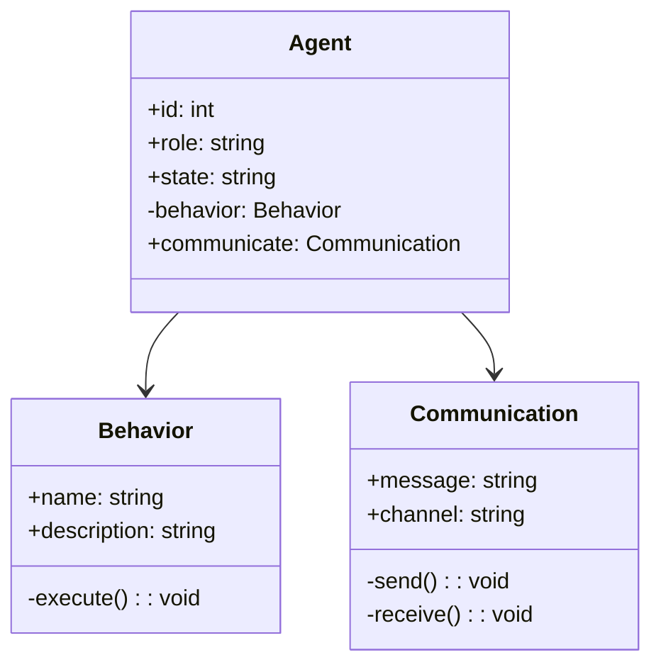
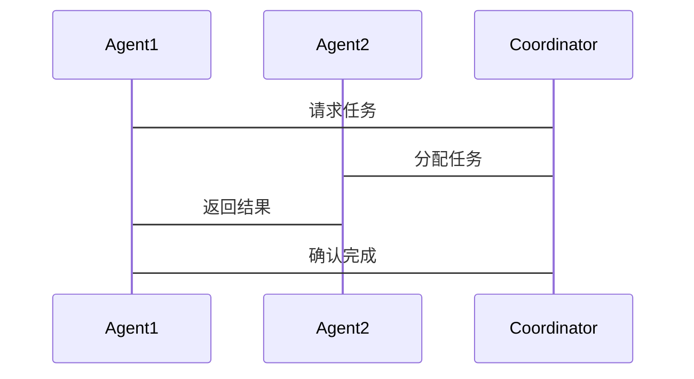
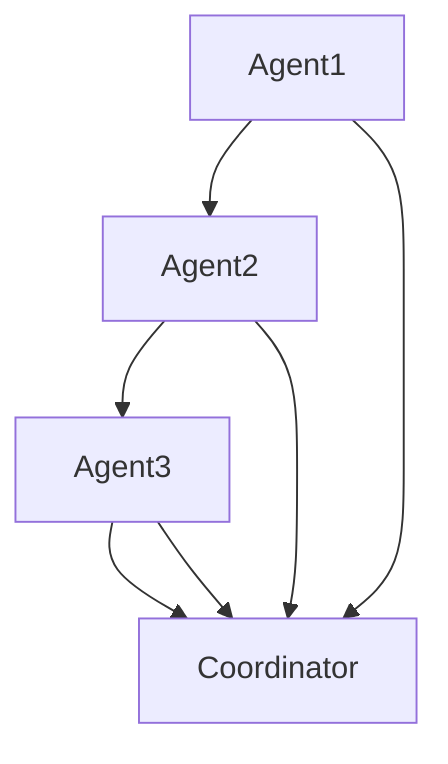
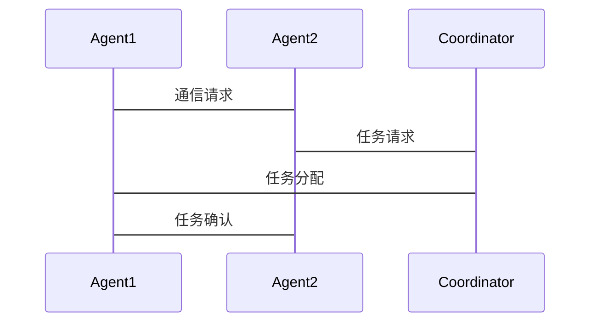

                 


# 《构建具有群体智能决策能力的多Agent系统》

> **关键词**：多Agent系统，群体智能，分布式计算，分布式算法，一致性算法，系统架构设计  
> **摘要**：本文旨在探讨如何构建一个具有群体智能决策能力的多Agent系统。首先介绍多Agent系统和群体智能的基本概念，分析其核心概念与联系；接着深入讲解群体智能决策的算法原理，包括分布式计算与博弈论的应用；然后讨论多Agent系统的架构设计，包括功能设计、架构图和接口设计；最后通过一个具体的项目实战案例，展示如何实现一个多Agent系统的群体智能决策，并总结相关的注意事项和最佳实践。

---

# 第1章 多Agent系统与群体智能决策概述

## 1.1 多Agent系统的基本概念

### 1.1.1 多Agent系统定义
多Agent系统（Multi-Agent System, MAS）是由多个智能体（Agent）组成的分布式系统，每个Agent都是具有独立性、主动性、反应性和协作性的实体。多Agent系统的特点包括：

- **独立性**：每个Agent都有自己的目标和行为，能够独立决策。
- **主动性**：Agent能够主动感知环境并采取行动。
- **反应性**：Agent能够根据环境的变化调整自己的行为。
- **协作性**：多个Agent通过协作完成复杂任务。

### 1.1.2 多Agent系统的特征
1. **分布式性**：Agent分布在不同的位置，通过通信和协作完成任务。
2. **动态性**：环境和任务可能是动态变化的，Agent需要适应这些变化。
3. **自主性**：Agent在没有外部干预的情况下自主决策。

### 1.1.3 多Agent系统的应用场景
多Agent系统广泛应用于分布式计算、机器人协作、自动驾驶、智能交通系统等领域。例如，在智能交通系统中，多个Agent可以分别负责交通灯控制、车辆路径规划和事故处理。

---

## 1.2 群体智能决策的基本概念

### 1.2.1 群体智能的定义
群体智能（Swarm Intelligence）是指通过多个简单个体（Agent）的协作，实现复杂问题的解决方案。群体智能的核心在于个体之间的局部交互，通过简单的规则实现全局的智能行为。

### 1.2.2 群体智能与多Agent系统的关系
群体智能是多Agent系统的一种实现方式。通过多个Agent的协作，群体智能能够完成单个Agent无法完成的任务。例如，在机器人编队中，每个机器人都是一个Agent，通过群体智能算法实现编队的自组织和自适应。

### 1.2.3 群体智能决策的核心思想
群体智能决策的核心思想是通过Agent之间的协作和信息共享，实现群体的智能决策。每个Agent基于局部信息做出决策，通过分布式计算实现全局最优。

---

## 1.3 多Agent系统与群体智能决策的结合

### 1.3.1 多Agent系统在群体智能中的作用
多Agent系统为群体智能提供了分布式计算的框架，通过Agent之间的协作实现复杂的群体行为。

### 1.3.2 群体智能决策在多Agent系统中的应用
群体智能决策可以应用于任务分配、资源优化、路径规划等领域。例如，在分布式任务分配中，多个Agent通过群体智能算法实现任务的最优分配。

### 1.3.3 多Agent系统与群体智能决策的协同机制
多Agent系统与群体智能决策的协同机制包括信息共享、分布式计算和协作决策。通过这些机制，多个Agent能够共同完成复杂的决策任务。

---

## 1.4 本章小结
本章介绍了多Agent系统和群体智能的基本概念，分析了它们的核心特征和应用场景，探讨了多Agent系统与群体智能决策的结合方式，为后续章节奠定了基础。

---

# 第2章 多Agent系统的核心概念与联系

## 2.1 多Agent系统中的Agent

### 2.1.1 Agent的定义与特征
Agent是多Agent系统的基本单元，具有以下特征：
- **自主性**：Agent能够自主决策。
- **反应性**：Agent能够根据环境变化调整行为。
- **社会性**：Agent能够与其他Agent协作。

### 2.1.2 Agent的分类与层次结构
Agent可以分为简单反射Agent、基于模型的反射Agent、目标驱动的Agent和效用驱动的Agent。每个Agent的层次结构包括感知层、决策层和执行层。

### 2.1.3 Agent的智能性与社会性
Agent的智能性体现在其感知、推理和决策能力，社会性体现在其与其他Agent的协作能力。

---

## 2.2 多Agent系统中的交互与协作

### 2.2.1 Agent之间的交互机制
Agent之间的交互包括通信、协调和协作。通信是Agent之间共享信息的方式，协调是Agent之间达成一致的机制，协作是Agent之间共同完成任务的方式。

### 2.2.2 多Agent系统的通信协议
通信协议是Agent之间共享信息的规则，包括消息格式、通信渠道和协议规范。

### 2.2.3 Agent协作的实现方式
Agent协作可以通过分布式计算、一致性算法和博弈论实现。例如，一致性算法（如Paxos和Raft）用于保证多个Agent的状态一致性。

---

## 2.3 多Agent系统的社会性与群体智能

### 2.3.1 多Agent系统的社会性特征
多Agent系统具有社会性特征，包括协作性、竞争性和协调性。这些特征使得多个Agent能够共同完成复杂任务。

### 2.3.2 群体智能与社会性的关系
群体智能通过Agent之间的协作实现社会性，社会性是群体智能的重要组成部分。

### 2.3.3 多Agent系统中社会性的实现
多Agent系统中社会性的实现包括角色分配、任务分配和协作机制。例如，角色分配可以通过博弈论实现。

---

## 2.4 本章小结
本章详细讲解了多Agent系统中的Agent及其分类，分析了Agent之间的交互与协作机制，探讨了多Agent系统的社会性与群体智能的关系。

---

# 第3章 群体智能决策的算法原理

## 3.1 分布式计算与群体智能

### 3.1.1 分布式计算的基本概念
分布式计算是将计算任务分配到多个计算节点上，通过协作完成任务。分布式计算的核心在于任务的分解与节点之间的通信。

### 3.1.2 分布式计算在群体智能中的应用
分布式计算可以应用于任务分配、资源优化和路径规划。例如，在分布式任务分配中，多个Agent通过分布式计算实现任务的最优分配。

### 3.1.3 分布式计算与多Agent系统的关系
分布式计算为多Agent系统提供了计算框架，多Agent系统为分布式计算提供了智能体。

---

## 3.2 博弈论与群体智能决策

### 3.2.1 博弈论的基本概念
博弈论研究的是多个参与者之间的策略互动。博弈论的核心在于均衡概念，如纳什均衡。

### 3.2.2 博弈论在群体智能中的应用
博弈论可以应用于任务分配、资源竞争和决策优化。例如，在任务分配中，多个Agent可以通过博弈论实现资源的最优分配。

### 3.2.3 博弈论与多Agent系统的关系
博弈论为多Agent系统提供了决策模型，多Agent系统为博弈论提供了实现平台。

---

## 3.3 群体智能决策的数学模型

### 3.3.1 群体智能决策的基本模型
群体智能决策的基本模型包括感知层、决策层和执行层。感知层负责信息采集，决策层负责策略选择，执行层负责行动。

### 3.3.2 群体智能决策的数学表达
群体智能决策的数学模型可以表示为：
$$
\text{决策} = \arg\max_{a} \sum_{i=1}^{n} u_i(a)
$$
其中，$u_i(a)$ 是第 $i$ 个Agent对行动 $a$ 的效用函数。

### 3.3.3 群体智能决策的优化算法
群体智能决策的优化算法包括遗传算法、模拟退火和蚁群算法。这些算法通过迭代优化实现全局最优。

---

## 3.4 本章小结
本章介绍了分布式计算与群体智能的关系，分析了博弈论在群体智能中的应用，探讨了群体智能决策的数学模型和优化算法。

---

# 第4章 多Agent系统的系统架构设计

## 4.1 系统功能设计

### 4.1.1 功能需求分析
多Agent系统的功能需求包括信息采集、任务分配、协作决策和结果输出。

### 4.1.2 系统功能设计的类图
以下是系统功能设计的类图：



---

### 4.1.3 功能模块的交互设计
以下是功能模块的交互设计：



---

## 4.2 系统架构设计

### 4.2.1 系统架构图
以下是系统架构图：



---

### 4.2.2 系统架构设计的实现
系统架构设计包括通信层、协调层和执行层。通信层负责Agent之间的信息传递，协调层负责任务分配和决策优化，执行层负责具体行动。

---

## 4.3 系统接口设计

### 4.3.1 系统接口的设计
系统接口设计包括通信接口、任务分配接口和结果反馈接口。通信接口负责Agent之间的信息传递，任务分配接口负责任务的分配与接收，结果反馈接口负责结果的汇报与确认。

### 4.3.2 接口设计的交互流程
以下是接口设计的交互流程：



---

## 4.4 本章小结
本章详细讲解了多Agent系统的系统架构设计，包括功能设计、架构图和接口设计，为后续章节的系统实现奠定了基础。

---

# 第5章 项目实战：构建一个多Agent系统的群体智能决策案例

## 5.1 项目介绍

### 5.1.1 项目背景
本项目旨在通过构建一个多Agent系统，实现群体智能决策。项目的目标是通过多个Agent的协作，完成复杂任务的决策优化。

### 5.1.2 项目需求
项目需求包括任务分配、资源优化和决策反馈。每个Agent需要能够感知环境、做出决策并与其他Agent协作。

---

## 5.2 环境安装与配置

### 5.2.1 开发环境
项目开发环境包括Python编程语言、多线程库（如threading）和通信库（如socket）。此外，还需要安装mermaid图生成工具和latex公式编辑工具。

### 5.2.2 依赖管理
项目依赖包括Python版本（3.8及以上）、mermaid工具链和latex编译器。可以通过pip安装必要的Python库，如numpy和pandas。

---

## 5.3 系统核心实现

### 5.3.1 Agent类的实现
以下是Agent类的Python实现：

```python
class Agent:
    def __init__(self, id, role):
        self.id = id
        self.role = role
        self.state = "idle"
        self.behavior = self.default_behavior()

    def default_behavior(self):
        def execute():
            print(f"Agent {self.id} is executing default behavior.")
        return execute

    def communicate(self, message):
        print(f"Agent {self.id} receives message: {message}")
```

### 5.3.2 通信模块的实现
以下是通信模块的Python实现：

```python
class Communication:
    def __init__(self, channel):
        self.channel = channel
        self.messages = []

    def send(self, message):
        self.messages.append(message)
        print(f"Message sent to {self.channel}: {message}")

    def receive(self):
        if self.messages:
            message = self.messages.pop(0)
            print(f"Message received from {self.channel}: {message}")
            return message
        return None
```

---

### 5.3.3 群体智能决策算法的实现
以下是群体智能决策算法的Python实现：

```python
def group_intelligence_decision(agents):
    max_utility = float('-inf')
    best_action = None
    for agent in agents:
        for action in agent.possible_actions():
            utility = calculate_utility(agent, action)
            if utility > max_utility:
                max_utility = utility
                best_action = action
    return best_action
```

---

## 5.4 项目实战分析

### 5.4.1 案例分析
通过一个具体的案例分析，展示如何实现一个多Agent系统的群体智能决策。例如，在智能交通系统中，多个Agent分别负责交通灯控制、车辆路径规划和事故处理。

### 5.4.2 代码实现与解读
以下是实现代码的解读：

```python
# 初始化多个Agent
agents = [Agent(1, "traffic_light"), Agent(2, "vehicle")]

# 初始化通信模块
communication = Communication("traffic_system")

# Agent 1发送消息
agents[0].communicate("start traffic light")

# Agent 2接收消息并执行行为
agents[1].communicate("adjust path")

# 群体智能决策
decision = group_intelligence_decision(agents)
print(f"Best action: {decision}")
```

---

## 5.5 本章小结
本章通过一个具体的项目案例，展示了如何实现一个多Agent系统的群体智能决策，包括环境配置、代码实现和案例分析。

---

# 第6章 总结与展望

## 6.1 总结

### 6.1.1 多Agent系统的核心概念
多Agent系统的核心概念包括Agent的定义、分类和交互机制。

### 6.1.2 群体智能决策的算法原理
群体智能决策的算法原理包括分布式计算、博弈论和优化算法。

### 6.1.3 系统架构设计的关键点
系统架构设计的关键点包括功能设计、架构图和接口设计。

---

## 6.2 未来展望

### 6.2.1 群体智能决策的发展趋势
群体智能决策的发展趋势包括算法优化、多模态决策和边缘计算的结合。

### 6.2.2 多Agent系统的未来研究方向
多Agent系统的未来研究方向包括智能体的自主性、社会性与人机协作。

### 6.2.3 群体智能决策在新兴领域的应用
群体智能决策在新兴领域的应用包括智能交通、智慧城市和分布式能源管理。

---

## 6.3 注意事项与最佳实践

### 6.3.1 开发中的注意事项
在开发多Agent系统时，需要注意系统的可扩展性、可维护性和可测试性。

### 6.3.2 最佳实践
最佳实践包括模块化设计、日志记录和性能优化。模块化设计可以提高系统的可维护性，日志记录可以方便调试，性能优化可以提高系统的效率。

---

## 6.4 本章小结
本章总结了全文的核心内容，展望了群体智能决策和多Agent系统的未来发展方向，并提出了开发中的注意事项和最佳实践。

---

# 结语

通过本文的探讨，我们深入理解了多Agent系统与群体智能决策的核心概念与实现方法。未来，随着人工智能技术的不断发展，多Agent系统和群体智能决策将在更多领域得到广泛应用。希望本文能够为读者提供有价值的参考和启发。

--- 

**注**：由于篇幅限制，以上内容为简化版，实际文章将更加详细，并包含完整的代码示例和mermaid图。

