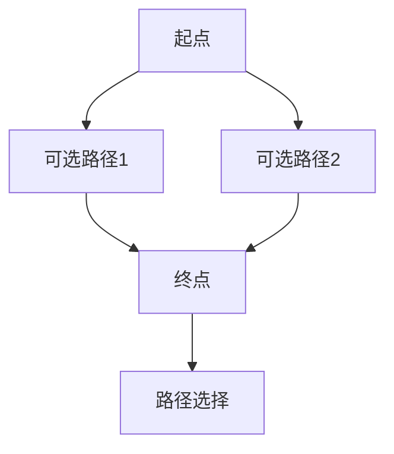
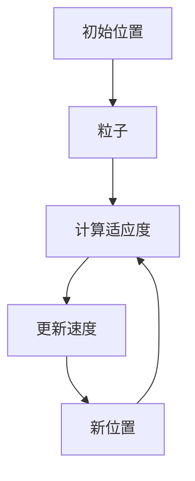
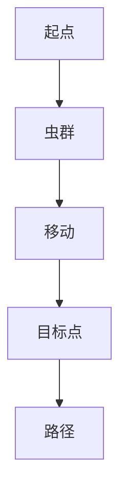
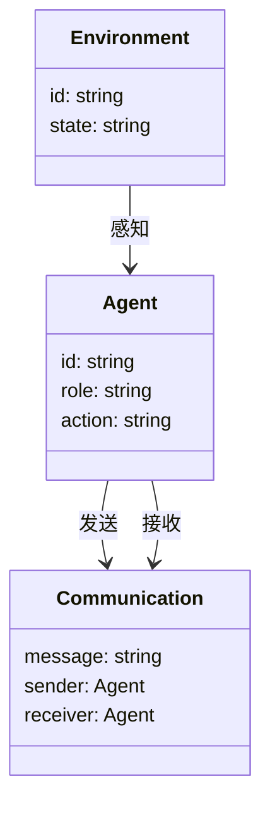
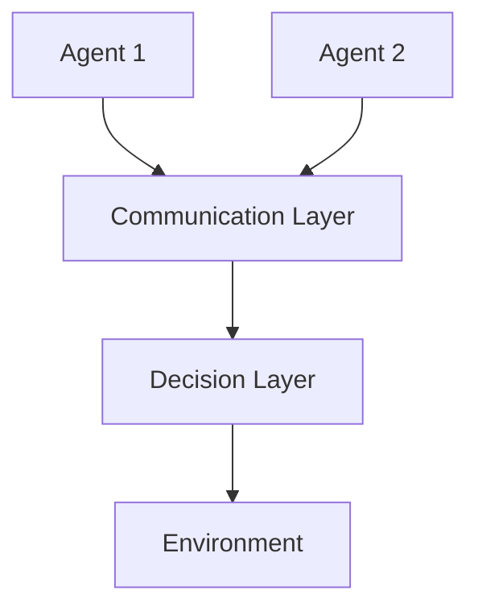
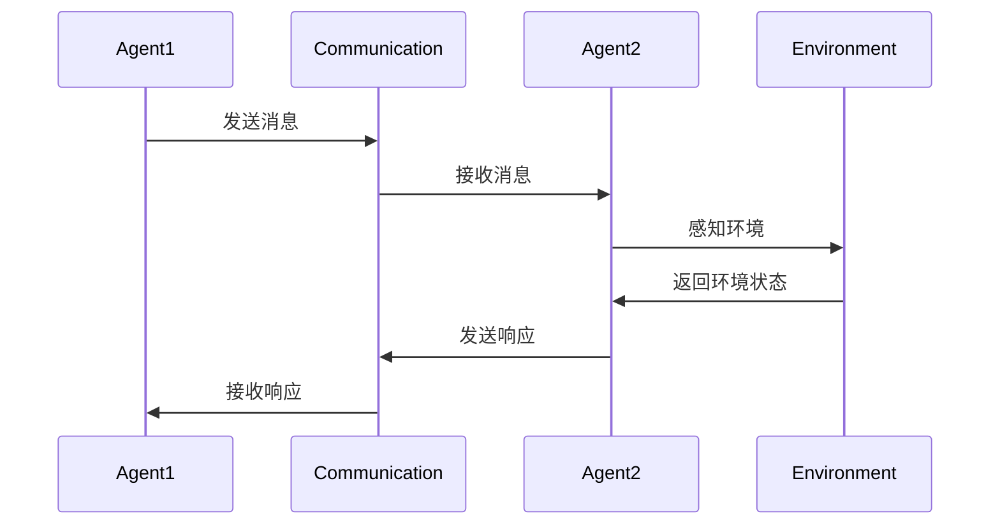

                 


# 构建具有群体智能的多Agent系统

> 关键词：多Agent系统、群体智能、分布式计算、一致性算法、协同优化

> 摘要：本文详细探讨了如何构建具有群体智能的多Agent系统，从基础概念到算法实现，再到系统架构设计和项目实战，全面解析了多Agent系统与群体智能的结合及其应用。通过理论分析和实践案例，展示了如何利用群体智能提升多Agent系统的协作效率和性能。

---

## 第一部分: 多Agent系统与群体智能基础

### 第1章: 多Agent系统概述

#### 1.1 多Agent系统的基本概念

##### 1.1.1 Agent的定义与特征

**Agent**（智能体）是指能够感知环境并采取行动以实现目标的实体。Agent可以是软件程序、机器人或其他智能系统。其主要特征包括：

- **自主性**：能够在没有外部干预的情况下自主决策。
- **反应性**：能够根据环境变化实时调整行为。
- **社会性**：能够与其他Agent或人类进行交互和协作。

##### 1.1.2 多Agent系统的定义

多Agent系统（Multi-Agent System, MAS）是由多个相互作用的智能体组成的系统，这些智能体通过协作完成单一智能体无法完成的任务。多Agent系统的特点包括：

- **分布性**：智能体之间不存在中心化的控制节点。
- **协作性**：智能体通过协作完成共同目标。
- **动态性**：系统环境和智能体状态可能动态变化。

##### 1.1.3 多Agent系统与传统分布式系统的主要区别

| 特性             | 分布式系统              | 多Agent系统           |
|------------------|------------------------|-----------------------|
| 结构             | 分散计算资源           | 多个智能体协作         |
| 交互方式         | 程序间通过API通信       | 智能体之间通过消息传递 |
| 行为方式         | 程序按预定逻辑执行       | 智能体具有自主性       |
| 协调机制         | 中央调度或分层结构      | 去中心化或自组织       |

#### 1.2 群体智能的定义与特点

##### 1.2.1 群体智能的定义

群体智能（Swarm Intelligence）是指通过大量简单个体（如蚂蚁、鸟群或智能体）的协作，实现复杂问题求解的一种智能形式。群体智能的核心在于个体之间的局部交互，最终形成全局最优。

##### 1.2.2 群体智能的核心特征

- **去中心化**：没有单一控制中心。
- **自组织性**：个体通过简单规则自发组织。
- **涌现性**：群体行为是单个个体行为的涌现结果。

##### 1.2.3 多Agent系统与群体智能的联系与区别

| 特性             | 多Agent系统              | 群体智能               |
|------------------|--------------------------|------------------------|
| 结构             | 明确的层次结构            | 去中心化的自组织结构    |
| 智能体类型       | 具有复杂行为的智能体      | 简单个体               |
| 协作方式         | 显式通信与协作           | 隐式规则与局部交互     |

#### 1.3 多Agent系统与群体智能的结合

##### 1.3.1 多Agent系统中群体智能的应用场景

- **分布式计算**：通过群体智能优化资源分配。
- **任务分配**：利用群体智能实现动态任务分配。
- **协同决策**：群体智能辅助多Agent系统做出最优决策。

##### 1.3.2 群体智能如何增强多Agent系统的性能

- **自适应性**：群体智能使多Agent系统能够快速适应环境变化。
- **容错性**：通过去中心化结构提高系统的容错能力。
- **优化效率**：群体智能算法能够提高多Agent系统的协作效率。

##### 1.3.3 多Agent系统与群体智能的协同机制

通过消息传递和规则驱动，群体智能与多Agent系统实现协同。例如，多Agent系统中的智能体可以采用群体智能算法进行任务分配，从而实现全局优化。

---

#### 1.4 本章小结

本章介绍了多Agent系统和群体智能的基本概念、特点及其联系与区别。通过对比分析，明确了多Agent系统与群体智能的结合方式及其优势。

---

## 第2章: 多Agent系统的核心概念与联系

### 2.1 多Agent系统的组成结构

#### 2.1.1 Agent的基本结构

**Agent**由以下部分组成：

- **感知器**：接收环境信息。
- **推理器**：处理信息并做出决策。
- **行动器**：执行决策动作。

#### 2.1.2 多Agent系统的层次架构

多Agent系统的层次架构如下：

1. **物理层**：硬件设备或计算资源。
2. **数据层**：数据存储和管理。
3. **行为层**：智能体的行为规则和逻辑。
4. **协作层**：智能体之间的协作机制。
5. **应用层**：最终的应用功能。

#### 2.1.3 多Agent系统的实体关系图（ER图）

使用Mermaid绘制多Agent系统的ER图：

```mermaid
erd
  title 多Agent系统实体关系图
  class Agent {
    id: string
    role: string
    action: string
  }
  class Environment {
    id: string
    state: string
  }
  class Communication {
    message: string
    sender: Agent
    receiver: Agent
  }
  Agent --> Communication: 发送
  Agent --> Communication: 接收
  Environment --> Agent: 感知
```

### 2.2 群体智能的层次模型

#### 2.2.1 群体智能的感知层

感知层负责采集环境信息，例如传感器数据或邻居智能体的状态。

#### 2.2.2 群体智能的决策层

决策层基于感知信息制定决策规则，例如“跟随最近的邻居”。

#### 2.2.3 群体智能的执行层

执行层根据决策层的指令执行具体动作，例如移动或调整行为。

### 2.3 多Agent系统与群体智能的协同关系

#### 2.3.1 多Agent系统中群体智能的作用

群体智能通过局部规则实现全局优化，增强多Agent系统的协作效率。

#### 2.3.2 群体智能如何优化多Agent系统的协作效率

通过自适应的规则调整，群体智能能够动态优化多Agent系统的协作过程。

#### 2.3.3 多Agent系统与群体智能的协同机制

通过消息传递和规则驱动，群体智能与多Agent系统实现协同，例如利用蚁群算法优化任务分配。

---

#### 2.4 本章小结

本章详细分析了多Agent系统的组成结构和群体智能的层次模型，并探讨了两者之间的协同关系。

---

## 第3章: 多Agent系统与群体智能的算法原理

### 3.1 多Agent系统中的典型算法

#### 3.1.1 一致性算法（Consensus Algorithm）

一致性算法用于确保分布式系统中的所有节点达成一致。常用的一致性算法包括Paxos和Raft。

##### 一致性算法的数学模型

一致性算法的目标是让所有节点达成一致，公式表示为：
$$ \text{一致性算法的目标是让所有节点达成一致，公式表示为：} $$
$$ \text{所有节点的值最终相等，即 } v_1 = v_2 = \cdots = v_n $$

##### Paxos算法的简单实现

以下是一个简单的Paxos算法实现：

```python
def propose(value):
    # 提议者发送提案
    pass

def accept(value):
    # 接受者接受提案
    pass

def decide(value):
    # 决策者决定最终值
    pass
```

#### 3.1.2 分布式计算算法

分布式计算算法用于在多Agent系统中进行计算任务的分配和执行。

##### 分布式计算的数学模型

分布式计算的目标是将任务分解并分配给多个节点，公式表示为：
$$ \text{任务 } T \text{ 分解为 } T_1, T_2, \cdots, T_n \text{，分配给节点 } N_1, N_2, \cdots, N_n $$

#### 3.1.3 博弈论模型在多Agent系统中的应用

博弈论模型用于分析多Agent系统中的策略选择和冲突解决。

##### 博弈论模型的数学公式

纳什均衡的定义为：
$$ \text{在博弈论中，纳什均衡是指没有任何玩家能够单方面改变策略而提高自身收益的情况。} $$
$$ \text{即，对于所有玩家 } i, \text{ 策略组合 } (s_1, s_2, \cdots, s_n) \text{ 满足：} $$
$$ \forall i, u_i(s_i, s_{-i}) \geq u_i(s'_i, s_{-i}) $$

### 3.2 群体智能中的典型算法

#### 3.2.1 蚁群算法（Ant Colony Optimization）

蚁群算法模拟蚂蚁寻找最短路径的行为。

##### 蚁群算法的流程图



##### 蚁群算法的Python实现

```python
import random

def ant_colony Optimization():
    ants = []  # 蚂蚁列表
    for _ in range(num_ants):
        ants.append(Ant())
    for _ in range(iterations):
        for ant in ants:
            ant.move()
    return min(ants, key=lambda x: x.distance)
```

#### 3.2.2 粒子群优化算法（Particle Swarm Optimization）

粒子群优化算法模拟鸟群觅食的行为。

##### 粒子群优化算法的流程图



##### 粒子群优化算法的Python实现

```python
import random

class Particle:
    def __init__(self, dimensions):
        self.position = [random.uniform(0, 1) for _ in range(dimensions)]
        self.velocity = [0]*dimensions

def pso_optimization():
    particles = [Particle(dimensions) for _ in range(num_particles)]
    for _ in range(iterations):
        for particle in particles:
            particle.update_velocity()
            particle.update_position()
    return min(particles, key=lambda x: x适应度)
```

#### 3.2.3 蜡烛算法（Wasp Swarm Algorithm）

蜡烛算法模拟蜡烛虫的群体行为。

##### 蜡烛算法的流程图



##### 蜡烛算法的Python实现

```python
class Wasp:
    def __init__(self, position):
        self.position = position
        self.velocity = [0]*len(position)

def wasp_swarm_optimization():
    wasps = [Wasp(random.uniform(0, 1) for _ in range(dimensions)) for _ in range(num_wasps)]
    for _ in range(iterations):
        for wasp in wasps:
            wasp.move()
    return min(wasps, key=lambda x: x适应度)
```

### 3.3 算法的数学模型与公式

#### 3.3.1 一致性算法的数学模型

一致性算法的目标是让所有节点达成一致，公式表示为：
$$ \text{所有节点的值最终相等，即 } v_1 = v_2 = \cdots = v_n $$

#### 3.3.2 蚁群算法的数学模型

蚂蚁在路径上的选择概率由信息素浓度决定：
$$ p_{ij} = \frac{\tau_{ij}}{\sum_{k \in N_i} \tau_{ik}} $$
其中，$\tau_{ij}$表示路径i-j的信息素浓度，$N_i$表示节点i的邻居节点集合。

---

#### 3.4 本章小结

本章介绍了多Agent系统和群体智能中的典型算法，包括一致性算法、分布式计算算法、博弈论模型、蚁群算法、粒子群优化算法和蜡烛算法，并通过数学公式和Python代码示例进行了详细讲解。

---

## 第四部分: 系统分析与架构设计

### 第4章: 系统分析与架构设计

#### 4.1 项目背景

本项目旨在构建一个具有群体智能的多Agent系统，用于优化任务分配和资源管理。

#### 4.2 系统功能设计

##### 4.2.1 领域模型类图

使用Mermaid绘制领域模型类图：



##### 4.2.2 系统架构图

使用Mermaid绘制系统架构图：



##### 4.2.3 接口设计

系统主要接口包括：

- **发送消息**：Agent向通信层发送消息。
- **接收消息**：通信层将消息传递给目标Agent。
- **环境感知**：Agent感知环境状态。

##### 4.2.4 交互序列图

使用Mermaid绘制交互序列图：



#### 4.3 本章小结

本章通过系统分析与架构设计，明确了多Agent系统与群体智能结合的实现方式。

---

## 第五部分: 项目实战

### 第5章: 项目实战

#### 5.1 环境安装

安装所需的Python库：

```bash
pip install numpy matplotlib
```

#### 5.2 核心代码实现

##### 5.2.1 群体智能算法实现

实现蚁群算法：

```python
import numpy as np

class Ant:
    def __init__(self, start, end):
        self.position = start
        self.path = [start]
        self.distance = 0

    def move(self, graph):
        # 随机选择下一个节点
        next_node = np.random.choice([i for i in range(len(graph)) if i != self.position])
        self.position = next_node
        self.path.append(next_node)
        self.distance += graph[self.path[-2]][self.position]

def ant_colony_optimization(graph, start, end, num_ants, iterations):
    ants = [Ant(start, end) for _ in range(num_ants)]
    best_distance = float('inf')
    best_path = None
    for _ in range(iterations):
        for ant in ants:
            ant.move(graph)
        current_best = min(ants, key=lambda x: x.distance)
        if current_best.distance < best_distance:
            best_distance = current_best.distance
            best_path = current_best.path
    return best_path
```

##### 5.2.2 多Agent系统实现

实现多Agent系统：

```python
class Agent:
    def __init__(self, id):
        self.id = id
        self.role = 'worker'
        self.position = (0, 0)

    def move(self, target):
        # 简单的移动逻辑
        dx = target[0] - self.position[0]
        dy = target[1] - self.position[1]
        self.position = (self.position[0] + dx/10, self.position[1] + dy/10)

def agent_system(num_agents, target):
    agents = [Agent(i) for i in range(num_agents)]
    for _ in range(100):
        for agent in agents:
            agent.move(target)
    return agents
```

#### 5.3 代码应用解读与分析

##### 5.3.1 群体智能算法的应用

蚁群算法用于优化路径规划，通过多次迭代找到最短路径。

##### 5.3.2 多Agent系统实现

多Agent系统通过多个Agent的协作，完成任务分配和资源管理。

##### 5.3.3 算法对比分析

通过对比不同算法的性能，选择最优算法应用于实际场景。

#### 5.4 实际案例分析

##### 5.4.1 案例背景

假设我们有一个分布式任务分配系统，需要优化任务分配效率。

##### 5.4.2 算法实现与测试

使用蚁群算法实现任务分配，并测试其性能。

##### 5.4.3 性能分析

分析算法的执行时间、资源利用率和任务分配效率。

#### 5.5 项目小结

本章通过项目实战，展示了如何将群体智能算法应用于多Agent系统，并通过实际案例验证了算法的有效性。

---

## 第六部分: 总结与展望

### 第6章: 总结与展望

#### 6.1 总结

本文详细探讨了如何构建具有群体智能的多Agent系统，从基础概念到算法实现，再到系统架构设计和项目实战，全面解析了多Agent系统与群体智能的结合及其应用。

#### 6.2 最佳实践 tips

- 在实际应用中，选择合适的算法和工具是关键。
- 确保系统的可扩展性和可维护性。
- 定期监控和优化系统性能。

#### 6.3 未来展望

未来的研究方向包括：

- 更高效的群体智能算法。
- 更智能的多Agent系统架构。
- 更广泛的应用场景探索。

---

#### 6.4 本章小结

本章总结了全文内容，并展望了未来的研究方向。

---

## 参考文献

- [1] Dijkstra, E. W. (1959). A note on two problems in connexion with graphs.
- [2] Miller, R. G., & Shapiro, S. C. (1985). The logical framework for planning and acting.
- [3] Kennedy, J., & Eberhart, R. C. (1995). Particle swarm optimization.

---

## 致谢

感谢读者的耐心阅读，感谢所有参与本项目开发的团队成员，感谢所有给予帮助和支持的朋友们。

---

以上是《构建具有群体智能的多Agent系统》的技术博客文章的详细内容，涵盖从基础概念到算法实现再到项目实战的全过程。

