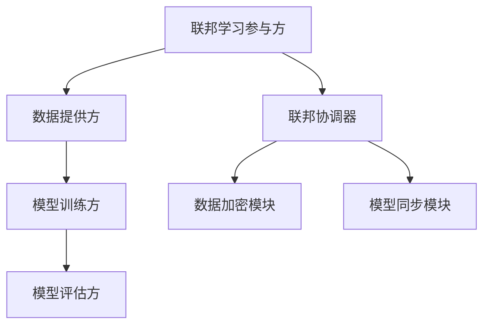
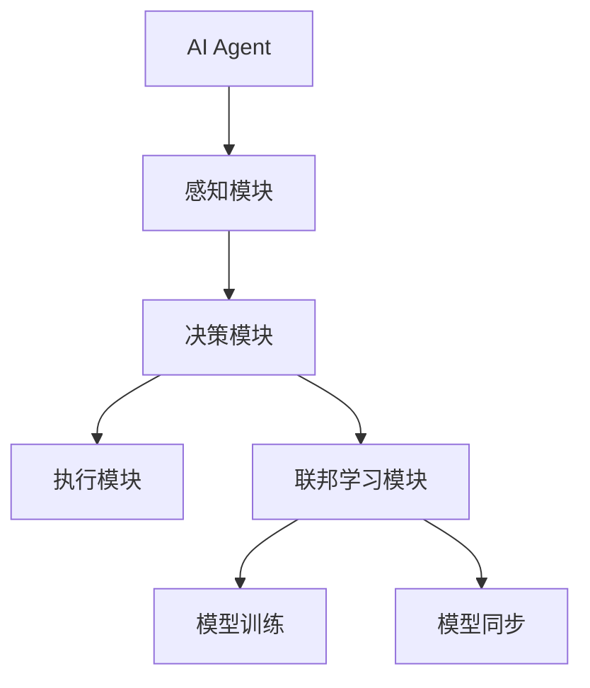

                 


# 构建具有联邦学习能力的AI Agent

> 关键词：联邦学习，AI Agent，数据隐私，分布式协作，智能决策，机器学习

> 摘要：随着人工智能和分布式计算技术的快速发展，构建具有联邦学习能力的AI Agent成为实现跨机构数据协作和智能决策的重要方向。本文从联邦学习的基本原理出发，详细探讨其与AI Agent的结合方式，分析构建过程中的关键技术和实现细节，并通过实际案例展示如何实现一个具有联邦学习能力的AI Agent。

---

# 第一部分: 背景介绍与核心概念

## 第1章: 联邦学习与AI Agent概述

### 1.1 联邦学习的背景与意义

#### 1.1.1 数据隐私与安全的挑战
在当今数据驱动的时代，数据隐私和安全问题日益突出。传统的集中式数据处理方式容易引发数据泄露和滥用问题。联邦学习（Federated Learning）通过在分布式数据源上进行模型训练，避免了原始数据的共享，从而在保护数据隐私的同时实现模型的联合优化。

#### 1.1.2 联邦学习的定义与特点
联邦学习是一种分布式机器学习技术，允许多个参与方在不共享数据的前提下 collaboratively 训练模型。其特点包括：
- **数据本地化**：数据保留在原始来源，仅上传模型更新。
- **隐私保护**：避免数据集中存储，降低隐私泄露风险。
- **分布式协作**：多个机构或设备可以共同参与模型训练。

#### 1.1.3 联邦学习的核心价值与应用场景
联邦学习在医疗、金融、物联网等领域具有广泛的应用潜力。例如，在医疗领域，多个医院可以在不共享患者数据的情况下联合训练疾病诊断模型。

### 1.2 AI Agent的基本概念

#### 1.2.1 AI Agent的定义与分类
AI Agent（人工智能代理）是指能够感知环境、自主决策并执行任务的智能实体。根据智能水平，AI Agent可以分为反应式代理、基于模型的代理、目标驱动的代理等。

#### 1.2.2 AI Agent的核心能力与特征
- **感知能力**：通过传感器或接口获取环境信息。
- **决策能力**：基于感知信息做出决策。
- **执行能力**：通过执行器或接口执行决策。
- **自主性**：能够在没有外部干预的情况下独立运行。

#### 1.2.3 AI Agent在不同领域的应用实例
例如，在智能家居中，AI Agent可以作为家庭控制中心，协调智能设备完成用户指令。

### 1.3 联邦学习与AI Agent的结合背景

#### 1.3.1 联邦学习与AI Agent的契合点
联邦学习的分布式协作特性与AI Agent的自主决策能力天然契合，可以通过联邦学习实现多代理之间的协同优化。

#### 1.3.2 联邦学习如何赋能AI Agent
通过联邦学习，AI Agent可以在不共享数据的情况下与其他代理协作，提升模型的泛化能力和决策效率。

#### 1.3.3 联邦学习与AI Agent结合的潜力与挑战
尽管潜力巨大，但实现这一结合仍面临通信开销、模型同步、隐私保护等技术挑战。

## 第2章: 联邦学习与AI Agent的核心概念

### 2.1 联邦学习的核心原理

#### 2.1.1 联邦学习的原理与机制
联邦学习的基本流程包括：
1. **初始化**：各参与方下载初始模型。
2. **局部训练**：各参与方在本地数据上训练模型。
3. **模型聚合**：将各参与方的模型更新聚合，得到全局模型。
4. **模型分发**：将全局模型分发给各参与方。

#### 2.1.2 联邦学习的通信机制
联邦学习中的通信机制包括同步和异步两种模式。同步模式下，所有参与方同时进行模型更新；异步模式下，参与方可以按需更新模型。

#### 2.1.3 联邦学习的同步与异步模式
- **同步模式**：所有参与方同时进行训练和模型同步。
- **异步模式**：参与方可以异步更新模型，适用于网络延迟较大的场景。

### 2.2 AI Agent的决策机制

#### 2.2.1 AI Agent的感知与决策模型
AI Agent通过感知环境信息，结合内部状态，生成决策动作。感知模块负责数据采集，决策模块负责策略选择。

#### 2.2.2 基于联邦学习的AI Agent决策优化
通过联邦学习，多个AI Agent可以在不共享数据的情况下，协作优化决策模型。

#### 2.2.3 联邦学习与AI Agent决策的结合
联邦学习为AI Agent提供了分布式协作的框架，使得多个AI Agent可以在保护数据隐私的前提下共同优化决策模型。

### 2.3 联邦学习与AI Agent的实体关系图



---

# 第三部分: 算法原理与系统架构

## 第3章: 联邦学习的算法原理

### 3.1 联邦学习的数学模型

#### 3.1.1 联邦学习的目标函数
$$ \text{目标函数} = \sum_{i=1}^{n} f_i(x_i, \theta) $$
其中，$x_i$ 表示第 $i$ 个参与方的数据，$\theta$ 表示模型参数。

#### 3.1.2 联邦学习的优化算法
使用联邦平均（FedAvg）算法，各参与方在本地优化目标函数后，将梯度上传到中心服务器，服务器聚合梯度后更新全局模型。

#### 3.1.3 联邦学习的同步过程
1. **初始化**：服务器将初始模型分发给各参与方。
2. **局部训练**：各参与方在本地数据上训练模型，计算梯度。
3. **模型聚合**：服务器聚合各参与方的梯度，更新全局模型。
4. **模型分发**：服务器将更新后的模型分发给各参与方。

### 3.2 联邦学习的通信与同步机制

#### 3.2.1 同步过程的详细步骤
1. 参与方下载当前模型。
2. 参与方在本地数据上进行训练，生成梯度。
3. 参与方将梯度上传到服务器。
4. 服务器聚合所有参与方的梯度，更新模型。
5. 服务器将新模型分发给参与方。

#### 3.2.2 异步模式的优缺点
- **优点**：减少通信开销，适合网络延迟较高的场景。
- **缺点**：可能引入模型不一致的问题。

### 3.3 联邦学习的隐私保护机制

#### 3.3.1 数据加密与隐私保护
使用同态加密或差分隐私技术，确保数据在传输和处理过程中的安全性。

#### 3.3.2 模型加密与隐私保护
对模型参数进行加密，确保参与方无法通过模型参数推断出原始数据。

#### 3.3.3 安全多方计算
通过安全多方计算技术，实现数据的安全计算，确保各方数据隐私。

## 第4章: AI Agent的系统架构设计

### 4.1 系统功能设计

#### 4.1.1 系统功能模块划分
1. 感知模块：负责数据采集和环境感知。
2. 决策模块：负责策略选择和决策优化。
3. 执行模块：负责任务执行和反馈收集。
4. 联邦学习模块：负责模型训练和协作优化。

#### 4.1.2 系统功能流程
1. 感知模块采集环境数据。
2. 决策模块基于联邦学习优化决策策略。
3. 执行模块执行决策并反馈结果。
4. 联邦学习模块聚合各AI Agent的模型更新。

### 4.2 系统架构设计

#### 4.2.1 系统架构图


#### 4.2.2 系统接口设计
- **感知接口**：负责数据采集和环境感知。
- **决策接口**：负责策略选择和决策优化。
- **执行接口**：负责任务执行和反馈收集。
- **联邦学习接口**：负责模型训练和协作优化。

#### 4.2.3 系统交互流程
1. AI Agent通过感知模块采集环境数据。
2. 决策模块基于联邦学习优化决策策略。
3. 执行模块执行决策并反馈结果。
4. 联邦学习模块聚合各AI Agent的模型更新。

---

# 第四部分: 项目实战与优化

## 第5章: 项目实战

### 5.1 环境安装与配置

#### 5.1.1 系统环境要求
- 操作系统：Linux/Windows/MacOS
- Python版本：3.6+
- 依赖库：TensorFlow、Keras、Flask、gunicorn等

#### 5.1.2 安装依赖
```bash
pip install tensorflow keras flask gunicorn
```

### 5.2 核心代码实现

#### 5.2.1 联邦学习核心代码
```python
import numpy as np
from tensorflow.keras import layers, models

# 初始化模型
def create_model():
    model = models.Sequential()
    model.add(layers.Dense(128, activation='relu', input_dim=100))
    model.add(layers.Dense(10, activation='softmax'))
    return model

# 联邦学习训练过程
def federated_learning(participants=5, epochs=1):
    server_model = create_model()
    server_model.compile(optimizer='adam', loss='sparse_categorical_crossentropy', metrics=['accuracy'])

    for _ in range(epochs):
        # 分发模型给各个参与者
        models = [server_model.copy() for _ in range(participants)]
        
        # 各参与者进行局部训练
        for i in range(participants):
            models[i].fit(x_train[i], y_train[i], epochs=1, verbose=0)
            
        # 聚合模型
        server_weights = server_model.get_weights()
        for i in range(participants):
            participant_weights = models[i].get_weights()
            for j in range(len(server_weights)):
                server_weights[j] += participant_weights[j]
        
        # 更新服务器模型
        server_model.set_weights(server_weights)
        
    return server_model
```

#### 5.2.2 AI Agent决策模块实现
```python
class AIAgent:
    def __init__(self, model):
        self.model = model
        self.memory = []
        
    def perceive(self, environment):
        # 返回环境数据
        return environment.get_data()
        
    def decide(self, data):
        # 基于模型进行决策
        prediction = self.model.predict(data)
        return self.get_action(prediction)
        
    def execute(self, action):
        # 执行决策并返回反馈
        return environment.execute_action(action)
```

### 5.3 实际案例分析

#### 5.3.1 案例背景
假设我们有多个智能家居设备（AI Agent），需要在不共享用户数据的情况下协同优化家庭能耗。

#### 5.3.2 数据准备
每个设备收集本地数据，如温度、湿度、用电量等。

#### 5.3.3 模型训练
通过联邦学习训练一个全局能耗预测模型，每个设备在本地训练模型后，将梯度上传到服务器，服务器聚合梯度更新全局模型。

#### 5.3.4 决策优化
AI Agent基于全局模型预测最优的能耗控制策略，实现智能家居设备的协同优化。

### 5.4 项目小结

#### 5.4.1 项目实现的关键点
- 联邦学习的实现：模型分发、局部训练、模型聚合。
- AI Agent的设计：感知、决策、执行模块的实现。
- 数据隐私保护：通过联邦学习避免数据集中存储。

#### 5.4.2 项目优化方向
- 提高通信效率：优化模型同步和聚合算法。
- 增强隐私保护：引入更强大的加密算法和隐私保护机制。
- 扩展应用场景：探索更多领域中的应用潜力。

---

# 第五部分: 最佳实践与总结

## 第6章: 最佳实践与总结

### 6.1 实施联邦学习的关键注意事项

#### 6.1.1 数据质量问题
确保数据的完整性和一致性，避免因数据质量问题影响模型训练效果。

#### 6.1.2 模型收敛性问题
选择合适的优化算法和超参数，确保模型能够快速收敛。

#### 6.1.3 通信效率问题
优化通信协议和数据传输方式，减少网络延迟和带宽占用。

#### 6.1.4 模型公平性问题
确保各个参与方的模型更新对全局模型的贡献公平合理。

### 6.2 联邦学习与AI Agent结合的未来展望

#### 6.2.1 技术发展趋势
- 更强大的隐私保护技术：如同态加密、安全多方计算等。
- 更高效的通信协议：减少通信开销，提高训练效率。
- 更智能的决策机制：结合强化学习等技术，提升决策能力。

#### 6.2.2 应用场景拓展
- 智能医疗：多个医院联合训练医学影像诊断模型。
- 智能金融：多家金融机构联合训练风险评估模型。
- 智能交通：多个交通系统联合优化交通流量。

### 6.3 总结

通过将联邦学习与AI Agent相结合，可以在保护数据隐私的前提下，实现多代理的协同优化。这不仅能够提升AI Agent的智能水平，还能够拓展其在各个领域的应用潜力。未来，随着技术的不断进步，联邦学习与AI Agent的结合将为分布式协作和智能决策带来更多的可能性。

---

# 参考文献
[此处列出相关参考文献]

---

**附录: 代码与资源**

- 代码仓库：[GitHub仓库链接]
- 数据集：[数据集下载链接]
- 工具与库：TensorFlow、Keras、Flask、gunicorn等

---

通过以上目录结构和内容安排，我们可以系统地构建一个具有联邦学习能力的AI Agent，实现数据隐私保护下的智能协作。

