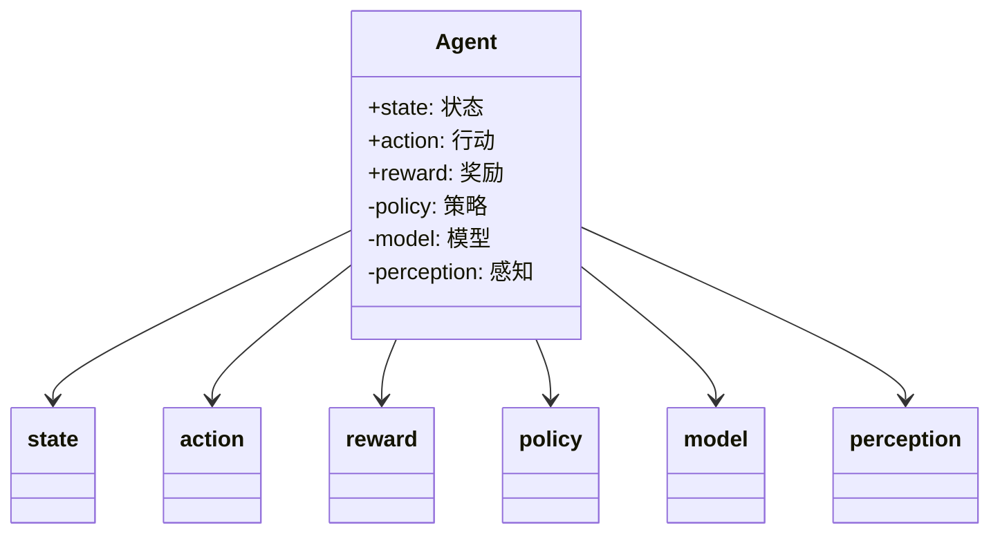
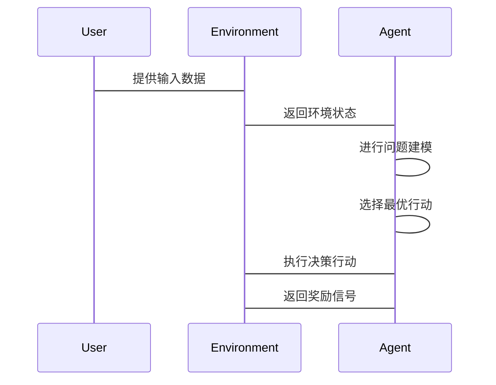

                 


# 构建具有自主决策能力的AI Agent

> **关键词**：AI Agent，自主决策，强化学习，决策树，随机森林

> **摘要**：本文详细探讨了如何构建具有自主决策能力的AI Agent。首先，我们介绍了AI Agent的基本概念和自主决策的重要性。接着，深入分析了自主决策的核心概念，包括问题建模、决策框架、推理方法和学习机制。然后，详细讲解了实现自主决策所需的算法原理，如强化学习、决策树和随机森林，并通过mermaid流程图和数学公式进行直观展示。最后，我们讨论了AI Agent系统的架构设计和项目实战，展示了如何从环境配置到核心代码实现，再到案例分析，帮助读者掌握实际操作技能。

---

## 第1章: AI Agent的背景与概念

### 1.1 AI Agent的定义与特点

AI Agent（人工智能代理）是指能够感知环境并采取行动以实现目标的智能实体。AI Agent可以是软件程序、机器人或其他智能系统，其核心目标是通过自主决策和行动来优化特定任务的执行效果。

**AI Agent的核心特点：**
- **自主性**：能够在没有外部干预的情况下独立运作。
- **反应性**：能够根据环境的变化实时调整行为。
- **目标导向**：所有行动都围绕实现特定目标展开。
- **学习能力**：通过与环境的交互不断优化决策策略。

**AI Agent与传统AI的区别：**
传统AI主要关注数据处理和模式识别，而AI Agent强调与环境的交互和自主决策能力。AI Agent不仅需要理解数据，还需要根据数据做出决策并采取行动。

### 1.2 自主决策的概念

自主决策是指AI Agent在没有任何外部干预的情况下，基于当前环境信息和历史经验，自主选择最优行动方案的能力。

**自主决策的核心要素：**
- **感知环境**：通过传感器或数据输入获取环境信息。
- **分析问题**：将环境信息转化为问题，明确决策的目标。
- **选择行动**：基于分析结果，选择最优的行动方案。
- **执行行动**：将选择的行动方案转化为具体的操作。

### 1.3 AI Agent的应用场景

AI Agent广泛应用于多个领域，如自动驾驶、智能客服、游戏AI和工业自动化等。

**AI Agent的实际案例：**
- **自动驾驶**：AI Agent通过感知道路环境和交通状况，自主决策车辆的行驶路径和速度。
- **智能客服**：AI Agent通过自然语言处理技术，理解用户需求并自主选择最佳的响应方式。

### 1.4 本章小结

本章介绍了AI Agent的基本概念、自主决策的核心要素及其应用场景。AI Agent的自主决策能力使其在多个领域展现出强大的应用潜力。

---

## 第2章: 自主决策的核心概念与原理

### 2.1 问题建模

问题建模是实现自主决策的第一步，它将现实世界中的问题转化为数学模型，以便计算机能够理解和处理。

**问题建模的步骤：**
1. **明确目标**：确定问题的核心目标。
2. **收集数据**：获取与问题相关的各种数据。
3. **构建模型**：将问题转化为数学模型，例如决策树或强化学习模型。

**问题建模的数学模型：**
$$
\text{目标函数} = f(x) \quad \text{其中} \quad x \text{是输入数据}
$$

### 2.2 决策框架

决策框架是自主决策的核心部分，它决定了AI Agent如何根据问题建模的结果选择最优行动。

**决策树的构建：**
决策树是一种树状结构，每个节点代表一个决策点，叶子节点代表最终的决策结果。

**决策树的优化：**
通过剪枝技术去除不必要的决策节点，提高决策效率。

### 2.3 推理方法

推理方法是AI Agent根据已有信息推导新结论的过程。

**基于逻辑推理的方法：**
通过逻辑规则推导出决策结果。

**基于概率推理的方法：**
利用概率论计算不同决策的概率，选择概率最高的决策。

### 2.4 学习机制

学习机制是AI Agent通过与环境交互不断优化决策策略的过程。

**强化学习：**
通过奖励机制，AI Agent学会选择最优行动。

**监督学习：**
通过标注数据，AI Agent学习正确的决策模式。

---

## 第3章: 自主决策的算法原理

### 3.1 强化学习算法

**Q-learning算法：**
Q-learning是一种经典的强化学习算法，通过更新Q值表来选择最优动作。

$$
Q(s, a) = Q(s, a) + \alpha [r + \max_{a'} Q(s', a') - Q(s, a)]
$$

**Deep Q-Networks (DQN)算法：**
DQN通过神经网络近似Q值函数，解决高维状态空间的问题。

### 3.2 决策树算法

**ID3算法：**
ID3算法通过信息增益选择最优特征进行决策树的构建。

$$
\text{信息增益} = H(s) - H(s|c)
$$

**C4.5算法：**
C4.5算法与ID3类似，但使用信息增益率作为特征选择标准。

### 3.3 随机森林算法

**随机森林的优势：**
通过集成多个决策树，提高模型的准确性和鲁棒性。

---

## 第4章: AI Agent的系统架构设计

### 4.1 系统功能设计

**领域模型（mermaid类图）：**


**系统架构设计（mermaid架构图）：**
```mermaid
archimate
title AI Agent系统架构
actors User
actors Environment
artifacts Data
artifacts Model
artifacts Policy
services Agent
services Perception
services Decision
services Action
```

**系统接口设计：**
- 输入接口：接收环境感知数据
- 输出接口：发送决策行动指令

**系统交互流程（mermaid序列图）：**


---

## 第5章: 项目实战

### 5.1 环境配置

安装必要的库：
```bash
pip install numpy
pip install matplotlib
pip install scikit-learn
pip install tensorflow
```

### 5.2 核心代码实现

**强化学习代码示例：**
```python
import numpy as np

class QLearningAgent:
    def __init__(self, state_space_size, action_space_size):
        self.q_table = np.zeros((state_space_size, action_space_size))
    
    def act(self, state):
        return np.argmax(self.q_table[state])
    
    def learn(self, state, action, reward):
        self.q_table[state, action] += reward
```

**决策树代码示例：**
```python
from sklearn.tree import DecisionTreeClassifier

class DecisionTreeAgent:
    def __init__(self):
        self.tree = DecisionTreeClassifier()
    
    def act(self, state):
        return self.tree.predict(state.reshape(1, -1))[0]
```

### 5.3 案例分析

**案例：迷宫导航**
- **问题描述**：AI Agent需要从起点导航到终点，避开障碍物。
- **算法选择**：使用强化学习算法（Q-learning）。
- **实现步骤**：
  1. 初始化Q表。
  2. 通过感知环境获取当前状态。
  3. 根据Q表选择行动。
  4. 执行行动并接收奖励。
  5. 更新Q表。

### 5.4 项目小结

通过项目实战，我们展示了如何将理论知识应用到实际问题中。通过强化学习和决策树算法，AI Agent能够实现自主决策，解决实际问题。

---

## 第6章: 总结与展望

### 6.1 本章总结

本文详细介绍了如何构建具有自主决策能力的AI Agent，涵盖了从概念到实现的全过程。

### 6.2 未来展望

随着人工智能技术的不断发展，AI Agent的自主决策能力将更加智能化和高效化。未来的研究方向包括更复杂的决策模型和多Agent协作。

### 6.3 最佳实践 tips

- **数据质量**：确保训练数据的多样性和代表性。
- **算法选择**：根据具体问题选择合适的算法。
- **系统优化**：通过并行计算和优化策略提高系统效率。

---

通过本文的学习，读者可以全面了解构建具有自主决策能力的AI Agent的方法和技巧，为实际应用打下坚实的基础。

