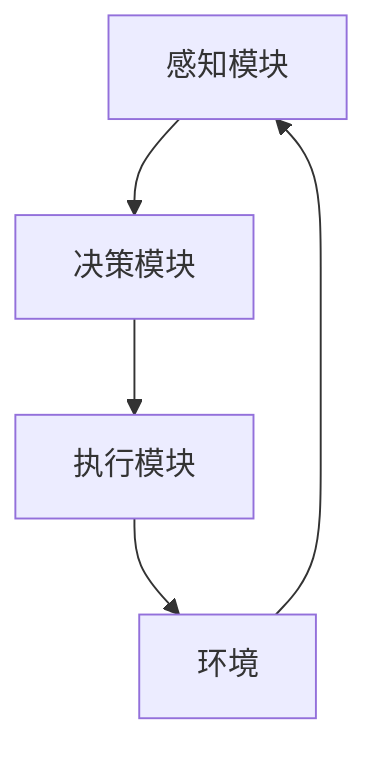
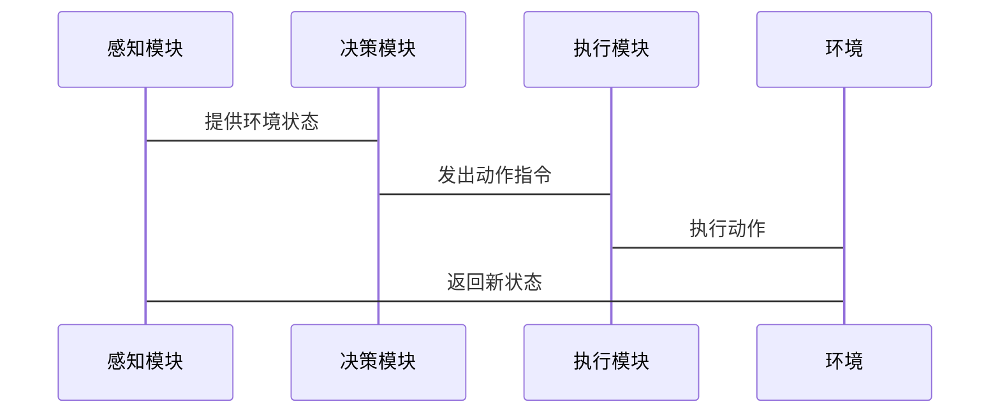

                 


# 构建具有自主学习与探索能力的AI Agent

> 关键词：AI Agent, 自主学习, 强化学习, 深度学习, 系统架构设计, 项目实战

> 摘要：本文详细探讨了构建具有自主学习与探索能力的AI Agent的方法，从背景和目标出发，分析了核心概念、算法原理、系统架构设计，并通过实际案例展示了如何在项目中实现这些技术。文章还提供了最佳实践建议和未来研究方向。

---

## 第1章: 引言

### 1.1 背景与目标

#### 1.1.1 问题背景与问题描述
随着人工智能技术的飞速发展，AI Agent（智能体）的应用场景日益广泛。传统的AI系统通常依赖于预先设定的规则，而现实世界中的复杂环境要求AI Agent具备更强的适应性和自主性。例如，在机器人导航、游戏AI和推荐系统中，AI Agent需要能够根据环境反馈自主调整策略，而不是依赖固定的规则。

#### 1.1.2 自主学习的核心目标
自主学习与探索能力的AI Agent的目标是使AI能够通过与环境的交互，不断优化自身的决策策略，从而在动态变化的环境中实现高效的任务完成。这种能力使得AI Agent能够适应不确定性，并在缺乏明确指导的情况下解决问题。

#### 1.1.3 解决方案与方法论
本文将从理论基础、算法设计、系统架构到实际项目实现，系统地探讨如何构建具有自主学习能力的AI Agent。我们将结合强化学习和深度学习等技术，提供一个完整的解决方案框架。

---

## 第2章: 自主学习AI Agent的核心概念与理论基础

### 2.1 自主学习AI Agent的定义与特点

#### 2.1.1 自主学习的定义
自主学习是指AI Agent在没有外部干预的情况下，通过与环境的交互，主动探索并学习知识，以提升自身任务完成能力的过程。

#### 2.1.2 自主学习的核心特点
- **主动性**：AI Agent主动寻求信息和解决方案。
- **适应性**：能够根据环境反馈调整策略。
- **高效性**：通过学习优化决策过程，提高任务完成效率。

#### 2.1.3 自主学习与传统AI的区别
| 特性       | 传统AI                          | 自主学习AI Agent                  |
|------------|---------------------------------|-----------------------------------|
| 决策方式     | 基于规则或预设模型              | 基于环境反馈优化策略              |
| 适应性      | 低或无                          | 高                                 |
| 交互方式     | 单向或被动                      | 主动探索和反馈                     |

### 2.2 自主学习的理论基础

#### 2.2.1 强化学习与深度学习
强化学习（Reinforcement Learning, RL）是实现自主学习的核心技术之一。通过定义状态、动作和奖励机制，AI Agent能够在复杂环境中学习最优策略。

#### 2.2.2 知识表示与推理
知识表示和推理技术帮助AI Agent理解和处理环境中的信息，从而做出更合理的决策。

#### 2.2.3 自适应学习与优化算法
自适应学习算法能够根据环境变化动态调整模型参数，优化学习过程。

---

## 第3章: 自主学习AI Agent的核心算法

### 3.1 基于强化学习的自主学习算法

#### 3.1.1 强化学习的基本原理
强化学习通过智能体与环境的交互，逐步学习最优策略。环境通过奖励机制对智能体的行为进行反馈。

#### 3.1.2 常见强化学习算法
- **Q-Learning**：基于值迭代的无模型算法，适用于离散动作空间。
- **Deep Q-Network (DQN)**：结合深度学习，适用于高维状态空间。

#### 3.1.3 算法的数学模型与公式
Q-Learning的更新公式：
$$ Q(s, a) \leftarrow Q(s, a) + \alpha [r + \max Q(s', a') - Q(s, a)] $$

### 3.2 深度学习在自主学习中的应用

#### 3.2.1 深度神经网络在自主学习中的作用
深度神经网络（DNN）用于处理复杂的非结构化数据，如图像和语音。

#### 3.2.2 模型结构与训练方法
- **模型结构**：卷积神经网络（CNN）和递归神经网络（RNN）。
- **训练方法**：使用梯度下降优化，结合强化学习信号。

#### 3.2.3 模型评估与优化
通过回放机制和目标网络避免过拟合，提高学习稳定性。

---

## 第4章: 自主学习AI Agent的系统架构设计

### 4.1 系统功能设计

#### 4.1.1 系统功能模块划分
- **感知模块**：处理环境输入。
- **决策模块**：执行学习和决策。
- **执行模块**：输出动作到环境。

#### 4.1.2 模块之间的关系与交互
感知模块将环境信息传递给决策模块，决策模块根据学习结果向执行模块发送动作。

### 4.2 系统架构设计

#### 4.2.1 系统架构图（Mermaid）


#### 4.2.2 系统接口设计
- **输入接口**：接收环境状态。
- **输出接口**：发送动作指令。

#### 4.2.3 系统交互流程（Mermaid）


---

## 第5章: 自主学习AI Agent的项目实战

### 5.1 项目背景与目标

#### 5.1.1 项目背景
以一个简单的游戏AI为例，构建能够自主学习的AI Agent，使其在游戏环境中不断优化策略。

#### 5.1.2 项目目标
实现一个能够在复杂环境中不断优化策略的AI Agent。

### 5.2 项目核心实现

#### 5.2.1 环境搭建
- 安装Python和深度学习框架（如TensorFlow或PyTorch）。

#### 5.2.2 核心算法实现（Python源代码）

```python
import numpy as np
import gym

class DQNAgent:
    def __init__(self, state_space, action_space, epsilon=1.0):
        self.state_space = state_space
        self.action_space = action_space
        self.epsilon = epsilon
        # 初始化Q网络

    def act(self, state):
        if np.random.random() < self.epsilon:
            return np.random.randint(self.action_space)
        # 使用Q网络预测
        return self.q_network.predict(state)

    def remember(self, experience):
        # 存储经验到记忆库
        pass

    def replay(self, batch_size):
        # 从记忆库中随机抽取经验进行训练
        pass

    def decay_epsilon(self):
        self.epsilon *= 0.99
        if self.epsilon < 0.01:
            self.epsilon = 0.01
```

#### 5.2.3 代码解读与分析
- **初始化**：建立Q网络，初始化epsilon参数。
- **act函数**：根据epsilon贪心策略选择动作。
- **replay函数**：通过回放经验优化Q网络。

### 5.3 项目案例分析

#### 5.3.1 实际案例
以OpenAI Gym中的一个典型环境为例，展示AI Agent的学习过程。

#### 5.3.2 案例分析
通过训练过程中的数据，分析AI Agent如何逐步优化策略。

---

## 第6章: 总结与展望

### 6.1 总结
本文详细探讨了构建具有自主学习与探索能力的AI Agent的方法，从理论到实践，提供了完整的解决方案。

### 6.2 未来展望
未来的研究可以集中在多智能体协作、持续学习和自适应优化等方面。

### 6.3 最佳实践 tips

#### 6.3.1 项目实现中的注意事项
- 确保环境和模型的兼容性。
- 合理设置超参数，如学习率和epsilon衰减率。

#### 6.3.2 领域内的研究热点
- 多智能体协作
- 持续学习与自适应优化
- 解决方案的可扩展性和可解释性

---

通过本文的详细讲解，读者可以系统地了解如何构建具有自主学习能力的AI Agent，并能够将其应用到实际项目中。

