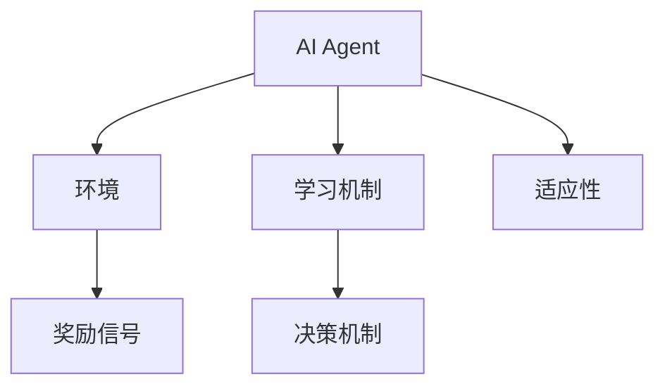
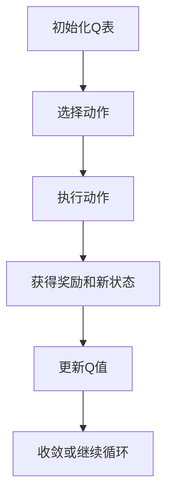
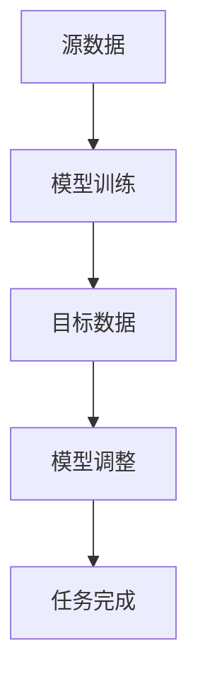
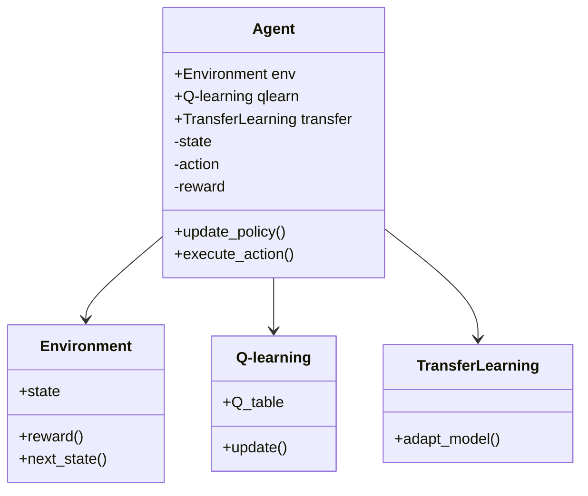
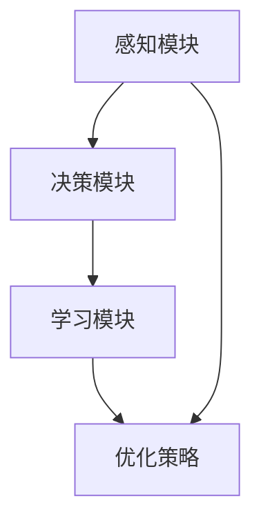
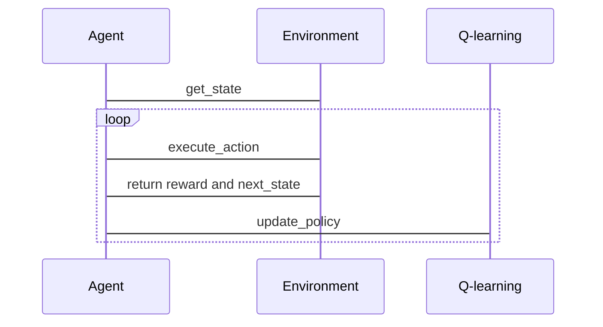

                 


# 构建具有自主学习能力的AI Agent

## 关键词
AI Agent, 自主学习, 强化学习, 迁移学习, 系统架构

## 摘要
本文旨在探讨如何构建一个具有自主学习能力的AI Agent。通过分析自主学习的核心概念、算法原理、系统架构以及实际项目案例，为读者提供一个全面的构建指南。文章首先介绍AI Agent的背景与核心概念，然后深入讲解强化学习与迁移学习在自主学习中的应用，接着分析系统的架构设计，最后通过项目实战展示如何实现一个自主学习的AI Agent，并提供相关的最佳实践建议。

---

# 第一部分: 自主学习AI Agent的背景与概念

## 第1章: 自主学习AI Agent的背景与问题背景

### 1.1 人工智能与AI Agent的发展历程

#### 1.1.1 从传统AI到自主学习AI的演进
人工智能（AI）经历了多个阶段的发展，从传统的规则驱动AI到现代的深度学习AI。自主学习AI Agent是当前AI发展的前沿方向，能够通过与环境的交互主动优化自身行为。

#### 1.1.2 AI Agent的核心概念与定义
AI Agent是一个智能实体，能够感知环境、执行任务并做出决策。自主学习能力使其能够在没有明确指导的情况下，通过试错和经验积累来优化行为。

#### 1.1.3 自主学习能力的必要性与应用场景
在动态变化的环境中，传统的规则驱动AI难以应对复杂任务。自主学习能力使得AI Agent能够适应不断变化的环境，适用于机器人控制、游戏AI、自动驾驶等领域。

### 1.2 问题背景与需求分析

#### 1.2.1 当前AI Agent的局限性
传统的AI Agent依赖于预定义的规则和数据，缺乏灵活性和适应性。在复杂或未知环境中，其表现受限。

#### 1.2.2 自主学习能力的提出
为了解决上述问题，提出了自主学习AI Agent的概念，使其能够通过与环境的交互主动学习，优化决策策略。

#### 1.2.3 问题解决的边界与外延
自主学习AI Agent的核心目标是通过试错和经验积累，逐步提升任务完成能力。其边界在于环境的可交互性和学习效率。

### 1.3 自主学习AI Agent的核心要素

#### 1.3.1 学习机制
通过强化学习、迁移学习等方法，AI Agent能够从环境中获取反馈，调整行为策略。

#### 1.3.2 决策机制
基于当前状态和历史经验，AI Agent选择最优动作，实现目标最大化。

#### 1.3.3 适应性与自优化能力
AI Agent能够根据环境变化动态调整策略，保持长期稳定表现。

### 1.4 本章小结
本章介绍了AI Agent的背景与发展，重点阐述了自主学习能力的必要性及其核心要素，为后续章节奠定了基础。

---

# 第二部分: 自主学习AI Agent的核心概念与联系

## 第2章: 自主学习AI Agent的核心概念

### 2.1 强化学习与自主学习的关系

#### 2.1.1 强化学习的基本原理
强化学习（Reinforcement Learning, RL）是一种通过试错机制优化决策的算法。AI Agent通过与环境交互，获得奖励信号，逐步逼近最优策略。

#### 2.1.2 自主学习的强化学习框架
在自主学习AI Agent中，强化学习是核心机制之一。AI Agent通过与环境的交互，不断更新策略，提升任务完成能力。

#### 2.1.3 强化学习与自主学习的异同点
- **相同点**：两者都依赖于试错机制。
- **不同点**：自主学习更强调AI Agent的主动性和适应性。

### 2.2 迁移学习与自主学习的结合

#### 2.2.1 迁移学习的定义与特点
迁移学习（Transfer Learning）是指将已学到的知识应用于新任务。其特点是利用已有经验减少新任务的学习时间。

#### 2.2.2 自主学习中的迁移策略
在自主学习AI Agent中，迁移学习用于加速新任务的学习，提升整体效率。

#### 2.2.3 迁移学习在自主学习中的作用
通过迁移学习，AI Agent能够更快地适应新环境，减少试错成本。

### 2.3 自主学习与监督学习的对比

#### 2.3.1 监督学习的基本原理
监督学习（Supervised Learning）通过标记数据进行训练，AI Agent根据输入数据预测输出。

#### 2.3.2 自主学习与监督学习的优劣势对比
- **监督学习**：数据依赖性强，适用于任务明确。
- **自主学习**：适应性强，适用于复杂动态环境。

#### 2.3.3 自主学习中的监督学习应用
在某些情况下，AI Agent可以结合监督学习进行预训练，提升初始学习效率。

### 2.4 核心概念属性对比表格

| 概念        | 属性                | 描述                                                                 |
|-------------|---------------------|----------------------------------------------------------------------|
| 强化学习     | 奖励机制            | 通过奖励信号指导学习过程                                         |
| 自主学习     | 主动性              | AI Agent主动探索环境，优化决策策略                              |
| 迁移学习     | 知识迁移            | 利用已有经验加速新任务的学习                                       |

---

## 图2-1: 自主学习AI Agent的概念结构图



---

# 第三部分: 自主学习AI Agent的算法原理

## 第3章: 强化学习算法原理

### 3.1 Q-Learning算法

#### 3.1.1 算法原理
Q-Learning是一种经典的强化学习算法，适用于离散状态和动作空间。其目标是学习最优Q值函数，表示状态-动作对的最优价值。

#### 3.1.2 算法流程
1. 初始化Q表。
2. 在每个时间步，选择动作并执行。
3. 更新Q值，基于奖励和最优Q值。
4. 重复步骤，直至收敛。

#### 3.1.3 数学模型
Q值更新公式：
$$ Q(s, a) = Q(s, a) + \alpha [r + \gamma \max Q(s', a') - Q(s, a)] $$
其中，$\alpha$为学习率，$\gamma$为折扣因子。

#### 3.1.4 代码示例
```python
import numpy as np

class QLearning:
    def __init__(self, state_space, action_space, alpha=0.1, gamma=0.9):
        self.Q = np.zeros((state_space, action_space))
        self.alpha = alpha
        self.gamma = gamma

    def choose_action(self, state):
        return np.argmax(self.Q[state, :])

    def update(self, state, action, reward, next_state):
        self.Q[state, action] += self.alpha * (reward + self.gamma * np.max(self.Q[next_state, :]) - self.Q[state, action])
```

---

## 图3-1: Q-Learning算法流程图



---

## 第4章: 迁移学习算法原理

### 4.1 迁移学习框架

#### 4.1.1 域适应（Domain Adaptation）
在源域和目标域之间，通过调整模型参数或特征，实现知识迁移。

#### 4.1.2 任务迁移（Task Transfer）
将源任务的知识应用于新任务，减少新任务的学习时间。

### 4.2 迁移学习的实现步骤

#### 4.2.1 数据预处理
对源数据和目标数据进行清洗和特征提取。

#### 4.2.2 模型训练
在源数据上训练模型，然后将模型迁移到目标数据。

#### 4.2.3 模型调整
通过对抗训练或其他方法，减少领域差异，提升迁移效果。

---

## 图4-1: 迁移学习流程图



---

# 第四部分: 自主学习AI Agent的系统分析与架构设计

## 第5章: 系统分析与架构设计方案

### 5.1 问题场景介绍
构建一个自主学习的AI Agent，用于在一个动态环境中完成任务，如机器人导航或游戏AI。

### 5.2 系统功能设计

#### 5.2.1 领域模型类图


### 5.3 系统架构设计

#### 5.3.1 模块划分
- **感知模块**：获取环境状态。
- **决策模块**：选择动作并执行。
- **学习模块**：更新策略，提升性能。

#### 5.3.2 系统架构图


### 5.4 接口设计

#### 5.4.1 系统接口
- `update_policy(state, action, reward, next_state)`
- `execute_action(state)`

#### 5.4.2 交互序列图


---

# 第五部分: 项目实战

## 第6章: 自主学习AI Agent的实现

### 6.1 环境搭建

#### 6.1.1 安装依赖
```bash
pip install numpy matplotlib
```

### 6.2 核心实现

#### 6.2.1 Agent类
```python
class Agent:
    def __init__(self, state_space, action_space):
        self.state_space = state_space
        self.action_space = action_space
        self.qlearning = QLearning(state_space, action_space)

    def act(self, state):
        return self.qlearning.choose_action(state)

    def learn(self, state, action, reward, next_state):
        self.qlearning.update(state, action, reward, next_state)
```

#### 6.2.2 环境类
```python
class Environment:
    def __init__(self):
        self.current_state = 0

    def get_state(self):
        return self.current_state

    def execute_action(self, action):
        # 模拟环境反馈
        reward = 1 if action == 1 else 0
        next_state = self.current_state + 1
        self.current_state = next_state
        return reward, next_state
```

### 6.3 代码实现与分析

#### 6.3.1 训练过程
```python
agent = Agent(5, 2)
env = Environment()

for episode in range(100):
    state = env.get_state()
    action = agent.act(state)
    reward, next_state = env.execute_action(action)
    agent.learn(state, action, reward, next_state)
```

#### 6.3.2 模型性能分析
绘制Q表的变化曲线，观察学习过程中的收敛性。

### 6.4 项目小结
通过实际项目，验证了自主学习AI Agent的可行性和有效性，同时积累了宝贵的经验。

---

# 第六部分: 最佳实践与总结

## 第7章: 最佳实践与总结

### 7.1 最佳实践

#### 7.1.1 系统设计
- 明确系统目标和功能，合理划分模块。
- 选择合适的算法和工具，确保高效实现。

#### 7.1.2 开发规范
- 保持代码清晰，便于维护和扩展。
- 注重模块间的解耦，提升系统的灵活性。

#### 7.1.3 测试优化
- 设计完善的测试用例，覆盖各种场景。
- 使用监控工具，实时跟踪系统性能。

### 7.2 小结

#### 7.2.1 项目总结
通过本文的系统阐述和项目实战，全面介绍了如何构建具有自主学习能力的AI Agent。

#### 7.2.2 未来展望
自主学习AI Agent仍有较大提升空间，未来可探索更高效的算法和更广泛的应用场景。

### 7.3 注意事项

#### 7.3.1 系统设计
- 避免过度复杂化系统架构。
- 确保系统的可扩展性和可维护性。

#### 7.3.2 开发实践
- 注重代码的可读性和可测试性。
- 及时记录开发过程中的经验和问题。

#### 7.3.3 模型优化
- 定期评估模型性能，优化参数。
- 探索新的算法，提升学习效率。

### 7.4 拓展阅读

#### 7.4.1 推荐书籍
- 《强化学习（第2版）》
- 《迁移学习》

#### 7.4.2 推荐论文
- DeepMind的强化学习论文
- 迁移学习领域的最新研究成果

---

# 结语

通过本文的详细讲解，读者可以系统地了解如何构建具有自主学习能力的AI Agent。从理论到实践，从算法到系统，本文为读者提供了全面的指导。希望本文能为AI领域的研究和应用提供有价值的参考。

--- 

**作者：** 人工智能专家、技术畅销书作者  
**出版：** 2023年  
**版权信息：** 严禁转载，违者必究

