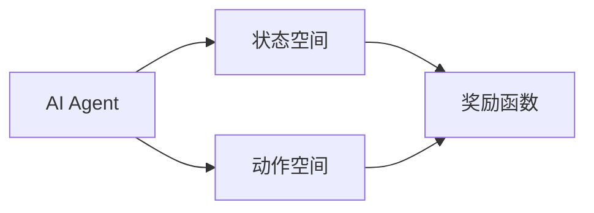
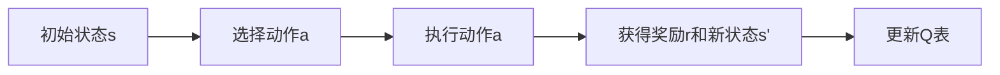
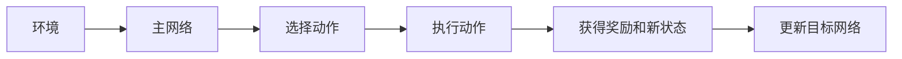
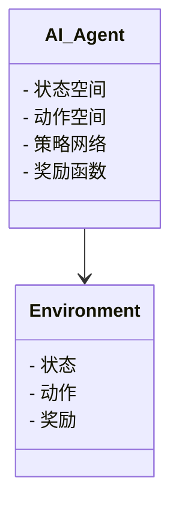
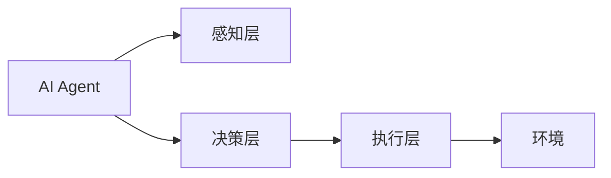
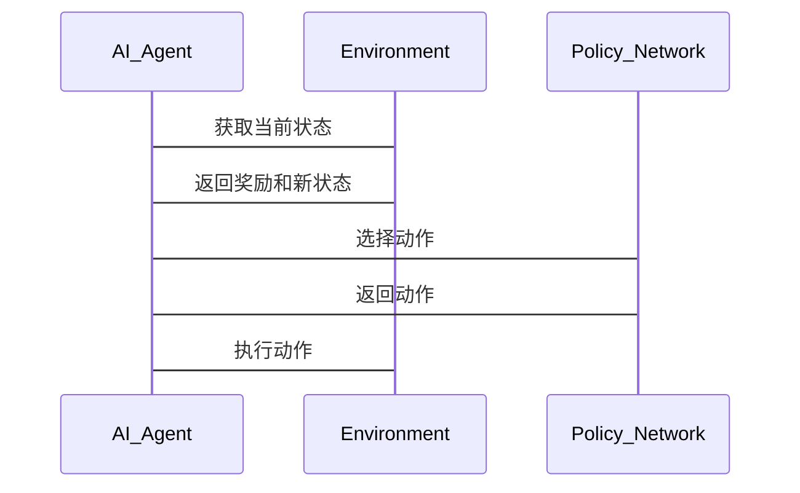

                 


# 构建具有自主探索能力的AI Agent

## 关键词：
AI Agent，自主探索，强化学习，深度Q网络，系统架构

## 摘要：
本文详细探讨了构建具有自主探索能力的AI Agent的关键技术与实现方法。通过逐步分析，从基础概念到算法原理，再到系统架构和项目实战，系统性地介绍了如何设计和实现具备自主探索能力的AI Agent。文章内容涵盖强化学习、Q-learning算法、Deep Q-Networks（DQN）算法、系统架构设计、项目实战等，旨在为读者提供全面的技术指导。

---

# 第一部分：构建具有自主探索能力的AI Agent背景介绍

## 第1章：AI Agent的基本概念

### 1.1 什么是AI Agent
#### 1.1.1 AI Agent的定义
AI Agent（人工智能代理）是一种能够感知环境、自主决策并采取行动的智能实体。它通过与环境交互，实现特定目标，如最大化累积奖励。

#### 1.1.2 AI Agent的核心特点
- **自主性**：无需外部干预，自主决策。
- **反应性**：能够实时感知环境并做出反应。
- **目标导向**：所有行为都以实现目标为导向。
- **学习能力**：通过经验改进性能。

#### 1.1.3 AI Agent与传统程序的区别
| 特性 | AI Agent | 传统程序 |
|------|----------|----------|
| 行为 | 主动采取行动 | 被动执行指令 |
| 学习 | 可以通过经验改进 | 无法改进 |
| 环境 | 可与动态环境交互 | 运行在静态环境中 |

---

## 第2章：自主探索能力的背景与意义

### 2.1 自主探索能力的背景
随着人工智能技术的发展，AI Agent在自动驾驶、机器人、游戏AI等领域得到了广泛应用。自主探索能力是AI Agent的核心能力之一，能够使其在未知环境中自主学习和适应。

### 2.2 自主探索能力的意义
- **提高适应性**：能够在复杂多变的环境中自主调整策略。
- **降低依赖性**：减少对人工干预的需求。
- **提高效率**：通过自主学习，快速找到最优解决方案。

### 2.3 自主探索能力的应用场景
- **游戏AI**：在电子游戏中，AI Agent可以通过自主探索学习最优策略。
- **机器人控制**：在工业或服务机器人中，自主探索能力使其能够更好地适应环境。
- **自动驾驶**：通过自主探索，自动驾驶系统可以不断优化路径规划和决策。

---

# 第二部分：自主探索能力的核心概念与联系

## 第3章：核心概念原理

### 3.1 策略（Policy）
策略定义了AI Agent在给定状态下采取的动作。策略可以是确定性的（如神经网络）或随机性的（如概率分布）。

#### 示例：一个简单的策略函数
```python
def simple_policy(state):
    if state == 0:
        return 0
    else:
        return 1
```

### 3.2 奖励函数（Reward Function）
奖励函数用于衡量AI Agent行为的好坏，是强化学习中的关键组成部分。

#### 示例：一个简单的奖励函数
```python
def reward_function(next_state, target):
    if next_state == target:
        return 1
    else:
        return 0
```

### 3.3 状态空间（State Space）
状态空间是AI Agent可能遇到的所有状态的集合。

#### 示例：迷宫环境的状态空间
状态空间可以表示为迷宫中的每个格子，例如：
```
state_space = [(i, j) for i in range(rows) for j in range(cols)]
```

### 3.4 动作空间（Action Space）
动作空间是AI Agent在每个状态下可以执行的所有动作的集合。

#### 示例：迷宫环境的动作空间
```python
action_space = ['up', 'down', 'left', 'right']
```

---

## 第4章：核心概念对比与关系图

### 4.1 核心概念对比表格
| 概念 | 描述 |
|------|------|
| 策略 | 定义AI Agent在给定状态下的行动方式 |
| 奖励函数 | 衡量AI Agent行为好坏的标准 |
| 状态空间 | AI Agent所处环境的所有可能状态 |
| 动作空间 | AI Agent在每个状态下可以执行的所有动作 |

### 4.2 实体关系图


---

# 第三部分：自主探索能力的算法原理

## 第5章：Q-learning算法

### 5.1 Q-learning的基本原理
Q-learning是一种基于值的强化学习算法，通过学习状态-动作值函数来优化决策策略。

### 5.2 Q-learning的更新公式
$$ Q(s, a) = Q(s, a) + \alpha [r + \gamma \max Q(s', a') - Q(s, a)] $$
其中：
- \( Q(s, a) \)：当前状态\( s \)和动作\( a \)的值
- \( \alpha \)：学习率
- \( r \)：奖励
- \( \gamma \)：折扣因子
- \( Q(s', a') \)：下一个状态\( s' \)和动作\( a' \)的值

### 5.3 Q-learning的实现步骤


---

## 第6章：Deep Q-Networks（DQN）算法

### 6.1 DQN的基本原理
DQN通过使用深度神经网络来近似Q函数，从而解决高维状态空间的问题。

### 6.2 DQN的网络结构
- **输入层**：接收状态空间的输入
- **隐藏层**：多个全连接层
- **输出层**：输出所有可能动作的Q值

### 6.3 DQN的训练过程


---

## 第7章：数学模型与公式推导

### 7.1 Q-learning的数学模型
$$ Q(s, a) = Q(s, a) + \alpha [r + \gamma \max Q(s', a') - Q(s, a)] $$

### 7.2 DQN的损失函数
$$ \mathcal{L} = \mathbb{E}[ (y - Q(s,a))^2 ] $$
其中：
- \( y = r + \gamma \max Q(s', a') \)
- \( Q(s,a) \)：主网络输出
- \( y \)：目标值

---

# 第四部分：系统架构与设计

## 第8章：系统架构设计

### 8.1 系统构成
- **感知层**：负责接收环境输入
- **决策层**：负责策略选择和优化
- **执行层**：负责执行动作并输出结果

### 8.2 领域模型设计


### 8.3 系统架构图


---

## 第9章：接口设计与交互流程

### 9.1 系统接口设计
- **输入接口**：接收环境状态
- **输出接口**：输出动作指令
- **奖励接口**：接收奖励信号

### 9.2 系统交互流程


---

# 第五部分：项目实战

## 第10章：环境安装与配置

### 10.1 安装依赖
```bash
pip install gym numpy tensorflow
```

## 第11章：系统核心实现

### 11.1 Q-learning实现
```python
class QLearningAgent:
    def __init__(self, state_space, action_space):
        self.state_space = state_space
        self.action_space = action_space
        self.Q = defaultdict(lambda: defaultdict(int))
```

### 11.2 DQN实现
```python
class DQNAgent:
    def __init__(self, state_dim, action_dim):
        self.state_dim = state_dim
        self.action_dim = action_dim
        self.main_network = self.build_network()
        self.target_network = self.build_network()
```

## 第12章：案例分析与优化

### 12.1 实际案例
在迷宫环境中实现DQN算法，训练AI Agent寻找最优路径。

### 12.2 性能优化
- **经验回放**：通过存储和重放经验减少样本偏差
- **目标网络更新**：定期更新目标网络以稳定训练

---

## 第13章：项目小结

### 13.1 项目总结
通过本项目，我们实现了具备自主探索能力的AI Agent，验证了Q-learning和DQN算法的有效性。

### 13.2 经验与教训
- **经验**：经验回放和目标网络是训练稳定性的关键。
- **教训**：超参数的设置对性能影响巨大，需谨慎调优。

---

# 第六部分：最佳实践与注意事项

## 第14章：最佳实践

### 14.1 实践建议
- **算法选择**：根据问题类型选择合适的算法。
- **超参数调优**：合理设置学习率、折扣因子等参数。
- **经验回放**：通过经验回放提高训练效率。

### 14.2 注意事项
- **环境复杂性**：复杂环境需要更复杂的网络结构。
- **计算资源**：深度学习算法需要较高的计算资源。
- **收敛性**：确保算法能够收敛到最优解。

## 第15章：小结与展望

### 15.1 全文总结
本文系统性地介绍了构建具有自主探索能力的AI Agent的关键技术与实现方法，涵盖了算法原理、系统架构和项目实战。

### 15.2 未来展望
未来的研究方向包括多智能体协作、复杂环境下的自主决策、强化学习与深度学习的结合等。

## 第16章：拓展阅读

### 16.1 推荐资料
- 《Deep Reinforcement Learning》
- 《Reinforcement Learning: Theory and Algorithms》

### 16.2 学术资源
- [OpenAI Gym](https://gym.openai.com/)
- [Keras RL](https://github.com/keras-rl/keras-rl)

---

# 结语

通过本文的详细讲解，读者可以系统性地掌握构建具有自主探索能力的AI Agent的核心技术。从理论到实践，从基础到高级，本文为读者提供了一个完整的知识框架。希望本文能够为AI Agent的研究和应用提供有价值的参考。

---

