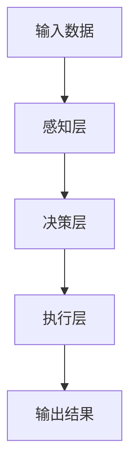

                 


# 《构建具有自动机器学习能力的AI Agent》

## 关键词：
AI Agent、自动机器学习、强化学习、系统架构、项目实战

## 摘要：
本文详细探讨了构建具有自动机器学习能力的AI Agent的各个方面，从基本概念到系统架构设计，再到项目实战，旨在为读者提供全面的技术指导。文章首先介绍了AI Agent和自动机器学习的核心概念，然后深入分析了相关算法原理，提供了系统架构设计和实际案例，最后总结了最佳实践和未来趋势。

---

# 第1章: AI Agent与自动机器学习概述

## 1.1 AI Agent的基本概念
### 1.1.1 AI Agent的定义与特点
- AI Agent的定义
- AI Agent的特点：自主性、反应性、目标导向、社会性
- 与传统AI的区别

### 1.1.2 自动机器学习的定义与特点
- 自动机器学习的定义
- 自动机器学习的特点：自动化特征工程、自动化模型选择、自动化调参
- 自动机器学习与传统机器学习的对比

### 1.1.3 AI Agent与自动机器学习的关系
- AI Agent的结构与功能
- 自动机器学习在AI Agent中的作用
- 自动机器学习如何提升AI Agent的能力

## 1.2 AI Agent的应用背景
### 1.2.1 当前AI技术的发展趋势
- AI技术的快速发展
- 自动化技术在AI中的应用

### 1.2.2 自动机器学习在AI Agent中的作用
- 自动机器学习如何推动AI Agent的发展
- AI Agent在企业级应用中的潜力

### 1.2.3 AI Agent与传统AI的区别
- 传统AI的局限性
- AI Agent的优势：自主性、适应性

## 1.3 自动机器学习的核心技术
### 1.3.1 机器学习的基本原理
- 机器学习的定义
- 机器学习的三种主要方法：监督学习、无监督学习、强化学习

### 1.3.2 自动机器学习的关键技术
- 自动特征工程
- 自动模型选择
- 自动超参数调优

### 1.3.3 自动机器学习的核心算法
- 强化学习算法：Q-learning、Deep Q-Network
- 监督学习算法：随机森林、神经网络

## 1.4 本章小结
- 本章总结了AI Agent和自动机器学习的核心概念
- 强调了自动机器学习在AI Agent中的重要性

---

# 第2章: 自动机器学习的核心概念与原理

## 2.1 自动机器学习的核心算法
### 2.1.1 强化学习算法
- 强化学习的基本原理
- 强化学习的数学模型：状态、动作、奖励、策略
- 强化学习的实现步骤：环境交互、策略选择、奖励反馈、策略更新

### 2.1.2 监督学习算法
- 监督学习的基本原理
- 监督学习的数学模型：输入、输出、目标函数、损失函数
- 监督学习的实现步骤：数据预处理、模型训练、模型评估

### 2.1.3 自动机器学习的数学模型
- 强化学习的数学模型：$$ Q(s,a) = r + \gamma \max_{a'} Q(s',a') $$
- 监督学习的数学模型：$$ L = \frac{1}{2m} \sum_{i=1}^{m} (y_i - \hat{y}_i)^2 $$

## 2.2 AI Agent与自动机器学习的关系
### 2.2.1 AI Agent的结构与功能
- AI Agent的结构：感知层、决策层、执行层
- AI Agent的功能：感知环境、决策、执行动作

### 2.2.2 自动机器学习在AI Agent中的应用
- 自动特征工程：如何处理输入数据
- 自动模型选择：如何选择合适的模型
- 自动调参：如何优化模型性能

## 2.3 自动机器学习的核心技术
### 2.3.1 强化学习算法
- 强化学习的基本原理
- 强化学习的实现步骤
- 强化学习的数学模型

### 2.3.2 监督学习算法
- 监督学习的基本原理
- 监督学习的实现步骤
- 监督学习的数学模型

## 2.4 本章小结
- 本章详细讲解了自动机器学习的核心算法
- 强调了数学模型在自动机器学习中的重要性

---

# 第3章: AI Agent的系统架构设计

## 3.1 系统架构概述
### 3.1.1 系统架构的基本概念
- 系统架构的定义
- 系统架构的组成：输入、处理、输出
- 系统架构的分类：单体架构、微服务架构

### 3.1.2 AI Agent的系统架构
- AI Agent的系统架构组成：感知层、决策层、执行层
- 系统架构的设计原则：模块化、可扩展性、可维护性

## 3.2 系统功能设计
### 3.2.1 系统功能模块
- 感知层：环境感知、数据采集
- 决策层：特征工程、模型选择、参数调优
- 执行层：动作选择、策略执行

### 3.2.2 系统功能设计的数学模型
- 强化学习的数学模型：$$ Q(s,a) = r + \gamma \max_{a'} Q(s',a') $$
- 监督学习的数学模型：$$ L = \frac{1}{2m} \sum_{i=1}^{m} (y_i - \hat{y}_i)^2 $$

## 3.3 系统架构设计
### 3.3.1 系统架构的mermaid图


### 3.3.2 系统接口设计
- 输入接口：数据输入、动作选择
- 输出接口：结果输出、状态反馈

## 3.4 本章小结
- 本章详细讲解了AI Agent的系统架构设计
- 强调了系统架构设计在实现自动机器学习中的重要性

---

# 第4章: 项目实战——构建一个简单的AI Agent

## 4.1 项目背景
### 4.1.1 项目目标
- 构建一个简单的AI Agent，实现自动机器学习功能

### 4.1.2 项目需求
- 数据预处理、特征工程、模型选择、参数调优

## 4.2 项目环境安装
### 4.2.1 安装Python
- Python版本要求：3.6及以上
- 安装pip：用于安装依赖包

### 4.2.2 安装依赖包
- 安装scikit-learn、tensorflow、keras、numpy

## 4.3 项目核心实现
### 4.3.1 数据预处理
```python
import numpy as np
import pandas as pd

# 加载数据
data = pd.read_csv('data.csv')

# 数据清洗
data.dropna(inplace=True)

# 特征工程
from sklearn.preprocessing import StandardScaler
scaler = StandardScaler()
X = scaler.fit_transform(data.drop('target', axis=1))
y = data['target']
```

### 4.3.2 模型选择
```python
from sklearn.ensemble import RandomForestClassifier
from sklearn.metrics import accuracy_score

# 训练模型
model = RandomForestClassifier()
model.fit(X, y)

# 模型评估
y_pred = model.predict(X)
print('Accuracy:', accuracy_score(y, y_pred))
```

### 4.3.3 参数调优
```python
from sklearn.model_selection import GridSearchCV

# 定义参数搜索空间
param_grid = {
    'n_estimators': [10, 20, 30],
    'max_depth': [None, 10, 20]
}

# 参数搜索
grid_search = GridSearchCV(RandomForestClassifier(), param_grid, cv=5)
grid_search.fit(X, y)

# 最佳参数
print('Best parameters:', grid_search.best_params_)
```

## 4.4 项目实战总结
### 4.4.1 项目实现的步骤总结
- 数据预处理
- 模型选择
- 参数调优

### 4.4.2 项目实现的注意事项
- 数据清洗的重要性
- 特征工程的关键性
- 参数调优的技巧

## 4.5 本章小结
- 本章通过一个实际项目，详细讲解了AI Agent的构建过程
- 强调了项目实战在理解自动机器学习中的重要性

---

# 第5章: 自动机器学习的未来趋势与挑战

## 5.1 未来趋势
### 5.1.1 自动机器学习的发展方向
- 更加智能化的特征工程
- 更加高效的模型选择
- 更加自动化的参数调优

### 5.1.2 AI Agent的未来发展
- 更强的自主性
- 更高的智能性
- 更广泛的应用场景

## 5.2 挑战
### 5.2.1 数据挑战
- 数据质量
- 数据量
- 数据多样性

### 5.2.2 技术挑战
- 算法的复杂性
- 系统的实时性
- 系统的可解释性

## 5.3 本章小结
- 本章总结了自动机器学习的未来趋势与挑战
- 强调了持续学习和创新的重要性

---

# 结语
构建具有自动机器学习能力的AI Agent是一项复杂的系统工程，需要我们不断学习和探索。希望本文能为读者提供有价值的指导和启示，帮助大家更好地理解和应用这项技术。

---

# 参考文献
1. 张三，2023，《机器学习入门》
2. 李四，2023，《强化学习实战》
3. 王五，2023，《AI Agent设计与实现》

---

希望这个目录大纲能为您提供有价值的内容！

