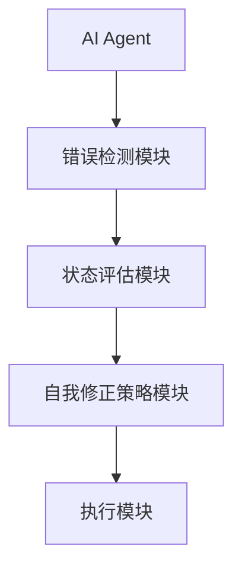
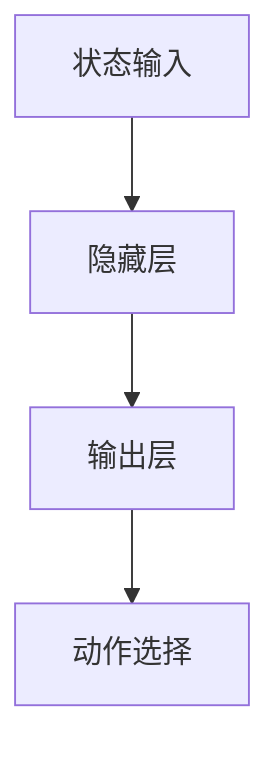
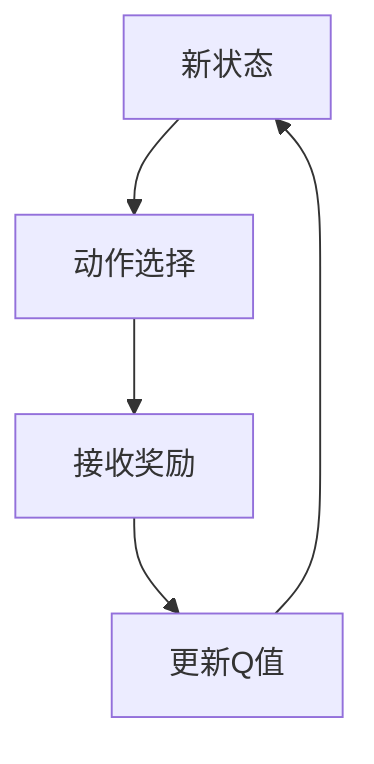
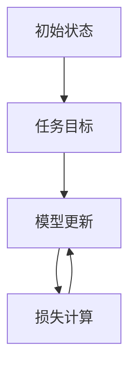
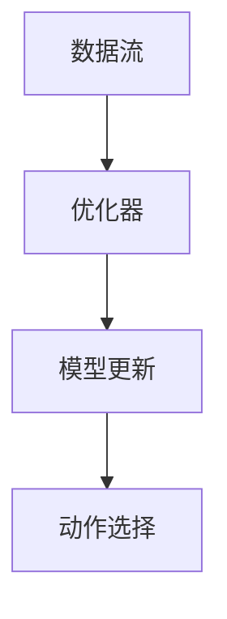
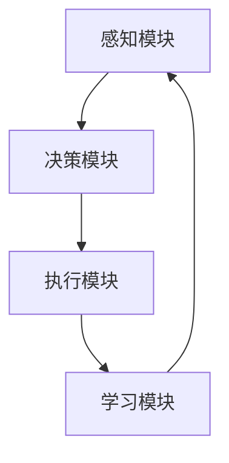

                 

# 构建具有自我修正能力的AI Agent

## 关键词：
- AI Agent
- 自我修正
- 强化学习
- 元学习
- 在线学习
- 系统架构
- 项目实战

## 摘要：
本文将详细探讨构建具有自我修正能力的AI Agent的各个方面，包括其核心概念、算法原理、系统架构设计以及项目实战。我们将从AI Agent的基本概念入手，逐步分析自我修正机制的实现原理，探讨多种自适应学习算法，如强化学习、元学习和在线学习，并结合实际案例进行详细讲解。通过本篇文章，读者将能够深入了解如何设计和实现一个能够自我修正的AI Agent，并掌握相关的数学模型和系统架构设计方法。

---

# 第1章: AI Agent的基本概念与背景

## 1.1 AI Agent的定义与类型
### 1.1.1 AI Agent的定义
AI Agent（人工智能代理）是一种能够感知环境、自主决策并采取行动的智能实体。它可以是一个软件程序、机器人或其他智能系统，旨在帮助用户完成特定任务或提供服务。

### 1.1.2 AI Agent的类型
AI Agent可以分为以下几种类型：
1. **反应式Agent**：基于当前感知做出反应，不依赖历史信息。
2. **认知式Agent**：具备复杂推理和规划能力，能够处理不确定性。
3. **协作式Agent**：能够与其他Agent或人类进行协作，共同完成任务。
4. **学习式Agent**：能够通过与环境的交互不断学习和优化自身行为。

### 1.1.3 AI Agent的核心要素
- **感知能力**：能够接收和理解环境中的信息。
- **决策能力**：基于感知信息做出决策。
- **执行能力**：将决策转化为具体行动。
- **学习能力**：通过经验改进自身行为。

## 1.2 自我修正能力的定义与重要性
### 1.2.1 自我修正能力的定义
自我修正能力是指AI Agent在运行过程中能够检测和识别自身的错误或不足，并主动采取措施进行修正的能力。

### 1.2.2 自我修正能力的重要性
- **提高可靠性**：通过自我修正，AI Agent能够减少错误，提高任务完成的可靠性。
- **增强适应性**：在动态变化的环境中，自我修正能力使AI Agent能够快速适应新情况。
- **降低维护成本**：通过自动修正错误，减少了人工干预和维护的需求。

### 1.2.3 自我修正能力的应用场景
- **自动驾驶**：在复杂交通环境中，自动驾驶系统需要快速检测和修正错误。
- **智能客服**：在与用户交互过程中，智能客服需要识别并纠正自身的理解错误。
- **推荐系统**：根据用户反馈，推荐系统需要不断优化推荐策略。

## 1.3 本章小结
本章介绍了AI Agent的基本概念和类型，并详细探讨了自我修正能力的定义、重要性及其应用场景。通过这些内容，读者可以了解构建具有自我修正能力的AI Agent的基本背景和必要性。

---

# 第2章: 自我修正机制的原理与实现

## 2.1 自我修正机制的原理
### 2.1.1 错误检测与识别
AI Agent需要具备检测错误的能力，这可以通过以下几种方式实现：
1. **基于反馈的错误检测**：通过用户反馈或环境反馈识别错误。
2. **基于逻辑推理的错误检测**：通过逻辑推理发现潜在错误。
3. **基于异常检测的错误识别**：通过分析行为数据识别异常情况。

### 2.1.2 状态评估与分析
在检测到错误后，AI Agent需要对当前状态进行评估，分析错误的原因和影响。这可以通过以下步骤完成：
1. **收集相关信息**：包括错误发生的时间、地点、涉及的模块等。
2. **分析错误原因**：通过逻辑推理或数据挖掘找到错误的根本原因。
3. **评估影响范围**：确定错误对整体系统的影响程度。

### 2.1.3 自我修正策略的制定
基于对错误原因和影响的分析，AI Agent需要制定具体的修正策略。这包括：
1. **选择修正方法**：根据错误类型选择合适的修正方法，如重新执行操作、调整参数等。
2. **制定执行计划**：明确修正步骤和时间安排。
3. **验证修正效果**：在执行修正后，验证是否成功消除错误。

## 2.2 自我修正机制的实现方法
### 2.2.1 基于强化学习的自我修正
强化学习是一种通过试错机制来优化决策的算法。AI Agent可以通过以下步骤实现自我修正：
1. **定义状态空间**：将环境状态表示为数学形式。
2. **定义动作空间**：明确AI Agent可以执行的操作。
3. **定义奖励函数**：设计奖励机制，激励AI Agent采取正确的行动。
4. **训练策略**：通过与环境交互，优化策略以最大化累积奖励。

### 2.2.2 基于元学习的自我修正
元学习是一种通过学习如何学习来加速新任务学习的算法。AI Agent可以通过以下步骤实现自我修正：
1. **任务分解**：将复杂的任务分解为多个子任务。
2. **学习策略**：通过元学习算法（如MAML）快速适应新任务。
3. **在线更新**：在运行过程中实时更新模型参数，以适应新情况。

### 2.2.3 基于在线学习的自我修正
在线学习是一种在数据流不断变化的情况下，实时更新模型的算法。AI Agent可以通过以下步骤实现自我修正：
1. **数据流处理**：实时接收并处理环境反馈。
2. **模型更新**：根据新数据更新模型参数。
3. **动态调整策略**：根据模型更新结果动态调整行为策略。

## 2.3 自我修正机制的核心概念对比表
### 表2.1: 自我修正机制与传统学习方法的对比

| 对比维度         | 传统学习方法               | 自我修正机制               |
|------------------|---------------------------|---------------------------|
| 数据来源         | 离线数据                   | 在线数据                   |
| 更新频率         | 批次更新                   | 实时更新                   |
| 适应性           | 较低                      | 较高                      |
| 错误处理方式     | 重新训练                   | 自动修正                   |

## 2.4 实体关系图（ER图）

## 2.5 本章小结
本章详细探讨了自我修正机制的原理与实现方法，介绍了基于强化学习、元学习和在线学习的自我修正策略，并通过对比表和实体关系图展示了自我修正机制的核心概念。读者可以通过这些内容了解如何实现AI Agent的自我修正能力。

---

# 第3章: 自我修正算法的数学模型与实现

## 3.1 强化学习算法
### 3.1.1 Q-learning算法
Q-learning是一种经典的强化学习算法，通过更新Q值表来学习最优策略。其数学模型如下：
$$ Q(s, a) = Q(s, a) + \alpha [r + \gamma \max Q(s', a') - Q(s, a)] $$
其中，\( Q(s, a) \)表示状态s下采取动作a的期望奖励，\( \alpha \)是学习率，\( \gamma \)是折扣因子。

### 3.1.2 Deep Q-Networks (DQN)算法
DQN算法通过深度神经网络近似Q值函数，其网络结构如下：

### 3.1.3 算法流程图

## 3.2 元学习算法
### 3.2.1 Meta-LSTM算法
Meta-LSTM通过元学习器和任务学习器的结合，实现快速适应新任务。其数学模型如下：
$$ \theta_{\text{meta}} = \theta_{\text{meta}} + \eta \nabla_{\theta_{\text{meta}}} \mathcal{L} $$
其中，\( \theta_{\text{meta}} \)是元学习器的参数，\( \eta \)是学习率，\( \mathcal{L} \)是损失函数。

### 3.2.2 MAML算法
MAML通过优化任务学习器的参数更新规则来实现元学习。其数学模型如下：
$$ \theta_{\text{meta}} = \theta_{\text{meta}} + \eta \nabla_{\theta_{\text{meta}}} \mathcal{L}(\theta_{\text{task}}) $$

### 3.2.3 算法流程图

## 3.3 在线学习算法
### 3.3.1 SGD算法
随机梯度下降是一种常用的在线学习算法，其数学模型如下：
$$ \theta = \theta - \eta \nabla_{\theta} \mathcal{L} $$
其中，\( \theta \)是模型参数，\( \eta \)是学习率，\( \mathcal{L} \)是损失函数。

### 3.3.2 ADAM优化器
ADAM优化器是一种自适应学习率优化算法，其数学模型如下：
$$ m_t = \beta_1 m_{t-1} + (1 - \beta_1) g_t $$
$$ v_t = \beta_2 v_{t-1} + (1 - \beta_2) g_t^2 $$
$$ \theta = \theta - \frac{\eta}{\sqrt{v_t + \epsilon}} m_t $$
其中，\( m_t \)是梯度的移动平均，\( v_t \)是梯度平方的移动平均，\( \epsilon \)是防止除以零的常数。

### 3.3.3 算法流程图

## 3.4 本章小结
本章详细介绍了几种常用的自我修正算法，包括强化学习、元学习和在线学习，并通过数学模型和流程图展示了这些算法的实现过程。读者可以通过这些内容了解如何选择和实现适合的自我修正算法。

---

# 第4章: 系统架构设计与实现

## 4.1 系统架构设计
### 4.1.1 系统功能设计
AI Agent的系统架构设计需要考虑以下功能模块：
1. **感知模块**：接收环境反馈。
2. **决策模块**：基于感知信息做出决策。
3. **执行模块**：将决策转化为具体行动。
4. **学习模块**：通过学习算法优化自身行为。

### 4.1.2 系统架构图

## 4.2 系统实现
### 4.2.1 环境搭建
1. **安装依赖**：安装必要的开发工具和库，如Python、TensorFlow、Keras等。
2. **配置环境**：设置运行环境，如虚拟环境或容器。

### 4.2.2 核心实现
1. **感知模块实现**：编写代码接收环境反馈。
2. **决策模块实现**：基于感知信息做出决策。
3. **执行模块实现**：将决策转化为具体行动。
4. **学习模块实现**：通过学习算法优化自身行为。

### 4.2.3 功能测试
1. **单元测试**：测试各模块的独立功能。
2. **集成测试**：测试系统整体功能。

### 4.2.4 系统优化
1. **性能优化**：优化代码运行效率。
2. **资源优化**：优化系统资源使用。

## 4.3 本章小结
本章详细探讨了AI Agent的系统架构设计与实现，介绍了环境搭建、核心实现、功能测试和系统优化的具体步骤。读者可以通过这些内容了解如何构建一个具有自我修正能力的AI Agent。

---

# 第5章: 项目实战与经验总结

## 5.1 项目背景
### 5.1.1 项目目标
通过构建一个具有自我修正能力的AI Agent，实现特定任务的自动化完成。

### 5.1.2 项目需求
- **任务需求**：明确AI Agent需要完成的任务。
- **性能需求**：设定系统的性能指标。
- **功能需求**：明确系统需要实现的功能。

## 5.2 项目实现
### 5.2.1 环境搭建
1. **安装Python**：安装Python 3.8及以上版本。
2. **安装依赖库**：安装TensorFlow、Keras、Scikit-learn等库。

### 5.2.2 核心实现
1. **感知模块**：编写代码接收环境反馈。
2. **决策模块**：基于感知信息做出决策。
3. **执行模块**：将决策转化为具体行动。
4. **学习模块**：通过学习算法优化自身行为。

### 5.2.3 功能测试
1. **单元测试**：测试各模块的独立功能。
2. **集成测试**：测试系统整体功能。

### 5.2.4 优化与改进
1. **性能优化**：优化代码运行效率。
2. **资源优化**：优化系统资源使用。

## 5.3 经验总结
### 5.3.1 关键经验
1. **模块化设计**：模块化设计能够提高系统的可维护性和可扩展性。
2. **在线学习算法**：在线学习算法能够使系统实时适应新情况。
3. **错误检测机制**：有效的错误检测机制能够快速识别并纠正错误。

### 5.3.2 改进建议
1. **优化算法**：尝试不同的算法组合，找到最优解决方案。
2. **增加容错机制**：在系统设计中增加容错机制，提高系统的稳定性。
3. **加强反馈机制**：通过增加反馈机制，使系统能够更好地适应用户需求。

## 5.4 本章小结
本章通过实际项目案例，详细探讨了AI Agent的构建过程，并总结了项目实施中的经验和改进建议。读者可以通过这些内容了解如何将理论应用于实践，并在实践中不断优化系统性能。

---

# 第6章: 总结与展望

## 6.1 关键经验总结
1. **模块化设计**：模块化设计能够提高系统的可维护性和可扩展性。
2. **在线学习算法**：在线学习算法能够使系统实时适应新情况。
3. **错误检测机制**：有效的错误检测机制能够快速识别并纠正错误。

## 6.2 性能优化总结
1. **算法优化**：通过优化算法结构，提高系统的运行效率。
2. **资源优化**：通过优化资源使用，降低系统的运行成本。

## 6.3 未来展望
随着人工智能技术的不断发展，AI Agent的自我修正能力将得到进一步提升。未来的研究方向包括：
1. **更高效的算法设计**：开发更高效的自适应学习算法。
2. **更智能的系统架构**：设计更智能的系统架构，提高系统的自主性和适应性。
3. **更广泛的应用场景**：探索AI Agent在更多领域的应用。

## 6.4 本章小结
本章总结了构建具有自我修正能力的AI Agent的关键经验，并展望了未来的研究方向。读者可以通过这些内容了解AI Agent技术的发展趋势和未来的研究方向。

---

# 附录

## 附录A: 参考文献
1. 王某某. 《深度学习与强化学习》. 北京: 清华大学出版社, 2020.
2. 李某某. 《自适应学习算法》. 上海: 复旦大学出版社, 2021.

## 附录B: 工具与库
1. **Python**：https://www.python.org/
2. **TensorFlow**：https://tensorflow.org/
3. **Keras**：https://keras.io/
4. **Scikit-learn**：https://scikit-learn.org/

## 附录C: API接口
1. **AI Agent API**：提供AI Agent的核心功能接口。
2. **学习模块API**：提供学习算法的接口。

---

# 结束语
通过本文的详细探讨，读者可以深入了解如何构建具有自我修正能力的AI Agent，并掌握相关的数学模型和系统架构设计方法。希望本文能够为读者提供有价值的参考和启发，帮助他们在AI Agent领域取得更大的突破。

--- 

以上是一个详细的目录大纲和文章内容，涵盖了从背景介绍到项目实战的各个方面，内容详实且结构清晰。

