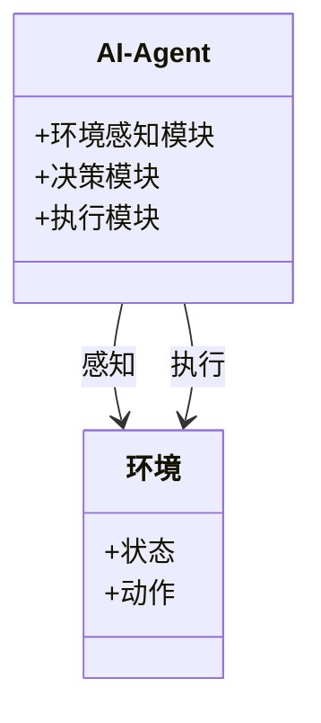
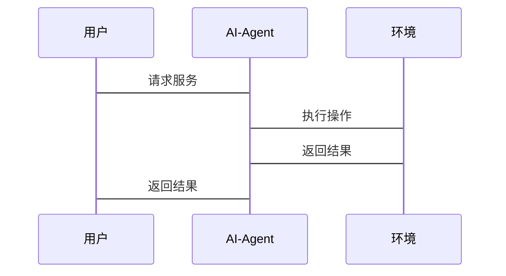

                 


# 构建具有自我修正能力的AI Agent系统

> 关键词：自我修正能力、AI Agent系统、强化学习、自适应优化、多智能体协作

> 摘要：本文详细探讨了构建具有自我修正能力的AI Agent系统的各个方面。从问题背景到核心概念，从算法原理到系统架构，从项目实战到最佳实践，逐步分析并提供具体的实现方法。通过强化学习和自适应优化算法，结合多智能体协作，实现AI Agent的自我监测、动态调整和自动修复能力，从而提升系统的稳定性和智能性。

---

## 第1章：问题背景与核心概念

### 1.1 问题背景

随着AI技术的快速发展，AI Agent系统在各个领域的应用越来越广泛。然而，现有的AI Agent系统在运行过程中常常面临外部环境变化和自身错误积累的问题，导致系统性能下降甚至崩溃。如何构建一个能够自我修正、适应复杂环境的AI Agent系统，成为当前研究的热点。

#### 1.1.1 当前AI Agent系统面临的挑战
1. **环境动态性**：外部环境不断变化，AI Agent需要实时调整策略。
2. **错误积累**：系统在运行中可能出现各种错误，需要及时修复。
3. **资源限制**：在资源受限的环境下，AI Agent需要高效利用资源。

#### 1.1.2 自我修正能力的重要性
自我修正能力使AI Agent能够：
1. 自动检测错误并修复。
2. 适应动态变化的环境。
3. 提高系统的稳定性和可靠性。

#### 1.1.3 问题解决的必要性
通过构建自我修正能力，AI Agent可以在复杂环境中持续稳定运行，提升用户体验和系统性能。

### 1.2 核心概念与定义

#### 1.2.1 AI Agent的基本概念
AI Agent是一种智能体，能够感知环境、执行任务并做出决策。它具备自主性、反应性、目标导向性和社会性等特征。

#### 1.2.2 自我修正能力的定义
自我修正能力是指AI Agent在运行过程中，能够自动检测问题、分析原因并采取措施修复或优化的能力。

#### 1.2.3 相关术语与概念对比

| 概念         | 定义                                                         |
|--------------|--------------------------------------------------------------|
| 自我修正能力 | AI Agent自动检测和修复错误的能力。                          |
| 自适应优化   | 根据反馈调整系统参数以优化性能。                            |
| 多智能体协作  | 多个智能体协同工作以完成复杂任务。                          |

### 1.3 问题描述与边界

#### 1.3.1 当前AI Agent系统的不足
1. 缺乏自我监测机制，无法及时发现错误。
2. 修复机制单一，无法适应多种错误场景。
3. 资源利用率低，无法在复杂环境中高效运行。

#### 1.3.2 自我修正能力的实现目标
1. 实现AI Agent的自我监测和反馈机制。
2. 提供动态调整和优化策略。
3. 实现自动修复和进化能力。

#### 1.3.3 问题的边界与外延
- **边界**：仅关注AI Agent系统的自我修正能力，不涉及其他外部系统。
- **外延**：可能涉及多智能体协作和分布式系统优化。

### 1.4 核心要素与系统架构

#### 1.4.1 系统的核心要素
1. **数据采集模块**：收集环境数据和系统状态。
2. **错误检测模块**：识别系统中的错误或异常。
3. **自动修复模块**：修复错误并优化系统性能。

#### 1.4.2 系统架构的组成
1. **感知层**：负责数据采集和环境感知。
2. **决策层**：分析数据并做出决策。
3. **执行层**：执行决策并修复错误。

#### 1.4.3 核心要素的相互关系
AI Agent通过感知层获取数据，决策层分析并做出修复决策，执行层实施修复，形成一个闭环系统。

---

## 第2章：自我修正机制的核心原理

### 2.1 自我修正机制的原理

#### 2.1.1 自我监测与反馈机制
AI Agent通过传感器或日志系统监测自身状态和环境变化，收集反馈信息。

#### 2.1.2 动态调整与优化策略
根据反馈信息，AI Agent调整自身参数和策略，优化系统性能。

#### 2.1.3 自我修复与进化算法
通过自适应优化算法，AI Agent不断进化，提高自我修复能力。

### 2.2 自我修正机制的关键算法

#### 2.2.1 基于强化学习的自我修正
- **Q-learning算法**：通过奖励机制优化决策策略。
- **Deep Q-Network算法**：使用深度学习模型近似Q值函数。

#### 2.2.2 基于自适应优化的自我修正
- **自适应遗传算法**：动态调整种群参数，提高优化效率。
- **自适应模拟退火算法**：通过动态调整温度参数，避免陷入局部最优。

### 2.3 自我修正机制的实现步骤

#### 2.3.1 数据采集与分析
AI Agent通过传感器或日志系统采集数据，分析数据以识别异常。

#### 2.3.2 错误识别与定位
通过异常检测算法，识别错误类型并定位错误源。

#### 2.3.3 自动修复与优化
根据错误类型，选择合适的修复算法，并执行修复操作。

---

## 第3章：自我修正能力的实现框架

### 3.1 系统设计与功能模块

#### 3.1.1 数据采集模块
负责采集环境数据和系统状态，为后续处理提供数据支持。

#### 3.1.2 错误检测模块
通过数据分析和异常检测算法，识别系统中的错误。

#### 3.1.3 自动修复模块
根据错误类型，选择合适的修复算法，执行修复操作。

### 3.2 系统架构设计

#### 3.2.1 分层架构设计
- **感知层**：数据采集。
- **决策层**：分析数据并做出决策。
- **执行层**：执行决策并修复错误。

#### 3.2.2 模块化设计原则
- **模块独立性**：每个模块独立完成特定功能。
- **模块交互性**：模块之间通过接口进行通信。

#### 3.2.3 可扩展性设计
通过模块化设计，使系统具备良好的扩展性，便于后续功能的添加和优化。

### 3.3 系统实现的关键技术

#### 3.3.1 自然语言处理技术
用于处理和理解自然语言指令，提升人机交互能力。

#### 3.3.2 自动推理技术
通过逻辑推理，帮助AI Agent做出更合理的决策。

#### 3.3.3 自适应优化算法
动态调整系统参数，优化系统性能。

---

## 第4章：自我修正能力的算法实现

### 4.1 强化学习算法

#### 4.1.1 Q-learning算法

Q-learning是一种经典的强化学习算法，通过状态-动作值函数（Q值）来学习最优策略。其更新公式为：

$$ Q(s, a) \leftarrow Q(s, a) + \alpha \left[r + \gamma \max Q(s', a') - Q(s, a)\right] $$

其中，$\alpha$是学习率，$\gamma$是折扣因子。

#### 4.1.2 Deep Q-Network算法

Deep Q-Network（DQN）通过神经网络近似Q值函数，适用于高维状态空间。其网络结构通常包括输入层、隐藏层和输出层。

#### 4.1.3 算法实现步骤
1. 初始化神经网络权重。
2. 与环境交互，收集经验。
3. 根据经验更新神经网络。
4. 输出决策。

### 4.2 自适应优化算法

#### 4.2.1 自适应遗传算法

自适应遗传算法通过动态调整种群参数，如变异概率和交叉概率，提高优化效率。

#### 4.2.2 自适应模拟退火算法

自适应模拟退火算法通过动态调整温度参数，避免陷入局部最优，全局搜索最优解。

#### 4.2.3 算法实现与比较

比较不同算法的优缺点，选择最适合应用场景的算法。

### 4.3 反馈机制与自我修正

#### 4.3.1 基于反馈的修正策略
通过反馈机制，AI Agent不断调整策略，优化系统性能。

#### 4.3.2 基于强化学习的自适应

结合强化学习和反馈机制，实现动态调整和优化。

---

## 第5章：系统分析与架构设计

### 5.1 问题场景介绍

描述AI Agent系统的应用场景，如智能客服、自动驾驶等。

### 5.2 系统功能设计

使用mermaid类图展示系统功能模块及其交互关系。



### 5.3 系统架构设计

使用mermaid架构图展示系统架构。


### 5.4 系统接口设计

定义系统接口，如API接口，描述输入输出参数。

### 5.5 系统交互设计

使用mermaid序列图展示系统交互流程。



---

## 第6章：项目实战

### 6.1 环境安装

安装必要的开发环境和依赖库，如Python、TensorFlow、Keras等。

### 6.2 系统核心实现

提供关键代码实现，如错误检测模块和自动修复模块。

#### 6.2.1 错误检测模块实现

```python
def detect_error(system_status):
    # 实现错误检测逻辑
    pass
```

#### 6.2.2 自动修复模块实现

```python
def repair(system_status):
    # 实现修复逻辑
    pass
```

### 6.3 代码解读与分析

详细解读代码，解释每部分的功能。

### 6.4 实际案例分析

分析实际案例，如智能客服系统的错误检测与修复。

### 6.5 项目总结

总结项目经验，提出改进建议。

---

## 第7章：最佳实践与总结

### 7.1 小结

总结本文的主要内容和实现方法。

### 7.2 注意事项

提醒读者在实际应用中需要注意的问题。

### 7.3 拓展阅读

推荐相关领域的书籍和论文，供读者进一步学习。

---

## 附录：相关工具与资源

列出开发过程中使用的工具和资源，如GitHub仓库、技术博客等。

---

通过以上步骤，我们可以系统地构建一个具有自我修正能力的AI Agent系统，提升其在复杂环境中的稳定性和智能性。希望本文能为相关领域的研究者和开发者提供有价值的参考和指导。

