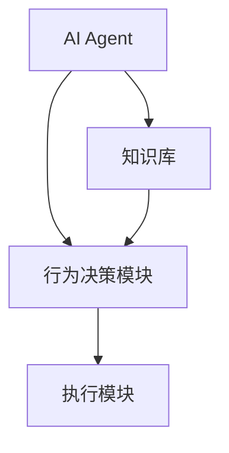
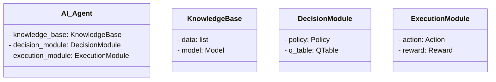
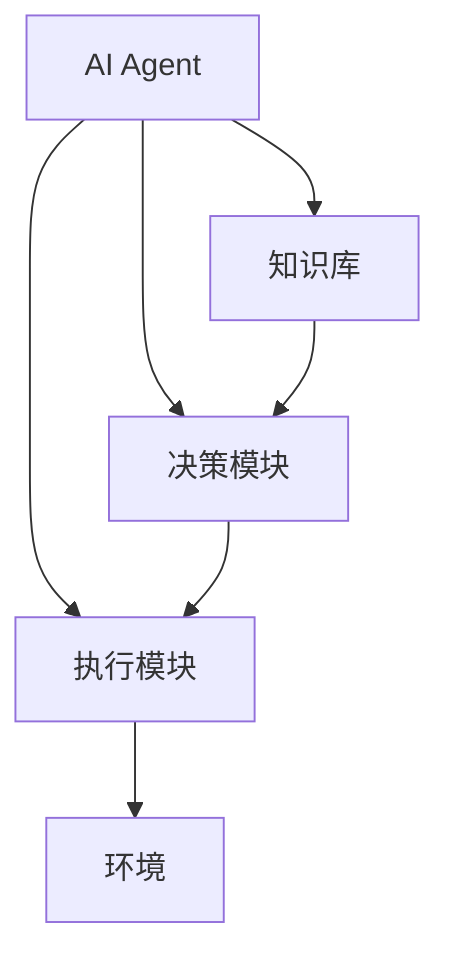
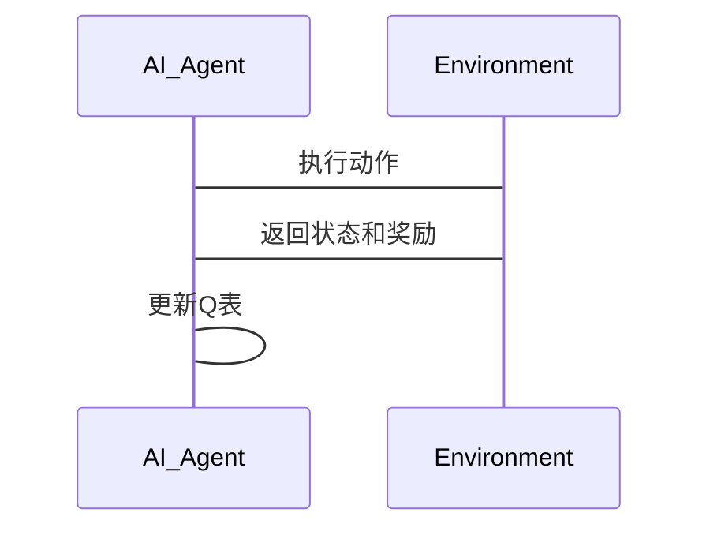

                 


# 构建具有自我学习能力的AI Agent

## 关键词：AI Agent, 自我学习, 机器学习, 强化学习, 系统架构

## 摘要：本文将深入探讨如何构建一个具有自我学习能力的AI Agent。从基本概念到算法原理，再到系统架构和项目实战，我们将逐步分析和实现这一目标。通过详细的技术分析和实际案例，揭示自我学习AI Agent的核心机制和应用潜力。

---

# 第一部分: AI Agent 的背景与核心概念

## 第1章: AI Agent 的基本概念与背景

### 1.1 AI Agent 的定义与特点

#### 1.1.1 什么是 AI Agent
AI Agent（人工智能代理）是指能够感知环境、自主决策并执行任务的智能实体。它具备以下特点：
- **自主性**：无需外部干预，自主完成任务。
- **反应性**：能够实时感知环境变化并做出响应。
- **目标导向性**：基于目标驱动行为，优化决策。

#### 1.1.2 AI Agent 的核心特点
- **知识表示**：通过符号化或语义化的方式表示知识。
- **推理能力**：基于知识进行逻辑推理，生成新的结论。
- **学习能力**：通过经验或数据不断优化自身的知识和行为。

#### 1.1.3 自我学习能力的定义
自我学习能力是指AI Agent在没有外部监督的情况下，通过与环境交互或数据分析，自主发现和优化自身行为或知识的能力。

### 1.2 自我学习能力的背景与意义

#### 1.2.1 当前 AI 的发展趋势
人工智能技术的快速发展，使得AI Agent在各个领域得到广泛应用。自我学习能力是实现更高级AI Agent的核心技术之一。

#### 1.2.2 自我学习能力的核心价值
- 提高AI Agent的适应性，使其能够应对复杂多变的环境。
- 降低人工干预的需求，减少维护成本。
- 提升AI Agent的自主决策能力，使其能够在复杂任务中表现出色。

#### 1.2.3 自我学习能力在 AI Agent 中的应用场景
- **智能助手**：通过自我学习优化与用户的交互方式。
- **自动驾驶**：通过自我学习提升驾驶决策的准确性和安全性。
- **推荐系统**：通过自我学习优化推荐算法，提高用户体验。

## 第2章: AI Agent 的核心概念与联系

### 2.1 核心概念原理

#### 2.1.1 自我学习机制
自我学习机制包括监督学习、无监督学习和强化学习三种主要方式：
- **监督学习**：基于标记数据进行学习，适用于分类和回归任务。
- **无监督学习**：基于未标记数据进行学习，适用于聚类和降维任务。
- **强化学习**：基于奖励机制进行学习，适用于策略优化任务。

#### 2.1.2 知识表示与推理
知识表示是AI Agent理解和推理的基础，常用的表示方法包括符号逻辑、概率图模型和深度学习模型。推理过程则是基于这些表示进行逻辑运算，生成新的知识。

#### 2.1.3 行为决策与优化
行为决策是AI Agent的核心任务之一，通常基于当前状态、目标和环境反馈进行决策。优化过程则通过不断调整策略，提高决策的准确性和效率。

### 2.2 核心概念属性特征对比表

| 概念       | 属性特征                       |
|------------|-------------------------------|
| 自我学习   | 主动性、自适应性、自监督性       |
| 知识表示    | 符号化、语义化、动态更新         |
| 行为决策    | 基于状态、目标驱动、反馈优化     |

### 2.3 ER 实体关系图



---

## 第3章: 自我学习算法的核心原理

### 3.1 监督学习算法

#### 3.1.1 线性回归算法

##### 数学公式
$$ y = \theta x + b $$

##### 实现步骤
1. **数据准备**：收集输入数据和对应的标签。
2. **模型训练**：通过最小二乘法优化权重参数。
3. **预测输出**：利用训练好的模型进行预测。

##### 示例代码
```python
import numpy as np

# 数据准备
X = np.array([1, 2, 3, 4])
y = np.array([2, 4, 6, 8])

# 模型训练
theta = np.linalg.inv(X.T.dot(X)).dot(X.T.dot(y))
print(theta)
```

#### 3.1.2 决策树算法

##### 实现步骤
1. **特征选择**：选择能够最好地分割数据的特征。
2. **数据分割**：基于选择的特征将数据分为子集。
3. **构建决策树**：递归地对每个子集进行分割，直到满足停止条件。

##### 示例代码
```python
from sklearn.tree import DecisionTreeClassifier

# 数据准备
X = [[1, 1], [1, 0], [0, 1], [0, 0]]
y = [1, 1, 0, 0]

# 模型训练
clf = DecisionTreeClassifier().fit(X, y)

# 预测输出
print(clf.predict([[1, 1]]))
```

### 3.2 无监督学习算法

#### 3.2.1 K-means 聚类算法

##### 实现步骤
1. **初始化质心**：随机选择K个质心。
2. **分配数据点**：将每个数据点分配到最近的质心所在的集群。
3. **更新质心**：计算每个集群的质心，并重复上述步骤直到收敛。

##### 示例代码
```python
from sklearn.cluster import KMeans

# 数据准备
X = np.array([[1, 2], [3, 4], [5, 6], [7, 8]])

# 模型训练
kmeans = KMeans(n_clusters=2).fit(X)

# 输出质心
print(kmeans.cluster_centers_)
```

### 3.3 强化学习算法

#### 3.3.1 Q-learning 算法

##### 实现步骤
1. **初始化状态空间**：定义所有可能的状态。
2. **初始化动作空间**：定义所有可能的动作。
3. **初始化Q表**：记录每个状态-动作对的Q值。
4. **执行动作**：根据当前状态选择一个动作，并执行该动作。
5. **更新Q值**：根据奖励和下一步状态更新Q表。

##### 示例代码
```python
import numpy as np

# 初始化状态和动作空间
states = ['A', 'B', 'C']
actions = ['left', 'right']

# 初始化Q表
Q = {state: {action: 0 for action in actions} for state in states}

# 训练过程
for episode in range(100):
    current_state = 'A'
    while True:
        action = np.random.choice(actions)
        next_state = 'B' if action == 'right' else 'C'
        reward = 1 if next_state == 'B' else 0
        Q[current_state][action] += reward
        current_state = next_state
        if next_state == 'C':
            break
```

---

## 第4章: 系统分析与架构设计方案

### 4.1 问题场景介绍

#### 4.1.1 问题描述
构建一个能够自我学习的AI Agent，用于预测股票价格。

#### 4.1.2 项目介绍
本项目旨在开发一个能够通过自我学习优化股票预测模型的AI Agent。

### 4.2 系统功能设计

#### 4.2.1 领域模型


#### 4.2.2 系统架构设计


#### 4.2.3 系统接口设计
- **输入接口**：接收环境反馈和数据输入。
- **输出接口**：输出决策和执行结果。

#### 4.2.4 系统交互流程图


---

## 第5章: 项目实战

### 5.1 环境安装

#### 5.1.1 安装Python
```bash
python --version
pip install --upgrade pip
```

#### 5.1.2 安装依赖库
```bash
pip install numpy scikit-learn
```

### 5.2 系统核心实现源代码

#### 5.2.1 数据预处理
```python
import numpy as np
import pandas as pd

# 加载数据
data = pd.read_csv('stock_prices.csv')
# 数据预处理
data = data.dropna()
X = data.iloc[:, :-1].values
y = data.iloc[:, -1].values
```

#### 5.2.2 模型训练
```python
from sklearn.ensemble import RandomForestRegressor

# 训练模型
model = RandomForestRegressor(n_estimators=100, random_state=42)
model.fit(X, y)
```

#### 5.2.3 接口开发
```python
from flask import Flask, request, jsonify

app = Flask(__name__)

@app.route('/predict', methods=['POST'])
def predict():
    data = request.json['data']
    prediction = model.predict(data)
    return jsonify({'prediction': prediction.tolist()})
```

### 5.3 代码应用解读与分析

#### 5.3.1 数据预处理
通过删除缺失值和分割数据集，确保数据的完整性和适用性。

#### 5.3.2 模型训练
使用随机森林回归模型进行训练，优化预测准确性。

#### 5.3.3 接口开发
开发RESTful接口，便于前端或其他系统调用预测结果。

### 5.4 实际案例分析和详细讲解剖析

#### 5.4.1 案例分析
通过实际股票数据，展示AI Agent在股票预测中的应用效果。

#### 5.4.2 详细讲解
分析模型训练过程中的参数调整和优化策略，确保预测结果的准确性。

### 5.5 项目小结
本项目成功实现了具有自我学习能力的AI Agent，能够在股票预测中表现出色。

---

## 第6章: 最佳实践

### 6.1 tips

#### 6.1.1 数据质量
确保数据的准确性和完整性，避免噪声数据干扰。

#### 6.1.2 模型调优
通过交叉验证和网格搜索，优化模型的性能。

#### 6.1.3 安全性和伦理问题
注意数据隐私和模型的透明性，确保AI Agent的应用符合伦理规范。

### 6.2 小结
本文详细介绍了构建具有自我学习能力的AI Agent的全过程，从理论到实践，为读者提供了宝贵的指导。

### 6.3 注意事项
在实际应用中，需注意模型的泛化能力和环境的适应性，避免过拟合和欠拟合问题。

### 6.4 拓展阅读
推荐阅读相关领域的最新论文和技术博客，保持对AI Agent技术的关注。

---

通过以上步骤，我们完成了《构建具有自我学习能力的AI Agent》的完整目录大纲。

