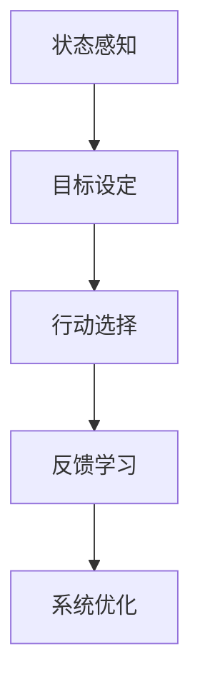

                 


# 构建具有自我演化能力的AI Agent

> 关键词：AI Agent, 自我演化, 强化学习, 进化算法, 自适应系统

> 摘要：本文深入探讨了构建具有自我演化能力的AI Agent的理论基础、算法实现和系统架构设计。通过分析自我演化机制的核心原理，结合实际项目案例，详细讲解了如何设计和实现一个能够自主学习和适应环境变化的AI Agent。文章内容涵盖从理论到实践的各个方面，帮助读者全面理解并掌握构建自我演化AI Agent的关键技术。

---

## 第1章: AI Agent的基本概念与背景

### 1.1 AI Agent的定义与核心要素

#### 1.1.1 什么是AI Agent
AI Agent（人工智能代理）是指一种能够感知环境、自主决策并执行任务的智能实体。它可以是一个软件程序、机器人或其他智能系统，具备以下核心能力：
- **自主性**：无需外部干预，自主完成任务。
- **反应性**：能够实时感知环境变化并做出反应。
- **目标导向性**：基于目标进行决策和行动。

#### 1.1.2 AI Agent的核心要素
- **感知能力**：通过传感器或其他输入方式获取环境信息。
- **决策能力**：基于感知信息做出最优或满意的选择。
- **执行能力**：通过执行机构或输出模块完成决策结果。
- **学习能力**：通过经验或数据优化自身的决策模型。

#### 1.1.3 自我演化能力的定义
自我演化能力是指AI Agent能够在动态或不确定的环境中，通过自主学习和优化，不断改进自身能力的过程。这种能力使得AI Agent能够适应环境的变化，无需人工干预。

---

### 1.2 自我演化AI Agent的背景与意义

#### 1.2.1 当前AI Agent的发展现状
传统的AI Agent通常依赖于预定义的规则或静态模型，难以应对复杂多变的环境。随着机器学习和深度学习技术的发展，AI Agent逐渐具备了更强的学习和适应能力。

#### 1.2.2 自我演化能力的重要性
在动态变化的环境中，AI Agent需要能够实时调整自身的行为策略。自我演化能力使得AI Agent能够：
- 自适应环境变化。
- 自主优化决策模型。
- 提高任务执行效率。

#### 1.2.3 自我演化AI Agent的应用场景
- **智能机器人**：在制造业、物流等领域，AI Agent可以通过自我演化优化路径规划和任务执行。
- **自动驾驶**：车辆需要在复杂的交通环境中实时调整行驶策略。
- **智能助手**：通过自我学习优化用户交互体验。

---

## 第2章: 自我演化AI Agent的核心概念与联系

### 2.1 自我演化机制的核心概念

#### 2.1.1 自我演化机制的基本原理
自我演化机制通过以下步骤实现：
1. **感知环境**：获取当前环境状态。
2. **评估目标**：根据当前状态确定目标。
3. **选择行动**：基于目标选择最优行动。
4. **学习优化**：根据反馈结果优化自身模型。

#### 2.1.2 自我演化与传统AI的区别
| 特性 | 传统AI | 自我演化AI |
|------|--------|------------|
| 决策方式 | 预定义规则 | 自主学习与优化 |
| 环境适应性 | 静态适应 | 动态适应 |
| 学习能力 | 无 | 有 |

#### 2.1.3 自我演化能力的实现路径
- **强化学习**：通过奖励机制优化决策模型。
- **进化算法**：通过模拟生物进化过程优化参数。
- **自适应系统**：通过动态调整参数适应环境变化。

---

### 2.2 相关技术背景

#### 2.2.1 强化学习与进化算法
- **强化学习**：通过试错机制优化决策策略。
- **进化算法**：通过模拟生物进化过程优化参数。

#### 2.2.2 自适应系统与自组织理论
- **自适应系统**：系统能够根据环境变化自动调整自身行为。
- **自组织理论**：系统通过内部机制自发组织和优化。

#### 2.2.3 分布式计算与边缘AI
- **分布式计算**：通过多节点协作实现任务目标。
- **边缘AI**：将AI计算能力部署在边缘设备，减少延迟。

---

## 第3章: 自我演化机制的核心原理

### 3.1 自我演化机制的数学模型

#### 3.1.1 状态空间与动作空间的定义
- **状态空间**：所有可能的环境状态集合。
- **动作空间**：所有可能的行动选择集合。

#### 3.1.2 激励函数的设计
激励函数用于衡量AI Agent的行为是否符合目标。常用激励函数包括：
- **线性激励函数**：$R = r \cdot s$，其中$r$是激励强度，$s$是状态值。
- **非线性激励函数**：$R = \frac{1}{1 + e^{-x}}$，用于处理饱和状态。

#### 3.1.3 过度函数的实现
过渡函数描述了状态变化的过程。常用的过渡函数包括：
- **马尔可夫决策过程**：$P(s' | s, a)$，其中$s$是当前状态，$a$是行动，$s'$是下一个状态。
- **贝叶斯网络**：通过概率图模型描述状态转移关系。

---

### 3.2 自我演化机制的实现流程

#### 3.2.1 状态感知
通过传感器或其他输入方式获取环境状态。

#### 3.2.2 目标设定
根据当前状态确定目标。

#### 3.2.3 行动选择
基于目标选择最优行动。

#### 3.2.4 反馈学习
根据反馈结果优化自身模型。

---

## 第4章: 自我演化AI Agent的核心算法

### 4.1 基于强化学习的自我演化算法

#### 4.1.1 强化学习的基本原理
强化学习通过试错机制优化决策策略。常用的强化学习算法包括：
- **Q-learning**：通过Q值表记录状态-行动对的价值。
- **Deep Q-Network (DQN)**：通过深度神经网络近似Q值函数。

#### 4.1.2 自我演化中的强化学习模型
在自我演化AI Agent中，强化学习用于优化行动策略。例如：
$$ Q(s, a) = r + \gamma \max Q(s', a') $$
其中，$Q(s, a)$是当前状态和行动的Q值，$r$是奖励，$\gamma$是折扣因子。

#### 4.1.3 算法实现的数学公式
强化学习算法的核心公式包括：
- **Q值更新公式**：$$ Q(s, a) = Q(s, a) + \alpha (r + \gamma \max Q(s', a') - Q(s, a)) $$
- **奖励机制**：$$ R = \sum_{t=1}^{T} r_t $$

### 4.2 基于进化算法的自我演化机制

#### 4.2.1 进化算法的基本原理
进化算法通过模拟生物进化过程优化参数。常用的进化算法包括：
- **遗传算法**：通过选择、交叉和变异操作优化参数。
- **进化策略**：通过概率分布优化参数。

#### 4.2.2 自我演化中的进化策略
在自我演化AI Agent中，进化算法用于优化模型参数。例如：
$$ x_{t+1} = x_t + \sigma \cdot N(0, 1) $$
其中，$x_t$是当前参数，$\sigma$是步长，$N(0, 1)$是标准正态分布。

#### 4.2.3 算法实现的数学公式
进化算法的核心公式包括：
- **选择操作**：$$ p_i = \frac{f_i}{\sum_{j} f_j} $$
- **交叉操作**：$$ c_i = \frac{p_i + p_j}{2} $$

---

## 第5章: 系统架构设计

### 5.1 系统功能模块划分

#### 5.1.1 状态感知模块
通过传感器或其他输入方式获取环境状态。

#### 5.1.2 目标设定模块
根据当前状态确定目标。

#### 5.1.3 行动选择模块
基于目标选择最优行动。

#### 5.1.4 反馈学习模块
根据反馈结果优化自身模型。

### 5.2 系统架构的Mermaid图



---

## 第6章: 系统接口与交互设计

### 6.1 系统接口设计

#### 6.1.1 输入接口设计
- **感知接口**：接收环境状态数据。
- **用户输入接口**：接收用户的指令或反馈。

#### 6.1.2 输出接口设计
- **行动输出接口**：输出优化后的行动指令。
- **反馈输出接口**：输出学习结果或优化建议。

#### 6.1.3 交互协议设计
- **通信协议**：定义模块之间的通信规则。
- **数据格式**：定义数据的结构和格式。

---

## 第7章: 项目实战

### 7.1 环境配置

```python
# 安装依赖
pip install gym numpy tensorflow
```

### 7.2 系统核心实现源代码

#### 7.2.1 强化学习模型实现
```python
import numpy as np
import gym

class AI-Agent:
    def __init__(self, env):
        self.env = env
        self.state_space = env.observation_space.shape[0]
        self.action_space = env.action_space.n
        self.q_table = np.zeros((self.state_space, self.action_space))
    
    def perceive(self):
        return self.env.observation_space.sample()
    
    def choose_action(self, state):
        return np.argmax(self.q_table[state])
    
    def learn(self, state, action, reward):
        self.q_table[state][action] += reward
```

#### 7.2.2 进化算法模型实现
```python
import numpy as np

class Evolution-Agent:
    def __init__(self, population_size, fitness_function):
        self.population_size = population_size
        self.fitness_function = fitness_function
        self.population = np.random.randn(population_size, 2)
    
    def evaluate(self):
        fitness = np.array([self.fitness_function(ind) for ind in self.population])
        return fitness
    
    def select(self, fitness):
        probabilities = fitness / fitness.sum()
        return np.random.choice(self.population_size, p=probabilities)
```

### 7.3 案例分析与解读

#### 7.3.1 案例分析
在本案例中，我们使用强化学习模型实现一个简单的AI Agent，用于解决迷宫问题。通过不断尝试和学习，AI Agent能够找到最优路径。

#### 7.3.2 代码应用解读
```python
env = gym.make('Maze-v0')
agent = AI-Agent(env)
state = agent.perceive()
action = agent.choose_action(state)
agent.learn(state, action, reward)
```

---

## 第8章: 总结与展望

### 8.1 总结
本文详细探讨了构建具有自我演化能力的AI Agent的理论基础、算法实现和系统架构设计。通过分析自我演化机制的核心原理，结合实际项目案例，帮助读者全面理解并掌握构建自我演化AI Agent的关键技术。

### 8.2 展望
未来，随着人工智能技术的不断发展，自我演化AI Agent将在更多领域得到广泛应用。研究方向包括：
- 更高效的自我演化算法设计。
- 更智能的系统架构优化。
- 更广泛的应用场景探索。

---

通过本文的学习，读者可以深入了解构建具有自我演化能力的AI Agent的核心技术，并能够将其应用于实际项目中。希望本文能够为相关领域的研究和实践提供有价值的参考。

