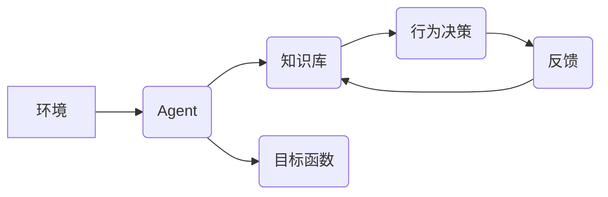
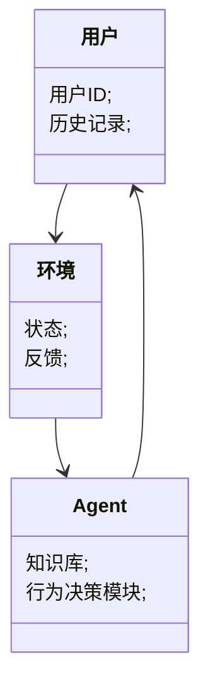
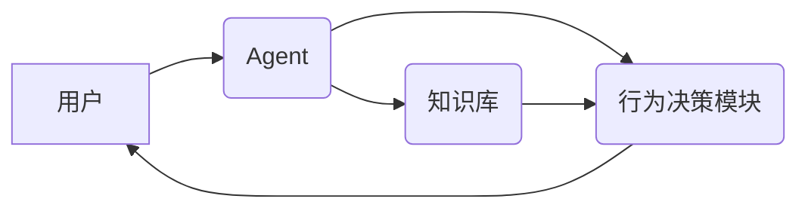

                 


# 构建具有自我演化能力的AI Agent系统

## 关键词
AI Agent, 自我演化, 强化学习, 知识表示, 系统架构

## 摘要
本文详细探讨了构建具有自我演化能力的AI Agent系统的各个方面，包括其背景、核心概念、算法原理、系统架构、项目实战以及高级主题。通过逐步分析，我们揭示了自我演化AI Agent的定义、特点、应用场景、技术实现和未来发展方向。本文旨在为读者提供一个全面的视角，帮助他们理解并掌握构建具有自我演化能力的AI Agent系统的方法和技巧。

---

## 正文

### 第1章：问题背景与定义

#### 1.1 问题背景
人工智能（AI）技术的快速发展为各行各业带来了巨大的变革，AI Agent（智能体）作为实现智能交互和自动化决策的核心技术，已广泛应用于自动驾驶、智能助手、机器人控制等领域。然而，传统AI Agent在面对复杂动态环境时，往往依赖于预设规则或固定模型，难以适应环境的变化。例如，在游戏中，AI Agent需要根据对手的策略变化实时调整自己的行为；在客户服务中，AI Agent需要根据客户需求的变化不断优化响应策略。

随着技术的进步，AI Agent的自我演化能力逐渐成为研究的热点。自我演化AI Agent能够通过与环境的交互，不断优化自身的知识库和行为策略，从而在复杂场景中实现自主决策和进化。这种能力使得AI Agent能够更好地适应动态变化的环境，提升其智能性和实用性。

#### 1.2 自我演化AI Agent的定义与特点
自我演化AI Agent是一种能够在运行过程中通过与环境的交互不断优化自身行为和知识表示的智能体。其核心在于通过内部驱动和外部反馈的结合，实现知识的动态更新和策略的自主优化。与传统AI Agent相比，自我演化AI Agent具有以下特点：

1. **动态适应性**：能够根据环境反馈实时调整行为策略和知识库。
2. **自主学习能力**：无需人工干预，通过强化学习、元学习等技术实现自我优化。
3. **知识表示的灵活性**：能够根据新的经验动态更新知识表示，支持多种表示形式（如符号、概率、图结构等）。
4. **多目标优化**：在多个目标之间寻找平衡，避免单一目标导致的策略僵化。

#### 1.3 应用场景与挑战
自我演化AI Agent的应用场景广泛，主要包括：

- **游戏AI**：在复杂游戏中实现动态策略调整。
- **智能助手**：根据用户行为和反馈优化服务策略。
- **机器人控制**：在动态环境中实现自主决策和行为优化。
- **自动驾驶**：在复杂交通环境中实时调整驾驶策略。

尽管自我演化AI Agent具有广阔的应用前景，但其实现也面临诸多挑战，例如：

- **计算资源限制**：自我演化过程需要大量计算资源，如何在资源受限的环境中实现高效优化是一个难点。
- **知识表示的复杂性**：如何设计灵活的知识表示形式以支持多场景下的动态调整是一个技术挑战。
- **安全性和伦理问题**：自我演化AI Agent的行为可能带来不可预测的风险，如何确保其安全性和伦理合规性是一个重要课题。

---

### 第2章：自我演化AI Agent的核心概念与联系

#### 2.1 自我演化机制的原理
自我演化机制是实现AI Agent动态适应性的核心。其主要包含以下两个方面：

1. **内部驱动**：基于AI Agent的当前知识库和目标函数，生成候选行为或策略。
2. **外部反馈**：通过与环境交互，获取反馈信息（如奖励、状态变化等），并根据反馈信息调整知识库和行为策略。

图1展示了自我演化机制的基本原理：



#### 2.2 核心概念的对比分析
为了更好地理解自我演化AI Agent的核心概念，我们需要对其关键概念进行对比分析。表1对比了自我演化机制与传统强化学习在以下几个方面的差异：

| 对比维度         | 自我演化机制                 | 传统强化学习             |
|------------------|------------------------------|--------------------------|
| 知识表示方式     | 动态知识库                   | 静态策略或Q表            |
| 行为生成方式     | 基于知识库的推理             | 基于策略网络的输出        |
| 知识更新方式     | 基于反馈的动态更新           | 基于经验回放的离线更新    |
| 环境适应能力     | 强，能够动态调整知识库       | 较弱，依赖固定环境假设     |

图2展示了自我演化机制与传统强化学习的对比关系：


---

### 第3章：强化学习与自我演化机制

#### 3.1 强化学习基础
强化学习（Reinforcement Learning，RL）是一种通过试错机制实现目标优化的技术。其核心要素包括：

- **状态（State）**：环境中的当前情况，表示为一个向量。
- **动作（Action）**：AI Agent在给定状态下选择的行为。
- **奖励（Reward）**：环境对AI Agent行为的反馈，用于指导行为优化。

Q-learning算法是强化学习中的一种经典算法，其数学模型如下：

$$ Q(s,a) = r + \gamma \max Q(s',a') $$

其中，$s$为当前状态，$a$为当前动作，$r$为奖励，$s'$为下一个状态，$\gamma$为折扣因子。

#### 3.2 自我演化机制的实现
自我演化机制可以通过强化学习框架实现，其主要步骤如下：

1. **初始化知识库**：构建初始的知识库，包含基本的行为规则和知识表示。
2. **行为生成**：基于当前知识库和目标函数，生成候选行为。
3. **环境交互**：执行行为并获取环境反馈。
4. **知识更新**：根据反馈信息更新知识库和行为策略。
5. **目标优化**：通过多目标优化算法，平衡不同目标之间的冲突。

图3展示了基于强化学习的自我演化机制的流程：


---

### 第4章：系统分析与架构设计

#### 4.1 问题场景介绍
以智能助手为例，我们需要设计一个能够与用户交互并动态优化服务策略的AI Agent。该系统需要支持多轮对话，根据用户反馈实时调整回答策略。

#### 4.2 系统功能设计
图4展示了智能助手系统的领域模型：



#### 4.3 系统架构设计
图5展示了系统的分层架构：



---

### 第5章：项目实战

#### 5.1 环境安装
为了实现自我演化AI Agent，我们需要以下环境：

- Python 3.8+
- PyTorch 1.9+
- gym库
- matplotlib

#### 5.2 系统核心实现
以下是基于强化学习的自我演化AI Agent的实现代码：

```python
import torch
import torch.nn as nn
import torch.optim as optim
import gym

# 定义策略网络
class PolicyNetwork(nn.Module):
    def __init__(self, state_dim, action_dim):
        super(PolicyNetwork, self).__init__()
        self.fc1 = nn.Linear(state_dim, 64)
        self.fc2 = nn.Linear(64, action_dim)
        self.softmax = nn.Softmax(dim=1)
    
    def forward(self, x):
        x = torch.relu(self.fc1(x))
        x = self.softmax(self.fc2(x))
        return x

# 初始化环境和网络
env = gym.make('CartPole-v0')
state_dim = env.observation_space.shape[0]
action_dim = env.action_space.n
policy_net = PolicyNetwork(state_dim, action_dim)
optimizer = optim.Adam(policy_net.parameters(), lr=0.001)

# 训练过程
for episode in range(1000):
    state = env.reset()
    while not done:
        # 策略网络生成动作概率
        with torch.no_grad():
            action_probs = policy_net(torch.FloatTensor([state]))
        # 采样动作
        action = torch.multinomial(action_probs, 1).item()
        # 执行动作并获取反馈
        next_state, reward, done, info = env.step(action)
        # 计算损失并更新网络
        optimizer.zero_grad()
        # 计算损失函数（此处简化为简单的交叉熵损失）
        loss = F.nll_loss(torch.log(action_probs), torch.tensor([action]))
        loss.backward()
        optimizer.step()
        state = next_state
```

---

### 第6章：高级主题与应用案例

#### 6.1 多智能体协作
在复杂场景中，多个AI Agent需要协作完成任务。例如，在机器人编队中，每个机器人需要动态调整自己的行为以适应团队目标的变化。

#### 6.2 自我演化机制的伦理问题
自我演化AI Agent的行为优化可能带来不可预测的结果，如何确保其行为符合伦理规范是一个重要课题。

---

### 第7章：总结与展望

#### 7.1 总结
本文详细探讨了构建具有自我演化能力的AI Agent系统的各个方面，包括其定义、核心概念、算法原理、系统架构和项目实战。通过理论分析和实践案例，我们展示了如何通过强化学习实现自我演化AI Agent，并探讨了其在复杂场景中的应用。

#### 7.2 未来展望
未来，随着人工智能技术的不断发展，自我演化AI Agent将朝着以下几个方向发展：

1. **多模态学习**：支持更多形式的知识表示，如视觉、听觉等。
2. **人机协作**：与人类协同工作，实现更高效的人机交互。
3. **边缘计算**：在边缘设备上实现低延迟的自我演化能力。

---

通过本文的探讨，我们相信，构建具有自我演化能力的AI Agent系统将为人工智能技术的发展注入新的活力，并在更多领域中发挥重要作用。

