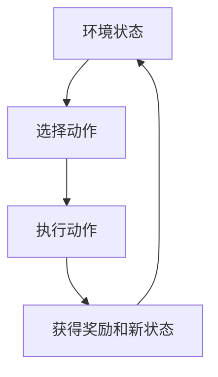
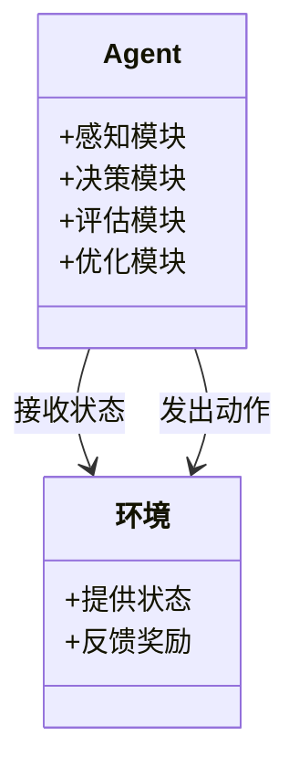

                 


# 构建具有自我评估与优化能力的AI Agent系统

## 关键词：AI Agent，自我评估，优化能力，强化学习，系统架构，项目实战

## 摘要：  
本文深入探讨如何构建一个具有自我评估与优化能力的AI Agent系统。通过分析AI Agent的核心概念、自我评估机制、优化算法、系统架构设计及实际应用案例，本文为读者提供全面的技术指导，帮助他们理解和实现具备自我改进能力的智能系统。

---

## 第一部分：背景介绍

### 第1章：AI Agent系统概述

#### 1.1 AI Agent的基本概念
- **1.1.1 AI Agent的定义与特点**
  AI Agent（人工智能代理）是一种能够感知环境、采取行动以实现目标的智能系统。其特点包括自主性、反应性、目标导向和社会能力。
  
- **1.1.2 自我评估与优化能力的必要性**
  AI Agent需要不断适应动态环境，自我评估和优化是其实现高效决策和长期稳定运行的关键。

- **1.1.3 AI Agent的应用场景与领域**
  包括自动驾驶、智能助手、机器人控制、推荐系统和游戏AI等领域。

---

## 第二部分：核心概念与联系

### 第2章：AI Agent的核心概念与联系

#### 2.1 AI Agent的结构
- 感知模块：接收环境信息。
- 决策模块：基于感知信息做出决策。
- 行动模块：执行决策动作。
- 评估模块：评估决策结果并优化。

#### 2.2 自我评估机制
- **评估指标**：如准确率、响应时间、资源消耗。
- **评估方法**：基于历史数据、实时反馈、对比分析。

#### 2.3 优化算法
- 强化学习：通过奖励机制优化行为策略。
- 梯度下降：用于参数优化。

#### 2.4 核心概念对比分析

| 概念         | 属性             | 示例                         |
|--------------|------------------|------------------------------|
| 感知模块     | 输入数据处理     | 图像识别、自然语言处理       |
| 决策模块     | 行为选择         | Q-learning、随机森林回归       |
| 评估模块     | 性能评价         | 准确率、F1分数、AUC曲线       |
| 优化模块     | 参数调整         | Adam优化器、遗传算法           |

---

## 第三部分：算法原理

### 第3章：算法原理与实现

#### 3.1 强化学习算法
- **Q-learning算法**：通过状态-动作-奖励-状态（SARSA）循环更新Q值。
  $$ Q(s, a) = Q(s, a) + \alpha (r + \gamma \max Q(s', a') - Q(s, a)) $$
- **流程图**：使用mermaid绘制Q-learning流程。



#### 3.2 自适应优化算法
- **自适应调整**：根据实时反馈动态调整参数。
  ```python
  def adaptive_optimization():
      while True:
          state = get_current_state()
          action = policy(state)
          reward = evaluate(state, action)
          update_policy(reward)
  ```

---

## 第四部分：系统分析与架构设计

### 第4章：系统分析与架构设计

#### 4.1 系统功能设计
- 感知模块：处理输入数据。
- 决策模块：生成行动计划。
- 评估模块：评估行动结果。
- 优化模块：调整系统参数。

#### 4.2 系统架构设计



---

## 第五部分：项目实战

### 第5章：项目实战与实现

#### 5.1 项目环境安装
```bash
pip install numpy matplotlib scikit-learn
```

#### 5.2 核心代码实现
```python
import numpy as np

def evaluate(agent_action):
    # 简单的评估函数，返回奖励
    return np.random.normal(0, 1) * agent_action

class AI_Agent:
    def __init__(self, learning_rate=0.1):
        self.learning_rate = learning_rate
        self.Q_table = {}

    def感知(self, state):
        return state

    def 决策(self, state):
        return np.random.choice(['左', '右'])

    def 评估(self, state, action, reward):
        self.Q_table[(state, action)] = reward

    def 优化(self):
        for key in self.Q_table:
            self.Q_table[key] *= self.learning_rate

agent = AI_Agent()
state = '起点'
action = agent.决策(state)
reward = evaluate(action)
agent.评估(state, action, reward)
agent.优化()
```

---

## 第六部分：最佳实践与小结

### 第6章：最佳实践与注意事项

#### 6.1 最佳实践
- 选择合适的算法：根据任务需求选择强化学习或自适应优化。
- 定期评估：定期检查系统性能，及时调整参数。
- 使用工具：利用现有框架（如TensorFlow、PyTorch）加速开发。

#### 6.2 注意事项
- 避免过度优化：防止过拟合和计算资源浪费。
- 监控系统：实时监控系统运行状态，及时发现异常。

#### 6.3 未来拓展
- 结合边缘计算：提升实时性和响应速度。
- 跨领域应用：探索AI Agent在更多领域的应用潜力。

---

## 结语
通过本文的系统介绍和详细讲解，读者可以全面理解并掌握构建具有自我评估与优化能力的AI Agent系统的知识。从理论到实践，逐步实现一个高效的智能系统，为未来的AI发展提供坚实的基础。

