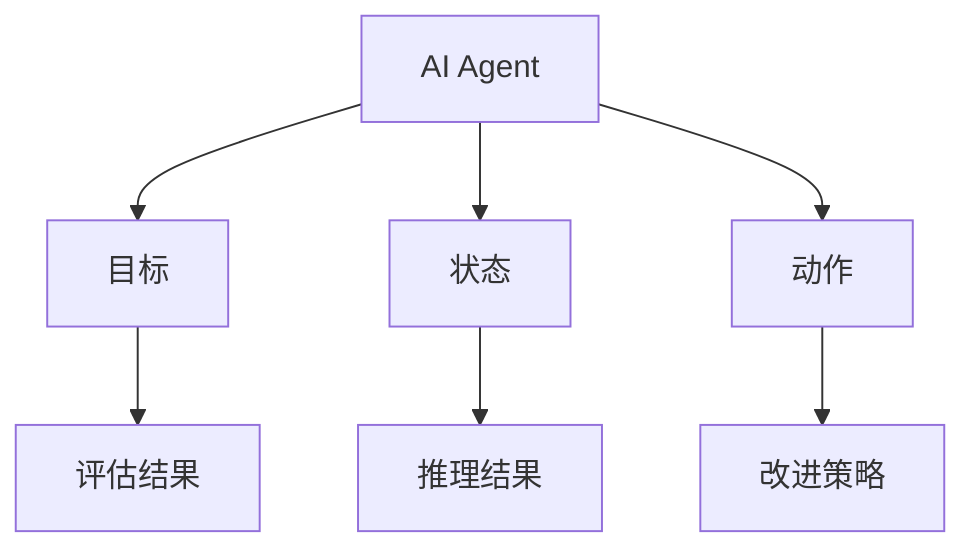
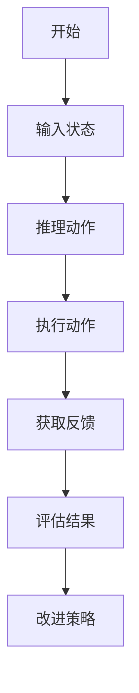
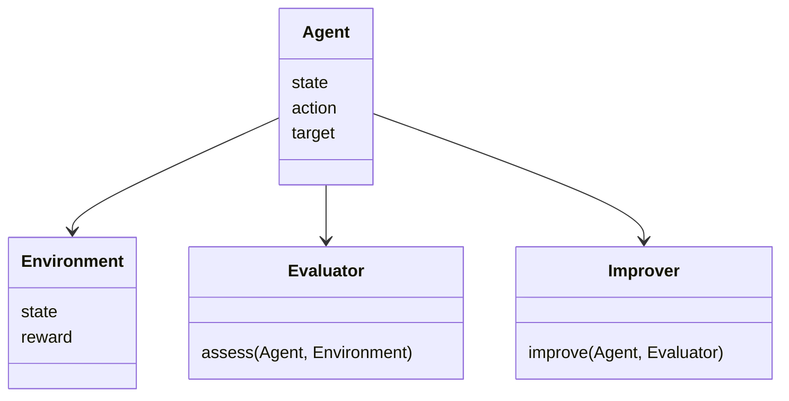
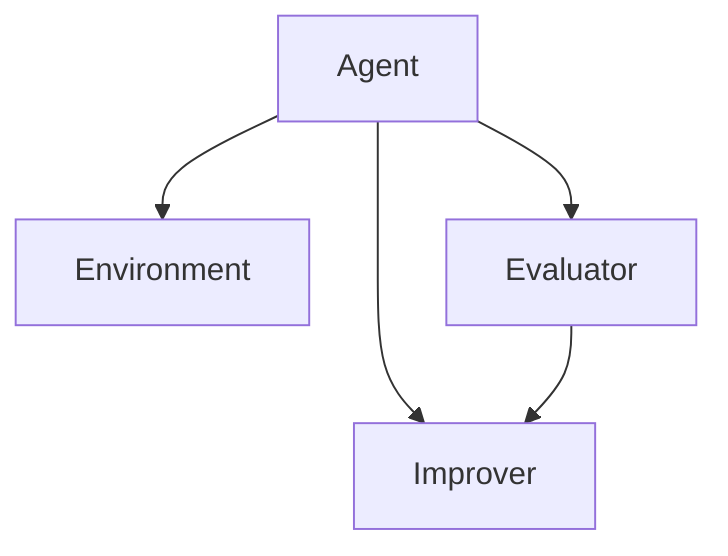
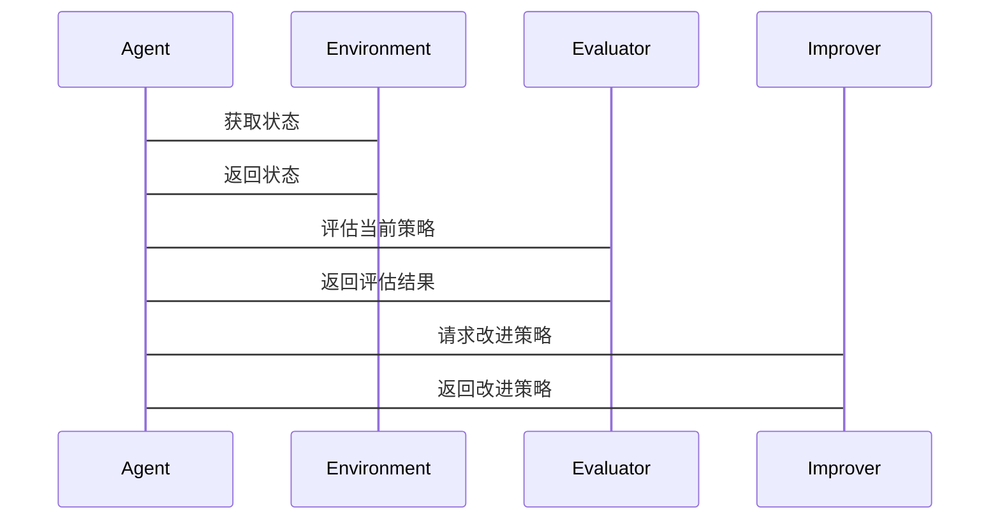

                 


---

# 构建具有自我评估与改进能力的AI Agent

## 关键词：AI Agent，自我评估，改进算法，知识表示，强化学习，系统架构

## 摘要：
本文将详细探讨构建具有自我评估与改进能力的AI Agent的各个方面。从问题背景到核心概念，从算法原理到系统架构，从项目实战到最佳实践，我们将逐步分析如何设计和实现这样一个智能系统。通过详细的理论分析和实际案例，本文旨在为读者提供一个全面的视角，帮助他们理解并掌握构建自我评估与改进AI Agent的核心技术与方法。

---

# 第一部分：构建具有自我评估与改进能力的AI Agent的背景与核心概念

## 第1章：问题背景与描述

### 1.1 问题背景

#### 1.1.1 当前AI Agent的发展现状
人工智能（AI）代理（Agent）近年来取得了显著进展，广泛应用于自动驾驶、智能助手、推荐系统等领域。然而，现有的AI Agent大多依赖于固定的规则或预训练模型，缺乏自我评估和持续改进的能力，难以在动态变化的环境中自适应优化。

#### 1.1.2 自我评估与改进能力的必要性
在复杂的实际应用场景中，AI Agent需要能够根据环境反馈和自身表现，动态调整策略和行为。自我评估与改进能力是实现这一目标的关键，能够使AI Agent在面对新问题和挑战时，不断提升性能和适应性。

#### 1.1.3 问题的边界与外延
自我评估与改进能力的AI Agent并不等同于一般的自适应系统。它需要具备明确的目标、状态和动作空间，并能够通过反馈机制进行持续优化。其边界包括：明确的目标函数、可量化的评估指标、动态调整的策略空间。

### 1.2 问题描述

#### 1.2.1 AI Agent的基本功能与目标
AI Agent的基本功能包括感知环境、执行动作、推理与决策。其目标是在给定的约束条件下，最大化目标函数的值。

#### 1.2.2 自我评估与改进的核心问题
自我评估涉及对当前策略和行为的优劣判断，而自我改进则需要根据评估结果调整策略和行为。核心问题在于如何设计有效的评估机制和改进算法。

#### 1.2.3 相关概念的对比与区分
本文将从目标、方法、实现方式等方面，对比自我评估与改进AI Agent与其他AI系统（如强化学习、自适应系统）的区别。

## 第2章：核心概念与联系

### 2.1 核心概念原理

#### 2.1.1 自我评估机制的原理
自我评估机制通过比较当前策略的实际表现与预期目标，生成评估结果。评估结果用于指导改进算法。

#### 2.1.2 自我改进算法的原理
改进算法根据评估结果，调整策略参数或行为模式。改进过程可能涉及强化学习、遗传算法等方法。

#### 2.1.3 知识表示与推理机制
知识表示用于将环境状态、动作及其结果编码为可处理的形式。推理机制基于知识表示进行逻辑推理，生成候选动作。

### 2.2 概念属性特征对比

#### 2.2.1 核心概念的属性对比表
下表展示了自我评估与改进AI Agent与其他AI系统的核心区别：

| 比较维度 | 自我评估与改进AI Agent | 传统强化学习 | 自适应系统 |
|----------|------------------------|--------------|------------|
| 目标     | 最大化目标函数         | 最大化奖励    | 适应环境    |
| 策略     | 动态调整策略           | 固定策略      | 稍作调整    |
| 反馈     | 明确的评估结果          | 奖励信号      | 环境反馈    |

#### 2.2.2 概念之间的关系分析
自我评估与改进AI Agent结合了强化学习的评估机制和自适应系统的改进策略，是一种更加综合的AI系统设计方法。

#### 2.2.3 ER实体关系图


---

# 第二部分：自我评估与改进算法原理

## 第3章：算法原理与实现

### 3.1 算法原理

#### 3.1.1 基于强化学习的自我评估
强化学习通过奖励机制评估当前策略的表现。AI Agent根据奖励信号，判断当前策略是否需要改进。

#### 3.1.2 基于反馈的自我改进
改进算法根据评估结果，动态调整策略参数。可能采用的方法包括Q-learning、深度强化学习等。

#### 3.1.3 知识表示与推理的算法选择
知识表示可以选择一阶逻辑或概率图模型。推理算法可以是基于规则的逻辑推理或基于概率的贝叶斯推理。

### 3.2 算法流程图

#### 3.2.1 强化学习算法流程图


#### 3.2.2 改进算法示例代码
以下是基于Q-learning的改进算法示例：

```python
import numpy as np

class QLearning:
    def __init__(self, state_space, action_space, learning_rate=0.1, gamma=0.9):
        self.q_table = np.zeros((state_space, action_space))
        self.lr = learning_rate
        self.gamma = gamma

    def choose_action(self, state, epsilon=0.1):
        if np.random.random() < epsilon:
            return np.random.randint(0, action_space)
        return np.argmax(self.q_table[state])

    def update(self, state, action, reward, next_state):
        target = reward + self.gamma * np.max(self.q_table[next_state])
        self.q_table[state][action] = self.q_table[state][action] + self.lr * (target - self.q_table[state][action])
```

### 3.3 数学模型与公式

#### 3.3.1 强化学习的基本公式
在强化学习中，Q-learning的目标是更新Q值：

$$ Q(s, a) = Q(s, a) + \alpha (r + \gamma \max Q(s', a') - Q(s, a)) $$

其中：
- \( s \) 是当前状态
- \( a \) 是当前动作
- \( r \) 是奖励
- \( s' \) 是下一个状态
- \( \alpha \) 是学习率
- \( \gamma \) 是折扣因子

#### 3.3.2 改进算法的数学模型
改进算法可以通过梯度下降优化策略参数 \( \theta \)：

$$ \theta = \theta + \eta (\nabla J) $$

其中：
- \( \theta \) 是策略参数
- \( \eta \) 是步长
- \( J \) 是目标函数

---

# 第三部分：系统分析与架构设计

## 第4章：系统分析与架构设计

### 4.1 问题场景介绍

#### 4.1.1 系统目标
构建一个能够自我评估和改进的AI Agent，应用于智能客服、自动驾驶等领域。

#### 4.1.2 系统功能需求
- 环境感知
- 状态表示
- 动作选择
- 评估与改进

### 4.2 系统功能设计

#### 4.2.1 领域模型类图


#### 4.2.2 系统架构图


### 4.3 接口设计与交互流程图

#### 4.3.1 系统接口设计
- Agent接口：提供状态、动作、目标的输入输出接口
- Environment接口：提供环境状态和奖励的输入接口
- Evaluator接口：提供评估结果的输出接口
- Improver接口：提供改进策略的输出接口

#### 4.3.2 交互流程图


---

# 第四部分：项目实战

## 第5章：项目实战

### 5.1 环境安装与配置

#### 5.1.1 安装Python环境
安装Python 3.8及以上版本，推荐使用Anaconda或虚拟环境。

#### 5.1.2 安装依赖库
安装numpy、keras、tensorflow等深度学习库。

### 5.2 核心功能实现

#### 5.2.1 知识表示实现
使用一阶逻辑表示状态和动作。

#### 5.2.2 推理与决策实现
基于知识表示进行逻辑推理，选择最优动作。

#### 5.2.3 评估与改进实现
根据评估结果动态调整策略参数。

### 5.3 代码实现与解读

#### 5.3.1 知识表示代码
```python
from logic import *

class KnowledgeBase:
    def __init__(self):
        self.knowledge = {}

    def add_rule(self, rule):
        self.knowledge[rule.head] = rule.body

    def infer(self, state):
        return infer_from(state, self.knowledge)
```

#### 5.3.2 推理与决策代码
```python
from inference import *

class Reasoner:
    def __init__(self, knowledge_base):
        self.kb = knowledge_base

    def decide_action(self, state):
        possible_actions = get_possible_actions(state, self.kb)
        return select_best_action(possible_actions)
```

### 5.4 案例分析与应用

#### 5.4.1 实际案例分析
以智能客服为例，展示如何实现自我评估与改进。

#### 5.4.2 系统性能分析
分析系统的评估和改进效果，优化算法参数。

## 第5.5 项目小结

总结项目实现的关键点，讨论遇到的问题及解决方案，展望未来改进方向。

---

# 第五部分：最佳实践与拓展

## 第6章：最佳实践

### 6.1 小结与总结

回顾全文，总结构建自我评估与改进AI Agent的核心要点。

### 6.2 注意事项

- 确保评估机制的准确性和实时性
- 合理选择改进算法和参数
- 定期监控和维护系统

### 6.3 拓展阅读

推荐相关领域的优秀书籍和论文，鼓励读者深入研究。

---

# 附录：参考文献与工具

- 参考文献：列出本文引用的主要文献和资料
- 工具清单：推荐使用的开发工具和框架

---

通过以上目录结构，我们可以系统地构建一个具有自我评估与改进能力的AI Agent。从理论到实践，从设计到实现，本文为读者提供了全面的指导和参考。希望读者能够通过本文，深入理解并掌握这一前沿技术的核心方法与实践技巧。

