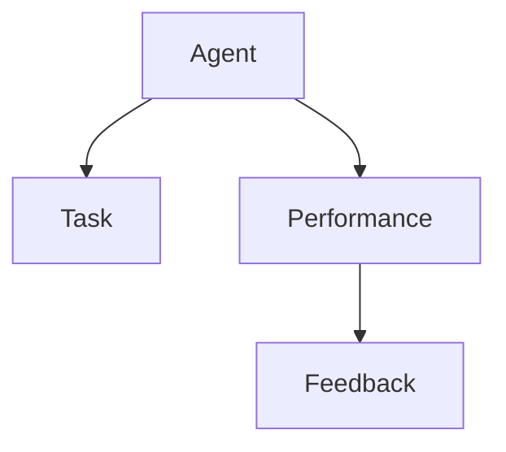
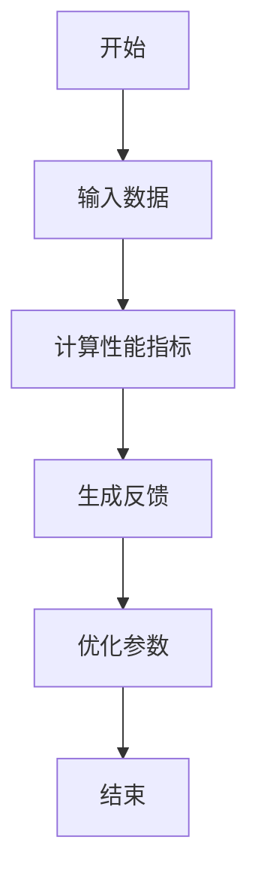
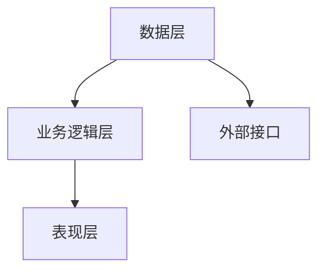
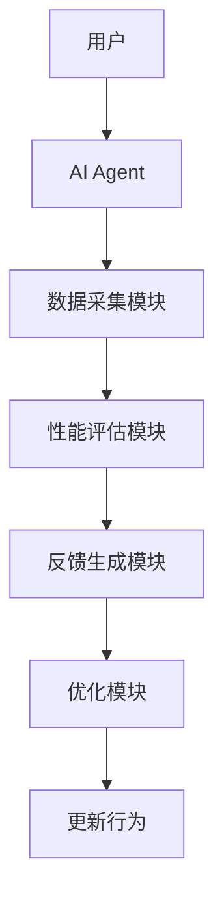

                 


# 构建具有自我评估能力的AI Agent

> 关键词：AI Agent, 自我评估, 机器学习, 系统架构, 项目实战

> 摘要：本文详细探讨了构建具有自我评估能力的AI Agent的关键技术，包括核心概念、算法原理、系统架构设计和项目实战。通过分析问题背景、算法实现和系统架构，为读者提供从理论到实践的全面指导，帮助他们掌握构建高效AI Agent的方法。

---

# 第一部分: 背景与概述

## 第1章: 自我评估AI Agent的背景与问题描述

### 1.1 AI Agent的基本概念

#### 1.1.1 AI Agent的定义
AI Agent（人工智能代理）是指能够感知环境、自主决策并执行任务的智能实体。它可以是一个软件程序或物理设备，通过传感器获取信息，利用算法处理数据，并通过执行器与环境交互。

#### 1.1.2 自我评估能力的必要性
自我评估能力是AI Agent的核心能力之一，它允许Agent在运行过程中监控和评估自己的表现，及时发现问题并进行优化。这种能力在复杂和动态的环境中尤为重要，能够提高系统的稳定性和效率。

#### 1.1.3 当前AI Agent的应用场景
AI Agent广泛应用于多个领域，如智能助手（如Siri、Alexa）、自动驾驶、智能客服、机器人控制等。在这些场景中，AI Agent需要实时处理信息，做出决策，并根据反馈调整行为。

### 1.2 自我评估AI Agent的背景

#### 1.2.1 AI Agent的发展历程
AI Agent的概念可以追溯到20世纪60年代，但随着计算能力和数据处理技术的进步，AI Agent在近年来取得了显著的发展。早期的AI Agent主要依赖规则系统，而现在更多地采用机器学习和深度学习技术。

#### 1.2.2 自我评估能力的起源
自我评估能力的起源可以追溯到自适应控制系统和自监督学习。近年来，随着深度学习和强化学习的发展，AI Agent的自我评估能力得到了显著提升。

#### 1.2.3 当前技术挑战与机遇
当前，构建具有自我评估能力的AI Agent面临诸多挑战，如如何准确评估性能、如何处理动态环境中的不确定性等。同时，随着技术的进步，也带来了新的机遇，如通过元学习和自适应算法实现更高效的自我优化。

### 1.3 问题描述与目标

#### 1.3.1 问题背景分析
在复杂的环境中，AI Agent需要处理的任务往往具有动态性和不确定性。传统的AI系统依赖于固定的规则和预定义的策略，难以应对环境的变化。因此，构建具有自我评估能力的AI Agent，能够根据环境反馈动态调整行为，成为当前研究的热点。

#### 1.3.2 自我评估能力的核心问题
- 如何设计有效的评估指标，准确反映AI Agent的性能。
- 如何利用评估结果优化AI Agent的行为，使其在动态环境中保持高效。

#### 1.3.3 目标与边界
本文的目标是探讨如何构建具有自我评估能力的AI Agent，重点分析其核心算法、系统架构和实现方法。本文的边界包括：仅关注AI Agent的自我评估能力，不涉及其与其他系统（如推荐系统）的集成。

## 1.4 本章小结
本章从背景和问题描述的角度，阐述了AI Agent的基本概念和自我评估能力的重要性。通过分析当前的应用场景、技术挑战和机遇，明确了本文的研究目标和边界。

---

# 第二部分: 核心概念与联系

## 第2章: 自我评估AI Agent的核心概念与联系

### 2.1 核心概念原理

#### 2.1.1 自我评估的定义
自我评估是指AI Agent通过某种机制，分析自身的表现，并根据分析结果调整行为的过程。这种机制通常包括数据采集、分析、评估和优化四个步骤。

#### 2.1.2 自我评估的实现机制
实现自我评估通常需要以下步骤：
1. **数据采集**：获取与任务相关的各种指标，如响应时间、准确率等。
2. **分析与建模**：利用统计或机器学习方法，分析数据并建立评估模型。
3. **评估与反馈**：根据模型输出评估结果，并生成反馈信号。
4. **优化与调整**：根据反馈信号，调整AI Agent的行为参数或策略。

#### 2.1.3 核心概念的属性特征对比
下表展示了传统AI Agent和具有自我评估能力的AI Agent在核心概念上的属性特征对比：

| 属性        | 传统AI Agent | 自我评估AI Agent |
|-------------|--------------|------------------|
| 行为调整     | 预定义规则    | 动态优化         |
| 性能评估     | 无或依赖外部系统 | 内置评估机制    |
| 适应能力     | 有限          | 较高             |

### 2.2 实体关系图

#### 2.2.1 ER实体关系图
通过ER图，我们可以清晰地看到AI Agent、任务、性能和反馈之间的关系。如下图所示：



- **Agent**：AI Agent实体。
- **Task**：任务实体，表示AI Agent需要完成的任务。
- **Performance**：性能指标实体，表示AI Agent在完成任务中的表现。
- **Feedback**：反馈实体，表示根据性能指标生成的反馈信号。

### 2.3 核心概念的联系

#### 2.3.1 Agent与任务的关系
AI Agent通过执行任务来展示其能力。任务可以是具体的（如识别图像）或抽象的（如优化资源分配）。自我评估能力使得AI Agent能够根据任务的性质调整其行为策略。

#### 2.3.2 性能与反馈的关系
性能指标是评估AI Agent表现的基础，而反馈是基于这些指标生成的信号，指导AI Agent进行行为优化。这种反馈机制形成了一个闭环，使得AI Agent能够持续改进。

#### 2.3.3 自我评估与优化的关系
自我评估是优化的基础，通过分析性能指标，AI Agent能够发现其不足之处，并通过调整参数或策略来实现优化。

## 2.4 本章小结
本章从核心概念的角度，分析了自我评估AI Agent的定义、实现机制及其与传统AI Agent的区别。通过ER图展示了各实体之间的关系，并阐述了自我评估能力如何帮助AI Agent实现优化。

---

# 第三部分: 算法原理

## 第3章: 自我评估AI Agent的算法原理

### 3.1 算法原理概述

#### 3.1.1 自我评估的基本流程
自我评估的过程可以分为以下几个步骤：
1. **数据采集**：获取与任务相关的数据。
2. **特征提取**：从数据中提取有用的特征。
3. **模型训练**：训练评估模型。
4. **性能评估**：利用模型生成评估结果。
5. **反馈生成**：根据评估结果生成反馈信号。
6. **优化与调整**：利用反馈信号优化AI Agent的行为。

#### 3.1.2 算法的输入与输出
- **输入**：任务数据、历史表现数据。
- **输出**：评估结果、优化策略。

#### 3.1.3 算法的数学模型
常用的数学模型包括回归分析、分类模型和强化学习模型。例如，使用回归模型预测性能指标：

$$
y = \beta_0 + \beta_1x_1 + \beta_2x_2 + \dots + \beta_nx_n
$$

其中，$y$ 是预测的性能指标，$x_i$ 是输入特征，$\beta_i$ 是回归系数。

### 3.2 算法流程图



### 3.3 算法实现

#### 3.3.1 Python源代码实现
以下是一个简单的自我评估AI Agent的实现示例：

```python
def calculate_performance(input_data):
    # 假设input_data是输入数据
    # 这里进行特征提取和模型训练
    features = extract_features(input_data)
    model = train_model(features)
    performance = model.predict(features)
    return performance

def generate_feedback(performance):
    # 根据性能生成反馈
    threshold = 0.8
    if performance > threshold:
        feedback = "优秀"
    elif performance > threshold - 0.2:
        feedback = "良好"
    else:
        feedback = "需要改进"
    return feedback

def optimize_behavior(feedback):
    # 根据反馈调整行为
    if feedback == "优秀":
        # 保持当前行为
        pass
    elif feedback == "良好":
        # 调整参数
        adjust_parameters()
    else:
        # 重新训练模型
        retrain_model()

# 主函数
def self_assessment_agent(input_data):
    performance = calculate_performance(input_data)
    feedback = generate_feedback(performance)
    optimize_behavior(feedback)
    return feedback
```

#### 3.3.2 算法实现的细节
在实际实现中，需要考虑以下细节：
- **特征提取**：选择与任务相关的特征，避免维度灾难。
- **模型训练**：选择合适的机器学习模型，如随机森林、神经网络等。
- **反馈生成**：设计合理的反馈机制，确保反馈能够有效指导优化。

### 3.4 本章小结
本章详细分析了自我评估AI Agent的算法原理，从基本流程到数学模型，再到具体的实现代码，为后续的系统设计和项目实战奠定了基础。

---

# 第四部分: 系统架构设计

## 第4章: 自我评估AI Agent的系统架构设计

### 4.1 系统架构概述

#### 4.1.1 系统应用场景
以智能客服为例，AI Agent需要处理大量的客户咨询，实时调整其回答策略。通过自我评估，AI Agent可以提高回答的准确性和客户满意度。

#### 4.1.2 系统功能设计
- **数据采集模块**：收集客户咨询和历史数据。
- **性能评估模块**：分析回答的准确率和客户满意度。
- **反馈生成模块**：根据评估结果生成反馈信号。
- **优化模块**：调整回答策略和训练模型。

#### 4.1.3 系统架构设计
系统架构采用分层设计，包括数据层、业务逻辑层和表现层。各层之间的交互通过接口进行。

#### 4.1.4 系统架构图


### 4.2 系统功能设计

#### 4.2.1 数据采集模块
- **功能**：收集与任务相关的数据。
- **实现**：通过API接口获取实时数据。

#### 4.2.2 性能评估模块
- **功能**：分析数据并生成评估结果。
- **实现**：使用回归模型预测性能指标。

#### 4.2.3 反馈生成模块
- **功能**：根据评估结果生成反馈信号。
- **实现**：基于预设阈值生成反馈。

#### 4.2.4 优化模块
- **功能**：根据反馈信号优化系统行为。
- **实现**：调整模型参数或重新训练模型。

### 4.3 系统交互设计

#### 4.3.1 系统交互流程


### 4.4 本章小结
本章从系统架构的角度，分析了自我评估AI Agent的各个模块及其交互关系，为后续的项目实战提供了理论基础。

---

# 第五部分: 项目实战

## 第5章: 自我评估AI Agent的项目实战

### 5.1 项目介绍

#### 5.1.1 项目背景
本文将通过构建一个简单的智能客服系统，展示如何实现具有自我评估能力的AI Agent。

#### 5.1.2 项目目标
- 实现一个能够自我评估的智能客服系统。
- 验证自我评估算法的有效性。

### 5.2 环境安装

#### 5.2.1 安装Python和必要的库
- Python 3.8+
- NumPy、Pandas、Scikit-learn、Flask

```bash
pip install numpy pandas scikit-learn flask
```

### 5.3 核心代码实现

#### 5.3.1 性能评估函数
```python
def calculate_performance(input_data):
    # 假设input_data是客户咨询的问题
    # 这里进行特征提取和模型训练
    features = extract_features(input_data)
    model = train_model(features)
    performance = model.predict(features)
    return performance
```

#### 5.3.2 反馈生成函数
```python
def generate_feedback(performance):
    # 根据性能生成反馈
    threshold = 0.8
    if performance > threshold:
        feedback = "优秀"
    elif performance > threshold - 0.2:
        feedback = "良好"
    else:
        feedback = "需要改进"
    return feedback
```

#### 5.3.3 优化函数
```python
def optimize_behavior(feedback):
    # 根据反馈调整行为
    if feedback == "优秀":
        # 保持当前行为
        pass
    elif feedback == "良好":
        # 调整参数
        adjust_parameters()
    else:
        # 重新训练模型
        retrain_model()
```

### 5.4 代码应用与分析

#### 5.4.1 代码实现细节
- **特征提取**：从客户咨询中提取关键词和语义信息。
- **模型训练**：使用机器学习模型训练性能评估模型。

#### 5.4.2 案例分析
假设我们有一个客户咨询的数据集，包括客户的问题和正确回答。通过训练模型，我们可以预测AI Agent的回答准确率，并根据反馈进行优化。

### 5.5 项目总结

#### 5.5.1 项目经验总结
- 自我评估能力的实现需要精确的评估指标和有效的反馈机制。
- 系统的优化需要根据反馈结果动态调整。

#### 5.5.2 注意事项
- 确保数据质量和多样性，避免模型过拟合。
- 定期更新模型，以应对环境的变化。

## 5.6 本章小结
本章通过一个实际的项目案例，展示了如何实现具有自我评估能力的AI Agent。从环境安装到代码实现，再到案例分析，为读者提供了从理论到实践的指导。

---

# 第六部分: 总结与展望

## 第6章: 总结与展望

### 6.1 总结

#### 6.1.1 核心内容回顾
本文详细探讨了构建具有自我评估能力的AI Agent的关键技术，包括核心概念、算法原理、系统架构设计和项目实战。

#### 6.1.2 本文的主要贡献
- 提供了自我评估AI Agent的系统性分析。
- 展示了实现自我评估能力的具体方法。

### 6.2 未来展望

#### 6.2.1 技术发展趋势
- 更加智能化的评估指标。
- 更加高效的优化算法。

#### 6.2.2 研究方向
- 多模态评估：结合文本、语音等多种数据源进行评估。
- 自适应优化：根据环境动态自适应调整行为。

#### 6.2.3 注意事项
- 注重数据隐私和安全。
- 避免过度优化导致的系统不稳定。

### 6.3 本章小结
本文总结了核心内容，并展望了未来的发展方向，为读者提供了进一步研究的思路。

---

# 第七部分: 附录

## 附录A: 代码实现

### 附录A.1 性能评估函数
```python
def calculate_performance(input_data):
    # 假设input_data是输入数据
    features = extract_features(input_data)
    model = train_model(features)
    performance = model.predict(features)
    return performance
```

### 附录A.2 反馈生成函数
```python
def generate_feedback(performance):
    threshold = 0.8
    if performance > threshold:
        feedback = "优秀"
    elif performance > threshold - 0.2:
        feedback = "良好"
    else:
        feedback = "需要改进"
    return feedback
```

### 附录A.3 优化函数
```python
def optimize_behavior(feedback):
    if feedback == "优秀":
        pass
    elif feedback == "良好":
        adjust_parameters()
    else:
        retrain_model()
```

---

# 结语

本文通过系统性地分析和详细阐述，为读者提供了构建具有自我评估能力的AI Agent的完整指南。从理论到实践，从核心概念到项目实现，本文为研究人员和开发者提供了宝贵的参考。希望本文能够激发更多的研究和实践，推动AI Agent技术的发展。

--- 

**关键词**：AI Agent, 自我评估, 机器学习, 系统架构, 项目实战

