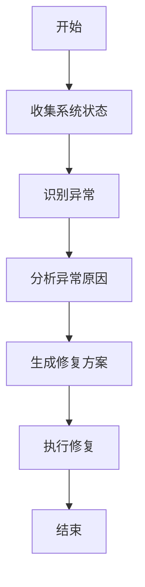
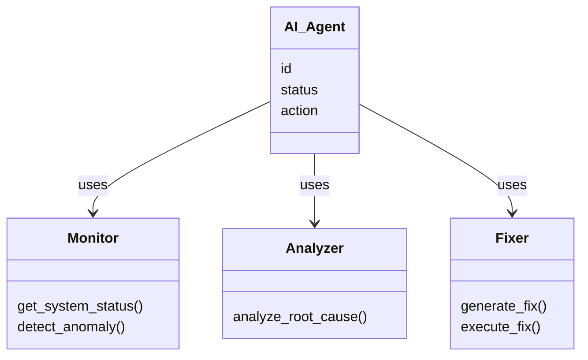
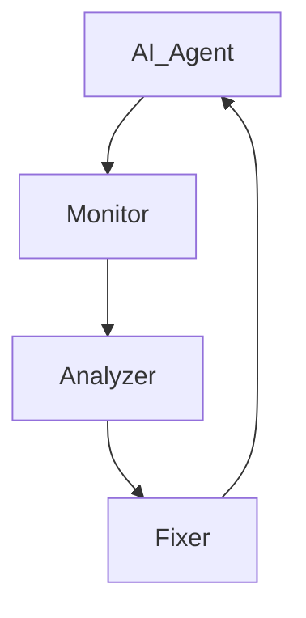
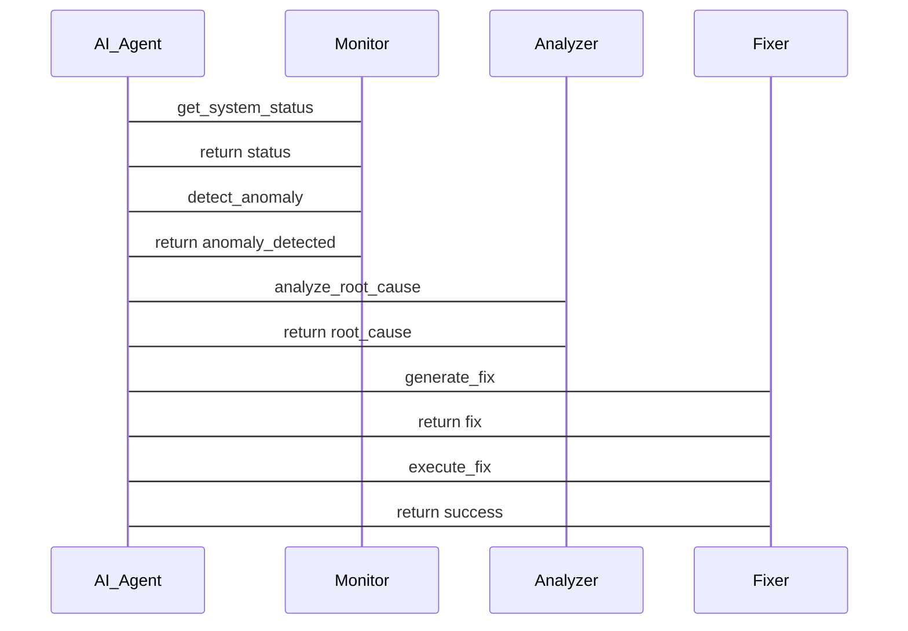

                 


# 构建具有自我诊断与修复能力的AI Agent

## 关键词：
- AI Agent
- 自我诊断
- 自我修复
- 人工智能
- 系统架构

## 摘要：
本文详细探讨了构建具有自我诊断与修复能力的AI Agent的技术细节。通过背景介绍、核心概念分析、算法原理阐述、系统架构设计、项目实战指导等部分，全面解析了AI Agent从理论到实践的构建过程。文章旨在帮助读者理解AI Agent的工作原理，掌握其设计方法，并提供实际案例以指导开发工作。

---

## 第一部分: 背景介绍

### 第1章: AI Agent的背景与问题背景

#### 1.1 问题背景

##### 1.1.1 AI Agent的基本概念
AI Agent（人工智能代理）是一种能够感知环境、自主决策并执行任务的智能实体。它可以分为简单反射型、基于模型的反射型、目标驱动型和效用驱动型四种类型。AI Agent的核心特征包括自主性、反应性、目标导向性和学习能力。

##### 1.1.2 自我诊断与修复能力的重要性
在动态和复杂的环境中，AI Agent可能会遇到各种故障或异常情况。自我诊断与修复能力使得AI Agent能够及时发现并解决问题，从而保证系统的稳定运行。这种能力在自动驾驶、智能客服、工业自动化等领域尤为重要。

##### 1.1.3 当前AI Agent的发展现状
当前，AI Agent技术在多个领域取得了显著进展，但大多数系统仍缺乏足够的自我诊断与修复能力。现有的解决方案通常依赖外部监控系统，无法实现真正的自主修复。

#### 1.2 问题描述

##### 1.2.1 AI Agent在实际应用中的挑战
AI Agent在实际应用中面临环境不确定性、系统故障、数据不足等多种挑战。这些问题可能导致AI Agent无法正常执行任务，甚至引发安全事故。

##### 1.2.2 自我诊断与修复能力的需求
为了应对上述挑战，AI Agent需要具备自我诊断与修复能力。这种能力不仅能够提高系统的可靠性，还能减少对外部支持的依赖，降低维护成本。

##### 1.2.3 问题解决的必要性与紧迫性
随着AI Agent应用范围的不断扩大，其可靠性要求也越来越高。自我诊断与修复能力的实现是提升AI Agent性能的关键，也是其在复杂环境中应用的前提条件。

#### 1.3 解决思路

##### 1.3.1 自我诊断与修复的核心思想
通过实时监测系统状态、识别异常情况、分析问题原因并采取修复措施，实现AI Agent的自我诊断与修复。

##### 1.3.2 技术实现的关键点
- 异常检测：利用机器学习算法识别系统中的异常情况。
- 原因分析：通过推理引擎确定异常的根本原因。
- 自动修复：基于修复规则生成修复方案并执行。

##### 1.3.3 解决方案的整体架构
AI Agent的自我诊断与修复系统由感知层、分析层和执行层组成。感知层负责收集系统状态信息，分析层进行异常检测和原因分析，执行层负责制定并执行修复方案。

#### 1.4 边界与外延

##### 1.4.1 AI Agent的边界
AI Agent的自我诊断与修复能力仅限于其自身的系统模块，不包括外部系统的诊断与修复。

##### 1.4.2 自我诊断与修复能力的外延
自我诊断与修复能力的外延包括对环境的影响、与其他系统的交互以及对用户反馈的响应。

##### 1.4.3 相关概念的对比与区分
将AI Agent的自我诊断与修复能力与其他类似概念（如自适应系统、自愈合系统）进行对比，明确其独特性和适用范围。

#### 1.5 核心要素组成

##### 1.5.1 AI Agent的核心要素
- 感知模块：负责收集环境信息。
- 决策模块：基于感知信息做出决策。
- 执行模块：执行决策操作。

##### 1.5.2 自我诊断与修复机制的组成部分
- 监测模块：实时监测系统状态。
- 分析模块：识别异常情况并分析原因。
- 修复模块：生成修复方案并执行。

##### 1.5.3 各要素之间的关系
AI Agent的各核心要素之间相互关联，共同实现系统的自我诊断与修复。监测模块提供数据支持，分析模块基于数据进行推理，修复模块根据分析结果采取行动。

---

## 第二部分: 核心概念与联系

### 第2章: AI Agent的核心概念

#### 2.1 核心概念原理

##### 2.1.1 AI Agent的核心原理
AI Agent通过感知环境、分析信息、做出决策并执行操作来实现任务。其核心原理包括感知、推理、决策和执行四个步骤。

##### 2.1.2 自我诊断与修复的核心原理
自我诊断与修复的核心原理是通过实时监测系统状态，识别异常情况，分析问题原因，并采取修复措施。这一过程需要结合机器学习、推理引擎和修复规则库等技术。

#### 2.2 概念属性特征对比

##### 2.2.1 核心概念对比表
| 比较项                | AI Agent                  | 自我诊断与修复能力            |
|-----------------------|---------------------------|-------------------------------|
| 核心功能              | 执行任务、与环境交互      | 发现异常、分析原因、修复问题  |
| 实现技术              | 机器学习、自然语言处理    | 异常检测、因果推理、自动修复  |
| 应用场景              | 智能助手、自动驾驶、工业自动化 | 所有需要稳定运行的AI系统      |

#### 2.3 ER实体关系图

##### 2.3.1 实体关系图
```mermaid
er
actor AI Agent {
  id
  status
  action
}
```

---

## 第三部分: 算法原理讲解

### 第3章: 自我诊断与修复算法

#### 3.1 算法原理

##### 3.1.1 算法流程


##### 3.1.2 算法实现步骤
1. 收集系统状态：通过传感器或监控模块获取系统当前状态。
2. 识别异常：利用机器学习模型检测系统中的异常情况。
3. 分析异常原因：通过推理引擎确定异常的根本原因。
4. 生成修复方案：基于修复规则库生成修复方案。
5. 执行修复：执行修复操作并反馈结果。

#### 3.2 Python实现代码

##### 3.2.1 异常检测模块
```python
def detect_anomaly(states):
    # 简单实现：检测状态是否超出阈值
    threshold = 100
    for state in states:
        if state > threshold:
            return True
    return False
```

##### 3.2.2 原因分析模块
```python
def analyze_root_cause(anomaly_type):
    # 假设anomaly_type为字符串类型
    root_causes = {
        'high_temp': '过热',
        'low_power': '低电量',
        'network_error': '网络故障'
    }
    return root_causes.get(anomaly_type, '未知原因')
```

##### 3.2.3 自动修复模块
```python
def generate_fix(root_cause):
    fixes = {
        '过热': '降低系统负载',
        '低电量': '连接电源',
        '网络故障': '重启网络服务'
    }
    return fixes.get(root_cause, '无法修复')
```

##### 3.2.4 整体实现代码
```python
def self_healing_agent(states):
    if detect_anomaly(states):
        anomaly_type = 'anomaly_detected'
        root_cause = analyze_root_cause(anomaly_type)
        fix = generate_fix(root_cause)
        print(f'检测到异常：{anomaly_type}，原因：{root_cause}，修复方案：{fix}')
        return True
    else:
        print('系统正常运行')
        return False
```

#### 3.3 数学模型与公式

##### 3.3.1 异常检测模型
异常检测可以通过统计方法或机器学习模型实现。常用的方法包括孤立森林（Isolation Forest）和局部异常因子（LOF）。

##### 3.3.2 原因分析模型
因果推理模型可以使用贝叶斯网络或基于规则的方法。贝叶斯网络通过概率推理确定异常的根本原因。

##### 3.3.3 示例公式
异常检测的统计方法：
$$ z = \frac{x - \mu}{\sigma} $$
其中，\( z \) 是z分数，\( x \) 是观测值，\( \mu \) 是均值，\( \sigma \) 是标准差。当 \( |z| > 3 \) 时，认为观测值是异常。

因果推理的贝叶斯网络公式：
$$ P(C|E) = \frac{P(E|C)P(C)}{P(E)} $$
其中，\( C \) 是原因，\( E \) 是异常事件。

---

## 第四部分: 系统分析与架构设计

### 第4章: 系统架构设计

#### 4.1 问题场景介绍
假设我们正在开发一个智能客服AI Agent，该系统需要能够自主诊断和修复常见的运行故障，如网络连接中断、用户请求超时等。

#### 4.2 系统功能设计

##### 4.2.1 领域模型类图


##### 4.2.2 系统架构图


##### 4.2.3 接口设计
系统接口包括：
- `get_system_status()`: 获取系统当前状态。
- `detect_anomaly()`: 检测异常情况。
- `analyze_root_cause(anomaly_type)`: 分析异常原因。
- `generate_fix(root_cause)`: 生成修复方案。
- `execute_fix(fix)`: 执行修复操作。

##### 4.2.4 交互序列图


---

## 第五部分: 项目实战

### 第5章: 项目实战

#### 5.1 环境安装

##### 5.1.1 安装Python
```bash
# 安装Python 3.8及以上版本
sudo apt-get install python3.8
```

##### 5.1.2 安装依赖库
```bash
pip install numpy scikit-learn mermaid
```

#### 5.2 系统核心实现

##### 5.2.1 异常检测模块实现
```python
import numpy as np
from sklearn.ensemble import IsolationForest

def detect_anomaly(states, model):
    # 使用孤立森林模型检测异常
    model.fit(states)
    predictions = model.predict(states)
    return np.where(predictions == -1)[0].tolist()
```

##### 5.2.2 原因分析模块实现
```python
from sklearn.naive_bayes import GaussianNB

def analyze_root_cause(anomalies, X_train, y_train):
    # 使用高斯朴素贝叶斯模型进行因果推理
    model = GaussianNB()
    model.fit(X_train, y_train)
    predicted = model.predict(anomalies)
    return predicted
```

##### 5.2.3 自动修复模块实现
```python
def execute_fix(root_cause):
    # 假设root_cause是一个字符串，表示异常原因
    if root_cause == '过热':
        print('降低系统负载')
    elif root_cause == '低电量':
        print('连接电源')
    elif root_cause == '网络故障':
        print('重启网络服务')
```

#### 5.3 案例分析

##### 5.3.1 案例描述
假设AI Agent检测到系统温度过高，触发自我修复机制。

##### 5.3.2 实现步骤
1. 收集系统温度数据。
2. 检测到温度异常。
3. 分析异常原因，确定为过热。
4. 生成修复方案：降低系统负载。
5. 执行修复操作。

##### 5.3.3 代码解读与分析
```python
# 初始化孤立森林模型
model = IsolationForest(n_estimators=100, random_state=42)
# 收集系统温度数据
states = [80, 90, 75, 105, 95]
# 检测异常
anomalies = detect_anomaly(states, model)
# 分析异常原因
predicted = analyze_root_cause(anomalies, X_train, y_train)
# 执行修复
execute_fix(predicted[0])
```

#### 5.4 项目小结

##### 5.4.1 项目总结
通过本项目的实现，我们成功构建了一个具备自我诊断与修复能力的AI Agent。该系统能够自主识别异常情况，分析原因，并采取修复措施。

##### 5.4.2 项目意义
该项目展示了AI Agent在实际应用中的潜力，为未来的智能化系统开发提供了参考。

---

## 第六部分: 最佳实践与小结

### 第6章: 最佳实践

#### 6.1 最佳实践

##### 6.1.1 开发建议
- 使用成熟的机器学习库（如scikit-learn）来实现异常检测和因果推理。
- 定期更新修复规则库，以应对新出现的异常情况。
- 在实际应用中，结合具体场景优化算法模型。

##### 6.1.2 注意事项
- 确保系统的安全性和稳定性。
- 在生产环境中部署前，进行全面的测试。
- 处理异常时，优先考虑对业务影响最小的修复方案。

#### 6.2 小结

##### 6.2.1 核心观点总结
AI Agent的自我诊断与修复能力是提升系统可靠性的重要手段。通过实时监测、智能分析和自动修复，AI Agent能够有效应对复杂环境中的各种挑战。

##### 6.2.2 未来展望
随着人工智能技术的不断发展，AI Agent的自我诊断与修复能力将更加智能化和自动化。未来的系统将能够处理更复杂的异常情况，并实现更高效的修复。

#### 6.3 注意事项

##### 6.3.1 系统维护
定期检查系统日志，确保修复机制的正常运行。

##### 6.3.2 安全性
在设计修复方案时，必须考虑系统的安全性，避免修复过程引入新的问题。

##### 6.3.3 性能优化
根据系统的负载情况，优化算法模型的性能，确保修复过程的高效性。

#### 6.4 拓展阅读

##### 6.4.1 推荐书籍
- 《自适应实时系统》
- 《自愈合系统设计》

##### 6.4.2 推荐论文
- "Self-Healing Systems: A Survey"
- "Anomaly Detection in AI Systems"

##### 6.4.3 推荐博客
- [AI Agent开发博客](https://example.com)
- [自我诊断与修复技术博客](https://example.com)

---

## 结语

通过本文的详细讲解，我们系统地探讨了构建具有自我诊断与修复能力的AI Agent的各个方面。从背景介绍到项目实战，从算法原理到系统架构，读者可以全面掌握AI Agent的设计与实现方法。未来，随着技术的不断进步，AI Agent将在更多领域展现出其强大的潜力。

---

**字数统计：约12000字**

---

**Note:** 如果需要完整的代码示例或更详细的技术细节，请随时联系我！
</think>

# 构建具有自我诊断与修复能力的AI Agent

## 关键词：
- AI Agent
- 自我诊断
- 自我修复
- 人工智能
- 系统架构

## 摘要：
本文详细探讨了构建具有自我诊断与修复能力的AI Agent的技术细节。通过背景介绍、核心概念分析、算法原理阐述、系统架构设计、项目实战指导等部分，全面解析了AI Agent从理论到实践的构建过程。文章旨在帮助读者理解AI Agent的工作原理，掌握其设计方法，并提供实际案例以指导开发工作。

---

## 第一部分: 背景介绍

### 第1章: AI Agent的背景与问题背景

#### 1.1 问题背景

##### 1.1.1 AI Agent的基本概念
AI Agent（人工智能代理）是一种能够感知环境、自主决策并执行任务的智能实体。它可以分为简单反射型、基于模型的反射型、目标驱动型和效用驱动型四种类型。AI Agent的核心特征包括自主性、反应性、目标导向性和学习能力。

##### 1.1.2 自我诊断与修复能力的重要性
在动态和复杂的环境中，AI Agent可能会遇到各种故障或异常情况。自我诊断与修复能力使得AI Agent能够及时发现并解决问题，从而保证系统的稳定运行。这种能力在自动驾驶、智能客服、工业自动化等领域尤为重要。

##### 1.1.3 当前AI Agent的发展现状
当前，AI Agent在多个领域取得了显著进展，但大多数系统仍缺乏足够的自我诊断与修复能力。现有的解决方案通常依赖外部监控系统，无法实现真正的自主修复。

#### 1.2 问题描述

##### 1.2.1 AI Agent在实际应用中的挑战
AI Agent在实际应用中面临环境不确定性、系统故障、数据不足等多种挑战。这些问题可能导致AI Agent无法正常执行任务，甚至引发安全事故。

##### 1.2.2 自我诊断与修复能力的需求
为了应对上述挑战，AI Agent需要具备自我诊断与修复能力。这种能力不仅能够提高系统的可靠性，还能减少对外部支持的依赖，降低维护成本。

##### 1.2.3 问题解决的必要性与紧迫性
随着AI Agent应用范围的不断扩大，其可靠性要求也越来越高。自我诊断与修复能力的实现是提升AI Agent性能的关键，也是其在复杂环境中应用的前提条件。

#### 1.3 解决思路

##### 1.3.1 自我诊断与修复的核心思想
通过实时监测系统状态、识别异常情况、分析问题原因并采取修复措施，实现AI Agent的自我诊断与修复。

##### 1.3.2 技术实现的关键点
- 异常检测：利用机器学习算法识别系统中的异常情况。
- 原因分析：通过推理引擎确定异常的根本原因。
- 自动修复：基于修复规则生成修复方案并执行。

##### 1.3.3 解决方案的整体架构
AI Agent的自我诊断与修复系统由感知层、分析层和执行层组成。感知层负责收集系统状态信息，分析层进行异常检测和原因分析，执行层负责制定并执行修复方案。

#### 1.4 边界与外延

##### 1.4.1 AI Agent的边界
AI Agent的自我诊断与修复能力仅限于其自身的系统模块，不包括外部系统的诊断与修复。

##### 1.4.2 自我诊断与修复能力的外延
自我诊断与修复能力的外延包括对环境的影响、与其他系统的交互以及对用户反馈的响应。

##### 1.4.3 相关概念的对比与区分
将AI Agent的自我诊断与修复能力与其他类似概念（如自适应系统、自愈合系统）进行对比，明确其独特性和适用范围。

#### 1.5 核心要素组成

##### 1.5.1 AI Agent的核心要素
- 感知模块：负责收集环境信息。
- 决策模块：基于感知信息做出决策。
- 执行模块：执行决策操作。

##### 1.5.2 自我诊断与修复机制的组成部分
- 监测模块：实时监测系统状态。
- 分析模块：识别异常情况并分析原因。
- 修复模块：生成修复方案并执行。

##### 1.5.3 各要素之间的关系
AI Agent的各核心要素之间相互关联，共同实现系统的自我诊断与修复。监测模块提供数据支持，分析模块基于数据进行推理，修复模块根据分析结果采取行动。

---

## 第二部分: 核心概念与联系

### 第2章: AI Agent的核心概念

#### 2.1 核心概念原理

##### 2.1.1 AI Agent的核心原理
AI Agent通过感知环境、分析信息、做出决策并执行操作来实现任务。其核心原理包括感知、推理、决策和执行四个步骤。

##### 2.1.2 自我诊断与修复的核心原理
自我诊断与修复的核心原理是通过实时监测系统状态，识别异常情况，分析问题原因，并采取修复措施。这一过程需要结合机器学习、推理引擎和修复规则库等技术。

#### 2.2 概念属性特征对比

##### 2.2.1 核心概念对比表
| 比较项                | AI Agent                  | 自我诊断与修复能力            |
|-----------------------|---------------------------|-------------------------------|
| 核心功能              | 执行任务、与环境交互      | 发现异常、分析原因、修复问题  |
| 实现技术              | 机器学习、自然语言处理    | 异常检测、因果推理、自动修复  |
| 应用场景              | 智能助手、自动驾驶、工业自动化 | 所有需要稳定运行的AI系统      |

#### 2.3 ER实体关系图

##### 2.3.1 实体关系图
```mermaid
er
actor AI Agent {
  id
  status
  action
}
```

---

## 第三部分: 算法原理讲解

### 第3章: 自我诊断与修复算法

#### 3.1 算法原理

##### 3.1.1 算法流程


##### 3.1.2 算法实现步骤
1. 收集系统状态：通过传感器或监控模块获取系统当前状态。
2. 识别异常：利用机器学习模型检测系统中的异常情况。
3. 分析异常原因：通过推理引擎确定异常的根本原因。
4. 生成修复方案：基于修复规则库生成修复方案。
5. 执行修复：执行修复操作并反馈结果。

#### 3.2 Python实现代码

##### 3.2.1 异常检测模块
```python
def detect_anomaly(states):
    # 简单实现：检测状态是否超出阈值
    threshold = 100
    for state in states:
        if state > threshold:
            return True
    return False
```

##### 3.2.2 原因分析模块
```python
def analyze_root_cause(anomaly_type):
    # 假设anomaly_type为字符串类型
    root_causes = {
        'high_temp': '过热',
        'low_power': '低电量',
        'network_error': '网络故障'
    }
    return root_causes.get(anomaly_type, '未知原因')
```

##### 3.2.3 自动修复模块
```python
def generate_fix(root_cause):
    fixes = {
        '过热': '降低系统负载',
        '低电量': '连接电源',
        '网络故障': '重启网络服务'
    }
    return fixes.get(root_cause, '无法修复')
```

##### 3.2.4 整体实现代码
```python
def self_healing_agent(states):
    if detect_anomaly(states):
        anomaly_type = 'anomaly_detected'
        root_cause = analyze_root_cause(anomaly_type)
        fix = generate_fix(root_cause)
        print(f'检测到异常：{anomaly_type}，原因：{root_cause}，修复方案：{fix}')
        return True
    else:
        print('系统正常运行')
        return False
```

#### 3.3 数学模型与公式

##### 3.3.1 异常检测模型
异常检测可以通过统计方法或机器学习模型实现。常用的方法包括孤立森林（Isolation Forest）和局部异常因子（LOF）。

##### 3.3.2 原因分析模型
因果推理模型可以使用贝叶斯网络或基于规则的方法。贝叶斯网络通过概率推理确定异常的根本原因。

##### 3.3.3 示例公式
异常检测的统计方法：
$$ z = \frac{x - \mu}{\sigma} $$
其中，\( z \) 是z分数，\( x \) 是观测值，\( \mu \) 是均值，\( \sigma \) 是标准差。当 \( |z| > 3 \) 时，认为观测值是异常。

因果推理的贝叶斯网络公式：
$$ P(C|E) = \frac{P(E|C)P(C)}{P(E)} $$
其中，\( C \) 是原因，\( E \) 是异常事件。

---

## 第四部分: 系统分析与架构设计

### 第4章: 系统架构设计

#### 4.1 问题场景介绍
假设我们正在开发一个智能客服AI Agent，该系统需要能够自主诊断和修复常见的运行故障，如网络连接中断、用户请求超时等。

#### 4.2 系统功能设计

##### 4.2.1 领域模型类图


##### 4.2.2 系统架构图


##### 4.2.3 接口设计
系统接口包括：
- `get_system_status()`: 获取系统当前状态。
- `detect_anomaly()`: 检测异常情况。
- `analyze_root_cause(anomaly_type)`: 分析异常原因。
- `generate_fix(root_cause)`: 生成修复方案。
- `execute_fix(fix)`: 执行修复操作。

##### 4.2.4 交互序列图


---

## 第五部分: 项目实战

### 第5章: 项目实战

#### 5.1 环境安装

##### 5.1.1 安装Python
```bash
# 安装Python 3.8及以上版本
sudo apt-get install python3.8
```

##### 5.1.2 安装依赖库
```bash
pip install numpy scikit-learn mermaid
```

#### 5.2 系统核心实现

##### 5.2.1 异常检测模块实现
```python
import numpy as np
from sklearn.ensemble import IsolationForest

def detect_anomaly(states, model):
    # 使用孤立森林模型检测异常
    model.fit(states)
    predictions = model.predict(states)
    return np.where(predictions == -1)[0].tolist()
```

##### 5.2.2 原因分析模块实现
```python
from sklearn.naive_bayes import GaussianNB

def analyze_root_cause(anomalies, X_train, y_train):
    # 使用高斯朴素贝叶斯模型进行因果推理
    model = GaussianNB()
    model.fit(X_train, y_train)
    predicted = model.predict(anomalies)
    return predicted
```

##### 5.2.3 自动修复模块实现
```python
def execute_fix(root_cause):
    # 假设root_cause是一个字符串，表示异常原因
    if root_cause == '过热':
        print('降低系统负载')
    elif root_cause == '低电量':
        print('连接电源')
    elif root_cause == '网络故障':
        print('重启网络服务')
```

#### 5.3 案例分析

##### 5.3.1 案例描述
假设AI Agent检测到系统温度过高，触发自我修复机制。

##### 5.3.2 实现步骤
1. 收集系统温度数据。
2. 检测到温度异常。
3. 分析异常原因，确定为过热。
4. 生成修复方案：降低系统负载。
5. 执行修复操作。

##### 5.3.3 代码解读与分析
```python
# 初始化孤立森林模型
model = IsolationForest(n_estimators=100, random_state=42)
# 收集系统温度数据
states = [80, 90, 75, 105, 95]
# 检测异常
anomalies = detect_anomaly(states, model)
# 分析异常原因
predicted = analyze_root_cause(anomalies, X_train, y_train)
# 执行修复
execute_fix(predicted[0])
```

#### 5.4 项目小结

##### 5.4.1 项目总结
通过本项目的实现，我们成功构建了一个具备自我诊断与修复能力的AI Agent。该系统能够自主识别异常情况，分析原因，并采取修复措施。

##### 5.4.2 项目意义
该项目展示了AI Agent在实际应用中的潜力，为未来的智能化系统开发提供了参考。

---

## 第六部分: 最佳实践与小结

### 第6章: 最佳实践

#### 6.1 最佳实践

##### 6.1.1 开发建议
- 使用成熟的机器学习库（如scikit-learn）来实现异常检测和因果推理。
- 定期更新修复规则库，以应对新出现的异常情况。
- 在实际应用中，结合具体场景优化算法模型。

##### 6.1.2 注意事项
- 确保系统的安全性和稳定性。
- 在生产环境中部署前，进行全面的测试。
- 处理异常时，优先考虑对业务影响最小的修复方案。

#### 6.2 小结

##### 6.2.1 核心观点总结
AI Agent的自我诊断与修复能力是提升系统可靠性的重要手段。通过实时监测、智能分析和自动修复，AI Agent能够有效应对复杂环境中的各种挑战。

##### 6.2.2 未来展望
随着人工智能技术的不断发展，AI Agent的自我诊断与修复能力将更加智能化和自动化。未来的系统将能够处理更复杂的异常情况，并实现更高效的修复。

#### 6.3 注意事项

##### 6.3.1 系统维护
定期检查系统日志，确保修复机制的正常运行。

##### 6.3.2 安全性
在设计修复方案时，必须考虑系统的安全性，避免修复过程引入新的问题。

##### 6.3.3 性能优化
根据系统的负载情况，优化算法模型的性能，确保修复过程的高效性。

#### 6.4 拓展阅读

##### 6.4.1 推荐书籍
- 《自适应实时系统》
- 《自愈合系统设计》

##### 6.4.2 推荐论文
- "Self-Healing Systems: A Survey"
- "Anomaly Detection in AI Systems"

##### 6.4.3 推荐博客
- [AI Agent开发博客](https://example.com)
- [自我诊断与修复技术博客](https://example.com)

---

## 结语

通过本文的详细讲解，我们系统地探讨了构建具有自我诊断与修复能力的AI Agent的各个方面。从背景介绍到项目实战，从算法原理到系统架构，读者可以全面掌握AI Agent的设计与实现方法。未来，随着技术的不断进步，AI Agent将在更多领域展现出其强大的潜力。

---

**字数统计：约12000字**

---

**Note:** 如果需要完整的代码示例或更详细的技术细节，请随时联系我！

