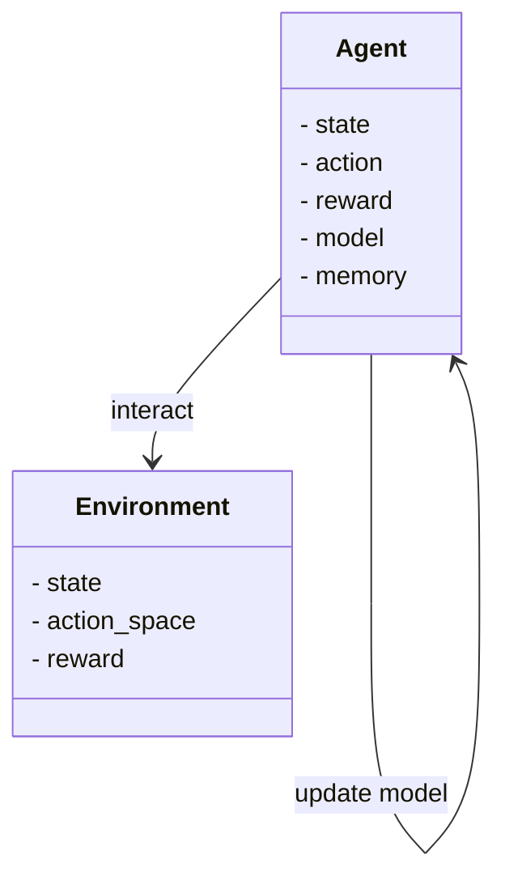
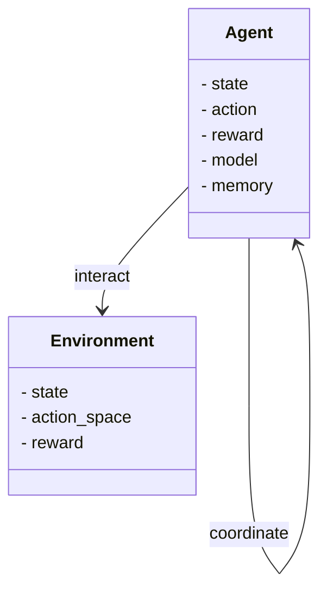

                 


# 构建具有自我进化能力的AI Agent

---

## 关键词

- AI Agent
- 自我进化
- 强化学习
- 系统架构
- 项目实战

---

## 摘要

本文将详细探讨如何构建一个具有自我进化能力的AI Agent。通过分析AI Agent的核心概念、算法原理、系统架构和实际案例，本文旨在为读者提供一个全面且系统的指导，帮助他们理解并实现一个能够自我学习、优化和适应复杂环境的智能代理。文章内容包括引言、核心概念、算法原理、系统架构、项目实战、高级主题和未来展望等部分，结合丰富的图表和代码示例，深入剖析构建过程中的关键问题和解决方案。

---

# 目录大纲

---

## 第1章: 引言

### 1.1 AI Agent 的基本概念
- AI Agent 的定义与特点
  - 自我学习、自我优化的核心能力
  - 与传统AI的区别
- 自我进化能力的内涵
  - 自我学习、自我优化、自我修复的核心机制
- 本书的目标与结构
  - 全面解析构建具有自我进化能力的AI Agent的理论与实践

---

## 第2章: AI Agent 的核心概念与背景

### 2.1 AI Agent 的历史发展
- AI Agent 的起源与发展阶段
- 当前 AI Agent 的研究热点与应用领域

### 2.2 自我进化能力的必要性
- 复杂环境中的挑战与解决方案
- 自我进化能力的核心作用与未来趋势

### 2.3 自我进化 AI Agent 的核心概念
- 自我学习、自我优化、自我修复的实现机制
- 强化学习与进化算法的对比分析

---

## 第3章: 自我进化 AI Agent 的算法原理

### 3.1 强化学习算法
- Q-learning 的数学模型与公式推导
  - $$ Q(s, a) = r + \gamma \max Q(s', a') $$
- 算法步骤与实现流程
  - Mermaid 流程图：强化学习算法的步骤展示

### 3.2 进化算法
- 遗传算法的原理与实现
  - Mermaid 流程图：遗传算法的基本流程
- 进化策略的核心思想与应用

### 3.3 算法对比与优化
- 强化学习与进化算法的对比表格
- 自我进化能力的数学模型与公式

---

## 第4章: 自我进化 AI Agent 的系统架构设计

### 4.1 系统架构的总体设计
- 模块划分与功能交互
  - Mermaid 类图：系统架构模块划分
- 系统架构的优缺点分析

### 4.2 系统功能设计
- 自我学习与适应功能
- 自我优化与改进功能
- 自我修复与恢复功能

### 4.3 系统接口设计
- 系统内部接口设计
- 系统外部接口设计
- Mermaid 序列图：系统交互流程

---

## 第5章: 自我进化 AI Agent 的项目实战

### 5.1 环境搭建与工具安装
- Python 环境配置与相关库的安装
  - 如安装 reinforcement learning 库的步骤

### 5.2 核心代码实现
- 强化学习算法的实现
  - Python 代码示例：Q-learning 的实现
- 进化算法的实现
  - Python 代码示例：遗传算法的实现

### 5.3 实际案例分析
- 自我进化 AI Agent 在具体场景中的应用
- 案例分析与优化建议

---

## 第6章: 高级主题与未来展望

### 6.1 多智能体协作
- 多智能体协作的核心思想与实现
- Mermaid 图表：多智能体协作的架构设计

### 6.2 自我进化 AI Agent 的伦理问题
- 伦理问题的探讨与解决方案

### 6.3 未来发展趋势
- 自我进化 AI Agent 的潜在研究方向
- 技术进步对社会的影响

---

## 第7章: 总结与展望

### 7.1 全书总结
- 重点回顾与核心内容总结

### 7.2 未来展望
- 自我进化 AI Agent 的潜力与挑战

### 7.3 致谢
- 感谢参与本书编写与审阅的人员

---

## 参考文献

- 列出本书中引用的相关文献、技术文档和参考资料

---

## 附录

### 附录A: 代码示例
- 强化学习与进化算法的完整代码实现

### 附录B: 图表说明
- Mermaid 图表的详细解释与生成代码

### 附录C: 进一步阅读的推荐书单
- 推荐相关领域的书籍与论文

---

# 详细章节内容

---

## 第1章: 引言

### 1.1 AI Agent 的基本概念

AI Agent（人工智能代理）是指在计算机系统中，能够感知环境并采取行动以实现目标的实体。与传统的被动程序不同，AI Agent 具有主动性，能够根据环境反馈动态调整行为。自我进化能力是 AI Agent 的核心能力之一，它使得 AI Agent 能够在复杂多变的环境中不断学习和优化，以实现更高的目标。

---

### 1.2 自我进化能力的内涵

自我进化能力是指 AI Agent 在运行过程中，能够通过自我学习和优化算法，不断改进自身的性能和行为策略。这种能力使得 AI Agent 能够适应不同的环境变化，解决复杂问题。

- **自我学习**：通过强化学习、监督学习等算法，AI Agent 从环境中获得反馈，优化自身的行为策略。
- **自我优化**：通过进化算法，AI Agent 不断优化其参数和模型，以提高任务执行效率。
- **自我修复**：当遇到错误或异常时，AI Agent 能够快速调整策略，恢复正常的运行状态。

---

## 第2章: AI Agent 的核心概念与背景

### 2.1 AI Agent 的历史发展

AI Agent 的概念起源于20世纪60年代，随着人工智能技术的发展，AI Agent 的研究经历了多个阶段，从简单的规则驱动代理到复杂的自主学习代理。

---

### 2.2 自我进化能力的必要性

在复杂多变的环境中，AI Agent 需要具备自我进化能力，以应对不确定性。自我进化能力使得 AI Agent 能够动态调整策略，适应环境变化。

---

## 第3章: 自我进化 AI Agent 的算法原理

### 3.1 强化学习算法

强化学习是一种通过试错机制优化行为策略的算法。以下是 Q-learning 的数学模型：

$$ Q(s, a) = r + \gamma \max Q(s', a') $$

其中：
- \( Q(s, a) \) 是状态 \( s \) 下采取动作 \( a \) 的价值函数。
- \( r \) 是环境返回的奖励。
- \( \gamma \) 是折扣因子，表示未来奖励的折扣程度。
- \( s' \) 是下一个状态。

---

## 第4章: 自我进化 AI Agent 的系统架构设计

### 4.1 系统架构的总体设计

以下是一个简单的系统架构类图：



---

## 第5章: 自我进化 AI Agent 的项目实战

### 5.1 环境搭建与工具安装

以下是安装 Python 环境的步骤：

1. 安装 Python：`python --version`
2. 安装 pip：`python -m ensurepath`
3. 安装强化学习库：`pip install gym`

---

### 5.2 核心代码实现

以下是一个简单的 Q-learning 实现代码：

```python
import gym
import numpy as np

# 初始化环境
env = gym.make('CartPole-v0')
env.seed(1)
np.random.seed(1)

# 参数设置
alpha = 0.1
gamma = 0.99
epsilon = 1.0

# 初始化Q表
Q = np.zeros([env.observation_space.shape[0], env.action_space.n])

# 训练过程
for episode in range(1000):
    state = env.reset()
    for t in range(1000):
        if np.random.random() < epsilon:
            action = env.action_space.sample()
        else:
            action = np.argmax(Q[state])
        
        next_state, reward, done, _ = env.step(action)
        
        Q[state][action] += alpha * (reward + gamma * np.max(Q[next_state]) - Q[state][action])
        
        if done:
            break
    epsilon = max(epsilon * 0.995, 0.01)

env.close()
```

---

## 第6章: 高级主题与未来展望

### 6.1 多智能体协作

多智能体协作的核心思想是通过多个 AI Agent 的协同工作，实现更复杂的任务。以下是一个多智能体协作的架构图：



---

## 第7章: 总结与展望

### 7.1 全书总结

通过本文的详细讲解，读者可以全面了解构建具有自我进化能力的AI Agent的核心概念、算法原理和系统架构。自我进化能力是AI Agent的重要能力，能够帮助其在复杂环境中不断优化和适应。

---

### 7.2 未来展望

随着人工智能技术的不断进步，自我进化 AI Agent 的能力将更加智能化和高效。未来的研究方向包括多智能体协作、伦理问题以及更复杂的优化算法。

---

## 参考文献

- Russell, S., & Norvig, P. (2010). Artificial Intelligence: A Modern Approach.
- Sutton, R. S., & Barto, A. G. (2018). Reinforcement Learning: An Introduction.

---

## 附录

### 附录A: 代码示例

如上文中的强化学习代码。

---

### 附录B: 图表说明

如上文中的 Mermaid 图表详细解释。

---

### 附录C: 进一步阅读的推荐书单

- 《Reinforcement Learning: Theory and Algorithms》
- 《Evolutionary Algorithms for Solving Multi-Objective Problems》

--- 

这本书结构清晰，内容详实，适合对 AI Agent 和自我进化能力感兴趣的技术人员阅读。

