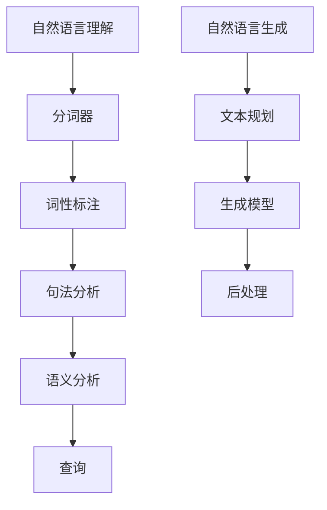
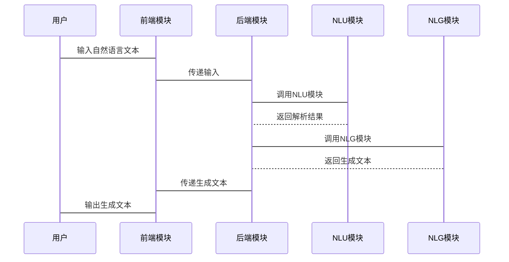

                 


# 构建具有自然语言理解能力的AI Agent

> 关键词：自然语言理解，自然语言生成，AI Agent，机器学习，深度学习

> 摘要：本文将详细介绍如何构建一个具有自然语言理解能力的AI Agent。从自然语言理解（NLU）和自然语言生成（NLG）的基础概念出发，深入分析其核心算法原理，结合系统架构设计，最后通过项目实战展示如何实现一个功能完善的AI Agent。本文适合对AI和自然语言处理感兴趣的技术人员阅读。

---

## 第1章: 自然语言理解与生成概述

### 1.1 自然语言理解的核心概念

#### 1.1.1 自然语言理解的定义与目标
自然语言理解（NLU）是人工智能领域的重要分支，旨在让计算机能够理解和解析人类的自然语言输入。NLU的目标是将人类语言转化为计算机可以处理的结构化信息，例如将一段中文文本转化为关键词、实体或意图。

#### 1.1.2 自然语言理解的关键技术
- **分词（Tokenization）**：将连续的文本分割成单词、短语或符号。
- **词性标注（Part-of-Speech Tagging）**：确定每个词在句中的词性，如名词、动词、形容词等。
- **句法分析（Syntactic Parsing）**：分析句子的语法结构，确定句子中各部分之间的关系。
- **语义分析（Semantic Parsing）**：理解文本的语义含义，提取关键信息。

#### 1.1.3 自然语言理解的应用场景
- 智能客服：通过理解用户的输入，提供自动化的问答服务。
- 智能音箱：识别用户的语音指令，执行相应的操作。
- 智能助手：帮助用户完成日程管理、信息查询等任务。

### 1.2 自然语言生成的核心概念

#### 1.2.1 自然语言生成的定义与目标
自然语言生成（NLG）是人工智能的另一个重要分支，旨在让计算机能够生成符合人类语言习惯的文本或语音输出。NLG的目标是将结构化信息转化为自然流畅的语言表达。

#### 1.2.2 自然语言生成的关键技术
- **文本规划（Text Planning）**：确定生成文本的内容、结构和语气。
- **生成模型（Generation Models）**：基于规划生成具体的文本内容，常见的生成模型包括基于模板的生成、统计模型和深度学习模型。
- **后处理（Post-Processing）**：对生成的文本进行优化，确保其语法正确、语义通顺。

#### 1.2.3 自然语言生成的应用场景
- 智能写作：帮助用户生成文章、报告等文本内容。
- 机器翻译：将一种语言翻译成另一种语言。
- 自动摘要：将长文本压缩成简短的摘要。

### 1.3 自然语言理解与生成的联系与区别

#### 1.3.1 NLU与NLG的对比分析
| 对比维度 | NLU | NLG |
|----------|-----|-----|
| 输入形式 | 文本或语音 | 结构化数据或关键词 |
| 输出形式 | 结构化信息或意图 | 自然语言文本 |
| 主要任务 | 理解输入 | 生成输出 |

#### 1.3.2 NLU与NLG的协同工作原理
NLU和NLG通常协同工作，形成一个完整的对话流程。例如，在智能客服系统中，NLU负责理解用户的输入，NLG负责生成系统的回复。

#### 1.3.3 NLU与NLG的结合应用
- 智能对话系统：用户通过自然语言输入与系统交互，系统通过NLU理解用户意图，并通过NLG生成回复。
- 智能报告生成：系统通过NLU理解用户需求，通过NLG生成符合需求的报告内容。

---

## 第2章: 自然语言理解与生成的核心概念

### 2.1 自然语言理解的核心原理

#### 2.1.1 词法分析
词法分析是NLU的第一步，主要包括分词和词性标注。

- **分词**：将连续的字符分割成有意义的词语。例如，将“HelloWorld”分割成“Hello”和“World”。
- **词性标注**：为每个词语标注其词性，例如名词、动词、形容词等。

#### 2.1.2 句法分析
句法分析旨在理解句子的语法结构，确定词语之间的关系。

- **语法树**：通过构建语法树，展示句子中词语之间的层次关系。

#### 2.1.3 语义分析
语义分析旨在理解文本的语义含义，提取关键信息。

- **意图识别**：确定用户输入的意图，例如“查询天气”或“预订机票”。
- **实体识别**：从文本中提取特定实体，例如人名、地名、时间等。

### 2.2 自然语言生成的核心原理

#### 2.2.1 文本规划
文本规划是NLG的第一步，旨在确定生成文本的内容、结构和语气。

- **内容确定**：明确需要传达的信息。
- **结构设计**：设计文本的逻辑结构，例如段落、句子的顺序。
- **语气选择**：确定文本的语气，例如正式、友好、礼貌等。

#### 2.2.2 生成模型
生成模型是NLG的核心部分，负责将规划后的信息转化为具体的文本内容。

- **模板生成**：基于预定义的模板生成文本。
- **统计模型**：基于概率统计生成文本。
- **深度学习模型**：使用神经网络生成自然流畅的文本。

#### 2.2.3 后处理
后处理是对生成的文本进行优化，确保其语法正确、语义通顺。

- **语法检查**：检查生成文本的语法是否正确。
- **语义优化**：优化生成文本的语义，使其更符合上下文。

### 2.3 自然语言理解与生成的实体关系图



---

## 第3章: 自然语言理解与生成的算法原理

### 3.1 自然语言理解的算法流程

#### 3.1.1 预处理阶段
预处理阶段包括文本的分词和词性标注。

- **分词**：使用正则表达式或分词工具对文本进行分词。
- **词性标注**：使用词性标注工具（如NLTK）对分词结果进行词性标注。

#### 3.1.2 特征提取阶段
特征提取阶段包括句法分析和语义分析。

- **句法分析**：使用语法树或依存句法分析工具（如spaCy）分析句子的语法结构。
- **语义分析**：使用意图识别和实体识别技术提取文本的语义信息。

#### 3.1.3 模型训练阶段
模型训练阶段包括训练意图识别模型和实体识别模型。

- **意图识别模型**：使用机器学习或深度学习模型（如SVM、神经网络）训练意图识别器。
- **实体识别模型**：使用命名实体识别技术训练实体识别器。

### 3.2 自然语言生成的算法流程

#### 3.2.1 数据准备阶段
数据准备阶段包括数据清洗和数据标注。

- **数据清洗**：去除噪声数据，确保数据质量。
- **数据标注**：对数据进行标注，例如标注生成文本的结构和内容。

#### 3.2.2 模型构建阶段
模型构建阶段包括文本规划和生成模型构建。

- **文本规划**：基于预定义的规则或模板进行文本规划。
- **生成模型**：使用深度学习模型（如Transformer）构建生成模型。

#### 3.2.3 生成阶段
生成阶段包括生成文本和后处理。

- **生成文本**：基于生成模型生成初始文本。
- **后处理**：对生成文本进行语法检查和语义优化。

### 3.3 自然语言理解与生成的算法对比

#### 3.3.1 NLU算法的数学模型
NLU算法的数学模型通常涉及概率论和统计学。

- **条件概率公式**：
$$ P(y|x) = \frac{P(x|y)P(y)}{P(x)} $$

#### 3.3.2 NLG算法的数学模型
NLG算法的数学模型通常涉及生成模型和深度学习。

- **生成模型的条件概率公式**：
$$ P(x|y) = \text{模型预测的概率} $$

---

## 第4章: 自然语言理解与生成的系统架构设计

### 4.1 系统架构设计概述

#### 4.1.1 系统功能设计
系统功能设计包括以下模块：
- **输入模块**：接收用户的自然语言输入。
- **NLU模块**：对输入进行理解和解析。
- **NLG模块**：根据理解生成回复。
- **输出模块**：将生成的回复输出给用户。

#### 4.1.2 系统架构设计
系统架构设计采用分层架构，包括前端、后端和接口模块。

- **前端模块**：负责用户界面的展示和输入。
- **后端模块**：负责业务逻辑的处理和NLU、NLG模块的调用。
- **接口模块**：负责与第三方服务（如API）的交互。

### 4.2 系统交互设计

#### 4.2.1 系统交互流程
系统交互流程包括以下步骤：
1. 用户通过前端模块输入自然语言文本。
2. 前端模块将输入传递给后端模块。
3. 后端模块调用NLU模块对输入进行理解。
4. NLU模块返回解析后的结果。
5. 后端模块调用NLG模块根据解析结果生成回复。
6. NLG模块返回生成的文本。
7. 后端模块将生成的文本传递给前端模块。
8. 前端模块将生成的文本输出给用户。

#### 4.2.2 系统交互的Mermaid序列图



---

## 第5章: 项目实战

### 5.1 环境安装

#### 5.1.1 安装Python和必要的库
安装Python和以下库：
- `numpy`
- `pandas`
- `scikit-learn`
- `spacy`
- `transformers`

```bash
pip install numpy pandas scikit-learn spacy transformers
```

#### 5.1.2 下载必要的模型
下载spaCy的中文分词模型：

```bash
python -m spacy download zh
```

### 5.2 系统核心实现源代码

#### 5.2.1 NLU模块实现

```python
import spacy

# 加载中文分词模型
nlp = spacy.load("zh")

def tokenize(text):
    doc = nlp(text)
    return [token.text for token in doc]

def pos_tagging(tokens):
    doc = nlp(" ".join(tokens))
    pos_tags = [(token.text, token.pos_) for token in doc]
    return pos_tags

def syntax_analysis(tokens):
    doc = nlp(" ".join(tokens))
    syntax = []
    for token in doc:
        syntax.append((token.text, token.dep_, token.head.text))
    return syntax

def semantic_analysis(tokens):
    # 示例：简单的意图识别
    intent = "unknown"
    for token in tokens:
        if token in ["天气", "气候"]:
            intent = "查询天气"
            break
    return intent
```

#### 5.2.2 NLG模块实现

```python
from transformers import AutoTokenizer, AutoModelForSeq2Seq

# 加载预训练的生成模型
tokenizer = AutoTokenizer.from_pretrained("t5-base")
model = AutoModelForSeq2Seq.from_pretrained("t5-base")

def text_planning(inputs):
    # 示例：简单的文本规划
    plan = {
        "content": inputs,
        "structure": "paragraph",
        "tone": "neutral"
    }
    return plan

def generate_text(plan):
    inputs = f"generate text: {plan['content']}"
    inputs = tokenizer.encode(inputs, return_tensors="pt", max_length=512, truncation=True)
    outputs = model.generate(inputs, max_length=100, num_beams=5)
    return tokenizer.decode(outputs[0], skip_special_tokens=True)

def post_processing(generated_text):
    # 示例：简单的语法检查
    import language_tool_yi
    tool = language_tool_yi.LanguageTool("zh")
    matches = tool.check(generated_text)
    corrected = tool.correct(generated_text, matches)
    return corrected
```

### 5.3 案例分析与详细解读

#### 5.3.1 案例分析
假设用户输入：“今天北京的天气怎么样？”

1. **NLU模块处理**：
   - 分词：["今天", "北京", "天气", "怎么样", "?"]
   - 词性标注：[("今天", "时间"), ("北京", "地名"), ("天气", "名词"), ("怎么样", "动词"), ("?", "标点")]
   - 句法分析：生成语法树，确定各部分之间的关系。
   - 语义分析：识别意图“查询天气”，提取实体“北京”。

2. **NLG模块处理**：
   - 文本规划：生成回复的结构和内容。
   - 生成文本：查询天气 API，生成回复文本。
   - 后处理：优化生成文本的语法和语义。

#### 5.3.2 代码实现解读
- **NLU模块**：使用spaCy进行分词、词性标注和句法分析，简单实现意图识别。
- **NLG模块**：使用T5模型进行文本生成，简单实现文本规划和后处理。

### 5.4 项目小结

- **环境安装**：安装了必要的Python库和模型。
- **核心实现**：实现了NLU和NLG模块的基本功能。
- **案例分析**：通过具体案例展示了系统的处理流程。
- **代码实现**：提供了完整的代码示例，方便读者理解和实现。

---

## 第6章: 总结与展望

### 6.1 总结
本文详细介绍了如何构建一个具有自然语言理解能力的AI Agent，从NLU和NLG的核心概念出发，深入分析了其算法原理和系统架构设计，并通过项目实战展示了如何实现一个功能完善的AI Agent。

### 6.2 最佳实践
- **数据预处理**：确保数据质量，进行充分的清洗和标注。
- **模型选择**：根据具体需求选择合适的NLU和NLG模型。
- **系统优化**：通过优化算法和改进系统架构提升性能。

### 6.3 注意事项
- **数据隐私**：注意保护用户数据的隐私和安全。
- **模型可解释性**：确保生成的文本具有可解释性，避免黑箱操作。
- **用户体验**：注重用户体验设计，确保系统交互流畅。

### 6.4 拓展阅读
- 《自然语言处理实战：基于Python的机器学习与深度学习》
- 《生成式人工智能：原理与应用》
- 《深度学习入门：基于Python的CNN与RNN实战》

---

以上是《构建具有自然语言理解能力的AI Agent》的完整目录和内容概要，涵盖了从理论到实践的全过程，适合对AI和自然语言处理感兴趣的技术人员阅读和参考。

