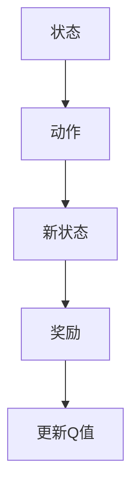
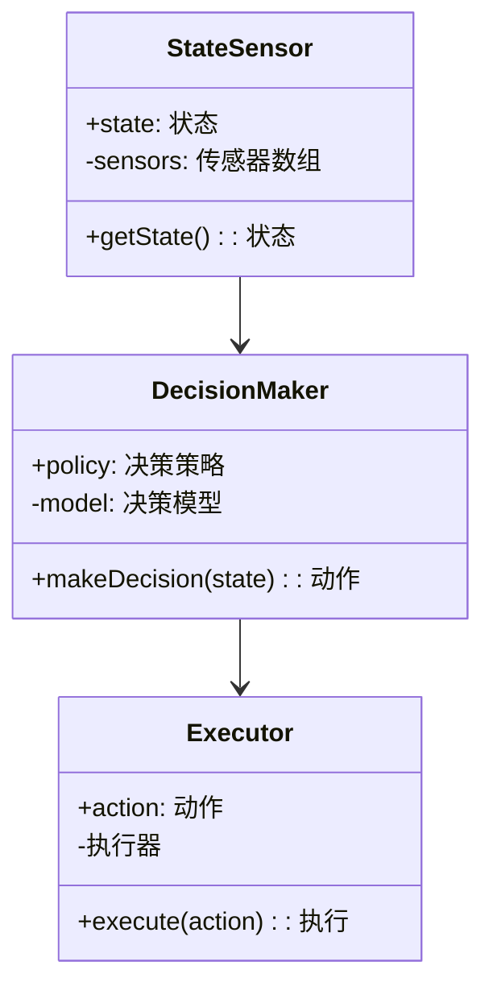
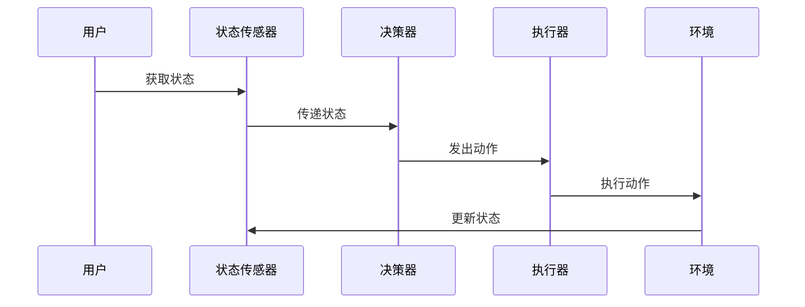

                 


# 构建具有自适应决策能力的AI Agent

> 关键词：自适应决策、AI Agent、智能体、强化学习、决策树、实时决策

> 摘要：本文详细探讨了构建具有自适应决策能力的AI Agent的各个方面，从核心概念到算法原理，从系统架构到项目实战，全面解析了自适应决策AI Agent的构建过程。通过实际案例分析和最佳实践，帮助读者掌握自适应决策AI Agent的设计与实现技巧。

---

## 第1章: 自适应决策AI Agent的背景与问题背景

### 1.1 自适应决策AI Agent的核心概念

#### 1.1.1 问题背景
在现代人工智能领域，传统的静态决策模型逐渐暴露出其局限性。随着环境的动态变化，决策模型需要具备实时调整和优化的能力。自适应决策AI Agent正是为了解决这一问题而提出的。

#### 1.1.2 问题描述
自适应决策AI Agent需要能够在复杂、动态的环境中实时感知变化，并根据变化调整决策策略。这要求AI Agent具备以下能力：
1. 实时感知环境状态。
2. 动态调整决策模型。
3. 学习并优化决策策略。

#### 1.1.3 问题解决
通过引入强化学习、动态规划和实时反馈机制，自适应决策AI Agent能够在复杂环境中实现动态调整和优化。

#### 1.1.4 边界与外延
自适应决策AI Agent的边界包括：
- 决策范围：仅限于特定任务。
- 环境类型：动态但可预测的环境。
- 决策频率：实时或准实时。

其外延包括：
- 多智能体协作。
- 分布式决策系统。
- 跨领域应用。

#### 1.1.5 核心要素组成
自适应决策AI Agent的核心要素包括：
- 状态感知模块：实时感知环境状态。
- 决策模块：基于当前状态生成决策。
- 反馈机制：根据执行结果调整决策策略。
- 学习模块：通过经验优化决策模型。

---

### 1.2 自适应决策AI Agent的特点与优势

#### 1.2.1 自适应性
AI Agent能够根据环境变化动态调整决策策略。

#### 1.2.2 实时性
能够在短时间内完成决策过程。

#### 1.2.3 可扩展性
支持多种任务和环境的扩展。

#### 1.2.4 智能性
具备自主学习和优化能力。

---

## 第2章: 自适应决策AI Agent的核心概念与联系

### 2.1 核心概念原理

#### 2.1.1 自适应机制
自适应机制是AI Agent的核心，包括状态感知、决策生成和策略优化三个环节。

#### 2.1.2 决策模型
决策模型是AI Agent的决策逻辑实现，包括强化学习模型和决策树模型。

#### 2.1.3 智能体架构
智能体架构是AI Agent的实现框架，包括感知层、决策层和执行层。

### 2.2 核心概念对比表格

| 对比维度       | 传统决策模型       | 自适应决策模型     |
|----------------|--------------------|--------------------|
| 决策依据       | 静态规则           | 动态环境反馈       |
| 决策频率       | 定期更新           | 实时调整           |
| 决策优化       | 预设规则优化       | 动态反馈优化       |

### 2.3 实体关系图（ER图）

```mermaid
er
  actor: 用户
  agent: AI Agent
  environment: 环境
  action: 行动
  state: 状态
  relation: 关联
  用户 --> 关联 --> AI Agent
  AI Agent --> 关联 --> 环境
  环境 --> 关联 --> 状态
  状态 --> 关联 --> 行动
```

---

## 第3章: 自适应决策AI Agent的算法原理

### 3.1 强化学习算法

#### 3.1.1 Q-learning算法
Q-learning算法是一种经典的强化学习算法，通过状态-动作-奖励机制优化决策策略。



#### 3.1.2 Deep Q-Networks (DQN)算法
DQN算法将Q值函数表示为深度神经网络，能够处理高维状态空间。

```python
class QNetwork:
    def __init__(self, state_space, action_space, learning_rate):
        self.state_space = state_space
        self.action_space = action_space
        self.learning_rate = learning_rate
        # 网络结构
        self.mod

---

## 第4章: 自适应决策AI Agent的系统分析与架构设计方案

### 4.1 问题场景介绍

#### 4.1.1 项目介绍
本项目旨在构建一个能够在动态环境中实时调整决策策略的AI Agent。

#### 4.1.2 系统功能设计



### 4.2 系统架构设计


### 4.3 系统接口设计

#### 4.3.1 接口定义



---

## 第5章: 项目实战

### 5.1 环境安装

```bash
pip install gym numpy tensorflow
```

### 5.2 核心代码实现

#### 5.2.1 状态传感器实现

```python
class StateSensor:
    def __init__(self, env):
        self.env = env

    def get_state(self):
        return self.env.observation_space.sample()
```

#### 5.2.2 决策器实现

```python
class DecisionMaker:
    def __init__(self, state_space, action_space, learning_rate):
        self.qnetwork = QNetwork(state_space, action_space, learning_rate)

    def make_decision(self, state):
        return self.qnetwork.predict(state)
```

### 5.3 案例分析

#### 5.3.1 案例描述
在动态价格调整场景中，AI Agent需要根据市场变化实时调整产品价格。

#### 5.3.2 代码实现

```python
env = MarketEnv()
sensor = StateSensor(env)
decision_maker = DecisionMaker(env.observation_space.shape[0], env.action_space.n, 0.01)
while True:
    state = sensor.get_state()
    action = decision_maker.make_decision(state)
    sensor.env.step(action)
```

---

## 第6章: 总结与展望

### 6.1 最佳实践 tips

1. 确保数据质量，实时反馈机制。
2. 定期更新决策模型。
3. 使用分布式架构优化性能。

### 6.2 小结
通过本文的详细讲解，读者可以掌握自适应决策AI Agent的构建方法，并能够将其应用到实际项目中。

### 6.3 注意事项
- 确保系统的实时性和稳定性。
- 定期优化决策模型。
- 注意数据隐私和安全问题。

### 6.4 拓展阅读
建议进一步研究强化学习的高级算法和分布式AI系统。

---

通过本文的系统讲解和实践案例，读者可以深入理解自适应决策AI Agent的构建过程，并能够在实际项目中灵活运用这些知识。

