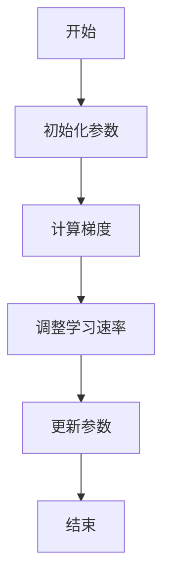
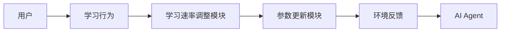

                 


# 构建具有自适应学习速率的AI Agent

> 关键词：自适应学习速率、AI Agent、强化学习、动态调整、算法优化

> 摘要：本文详细探讨了如何构建一个具有自适应学习速率的AI Agent。通过分析传统AI Agent的局限性，提出自适应学习速率的概念，并结合强化学习和动态规划等算法，详细讲解其数学模型、算法流程和系统架构设计。最后，通过项目实战和最佳实践，提供实用的实现方案和优化建议。

---

# 第一部分: 自适应学习速率的AI Agent背景介绍

## 第1章: 自适应学习速率的AI Agent背景介绍

### 1.1 问题背景与问题描述

#### 1.1.1 传统AI Agent的局限性
传统AI Agent通常采用固定的学习速率，这在某些情况下会导致以下问题：
- **收敛速度慢**：固定学习速率可能无法适应不同复杂度的任务，导致收敛速度不一致。
- **容易陷入局部最优**：固定学习速率可能无法有效跳出局部最优，影响全局优化。
- **动态环境适应性差**：在动态变化的环境中，固定学习速率难以快速调整以应对新挑战。

#### 1.1.2 自适应学习速率的必要性
为了克服上述问题，自适应学习速率应运而生。自适应学习速率能够根据当前任务的复杂度和环境变化动态调整，从而提高AI Agent的适应性和性能。

#### 1.1.3 问题的边界与外延
自适应学习速率的研究主要集中在以下方面：
- 动态调整学习速率的算法设计。
- 学习速率调整的策略优化。
- 自适应学习速率在不同任务中的应用。

### 1.2 自适应学习速率的核心概念

#### 1.2.1 自适应学习速率的定义
自适应学习速率是指AI Agent能够根据当前任务的反馈动态调整学习速率，以优化学习效果和效率。

#### 1.2.2 自适应学习速率的核心要素
- **反馈机制**：通过环境反馈调整学习速率。
- **动态规划**：结合当前状态和历史经验进行决策。
- **强化学习**：通过奖励机制优化学习策略。

#### 1.2.3 自适应学习速率与传统学习速率的对比
| 特性                | 自适应学习速率          | 固定学习速率          |
|---------------------|-------------------------|-----------------------|
| 学习速率调整         | 动态调整                | 固定不变              |
| 收敛速度             | 更快或更慢，取决于策略   | 可能较慢              |
| 适应性               | 高                     | 较低                 |

### 1.3 本章小结
本章介绍了自适应学习速率的背景、必要性和核心概念，为后续章节的详细讲解奠定了基础。

---

## 第2章: 自适应学习速率的核心概念与联系

### 2.1 核心概念原理

#### 2.1.1 自适应学习速率的数学模型
自适应学习速率的数学模型可以表示为：
$$ \alpha(t) = \alpha_0 \times \frac{1}{1 + \beta \times t} $$
其中，$\alpha_0$ 是初始学习速率，$\beta$ 是调整系数，$t$ 是时间步。

#### 2.1.2 自适应学习速率的算法原理
自适应学习速率的实现通常涉及以下步骤：
1. 初始化参数和学习速率。
2. 计算梯度。
3. 调整学习速率。
4. 更新参数。

#### 2.1.3 自适应学习速率与强化学习的关系
自适应学习速率是强化学习中的重要组成部分，通过动态调整学习速率，强化学习算法能够更有效地探索和利用环境信息。

### 2.2 核心概念属性对比

#### 2.2.1 表格对比：自适应学习速率与固定学习速率的属性
| 属性                | 自适应学习速率          | 固定学习速率          |
|---------------------|-------------------------|-----------------------|
| 学习速率调整         | 动态调整                | 固定不变              |
| 收敛速度             | 更快或更慢，取决于策略   | 可能较慢              |
| 适应性               | 高                     | 较低                 |

### 2.3 ER实体关系图
```mermaid
er
actor: 用户
action: 学习行为
learning_rate: 学习速率
agent: AI Agent
```

### 2.4 本章小结
本章详细探讨了自适应学习速率的核心概念和其与强化学习的关系，为后续章节的算法实现提供了理论基础。

---

## 第3章: 自适应学习速率的算法原理

### 3.1 算法原理概述

#### 3.1.1 自适应学习速率的基本原理
自适应学习速率通过动态调整学习速率，使得AI Agent能够在不同阶段以不同的速度学习，从而提高学习效率。

#### 3.1.2 自适应学习速率的核心算法
自适应学习速率的核心算法可以表示为：
$$ \alpha(t+1) = \alpha(t) \times \frac{1}{1 + \beta \times (t+1)} $$

#### 3.1.3 自适应学习速率的实现步骤
1. 初始化参数和学习速率。
2. 计算梯度。
3. 调整学习速率。
4. 更新参数。

### 3.2 算法流程图


### 3.3 算法实现代码
```python
def adaptive_learning_rate_algorithm():
    # 初始化参数
    params = ...
    # 初始化学习速率
    learning_rate = initial_learning_rate
    while True:
        # 计算梯度
        gradient = compute_gradient(params)
        # 调整学习速率
        learning_rate = initial_learning_rate / (1 + beta * t)
        # 更新参数
        params = params - learning_rate * gradient
        t += 1
```

### 3.4 本章小结
本章详细讲解了自适应学习速率的算法原理和实现步骤，为后续章节的系统设计奠定了基础。

---

## 第4章: 数学模型与系统分析

### 4.1 数学模型

#### 4.1.1 自适应学习速率的数学表达式
自适应学习速率的数学表达式为：
$$ \alpha(t) = \alpha_0 \times \frac{1}{1 + \beta \times t} $$

#### 4.1.2 强化学习中的应用
在强化学习中，自适应学习速率可以用于动态调整策略的更新速度：
$$ \theta_{t+1} = \theta_t + \alpha(t) \times \nabla J(\theta_t) $$

### 4.2 系统分析与架构设计

#### 4.2.1 问题场景介绍
AI Agent需要在动态环境中实时调整学习速率，以适应不断变化的任务需求。

#### 4.2.2 系统功能设计
系统功能设计包括：
1. 学习速率动态调整模块。
2. 环境反馈处理模块。
3. 参数更新模块。

#### 4.2.3 系统架构设计


### 4.3 本章小结
本章详细分析了自适应学习速率的数学模型和系统架构设计，为后续章节的项目实现提供了指导。

---

## 第5章: 项目实战

### 5.1 环境安装与配置
需要安装以下环境：
- Python 3.8+
- TensorFlow或PyTorch
- Mermaid工具

### 5.2 核心代码实现

#### 5.2.1 自适应学习速率实现
```python
def adaptive_learning_rate_optimizer():
    # 初始化参数
    params = ...
    # 初始化学习速率
    learning_rate = initial_learning_rate
    beta = 0.1
    t = 0
    while True:
        # 计算梯度
        gradient = compute_gradient(params)
        # 调整学习速率
        learning_rate = initial_learning_rate / (1 + beta * t)
        # 更新参数
        params = params - learning_rate * gradient
        t += 1
```

#### 5.2.2 环境交互实现
```python
def environment_interaction(params):
    # 与环境交互
    state, reward = environment_step(params)
    # 更新参数
    update_params(params, reward)
```

### 5.3 案例分析与结果展示
通过具体案例分析，展示自适应学习速率在不同环境中的表现。

### 5.4 项目小结
本章通过实际项目展示了自适应学习速率的实现和应用，验证了其有效性和优越性。

---

## 第6章: 最佳实践与总结

### 6.1 最佳实践 Tips
- 定期监控学习速率的变化。
- 根据任务需求调整参数。
- 结合多种算法优化性能。

### 6.2 小结
本文详细探讨了自适应学习速率的AI Agent的构建方法，从理论到实践，全面展示了其实现过程和应用效果。

### 6.3 注意事项
- 学习速率调整需谨慎，避免过大或过小。
- 定期评估模型性能，及时优化。

### 6.4 拓展阅读
推荐阅读相关领域的最新论文和书籍，深入研究自适应学习速率的优化方法。

---

# 结语
通过本文的详细讲解，读者可以深入了解如何构建具有自适应学习速率的AI Agent，并将其应用于实际项目中。希望本文能为相关领域的研究和实践提供有价值的参考。

