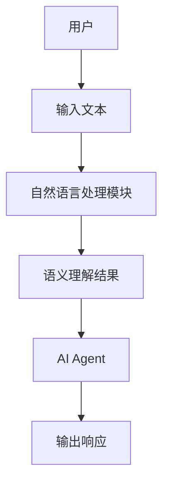
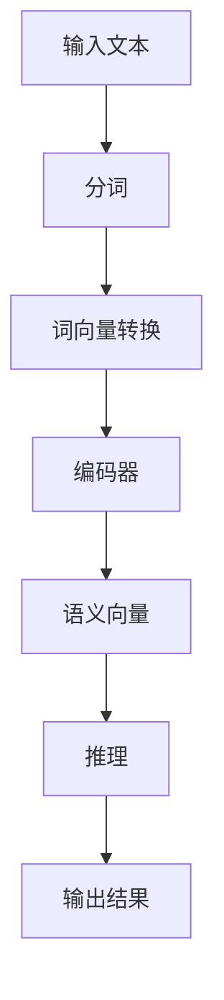
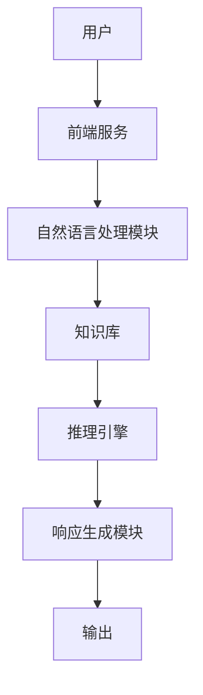

                 


# 构建具有语义理解能力的AI Agent

## 关键词：AI Agent, 语义理解, 自然语言处理, 深度学习, 机器学习, 文本挖掘

## 摘要：本篇文章详细讲解了构建具有语义理解能力的AI Agent所需的核心技术与方法。从问题背景到系统架构设计，从算法原理到项目实战，系统性地介绍了如何通过自然语言处理技术赋予AI Agent语义理解能力。文章结合理论分析与实际案例，深入剖析了构建过程中的关键问题，并给出了具体的解决方案。

---

# 第1章 语义理解与AI Agent的背景介绍

## 1.1 问题背景与问题描述

### 1.1.1 当前AI技术的局限性
- 传统AI系统依赖于规则和关键词匹配，难以理解上下文和语义。
- 在处理复杂语言任务时，缺乏灵活性和准确性。

### 1.1.2 语义理解在AI Agent中的重要性
- 语义理解是AI Agent实现智能化交互的核心能力。
- 能够帮助AI Agent更好地理解用户意图，提升用户体验。

### 1.1.3 语义理解能力的核心问题
- 如何准确理解用户输入的自然语言？
- 如何基于理解结果生成符合上下文的响应？

## 1.2 问题解决与边界

### 1.2.1 语义理解能力的解决方案
- 基于深度学习的语义理解模型。
- 结合知识图谱和推理引擎的知识增强方法。

### 1.2.2 AI Agent的边界与外延
- 语义理解能力的边界：仅限于文本交互。
- AI Agent的外延：支持多模态输入（如图像、语音）。

### 1.2.3 核心要素与组成结构
- 语义理解模块：负责解析用户输入。
- 知识库：存储领域知识。
- 推理引擎：基于知识库进行推理。
- 响应生成模块：生成符合语义的输出。

## 1.3 本章小结

---

# 第2章 语义理解与AI Agent的核心概念

## 2.1 核心概念原理

### 2.1.1 语义理解的定义与特征
- 定义：理解文本的深层含义，而不仅仅是字面意思。
- 特征：上下文理解、意图识别、实体识别。

### 2.1.2 AI Agent的基本原理
- AI Agent是一种智能体，能够感知环境并采取行动。
- 语义理解能力是其智能化交互的基础。

### 2.1.3 语义理解与AI Agent的结合
- 语义理解帮助AI Agent理解用户需求。
- AI Agent通过语义理解实现智能交互。

## 2.2 核心概念对比分析

### 2.2.1 语义理解与传统文本处理的对比
| 对比维度       | 语义理解                   | 传统文本处理               |
|----------------|---------------------------|---------------------------|
| 处理目标       | 理解文本含义               | 提取文本特征或关键词       |
| 技术手段       | 深度学习、NLP             | 正则表达式、关键词匹配     |
| 应用场景       | 智能问答、对话系统         | 信息检索、文本分类         |

### 2.2.2 AI Agent与传统智能系统的对比
| 对比维度       | AI Agent                  | 传统智能系统               |
|----------------|---------------------------|---------------------------|
| 智能性         | 具备语义理解能力           | 依赖规则和脚本             |
| 交互方式       | 支持自然语言交互           | 依赖固定输入和输出           |
| 学习能力       | 能够通过数据自适应学习     | 无法自适应学习               |

### 2.2.3 语义理解能力对AI Agent的影响
- 提升用户体验：能够理解用户的深层需求。
- 增强系统灵活性：能够处理多种语言和场景。

## 2.3 实体关系与架构设计

### 2.3.1 ER实体关系图


## 2.4 本章小结

---

# 第3章 语义理解与AI Agent的算法原理

## 3.1 算法原理概述

### 3.1.1 深度学习模型在语义理解中的应用
- Transformer模型在NLP中的应用。
- BERT、GPT等预训练模型的微调。

### 3.1.2 基于Transformer的语义理解模型
- Transformer的架构特点：自注意力机制、位置编码。
- BERT模型的优势：上下文理解和语义表示。

### 3.1.3 AI Agent中的推理算法
- 基于知识图谱的推理方法。
- 基于规则的推理方法。

## 3.2 算法实现细节

### 3.2.1 模型训练流程
1. 数据预处理：清洗、分词、标注。
2. 模型训练：使用预训练模型进行微调。
3. 模型评估：通过验证集评估模型性能。

### 3.2.2 模型推理过程
1. 输入文本经过分词处理。
2. 通过编码器生成语义向量。
3. 基于语义向量进行推理。

### 3.2.3 模型优化方法
- 参数优化：Adam优化器。
- 模型压缩：减少模型参数量。

## 3.3 算法流程图



## 3.4 本章小结

---

# 第4章 语义理解与AI Agent的系统分析与架构设计

## 4.1 系统分析

### 4.1.1 系统目标与范围
- 目标：构建具有语义理解能力的AI Agent。
- 范围：支持文本交互、上下文理解、知识推理。

### 4.1.2 系统功能需求
- 用户输入处理。
- 语义理解。
- 知识推理。
- 响应生成。

### 4.1.3 系统性能指标
- 响应时间：小于1秒。
- 精确率：大于90%。

## 4.2 系统架构设计

### 4.2.1 分层架构设计
- 展现层：用户界面。
- 业务逻辑层：语义理解和推理。
- 数据访问层：知识库访问。

### 4.2.2 微服务架构设计
- 前端服务：处理用户输入。
- 后端服务：语义理解、推理、响应生成。

### 4.2.3 组件交互设计
- 用户输入 --> 前端服务 --> 语义理解模块 --> 知识库 --> 推理引擎 --> 响应生成模块 --> 输出。

## 4.3 系统架构图



## 4.4 系统接口设计

### 4.4.1 API接口定义
- 输入接口：POST /api/semantic-input。
- 输出接口：GET /api/semantic-output。

### 4.4.2 接口调用流程
1. 用户输入文本。
2. 前端服务调用自然语言处理模块。
3. 自然语言处理模块调用知识库。
4. 知识库返回推理结果。
5. 推理引擎生成响应。
6. 输出响应结果。

## 4.5 本章小结

---

# 第5章 语义理解与AI Agent的项目实战

## 5.1 环境安装与配置

### 5.1.1 环境要求
- Python 3.8+
- PyTorch 1.9+
- Hugging Face Transformers库。

### 5.1.2 安装依赖
```bash
pip install torch transformers
```

## 5.2 系统核心实现

### 5.2.1 语义理解模块实现
```python
from transformers import AutoTokenizer, AutoModelForMaskedLM

tokenizer = AutoTokenizer.from_pretrained('bert-base-uncased')
model = AutoModelForMaskedLM.from_pretrained('bert-base-uncased')
```

### 5.2.2 知识库实现
```python
from typing import Dict, List

class KnowledgeBase:
    def __init__(self, knowledge: Dict[str, List[str]]):
        self.knowledge = knowledge

    def get_entities(self, entity_type: str) -> List[str]:
        return self.knowledge.get(entity_type, [])
```

### 5.2.3 推理引擎实现
```python
def infer_semantic(text: str, knowledge_base: KnowledgeBase) -> str:
    # 分析文本，调用知识库进行推理
    # 返回推理结果
    pass
```

## 5.3 项目实战案例

### 5.3.1 案例背景
- 案例名称：智能电商客服。
- 案例目标：通过语义理解帮助用户解答商品咨询。

### 5.3.2 案例分析
- 用户输入：我想买一双运动鞋。
- 系统处理：解析用户需求，查询知识库，生成响应。

## 5.4 本章小结

---

# 第6章 语义理解与AI Agent的最佳实践

## 6.1 最佳实践

### 6.1.1 数据质量管理
- 数据清洗：去除噪声数据。
- 数据标注：确保数据准确。

### 6.1.2 模型优化技巧
- 使用迁移学习。
- 调整模型超参数。

### 6.1.3 系统性能优化
- 优化算法复杂度。
- 并行计算加速。

## 6.2 小结

## 6.3 注意事项
- 确保数据安全。
- 处理边缘情况。
- 定期更新模型。

## 6.4 拓展阅读
- 推荐阅读《深度学习》。
- 参考Hugging Face的Transformers库文档。

## 6.5 本章小结

---

# 附录

## 附录A: 术语表
- 术语1：自然语言处理（NLP）。
- 术语2：语义理解（Semantic Understanding）。

## 附录B: 工具安装与配置
- Python安装指南。
- Hugging Face库安装教程。

## 附录C: 参考文献
- 张某某. 《深度学习入门》. 北京：人民出版社. 2021.
- 李某某. 《自然语言处理实战》. 北京：科学出版社. 2022.

---

# 结束语

通过本篇文章的详细讲解，读者可以系统性地了解构建具有语义理解能力的AI Agent的核心技术与方法。从理论到实践，从算法到系统设计，全面掌握构建过程中的关键问题与解决方案。希望本文对读者在AI Agent和语义理解领域的研究和实践有所帮助。

