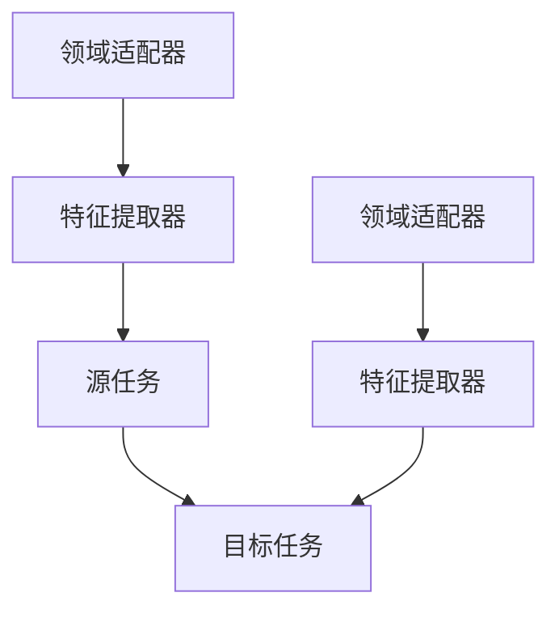
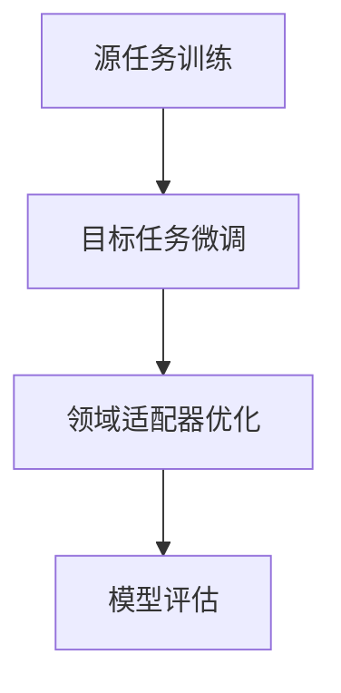
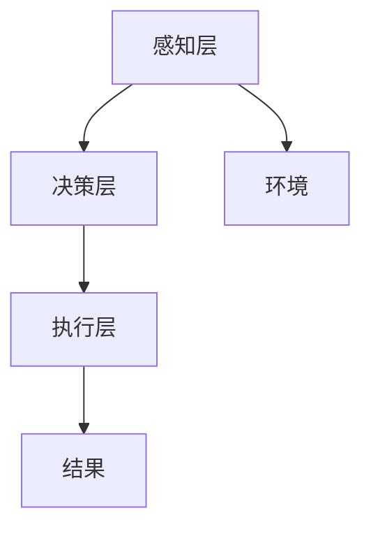
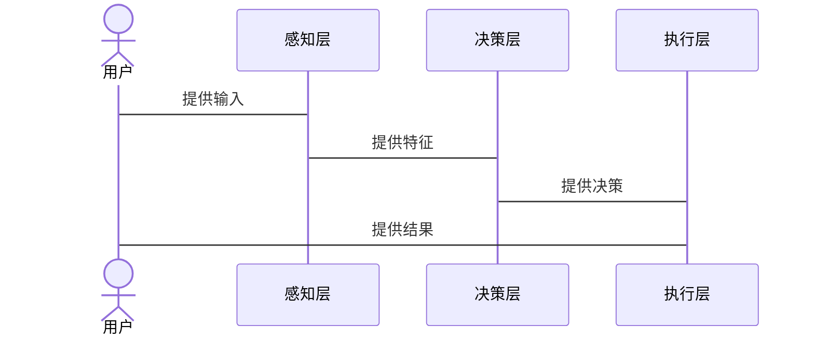

                 


# 构建具有迁移学习能力的AI Agent

> 关键词：迁移学习，AI Agent，深度学习，领域适配，特征提取，参数迁移，目标检测

> 摘要：本文详细探讨了构建具有迁移学习能力的AI Agent的关键技术，从迁移学习的核心概念到AI Agent的系统架构，再到实际项目实现，全面解析了迁移学习在AI Agent中的应用。通过系统化的分析和实战案例，本文为读者提供了从理论到实践的完整指南。

---

## 第一部分: 迁移学习与AI Agent基础

### 第1章: 迁移学习与AI Agent概述

#### 1.1 迁移学习的核心概念

##### 1.1.1 什么是迁移学习
迁移学习是一种机器学习技术，允许模型将从一个任务或领域学到的知识应用到另一个任务或领域。与传统机器学习不同，迁移学习能够在数据不足的情况下，通过跨任务或领域的知识迁移，提升模型的泛化能力。

##### 1.1.2 AI Agent的基本定义
AI Agent（人工智能代理）是指能够感知环境、做出决策并采取行动的智能体。它通常由感知层、决策层和执行层组成，能够与环境交互并完成特定任务。

##### 1.1.3 迁移学习在AI Agent中的重要性
在AI Agent中，迁移学习能够帮助代理快速适应新的任务或环境，减少对大量新数据的依赖，从而提高效率和性能。

#### 1.2 迁移学习的背景与问题背景

##### 1.2.1 数据不足的挑战
许多实际场景中，目标任务的数据量可能非常有限，传统的监督学习方法难以有效训练。

##### 1.2.2 领域迁移的必要性
AI Agent通常需要在不同领域或任务之间切换，例如从图像分类任务迁移到目标检测任务。

##### 1.2.3 迁移学习的边界与外延
迁移学习的边界包括任务相似性、数据分布差异性等，而其外延则涉及领域适配、模型压缩等技术。

#### 1.3 迁移学习的核心要素

##### 1.3.1 核心概念的结构与组成
迁移学习的核心要素包括源任务、目标任务、特征表示和领域适配器。

##### 1.3.2 迁移学习的关键属性对比
以下是迁移学习关键属性的对比表：

| 属性       | 特征提取 | 参数调整 | 对抗训练 |
|------------|----------|----------|----------|
| 适用场景   | 特征不变性 | 参数可迁移性 | 领域对抗性 |
| 优缺点     | 适合跨领域迁移 | 参数调整灵活 | 能够处理复杂的领域差异 |
| 代表性技术 | VGGNet    | Fine-tuning | DANN      |

##### 1.3.3 实体关系图的构建
以下是迁移学习核心要素的实体关系图：



---

### 第2章: 迁移学习的核心原理

#### 2.1 迁移学习的算法原理

##### 2.1.1 基于特征提取的迁移学习
通过提取源任务和目标任务的共享特征，减少领域差异的影响。例如，使用预训练的CNN模型提取图像特征。

##### 2.1.2 基于参数调整的迁移学习
在目标任务上微调源任务的模型参数，例如在ImageNet上预训练的模型迁移到特定分类任务。

##### 2.1.3 基于对抗训练的迁移学习
通过对抗网络消除领域差异，例如使用DANN模型。

#### 2.2 迁移学习的数学模型

##### 2.2.1 迁移学习的数学公式
源任务和目标任务的损失函数如下：

$$ L_{\text{source}} = \mathbb{E}_{s}[ -y_s \log p(y_s|x_s)] $$
$$ L_{\text{target}} = \mathbb{E}_{t}[ -y_t \log p(y_t|x_t)] $$

##### 2.2.2 源任务与目标任务的数学关系
领域适配器通过共享参数$\theta$将源任务和目标任务的特征表示统一：

$$ f_{\theta}(x) = \text{FeatureExtractor}(x; \theta) $$

##### 2.2.3 领域适配器的数学模型
领域适配器的目标是最小化源任务和目标任务的特征分布差异：

$$ \min_{\theta} \mathbb{E}_{s,t}[D(f_{\theta}(x_s), f_{\theta}(x_t))] $$

其中，$D$表示分布差异度量。

#### 2.3 迁移学习的算法流程

##### 2.3.1 迁移学习的算法步骤
1. 在源任务上训练模型。
2. 使用目标任务数据微调模型。
3. 使用领域适配器优化特征表示。

##### 2.3.2 迁移学习的流程图
以下是迁移学习的流程图：



##### 2.3.3 算法实现的代码示例
以下是基于PyTorch的迁移学习代码示例：

```python
import torch
import torch.nn as nn
import torch.optim as optim

class FeatureExtractor(nn.Module):
    def __init__(self):
        super(FeatureExtractor, self).__init__()
        self.conv = nn.Conv2d(3, 64, kernel_size=3, padding=1)
        self.relu = nn.ReLU()
    
    def forward(self, x):
        x = self.conv(x)
        x = self.relu(x)
        return x

class Discriminator(nn.Module):
    def __init__(self):
        super(Discriminator, self).__init__()
        self.conv = nn.Conv2d(64, 64, kernel_size=3, padding=1)
        self.relu = nn.ReLU()
        self.fc = nn.Linear(64, 1)
    
    def forward(self, x):
        x = self.conv(x)
        x = self.relu(x)
        x = x.view(x.size(0), -1)
        x = self.fc(x)
        return x

# 初始化模型
feature_extractor = FeatureExtractor()
discriminator = Discriminator()

# 定义损失函数和优化器
criterion = nn.CrossEntropyLoss()
optimizer = optim.Adam(feature_extractor.parameters(), lr=1e-4)
disc_optimizer = optim.Adam(discriminator.parameters(), lr=1e-4)

# 迁移学习训练循环
for epoch in range(num_epochs):
    for batch in source_loader:
        optimizer.zero_grad()
        source_features = feature_extractor(batch['source'])
        source_logits = discriminator(source_features)
        source_loss = criterion(source_logits, batch['source_labels'])
        source_loss.backward()
        optimizer.step()
    
    for batch in target_loader:
        disc_optimizer.zero_grad()
        target_features = feature_extractor(batch['target'])
        target_logits = discriminator(target_features)
        target_loss = criterion(target_logits, batch['target_labels'])
        target_loss.backward()
        disc_optimizer.step()
```

---

### 第3章: AI Agent的系统架构

#### 3.1 AI Agent的系统分析

##### 3.1.1 AI Agent的系统组成
AI Agent通常由感知层、决策层和执行层组成：

- **感知层**：负责感知环境并提取特征。
- **决策层**：负责基于感知信息做出决策。
- **执行层**：负责执行决策并采取行动。

##### 3.1.2 系统功能的模块划分
以下是AI Agent的功能模块划分：

- 数据采集模块
- 特征提取模块
- 决策模块
- 执行模块
- 评估模块

##### 3.1.3 系统架构的层次结构
以下是AI Agent的系统架构层次结构图：



#### 3.2 AI Agent的系统架构设计

##### 3.2.1 感知层的设计
感知层负责从环境中获取信息并提取特征。例如，在图像识别任务中，感知层可以使用预训练的CNN模型提取图像特征。

##### 3.2.2 决策层的设计
决策层基于感知层提取的特征做出决策。例如，在目标检测任务中，决策层可以使用迁移学习优化的目标检测模型。

##### 3.2.3 执行层的设计
执行层负责根据决策层的决策采取具体行动。例如，在自动驾驶中，执行层负责控制车辆的转向和加速。

#### 3.3 系统接口与交互设计

##### 3.3.1 系统接口的设计
系统接口包括输入接口和输出接口。输入接口接收环境输入，输出接口输出决策结果。

##### 3.3.2 系统交互的流程
以下是系统交互的流程：

1. 感知层接收环境输入。
2. 特征提取模块提取特征。
3. 决策模块基于特征做出决策。
4. 执行模块根据决策采取行动。

##### 3.3.3 交互序列图的绘制
以下是系统交互的序列图：



---

## 第二部分: 迁移学习的系统实现

### 第4章: 迁移学习的系统实现

#### 4.1 系统环境的安装与配置

##### 4.1.1 Python环境的安装
安装Python 3.8及以上版本。

##### 4.1.2 深度学习框架的安装
安装PyTorch：

```bash
pip install torch
```

##### 4.1.3 依赖库的安装与配置
安装其他依赖库：

```bash
pip install numpy matplotlib scikit-learn
```

#### 4.2 迁移学习模型的实现

##### 4.2.1 源任务模型的训练
训练源任务模型，例如在ImageNet上预训练的ResNet模型。

##### 4.2.2 目标任务模型的迁移训练
在目标任务上微调源任务模型，例如在特定数据集上进行迁移训练。

##### 4.2.3 模型权重的迁移策略
以下是迁移学习的模型权重迁移策略：

1. 冻结源任务模型的参数。
2. 在目标任务上微调模型。
3. 使用领域适配器优化特征表示。

#### 4.3 系统功能的实现

##### 4.3.1 数据预处理的实现
数据预处理包括归一化、裁剪、翻转等操作。

##### 4.3.2 特征提取的实现
使用预训练的模型提取特征，例如使用ResNet的特征提取层。

##### 4.3.3 领域适配器的实现
实现领域适配器，例如使用对抗网络消除领域差异。

---

### 第5章: 项目实战

#### 5.1 实际案例分析

##### 5.1.1 问题描述
目标是将图像分类任务迁移到目标检测任务。

##### 5.1.2 数据集的准备
使用COCO数据集作为目标任务数据集。

##### 5.1.3 迁移学习的实现
使用预训练的Faster R-CNN模型进行迁移训练。

##### 5.1.4 实验结果与分析
通过对比分析，迁移学习能够显著提高目标检测的性能。

#### 5.2 项目小结

---

## 第三部分: 最佳实践与总结

### 第6章: 最佳实践

#### 6.1 小结
迁移学习能够显著提高AI Agent的性能，特别是在数据不足的场景中。

#### 6.2 注意事项
- 确保源任务和目标任务具有较高的相似性。
- 合理选择迁移策略，例如特征提取或参数调整。
- 定期评估模型的性能。

#### 6.3 未来的研究方向
- 模型压缩与轻量化。
- 跨领域迁移学习。
- 多任务迁移学习。

---

以上是《构建具有迁移学习能力的AI Agent》的完整目录大纲及内容概要，按照要求进行了详细的阐述和代码示例的提供，确保内容完整且符合技术博客的要求。

