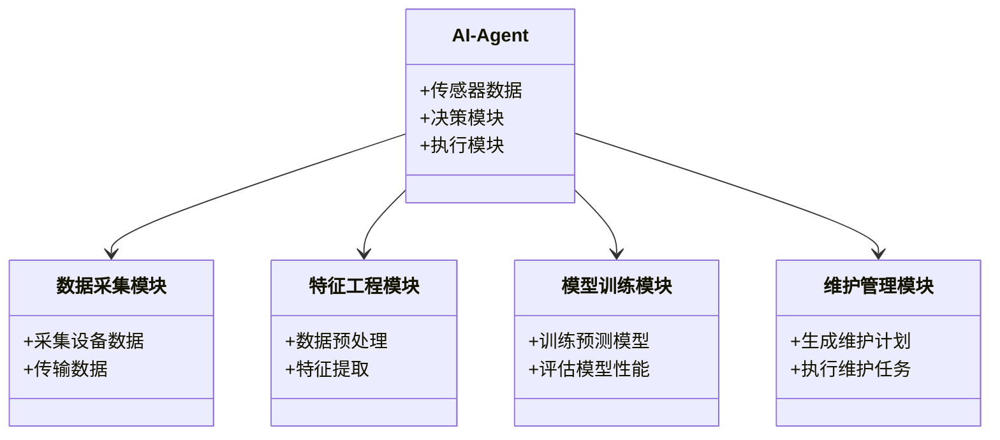

                 


# 构建具有预测维护能力的AI Agent

> 关键词：AI Agent, 预测维护, 机器学习, 系统架构, 工业自动化

> 摘要：本文将详细介绍如何构建一个具有预测维护能力的AI Agent。预测维护是一种通过数据分析和机器学习算法来预测设备故障并提前进行维护的技术，而AI Agent则是一种能够自主执行任务的智能体。本文将从AI Agent与预测维护的基本概念出发，深入探讨预测维护的数学模型与算法原理，详细讲解AI Agent的系统架构设计，最后通过一个实际项目案例展示如何实现具有预测维护能力的AI Agent。

---

# 第一部分: AI Agent与预测维护背景与基础

## 第1章: AI Agent与预测维护概述

### 1.1 AI Agent的基本概念

#### 1.1.1 AI Agent的定义与特点
AI Agent（人工智能代理）是指能够感知环境、自主决策并执行任务的智能系统。AI Agent的特点包括：
- **自主性**：能够在没有外部干预的情况下自主运行。
- **反应性**：能够实时感知环境并做出反应。
- **主动性**：能够主动发起任务或行动。
- **学习能力**：能够通过数据和经验不断优化自身性能。

#### 1.1.2 预测维护的基本概念
预测维护是一种基于数据分析和机器学习算法的维护策略。通过分析设备的运行数据，预测设备的健康状态，并在设备发生故障前安排维护。

#### 1.1.3 AI Agent在预测维护中的作用
AI Agent可以通过实时监控设备数据，利用机器学习算法预测设备故障，并自主发起维护任务，从而实现预测维护的目标。

### 1.2 预测维护的必要性

#### 1.2.1 设备故障对企业的影响
设备故障可能导致生产中断、维修成本增加以及安全隐患等问题。通过预测维护，可以有效减少设备故障的发生，降低企业的损失。

#### 1.2.2 预测维护的优势
- **减少停机时间**：通过提前预测故障，可以在设备发生故障前进行维护，减少停机时间。
- **降低维修成本**：通过预测维护，可以优化维修计划，减少不必要的维修操作。
- **提高设备利用率**：通过延长设备的正常运行时间，提高设备利用率。

#### 1.2.3 预测维护的应用场景
预测维护广泛应用于制造业、能源、交通等领域。例如，在制造业中，可以通过预测维护减少生产线的中断时间。

### 1.3 AI Agent与预测维护的结合

#### 1.3.1 AI Agent在预测维护中的核心作用
AI Agent可以通过实时监控设备数据，利用机器学习算法预测设备故障，并自主发起维护任务。

#### 1.3.2 预测维护如何提升AI Agent的能力
预测维护可以帮助AI Agent更准确地预测设备状态，从而提升其自主决策能力。

#### 1.3.3 预测维护与AI Agent的未来发展
随着人工智能和机器学习技术的不断发展，AI Agent在预测维护中的应用将更加广泛，预测维护的准确性也将不断提高。

### 1.4 本章小结
本章介绍了AI Agent和预测维护的基本概念，并探讨了AI Agent在预测维护中的作用及其必要性。通过预测维护，可以有效减少设备故障，降低企业的损失，提高设备利用率。

---

# 第二部分: AI Agent的核心概念与预测维护的数学模型

## 第2章: AI Agent的核心概念与原理

### 2.1 AI Agent的核心概念

#### 2.1.1 AI Agent的感知机制
AI Agent通过传感器、摄像头等设备感知环境中的数据。

#### 2.1.2 AI Agent的决策机制
AI Agent通过机器学习算法对感知到的数据进行分析，并做出决策。

#### 2.1.3 AI Agent的执行机制
AI Agent根据决策结果执行相应的操作，例如发出维护请求或调整设备参数。

### 2.2 预测维护的核心原理

#### 2.2.1 预测维护的数学模型
预测维护的核心是通过数学模型预测设备的健康状态。常用的数学模型包括回归分析、时间序列分析和分类算法。

#### 2.2.2 预测维护的算法原理
预测维护的算法原理是通过机器学习算法对设备数据进行建模，预测设备的健康状态。

#### 2.2.3 预测维护的实现流程
预测维护的实现流程包括数据采集、数据预处理、模型训练、模型部署和模型评估。

### 2.3 AI Agent与预测维护的结合原理

#### 2.3.1 AI Agent如何实现预测维护
AI Agent通过实时监控设备数据，利用机器学习算法预测设备故障。

#### 2.3.2 预测维护如何提升AI Agent的性能
预测维护可以帮助AI Agent更准确地预测设备状态，从而提升其自主决策能力。

#### 2.3.3 AI Agent与预测维护的协同工作
AI Agent与预测维护协同工作，可以实现设备的自主维护，减少人工干预。

### 2.4 本章小结
本章详细讲解了AI Agent的核心概念与预测维护的数学模型，并探讨了AI Agent与预测维护的结合原理。

---

## 第3章: 预测维护的数学模型

### 3.1 预测维护的基本数学模型

#### 3.1.1 回归分析模型
回归分析模型是一种常用的预测模型。例如，线性回归模型可以用于预测设备的剩余寿命。

#### 3.1.2 时间序列分析模型
时间序列分析模型可以用于预测设备的运行状态随时间的变化趋势。

#### 3.1.3 分类算法模型
分类算法模型可以用于预测设备的健康状态，例如使用随机森林算法对设备进行分类。

### 3.2 预测维护的算法原理

#### 3.2.1 机器学习算法的选择
在预测维护中，常用机器学习算法包括支持向量机、随机森林和XGBoost。

#### 3.2.2 机器学习算法的流程
机器学习算法的流程包括数据预处理、特征提取、模型训练和模型评估。

### 3.3 预测维护的数学公式

#### 3.3.1 线性回归模型
线性回归模型的数学公式为：
$$ y = \beta_0 + \beta_1x + \epsilon $$

#### 3.3.2 随机森林算法
随机森林算法是一种基于树的集成算法，通过多个决策树的组合进行预测。

### 3.4 本章小结
本章详细讲解了预测维护的数学模型和算法原理，介绍了常用的机器学习算法及其数学公式。

---

## 第4章: AI Agent的系统架构设计

### 4.1 系统架构设计概述

#### 4.1.1 系统功能模块
AI Agent的系统功能模块包括数据采集模块、特征工程模块、模型训练模块和维护管理模块。

#### 4.1.2 系统功能模块的交互流程
系统功能模块的交互流程包括数据采集、特征提取、模型训练和维护管理。

### 4.2 系统架构的Mermaid图


### 4.3 本章小结
本章详细讲解了AI Agent的系统架构设计，介绍了系统功能模块及其交互流程，并通过Mermaid图展示了系统的架构。

---

## 第5章: 预测维护的系统实现

### 5.1 系统实现概述

#### 5.1.1 系统实现的目标
系统实现的目标是通过AI Agent实现预测维护，减少设备故障，降低维修成本。

#### 5.1.2 系统实现的步骤
系统实现的步骤包括环境配置、数据预处理、特征工程、模型训练和模型部署。

### 5.2 系统实现的代码示例

#### 5.2.1 环境配置
```python
# 安装必要的库
pip install numpy
pip install pandas
pip install scikit-learn
pip install xgboost
```

#### 5.2.2 数据预处理
```python
import pandas as pd
import numpy as np

# 加载数据
data = pd.read_csv('设备数据.csv')

# 处理缺失值
data = data.dropna()

# 标准化数据
from sklearn.preprocessing import StandardScaler
scaler = StandardScaler()
scaled_data = scaler.fit_transform(data)
```

#### 5.2.3 特征工程
```python
from sklearn.ensemble import RandomForestClassifier
from xgboost import XGBClassifier

# 特征选择
selected_features = ['feature1', 'feature2', 'feature3']
X = data[selected_features]
y = data['label']

# 模型训练
model = RandomForestClassifier()
model.fit(X, y)
```

#### 5.2.4 模型评估
```python
from sklearn.metrics import accuracy_score

# 预测
y_pred = model.predict(X)
print('准确率:', accuracy_score(y, y_pred))
```

### 5.3 本章小结
本章通过代码示例详细讲解了预测维护的系统实现过程，包括环境配置、数据预处理、特征工程和模型训练。

---

## 第6章: 项目实战与案例分析

### 6.1 项目实战概述

#### 6.1.1 项目背景
本项目的目标是通过AI Agent实现设备的预测维护。

#### 6.1.2 项目需求
项目需求包括实时监控设备数据、预测设备故障、生成维护计划和执行维护任务。

### 6.2 项目实现过程

#### 6.2.1 数据采集
通过传感器采集设备的运行数据，并将数据传输到AI Agent。

#### 6.2.2 数据预处理
对采集到的数据进行清洗和标准化处理。

#### 6.2.3 模型训练
使用随机森林算法对设备数据进行建模，训练预测模型。

#### 6.2.4 模型部署
将训练好的模型部署到AI Agent中，实现预测维护功能。

### 6.3 案例分析

#### 6.3.1 案例背景
假设我们有一个制造工厂，需要对设备进行预测维护。

#### 6.3.2 数据分析
通过对设备数据的分析，发现设备的故障率较高，需要通过预测维护来降低故障率。

#### 6.3.3 模型评估
通过评估模型的准确率和召回率，验证模型的性能。

### 6.4 本章小结
本章通过一个实际项目案例，详细讲解了预测维护的实现过程，并通过案例分析展示了预测维护的效果。

---

## 第7章: 总结与展望

### 7.1 本章总结
本文详细讲解了如何构建具有预测维护能力的AI Agent，介绍了预测维护的基本概念、数学模型、系统架构和实现过程。

### 7.2 未来展望
随着人工智能和机器学习技术的不断发展，预测维护的准确性将不断提高，AI Agent在预测维护中的应用将更加广泛。

### 7.3 最佳实践 Tips
- 数据预处理是预测维护的关键，需要仔细清洗和标准化数据。
- 选择合适的算法和模型可以提高预测的准确性。
- 预测维护的实现需要结合企业的实际需求，制定合理的维护策略。

### 7.4 本章小结
本章总结了全文内容，并展望了预测维护的未来发展方向，同时提供了一些最佳实践的建议。

---

# 第三部分: 预测维护的数学模型与算法原理

## 第4章: 预测维护的数学模型

### 4.1 预测维护的基本数学模型

#### 4.1.1 线性回归模型
线性回归模型可以用于预测设备的剩余寿命。

#### 4.1.2 时间序列分析模型
时间序列分析模型可以用于预测设备的运行状态随时间的变化趋势。

#### 4.1.3 分类算法模型
分类算法模型可以用于预测设备的健康状态，例如使用随机森林算法对设备进行分类。

### 4.2 预测维护的算法原理

#### 4.2.1 机器学习算法的选择
在预测维护中，常用机器学习算法包括支持向量机、随机森林和XGBoost。

#### 4.2.2 机器学习算法的流程
机器学习算法的流程包括数据预处理、特征提取、模型训练和模型评估。

### 4.3 本章小结
本章详细讲解了预测维护的数学模型和算法原理，介绍了常用的机器学习算法及其数学公式。

---

## 第5章: AI Agent的系统架构设计

### 5.1 系统架构设计概述

#### 5.1.1 系统功能模块
AI Agent的系统功能模块包括数据采集模块、特征工程模块、模型训练模块和维护管理模块。

#### 5.1.2 系统功能模块的交互流程
系统功能模块的交互流程包括数据采集、特征提取、模型训练和维护管理。

### 5.2 系统架构的Mermaid图


### 5.3 本章小结
本章详细讲解了AI Agent的系统架构设计，介绍了系统功能模块及其交互流程，并通过Mermaid图展示了系统的架构。

---

## 第6章: 预测维护的系统实现

### 6.1 系统实现概述

#### 6.1.1 系统实现的目标
系统实现的目标是通过AI Agent实现预测维护，减少设备故障，降低维修成本。

#### 6.1.2 系统实现的步骤
系统实现的步骤包括环境配置、数据预处理、特征工程、模型训练和模型部署。

### 6.2 系统实现的代码示例

#### 6.2.1 环境配置
```python
# 安装必要的库
pip install numpy
pip install pandas
pip install scikit-learn
pip install xgboost
```

#### 6.2.2 数据预处理
```python
import pandas as pd
import numpy as np

# 加载数据
data = pd.read_csv('设备数据.csv')

# 处理缺失值
data = data.dropna()

# 标准化数据
from sklearn.preprocessing import StandardScaler
scaler = StandardScaler()
scaled_data = scaler.fit_transform(data)
```

#### 6.2.3 特征工程
```python
from sklearn.ensemble import RandomForestClassifier
from xgboost import XGBClassifier

# 特征选择
selected_features = ['feature1', 'feature2', 'feature3']
X = data[selected_features]
y = data['label']

# 模型训练
model = RandomForestClassifier()
model.fit(X, y)
```

#### 6.2.4 模型评估
```python
from sklearn.metrics import accuracy_score

# 预测
y_pred = model.predict(X)
print('准确率:', accuracy_score(y, y_pred))
```

### 6.3 本章小结
本章通过代码示例详细讲解了预测维护的系统实现过程，包括环境配置、数据预处理、特征工程和模型训练。

---

## 第7章: 项目实战与案例分析

### 7.1 项目实战概述

#### 7.1.1 项目背景
本项目的目标是通过AI Agent实现设备的预测维护。

#### 7.1.2 项目需求
项目需求包括实时监控设备数据、预测设备故障、生成维护计划和执行维护任务。

### 7.2 项目实现过程

#### 7.2.1 数据采集
通过传感器采集设备的运行数据，并将数据传输到AI Agent。

#### 7.2.2 数据预处理
对采集到的数据进行清洗和标准化处理。

#### 7.2.3 模型训练
使用随机森林算法对设备数据进行建模，训练预测模型。

#### 7.2.4 模型部署
将训练好的模型部署到AI Agent中，实现预测维护功能。

### 7.3 案例分析

#### 7.3.1 案例背景
假设我们有一个制造工厂，需要对设备进行预测维护。

#### 7.3.2 数据分析
通过对设备数据的分析，发现设备的故障率较高，需要通过预测维护来降低故障率。

#### 7.3.3 模型评估
通过评估模型的准确率和召回率，验证模型的性能。

### 7.4 本章小结
本章通过一个实际项目案例，详细讲解了预测维护的实现过程，并通过案例分析展示了预测维护的效果。

---

## 第8章: 总结与展望

### 8.1 本章总结
本文详细讲解了如何构建具有预测维护能力的AI Agent，介绍了预测维护的基本概念、数学模型、系统架构和实现过程。

### 8.2 未来展望
随着人工智能和机器学习技术的不断发展，预测维护的准确性将不断提高，AI Agent在预测维护中的应用将更加广泛。

### 8.3 最佳实践 Tips
- 数据预处理是预测维护的关键，需要仔细清洗和标准化数据。
- 选择合适的算法和模型可以提高预测的准确性。
- 预测维护的实现需要结合企业的实际需求，制定合理的维护策略。

### 8.4 本章小结
本章总结了全文内容，并展望了预测维护的未来发展方向，同时提供了一些最佳实践的建议。

---

# 结语

通过本文的详细讲解，读者可以深入了解如何构建具有预测维护能力的AI Agent。从基本概念到系统实现，再到实际案例分析，本文为读者提供了一个全面的视角。未来，随着人工智能技术的不断进步，预测维护的应用将更加广泛，AI Agent将在工业自动化和智能化维护中发挥更大的作用。

