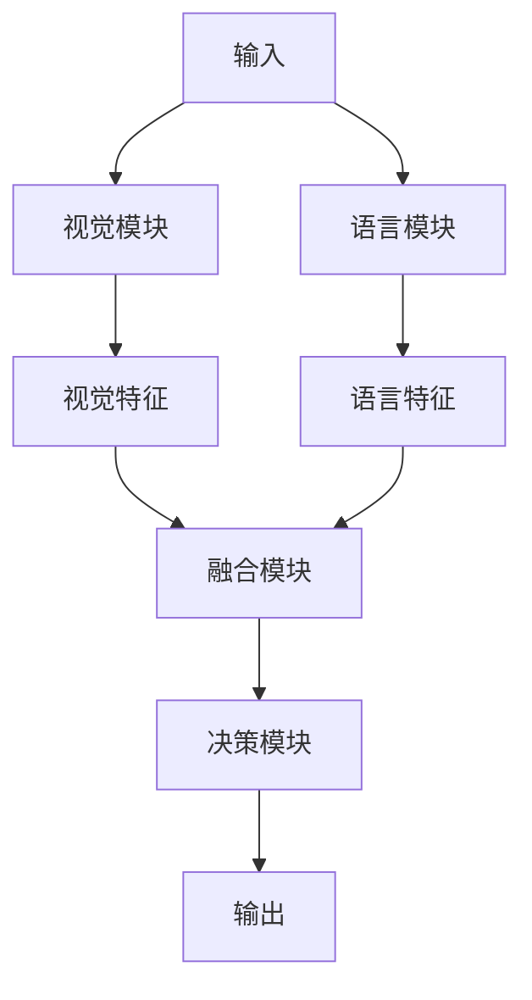

                 


# 构建多模态AI Agent：整合视觉和语言能力

> 关键词：多模态AI Agent, 视觉语言整合, 多模态数据融合, 对比学习, 人工智能系统设计, 视觉语言模型

> 摘要：多模态AI Agent是整合视觉和语言能力的人工智能系统，能够通过多种感官数据进行交互和推理。本文详细探讨了多模态AI Agent的核心概念、算法原理、系统设计和项目实现，为读者提供从理论到实践的全面指导。

---

# 第一部分: 多模态AI Agent基础

## 第1章: 多模态AI Agent概述

### 1.1 多模态AI Agent的背景与意义

#### 1.1.1 多模态AI的定义与特点
多模态AI Agent是一种能够处理和整合多种数据模态（如视觉、语言、音频等）的人工智能系统。与单一模态的AI系统相比，多模态AI Agent能够更好地理解和处理复杂的现实场景，提供更全面的交互体验。

**多模态AI Agent的特点：**
- **多维感知**：能够同时处理多种类型的数据输入。
- **语义理解**：能够理解不同模态数据之间的语义关联。
- **协同学习**：通过不同模态的数据相互补充，提升模型的泛化能力。

#### 1.1.2 多模态AI Agent的应用场景
多模态AI Agent在多个领域都有广泛的应用，如：
- **智能助手**：如 Siri、Alexa 等，通过语音和文本交互提供服务。
- **机器人**：具备视觉和语言能力的机器人能够更好地完成复杂任务。
- **医疗健康**：通过整合医学图像和文本数据，辅助医生进行诊断。

#### 1.1.3 多模态AI Agent的核心价值
- 提升用户体验：通过多模态交互，用户可以获得更自然、更丰富的交互体验。
- 增强系统能力：多模态数据的整合能够帮助AI系统更好地理解和推理复杂的场景。
- 扩展应用场景：多模态AI Agent能够覆盖更多场景，解决单一模态AI无法处理的问题。

---

### 1.2 视觉与语言模态的整合

#### 1.2.1 视觉模态的基础知识
视觉模态主要涉及图像和视频数据的处理。计算机视觉技术（如CNN、RCNN等）能够从图像中提取特征信息，帮助AI系统理解图像内容。

#### 1.2.2 语言模态的基础知识
语言模态主要涉及文本数据的处理。自然语言处理技术（如BERT、GPT等）能够从文本中提取语义信息，帮助AI系统理解语言内容。

#### 1.2.3 视觉与语言模态的整合方式
视觉与语言模态的整合可以通过以下几种方式实现：
- **特征对齐**：将视觉特征和语言特征进行对齐，以便模型能够同时利用两种模态的信息。
- **联合学习**：通过多任务学习的方式，同时优化视觉和语言任务的性能。
- **跨模态推理**：利用视觉信息辅助语言理解，或利用语言信息辅助视觉分析。

---

### 1.3 多模态AI Agent的挑战与机遇

#### 1.3.1 多模态数据处理的挑战
- 数据异构性：不同模态的数据格式和特征维度不同，难以直接融合。
- 数据稀缺性：高质量的多模态标注数据较为稀缺，限制了模型的训练效果。
- 计算复杂度：多模态数据的处理通常需要大量的计算资源。

#### 1.3.2 多模态模型训练的难点
- 跨模态对齐：如何在不同模态之间建立有效的对齐关系。
- 模态权重分配：如何在不同模态之间分配合适的权重，以达到最优的模型性能。
- 模态冲突：不同模态的信息可能存在冲突，需要模型具备足够的鲁棒性来处理。

#### 1.3.3 多模态AI Agent的未来发展方向
- 更强的跨模态理解能力：通过更先进的模型结构和算法，提升模型对不同模态数据的理解能力。
- 更高效的计算方式：通过优化算法和硬件加速，降低多模态数据处理的计算成本。
- 更广泛的应用场景：拓展多模态AI Agent的应用领域，覆盖更多复杂的现实场景。

---

### 1.4 本章小结
本章主要介绍了多模态AI Agent的基本概念、视觉与语言模态的整合方式以及多模态AI Agent面临的挑战和未来发展方向。通过本章的学习，读者可以对多模态AI Agent的核心思想和应用场景有一个初步的了解。

---

## 第2章: 多模态数据处理基础

### 2.1 视觉数据处理

#### 2.1.1 图像处理基础
图像处理是计算机视觉的基础，主要包括图像的采集、预处理、特征提取和目标检测等步骤。

##### 图像预处理
图像预处理是图像处理的重要步骤，主要包括：
- **归一化**：将图像的像素值归一化到[0,1]范围内，便于模型的训练。
- **数据增强**：通过旋转、缩放、翻转等操作，增加训练数据的多样性。

##### 图像特征提取
图像特征提取是图像处理的核心任务，常用的模型包括：
- **CNN（卷积神经网络）**：通过卷积操作提取图像的空间特征。
- **ResNet**：一种改进的CNN结构，通过残差连接提升模型的性能。

#### 2.1.2 视频处理基础
视频处理是对视频数据进行分析和处理的过程，主要包括视频流的分割、视频特征提取和视频语义理解。

##### 视频特征提取
视频特征提取可以通过以下方法实现：
- **2D-CNN**：在视频的每个帧上提取特征，并将这些特征拼接起来表示整个视频。
- **3D-CNN**：通过3D卷积操作直接提取视频的空间和时间特征。

#### 2.1.3 视觉数据的特征提取
视觉数据的特征提取是多模态AI Agent的核心任务之一。常用的视觉特征提取方法包括：
- **基于CNN的特征提取**：通过CNN提取图像的高层语义特征。
- **基于区域的特征提取**：通过RPN（区域建议网络）提取图像中感兴趣区域的特征。

---

### 2.2 语言数据处理

#### 2.2.1 文本处理基础
文本处理是自然语言处理的基础，主要包括文本的分词、句法分析和语义理解。

##### 文本分词
文本分词是将文本分割成有意义的词语或短语的过程，常用的分词工具包括：
- **jieba**：中文分词工具。
- **spaCy**：支持多种语言的分词工具。

##### 文本特征提取
文本特征提取是自然语言处理的核心任务，常用的特征提取方法包括：
- **TF-IDF**：基于词频-逆文档频率的特征提取方法。
- **Word2Vec**：通过词向量模型提取词语的语义特征。

#### 2.2.2 语言模型的特征提取
语言模型的特征提取是通过语言模型（如BERT、GPT）提取文本的语义特征。常用的语言模型包括：
- **BERT**：基于Transformer的双向语言模型。
- **GPT**：基于Transformer的生成式语言模型。

#### 2.2.3 视觉与语言数据的对齐
视觉与语言数据的对齐是多模态数据处理的关键步骤，主要包括：
- **跨模态对齐**：通过对比学习等方法，将视觉特征和语言特征对齐。
- **语义对齐**：通过语言模型对视觉描述进行语义对齐。

---

### 2.3 多模态数据融合方法

#### 2.3.1 基于特征融合的方法
基于特征融合的方法是通过将不同模态的特征进行融合，生成新的特征表示。常用的特征融合方法包括：
- **加性融合**：将不同模态的特征直接相加。
- **乘性融合**：将不同模态的特征进行点乘。
- **注意力融合**：通过注意力机制对不同模态的特征进行加权融合。

#### 2.3.2 基于注意力机制的融合方法
注意力机制是一种有效的特征融合方法，能够根据不同的模态特征的重要性进行加权。

##### 示例：视觉与语言特征的注意力融合
$$
\text{attention}(v, l) = \frac{\exp(\text{sim}(v, l))}{\sum \exp(\text{sim}(v, l))}
$$
其中，$v$ 表示视觉特征，$l$ 表示语言特征，$\text{sim}$ 表示相似度计算函数。

#### 2.3.3 基于对比学习的融合方法
对比学习是一种有效的特征对齐方法，通过最大化相同模态特征之间的相似性，以及最小化不同模态特征之间的相似性，实现跨模态对齐。

##### 对比学习示例
$$
\text{loss} = -\log \frac{\exp(\text{sim}(x, y))}{\exp(\text{sim}(x, y)) + \sum_{k \neq y} \exp(\text{sim}(x, k))}
$$
其中，$x$ 表示视觉特征，$y$ 表示对应的语言特征，$k$ 表示其他语言特征。

---

### 2.4 本章小结
本章主要介绍了视觉和语言数据的处理方法，以及多模态数据融合的核心技术。通过本章的学习，读者可以掌握如何对视觉和语言数据进行有效的特征提取和融合。

---

## 第3章: 多模态AI Agent的核心概念与联系

### 3.1 多模态数据融合的原理

#### 3.1.1 数据融合的层次结构
数据融合的层次结构包括：
- **特征级融合**：在特征层面上进行融合，生成新的特征表示。
- **决策级融合**：在决策层面上进行融合，生成最终的决策结果。
- **语义级融合**：在语义层面上进行融合，生成语义一致的表示。

#### 3.1.2 多模态数据的特征对齐
特征对齐是多模态数据融合的核心步骤，通过对比学习等方法，将不同模态的特征对齐到同一个语义空间。

#### 3.1.3 多模态数据的语义对齐
语义对齐是通过语言模型对视觉描述进行语义对齐，确保不同模态的数据在语义上具有一致性。

---

### 3.2 多模态模型的架构设计

#### 3.2.1 多模态编码器的设计
多模态编码器的设计包括：
- **视觉编码器**：将视觉数据编码为视觉特征。
- **语言编码器**：将语言数据编码为语言特征。

#### 3.2.2 多模态解码器的设计
多模态解码器的设计包括：
- **视觉解码器**：将视觉特征解码为视觉输出。
- **语言解码器**：将语言特征解码为语言输出。

#### 3.2.3 多模态模型的训练策略
多模态模型的训练策略包括：
- **联合训练**：同时训练视觉和语言任务。
- **对比学习**：通过对比学习进行跨模态对齐。

---

### 3.3 多模态数据融合的对比分析

#### 3.3.1 基于特征的对比分析
基于特征的对比分析包括：
- **特征相似性分析**：通过计算特征之间的相似性，评估特征对齐的效果。
- **特征分布分析**：通过分析特征的分布，评估特征对齐的质量。

#### 3.3.2 基于语义的对比分析
基于语义的对比分析包括：
- **语义相似性分析**：通过语言模型评估语义相似性。
- **语义对齐分析**：通过对比学习评估语义对齐的效果。

#### 3.3.3 基于任务的对比分析
基于任务的对比分析包括：
- **任务性能对比**：通过不同融合方法在任务上的性能对比，评估融合方法的有效性。
- **任务成功率对比**：通过不同融合方法在任务上的成功率对比，评估融合方法的鲁棒性。

---

### 3.4 本章小结
本章主要介绍了多模态数据融合的核心原理和多模态模型的架构设计。通过本章的学习，读者可以掌握多模态数据融合的核心思想和实现方法。

---

## 第4章: 多模态AI Agent的算法原理

### 4.1 多模态数据融合的算法原理

#### 4.1.1 对比学习的算法原理
对比学习是一种有效的跨模态对齐方法，通过最大化相同模态特征之间的相似性，以及最小化不同模态特征之间的相似性，实现跨模态对齐。

##### 对比学习的实现步骤
1. **特征提取**：分别提取视觉特征和语言特征。
2. **特征对齐**：通过对比学习对齐视觉特征和语言特征。
3. **损失计算**：计算对比学习的损失函数。
4. **模型优化**：通过优化器优化模型参数。

#### 4.1.2 多任务学习的算法原理
多任务学习是一种有效的多模态数据融合方法，通过同时优化多个任务的性能，实现跨模态数据的联合优化。

##### 多任务学习的实现步骤
1. **任务定义**：定义多个任务，如视觉分类和语言分类。
2. **特征提取**：提取视觉和语言特征。
3. **任务优化**：通过多任务学习优化模型参数。
4. **权重分配**：通过权重分配实现不同任务之间的平衡。

---

### 4.2 多模态AI Agent的训练流程

#### 4.2.1 数据预处理
数据预处理包括：
- **数据清洗**：去除噪声数据。
- **数据增强**：增加数据的多样性。
- **数据归一化**：将数据归一化到统一的范围。

#### 4.2.2 模型训练
模型训练包括：
- **特征提取**：通过编码器提取视觉和语言特征。
- **特征融合**：通过对比学习或注意力机制融合特征。
- **任务优化**：通过优化器优化模型参数。

#### 4.2.3 模型评估
模型评估包括：
- **性能评估**：通过准确率、召回率等指标评估模型的性能。
- **结果分析**：通过分析模型的输出结果，评估模型的鲁棒性和泛化能力。

---

### 4.3 本章小结
本章主要介绍了多模态数据融合的核心算法原理和多模态AI Agent的训练流程。通过本章的学习，读者可以掌握多模态数据融合的核心算法和实现步骤。

---

## 第5章: 多模态AI Agent的系统设计

### 5.1 系统功能设计

#### 5.1.1 系统功能模块
多模态AI Agent的系统功能模块包括：
- **视觉模块**：负责处理视觉数据，提取视觉特征。
- **语言模块**：负责处理语言数据，提取语言特征。
- **融合模块**：负责融合视觉和语言特征，生成最终的表示。
- **决策模块**：负责根据融合的特征进行决策。

#### 5.1.2 系统功能流程
系统功能流程包括：
1. **输入处理**：接收视觉和语言输入。
2. **特征提取**：分别提取视觉和语言特征。
3. **特征融合**：通过对比学习或注意力机制融合特征。
4. **决策输出**：根据融合的特征进行决策输出。

---

### 5.2 系统架构设计

#### 5.2.1 系统架构图
以下是多模态AI Agent的系统架构图：



#### 5.2.2 模块交互流程
模块交互流程包括：
1. **输入处理**：接收视觉和语言输入。
2. **特征提取**：视觉模块提取视觉特征，语言模块提取语言特征。
3. **特征融合**：融合模块将视觉和语言特征进行融合。
4. **决策输出**：决策模块根据融合的特征进行决策输出。

---

### 5.3 本章小结
本章主要介绍了多模态AI Agent的系统功能设计和系统架构设计。通过本章的学习，读者可以掌握多模态AI Agent的系统设计方法和实现流程。

---

## 第6章: 多模态AI Agent的项目实战

### 6.1 项目环境安装

#### 6.1.1 安装Python
安装Python：
```bash
sudo apt-get install python3
```

#### 6.1.2 安装依赖库
安装依赖库：
```bash
pip install numpy
pip install matplotlib
pip install tensorflow
pip install keras
pip install transformers
```

---

### 6.2 系统核心实现源代码

#### 6.2.1 视觉模块代码
```python
import numpy as np
import tensorflow as tf
from tensorflow.keras import layers

def visual_encoder(input_shape):
    model = tf.keras.Sequential()
    model.add(layers.Conv2D(32, (3, 3), activation='relu', input_shape=input_shape))
    model.add(layers.MaxPooling2D((2, 2)))
    model.add(layers.Conv2D(64, (3, 3), activation='relu'))
    model.add(layers.MaxPooling2D((2, 2)))
    model.add(layers.Flatten())
    model.add(layers.Dense(128, activation='relu'))
    return model
```

#### 6.2.2 语言模块代码
```python
import numpy as np
import tensorflow as tf
from tensorflow.keras import layers
from transformers import BertTokenizer, TFBertModel

def language_encoder(tokenizer, max_length):
    model = TFBertModel.from_pretrained('bert-base-uncased')
    inputs = {
        'input_ids': tf.keras.Input(shape=(max_length,), dtype='int64'),
        'attention_mask': tf.keras.Input(shape=(max_length,), dtype='int64')
    }
    outputs = model(inputs)
    encoder = tf.keras.Model(inputs=inputs, outputs=outputs.last_hidden_state)
    return encoder
```

#### 6.2.3 融合模块代码
```python
import numpy as np
import tensorflow as tf
from tensorflow.keras import layers

def fusion_module(visual_features, language_features):
    visual_dense = layers.Dense(128, activation='relu')(visual_features)
    language_dense = layers.Dense(128, activation='relu')(language_features)
    fused_features = layers.concatenate([visual_dense, language_dense])
    output = layers.Dense(1, activation='sigmoid')(fused_features)
    return output
```

---

### 6.3 项目实战小结
本章通过一个具体的项目实战，详细介绍了多模态AI Agent的环境安装和核心代码实现。通过本章的学习，读者可以掌握多模态AI Agent的项目实现方法和注意事项。

---

## 第7章: 最佳实践与总结

### 7.1 最佳实践

#### 7.1.1 数据处理
- 确保数据的多样性和代表性。
- 对数据进行合理的预处理和增强。

#### 7.1.2 模型优化
- 合理选择模型结构和参数。
- 使用对比学习等先进技术优化模型性能。

#### 7.1.3 系统设计
- 明确系统的功能模块和交互流程。
- 合理设计系统的架构，确保系统的可扩展性和可维护性。

---

### 7.2 小结

通过本章的学习，读者可以掌握多模态AI Agent的最佳实践方法和系统设计技巧。

---

## 总结

本文详细介绍了多模态AI Agent的核心概念、算法原理、系统设计和项目实现。通过本文的学习，读者可以全面掌握多模态AI Agent的构建方法，并能够在实际应用中灵活运用这些技术。

---

**关键词：多模态AI Agent, 视觉语言整合, 多模态数据融合, 对比学习, 人工智能系统设计, 视觉语言模型**

**摘要：** 多模态AI Agent是整合视觉和语言能力的人工智能系统，能够通过多种感官数据进行交互和推理。本文详细探讨了多模态AI Agent的核心概念、算法原理、系统设计和项目实现，为读者提供从理论到实践的全面指导。

