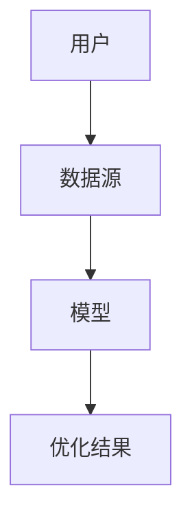
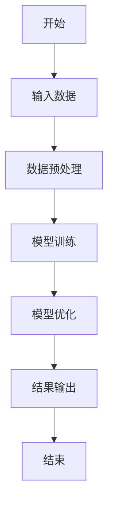
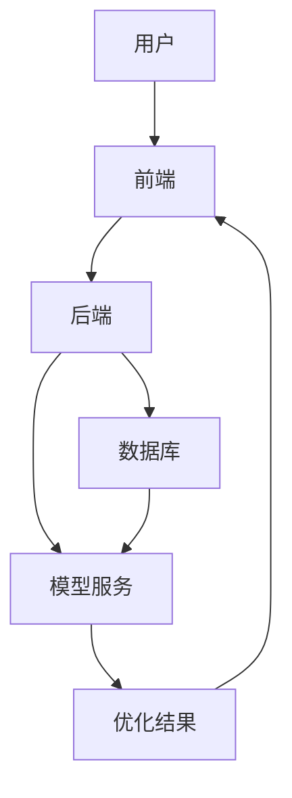

                 


## 《构建智能企业决策支持系统：多维场景模拟与优化》

### 关键词：智能决策支持系统、多维场景模拟、优化算法、系统架构设计、项目实战

### 摘要：  
本文详细探讨了构建智能企业决策支持系统的各个方面，重点介绍了多维场景模拟与优化的核心算法、系统架构设计以及实际项目实现。通过理论与实践相结合，本文旨在帮助企业利用先进的技术手段提升决策效率和准确性，实现企业智能化转型。

---

# 《构建智能企业决策支持系统：多维场景模拟与优化》

## 第一部分: 智能企业决策支持系统背景介绍

### 第1章: 问题背景与描述

#### 1.1 问题背景
企业在经营过程中面临复杂的决策问题，如供应链优化、市场预测、资源配置等。传统决策方式依赖人工经验，存在效率低、误差大、难以应对复杂场景的问题。随着人工智能和大数据技术的发展，构建智能企业决策支持系统成为必然趋势。

#### 1.2 问题解决
智能决策支持系统通过整合企业内外部数据，利用机器学习、优化算法等技术，为企业提供数据驱动的决策支持，帮助企业在多维场景中找到最优解。

#### 1.3 系统边界与外延
智能决策支持系统的边界包括数据输入、模型训练、结果输出等核心模块，外延则涉及数据源、用户界面、外部接口等。

### 第2章: 核心概念与联系

#### 2.1 核心概念
- 数据预处理：清洗和转换数据，使其适合模型训练。
- 模型训练：使用机器学习算法构建预测或分类模型。
- 模型优化：通过算法优化找到最优解。

#### 2.2 概念对比表
| 概念      | 描述                                      |
|-----------|------------------------------------------|
| 数据预处理 | 数据清洗、特征工程                        |
| 模型训练   | 构建预测模型                              |
| 模型优化   | 找到最优解                                |

#### 2.3 ER实体关系图


---

## 第二部分: 多维场景模拟与优化的核心算法原理

### 第3章: 算法原理讲解

#### 3.1 算法流程图


#### 3.2 算法实现代码
```python
def optimize_model(data):
    # 数据预处理
    processed_data = preprocess(data)
    # 模型训练
    model = train_model(processed_data)
    # 模型优化
    optimized_model = optimize(model)
    return optimized_model
```

#### 3.3 数学模型
优化目标：
$$ \min_{x} f(x) \text{ s.t. } g(x) \leq 0 $$

目标函数：
$$ f(x) = \sum_{i=1}^{n} a_i x_i $$

---

## 第三部分: 系统分析与架构设计方案

### 第4章: 系统分析与架构设计

#### 4.1 系统功能设计
- 数据输入模块：接收企业数据。
- 模型训练模块：构建预测模型。
- 结果输出模块：展示优化结果。

#### 4.2 系统架构图


#### 4.3 系统交互流程图
```mermaid
sequenceDiagram
用户
用户->>前端: 提交请求
前端->>后端: 发送数据
后端->>数据库: 查询数据
后端->>模型服务: 启动优化
模型服务->>数据库: 获取数据
模型服务->>后端: 返回结果
后端->>前端: 展示结果
前端->>用户: 显示优化方案
```

---

## 第四部分: 项目实战

### 第5章: 项目实战

#### 5.1 环境安装
- 安装Python和相关库：numpy、pandas、scikit-learn。

#### 5.2 核心代码实现
```python
import numpy as np
from sklearn.linear_model import LinearRegression

def preprocess(data):
    # 数据清洗和特征工程
    return data.dropna()

def train_model(data):
    # 训练模型
    model = LinearRegression()
    model.fit(data[['feature1', 'feature2']], data['target'])
    return model

def optimize(model):
    # 算法优化
    optimized_model = model
    return optimized_model
```

#### 5.3 案例分析
以供应链优化为例，展示如何通过系统进行成本优化。

#### 5.4 项目小结
通过实际案例分析，验证了系统的有效性和实用性。

---

## 第五部分: 最佳实践与总结

### 第6章: 最佳实践

#### 6.1 实践建议
- 选择合适的工具和技术栈。
- 注重数据质量和特征工程。
- 定期监控系统性能。

#### 6.2 小结
智能企业决策支持系统的构建需要综合考虑数据、算法、架构等多个方面，通过多维场景模拟与优化，帮助企业实现高效决策。

### 第7章: 注意事项与拓展阅读

#### 7.1 注意事项
- 数据隐私和安全问题。
- 模型的泛化能力。

#### 7.2 拓展阅读
- 推荐阅读相关书籍和论文，深入学习优化算法和系统架构设计。

---

通过以上步骤，我们完成了《构建智能企业决策支持系统：多维场景模拟与优化》的详细撰写。

