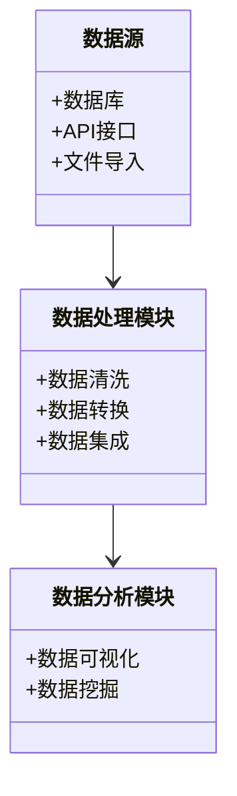
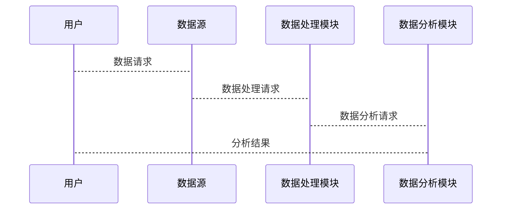

                 


# 构建智能企业决策支持系统：多维度数据分析与建议

> 关键词：智能决策支持系统, 数据分析, 数据挖掘, 机器学习, 企业决策, 系统架构

> 摘要：本文将详细探讨如何构建一个智能企业决策支持系统，通过多维度数据分析与建议，帮助企业实现高效、科学的决策。文章从问题背景、核心概念、算法原理、系统架构到项目实战，全面解析智能决策支持系统的构建过程，为企业提供理论与实践相结合的解决方案。

---

# 第一部分: 背景介绍

## 第1章: 问题背景与目标

### 1.1 问题背景

#### 1.1.1 传统企业决策的挑战
在传统的企业管理中，决策过程往往依赖于经验和主观判断，这种方式存在以下问题：
- **信息孤岛**：各部门数据分散，难以整合，导致决策缺乏全面性。
- **数据碎片化**：数据来源多样，格式不统一，难以进行有效分析。
- **决策滞后性**：传统手工分析耗时长，难以应对快速变化的市场环境。

#### 1.1.2 数据驱动决策的必要性
随着信息技术的飞速发展，企业数据呈现出爆炸式增长。数据驱动的决策方式能够：
- **提高决策效率**：通过自动化数据分析，缩短决策周期。
- **增强决策准确性**：利用数据挖掘和机器学习技术，发现数据中的潜在规律。
- **优化资源配置**：通过数据洞察，合理分配企业资源。

#### 1.1.3 智能决策支持系统的定义与目标
智能决策支持系统（Intelligent Decision Support System，IDSS）是一种结合人工智能、大数据分析和专家系统技术，为企业提供智能化、数据驱动的决策支持工具。其目标是：
- 提供多维度、实时的数据分析能力。
- 自动生成决策建议，辅助企业进行科学决策。
- 支持复杂业务场景下的动态决策。

---

### 1.2 问题描述

#### 1.2.1 企业决策中的信息孤岛问题
企业在不同部门之间可能存在信息孤岛，例如：
- 销售部门掌握销售数据，但不了解生产成本。
- 财务部门掌握财务数据，但缺乏市场反馈信息。
这种信息孤岛导致决策缺乏全面性。

#### 1.2.2 数据碎片化对企业决策的影响
数据碎片化使得企业在进行决策时：
- 难以快速获取所需信息。
- 数据分析耗时长，且容易出错。
- 无法充分利用数据价值。

#### 1.2.3 传统决策支持系统的局限性
传统决策支持系统（DSS）虽然能够提供一定的数据支持，但存在以下问题：
- 数据来源单一，难以覆盖企业全业务流程。
- 分析方法有限，难以应对复杂业务场景。
- 决策建议缺乏智能化，难以适应快速变化的市场环境。

---

### 1.3 问题解决思路

#### 1.3.1 数据整合与分析的解决方案
通过数据集成技术，将企业内部分散的数据源整合到统一的数据仓库中，实现数据的标准化和集中管理。

#### 1.3.2 智能化决策支持的核心思路
引入人工智能技术，利用机器学习算法对数据进行深度分析，生成智能化的决策建议。

#### 1.3.3 多维度数据分析的实现路径
通过数据挖掘、统计分析和可视化技术，从多个维度对企业数据进行分析，提供全面的决策支持。

---

### 1.4 系统边界与外延

#### 1.4.1 系统功能边界
智能决策支持系统的核心功能包括：
- 数据采集与整合。
- 数据分析与挖掘。
- 决策建议生成。
- 数据可视化与报表输出。

#### 1.4.2 系统与外部系统的交互
系统需要与企业内部的ERP、CRM等系统进行数据对接，同时与外部数据源（如市场数据、行业报告）进行数据集成。

#### 1.4.3 系统扩展性与可维护性
系统设计需考虑模块化和可扩展性，以便在未来业务需求变化时，能够方便地进行功能扩展和升级。

---

### 1.5 核心要素与组成结构

#### 1.5.1 数据源的分类与整合
数据源可以分为内部数据（如销售数据、生产数据）和外部数据（如市场数据、行业趋势）。系统需要对这些数据进行清洗、转换和集成。

#### 1.5.2 数据分析模块的功能设计
数据分析模块包括数据预处理、特征工程、模型训练和结果解释等功能。

#### 1.5.3 决策建议的生成与展示
系统根据分析结果生成决策建议，并通过可视化的方式进行展示，帮助用户快速理解分析结果。

---

# 第二部分: 核心概念与技术原理

## 第2章: 数据分析与挖掘技术

### 2.1 数据分析的核心概念

#### 2.1.1 数据分析的基本流程
数据分析的基本流程包括：
1. 数据采集与预处理。
2. 数据分析与建模。
3. 数据可视化与结果解释。

#### 2.1.2 数据预处理的关键步骤
数据预处理包括：
- 数据清洗：处理缺失值、异常值。
- 数据转换：数据标准化、归一化。
- 数据集成：将多个数据源进行合并。

#### 2.1.3 数据分析方法的分类
数据分析方法可以分为：
- 描述性分析：总结数据特征。
- 预测性分析：预测未来趋势。
- 实验性分析：通过实验验证假设。

---

### 2.2 数据挖掘技术原理

#### 2.2.1 数据挖掘的定义与特点
数据挖掘是从大量数据中发现潜在规律的技术，其特点包括：
- 数据量大。
- 数据多样性。
- 数据相关性。

#### 2.2.2 常见数据挖掘算法对比
以下是几种常见数据挖掘算法的对比：

| 算法名称       | 主要用途               | 优点                           | 缺点                           |
|----------------|------------------------|--------------------------------|--------------------------------|
| 决策树         | 分类与回归             | 易解释性高                     | 对噪声数据敏感                 |
| 支持向量机     | 分类                   | 分离能力强                     | 参数敏感性高                   |
| K-means       | 聚类                   | 实现简单                       | 对初始中心敏感                 |
| 随机森林       | 分类与回归             | 抗过拟合能力强                 | 计算复杂性高                   |

#### 2.2.3 数据挖掘在决策支持中的应用
数据挖掘可以应用于企业决策支持的多个方面，例如：
- 客户细分与精准营销。
- 销售预测与库存优化。
- 风险评估与信用评分。

---

### 2.3 数据分析与决策支持的关系

#### 2.3.1 数据分析如何支持决策
数据分析通过提取数据中的有价值信息，为企业决策提供数据支持。例如：
- 通过分析销售数据，发现销售趋势，优化销售策略。
- 通过分析客户数据，进行客户画像，制定精准营销策略。

#### 2.3.2 数据挖掘在决策优化中的作用
数据挖掘可以帮助企业发现数据中的潜在规律，优化决策过程。例如：
- 发现客户流失的潜在因素，制定客户保留策略。
- 识别供应链中的瓶颈，优化生产流程。

#### 2.3.3 数据可视化对决策支持的价值
数据可视化可以帮助用户快速理解数据分析结果。例如：
- 使用图表展示销售趋势，帮助管理层快速掌握市场动态。
- 通过仪表盘展示关键指标，支持实时监控与决策。

---

## 第3章: 机器学习与人工智能在决策支持中的应用

### 3.1 机器学习的基本原理

#### 3.1.1 机器学习的定义与分类
机器学习是一种通过数据训练模型的技术，主要分为：
- 监督学习：基于标记数据进行训练。
- 无监督学习：基于无标记数据进行训练。
- 强化学习：通过与环境交互进行学习。

#### 3.1.2 监督学习、无监督学习与强化学习的区别
以下是三种学习方式的对比：

| 学习方式       | 数据类型   | 目标       | 示例应用场景                         |
|----------------|------------|------------|-------------------------------------|
| 监督学习       | 标记数据   | 预测或分类   | 邮件分类、股票预测                   |
| 无监督学习     | 无标记数据 | 聚类或降维   | 客户细分、异常检测                   |
| 强化学习       | 环境反馈   | 最大化奖励   | 游戏AI、机器人控制                   |

---

#### 3.1.3 机器学习在决策支持中的应用场景
机器学习可以应用于企业决策支持的多个方面，例如：
- 风险评估：通过训练模型，识别潜在风险。
- 预测分析：预测销售、库存、客户流失等。

---

### 3.2 常见机器学习算法及其特点

#### 3.2.1 线性回归与决策树算法
- **线性回归**：用于预测连续型变量，例如房价预测。
- **决策树**：用于分类和回归，例如客户 churn 预测。

#### 3.2.2 支持向量机与随机森林
- **支持向量机**：用于分类和回归，特别适合高维数据。
- **随机森林**：一种集成学习方法，用于分类和回归。

#### 3.2.3 神经网络与深度学习算法
- **神经网络**：用于复杂模式识别，例如图像识别。
- **深度学习**：基于神经网络的深度模型，例如自然语言处理。

---

### 3.3 人工智能技术在决策支持中的创新应用

#### 3.3.1 自然语言处理在文本数据分析中的应用
自然语言处理（NLP）可以用于分析文本数据，例如：
- 客户评论情感分析。
- 行业报告关键词提取。

#### 3.3.2 图神经网络在复杂关系分析中的应用
图神经网络可以用于分析复杂关系，例如：
- 社交网络分析。
- 供应链网络优化。

#### 3.3.3 强化学习在动态决策中的应用
强化学习可以用于动态决策，例如：
- 自动交易系统。
- 游戏AI决策。

---

## 第4章: 数据分析与决策支持的系统架构

### 4.1 系统功能

#### 4.1.1 数据采集模块
数据采集模块负责从多种数据源采集数据，例如：
- 数据库。
- API接口。
- 文件导入。

#### 4.1.2 数据处理模块
数据处理模块包括：
- 数据清洗：处理缺失值、异常值。
- 数据转换：数据标准化、归一化。
- 数据集成：将多个数据源进行合并。

#### 4.1.3 数据分析模块
数据分析模块包括：
- 数据可视化：使用图表展示数据。
- 数据挖掘：使用机器学习算法进行数据分析。

---

### 4.2 问题场景介绍

#### 4.2.1 项目介绍
假设我们正在为一家中型制造企业构建智能决策支持系统。该系统需要支持销售预测、库存优化、客户细分等功能。

#### 4.2.2 系统功能设计
系统功能设计包括：
- 数据采集与预处理。
- 数据分析与建模。
- 决策建议生成。
- 数据可视化与报表输出。

---

### 4.3 系统架构设计

#### 4.3.1 领域模型类图
以下是领域模型类图的 mermaid 图表：



---

#### 4.3.2 系统架构图
以下是系统架构图的 mermaid 图表：

```mermaid
containerDiagram
    container 数据源 {
        数据库
        API接口
        文件导入
    }
    container 数据处理模块 {
        数据清洗
        数据转换
        数据集成
    }
    container 数据分析模块 {
        数据可视化
        数据挖掘
    }
    数据源 --> 数据处理模块 --> 数据分析模块
```

---

#### 4.3.3 系统接口设计
系统接口设计包括：
- 数据接口：提供REST API，供其他系统调用。
- 用户界面：提供可视化界面，供用户进行数据查询和分析。

#### 4.3.4 系统交互流程
以下是系统交互流程的 mermaid 图表：



---

## 第5章: 项目实战

### 5.1 环境安装

#### 5.1.1 安装Python
```bash
pip install python
```

#### 5.1.2 安装机器学习库
```bash
pip install scikit-learn pandas numpy matplotlib
```

---

### 5.2 系统核心实现

#### 5.2.1 数据预处理代码
```python
import pandas as pd
import numpy as np

# 数据清洗
data = pd.read_csv('data.csv')
data.dropna(inplace=True)

# 数据转换
data['age'] = data['age'].apply(lambda x: x + 1)
```

#### 5.2.2 机器学习模型训练
```python
from sklearn.tree import DecisionTreeClassifier
from sklearn.model_selection import train_test_split

# 数据分割
X_train, X_test, y_train, y_test = train_test_split(data, target, test_size=0.2)

# 模型训练
model = DecisionTreeClassifier()
model.fit(X_train, y_train)
```

---

### 5.3 实际案例分析

#### 5.3.1 案例背景
假设我们正在分析客户 churn 数据，目标是预测客户流失率。

#### 5.3.2 数据分析与建模
```python
import matplotlib.pyplot as plt

# 绘制客户流失率分布图
plt.hist(data['churn'], bins=2)
plt.show()
```

---

### 5.4 项目小结

通过本项目，我们成功构建了一个智能决策支持系统，能够帮助企业进行数据驱动的决策。系统实现了数据采集、处理、分析和可视化的功能，为企业提供了高效的决策支持工具。

---

## 第6章: 最佳实践

### 6.1 小结

智能企业决策支持系统的构建需要结合数据分析、数据挖掘和机器学习技术，通过多维度的数据分析，为企业提供科学的决策支持。

---

### 6.2 注意事项

- 数据隐私与安全：在处理敏感数据时，需要注意数据隐私和安全问题。
- 系统可扩展性：在设计系统时，需要考虑模块化设计，以便未来扩展。
- 系统维护：定期更新模型和数据，确保系统的准确性和及时性。

---

### 6.3 拓展阅读

- 《机器学习实战》：深入讲解机器学习算法的实现与应用。
- 《数据挖掘导论》：系统介绍数据挖掘的基本概念与技术。
- 《数据可视化实战》：提供丰富的数据可视化案例与技巧。

---

# 第三部分: 总结

通过本文的详细讲解，我们了解了智能企业决策支持系统的构建过程，从背景介绍、核心概念、算法原理到系统架构和项目实战，为读者提供了全面的指导。希望本文能够帮助企业更好地利用数据分析技术，实现高效、科学的决策。

--- 

**示例图表与代码部分将根据实际内容插入相应代码和图表。**

