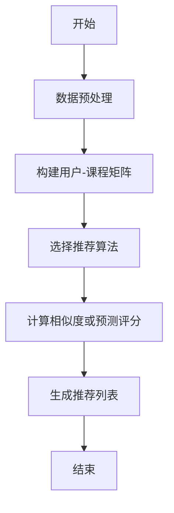
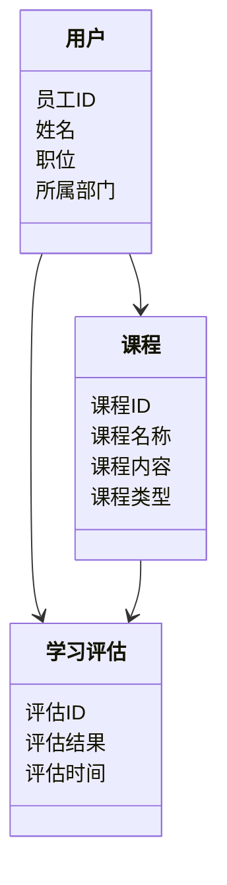
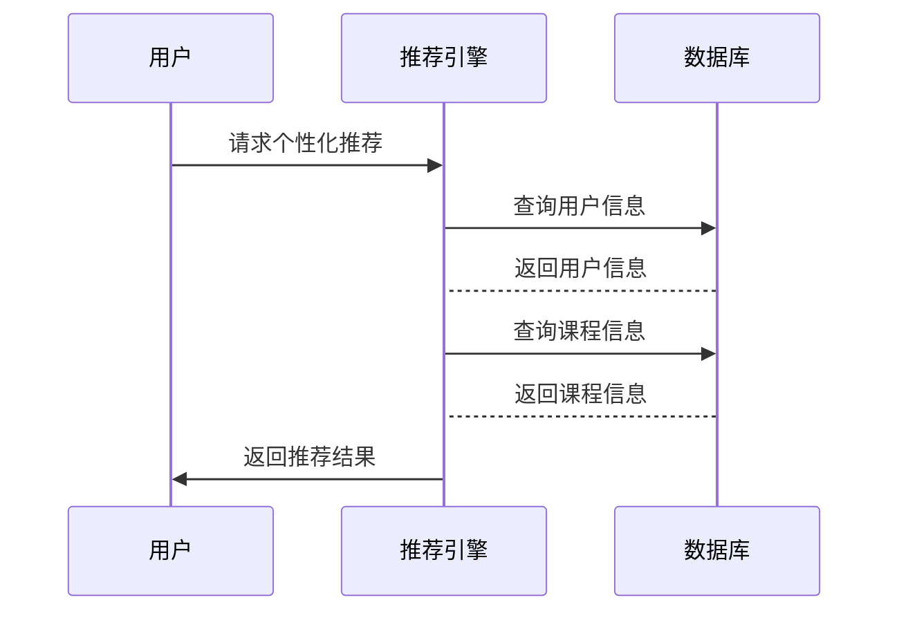

                 


# 构建智能企业合规培训系统：个性化学习内容与评估

## 关键词：企业合规培训系统、个性化学习、推荐算法、系统架构、人工智能

## 摘要：本文将详细探讨如何构建一个智能企业合规培训系统，重点分析个性化学习内容的生成与评估方法。通过系统化的背景分析、核心概念讲解、推荐算法实现、系统架构设计以及实际项目案例，本文旨在为企业提供一套高效、智能的合规培训解决方案。

---

# 第1章: 企业合规培训系统概述

## 1.1 问题背景与描述

### 1.1.1 企业合规培训的重要性
在现代企业中，合规培训是确保员工遵守法律法规、行业规范以及企业内部政策的关键环节。合规培训不仅能够降低企业的法律风险，还能提升员工的职业素养和工作效率。然而，传统的企业合规培训往往存在以下问题：

- **内容千篇一律**：不同岗位的员工需要不同的培训内容，但传统培训往往采取“一刀切”的方式，导致部分员工对培训内容不感兴趣，学习效果差。
- **学习动力不足**：员工对培训内容缺乏主动性和兴趣，导致培训效果不佳。
- **评估方式单一**：传统的评估方式通常仅依赖于考试成绩，无法全面反映员工的实际掌握情况。

### 1.1.2 问题描述
为了提高企业合规培训的效果，我们需要一个能够根据员工的岗位需求、知识水平和学习进度，提供个性化学习内容的系统。同时，系统需要能够动态调整学习计划，并通过多种评估方式（如知识测试、行为观察等）来全面评估员工的学习效果。

### 1.1.3 系统的目标与范围
本系统的目标是构建一个智能企业合规培训系统，通过个性化学习内容的生成与评估，提高员工的学习效率和合规意识。系统的范围包括以下几个方面：

- **用户管理**：记录员工的基本信息、岗位需求和学习记录。
- **课程管理**：提供多样化的合规培训课程，支持根据员工需求动态生成个性化课程。
- **学习评估**：通过多种方式评估员工的学习效果，生成评估报告。
- **数据管理**：存储用户数据、课程数据和评估数据，支持系统的高效运行。

## 1.2 系统的边界与外延
智能企业合规培训系统的边界包括以下内容：

- **用户界面**：提供员工学习和管理界面。
- **课程内容**：涵盖企业合规的各个方面，如法律法规、行业规范等。
- **推荐算法**：用于生成个性化学习内容。
- **评估模块**：用于评估员工的学习效果。

系统的外延包括以下几个方面：

- **数据来源**：企业内部政策、法律法规、行业规范等。
- **学习工具**：支持在线学习、离线学习等多种学习方式。
- **评估方式**：支持知识测试、行为观察等多种评估方式。

## 1.3 核心要素与组成结构
智能企业合规培训系统的组成结构包括以下几个部分：

- **用户管理模块**：负责用户信息的录入、管理与维护。
- **课程管理模块**：负责课程的分类、存储与管理。
- **推荐算法模块**：根据用户需求生成个性化课程推荐。
- **评估模块**：评估员工的学习效果，生成评估报告。

---

# 第2章: 合规培训系统的核心概念

## 2.1 合规培训系统的定义与属性

### 2.1.1 系统的定义
合规培训系统是一种基于人工智能技术的培训管理系统，能够根据员工的需求和能力，动态生成个性化学习内容，并通过多种方式评估员工的学习效果。

### 2.1.2 系统的关键属性
以下是合规培训系统的几个关键属性：

- **个性化**：根据员工的需求和能力，动态生成个性化学习内容。
- **智能性**：利用人工智能技术，推荐学习内容和评估学习效果。
- **动态性**：根据员工的学习进度和效果，动态调整学习计划。

### 2.1.3 系统的特征分析
以下是合规培训系统的几个主要特征：

- **灵活性**：支持多种学习方式和评估方式。
- **高效性**：通过个性化推荐算法，提高学习效率。
- **全面性**：覆盖企业合规的各个方面，提供全面的培训内容。

## 2.2 个性化学习的原理与机制

### 2.2.1 个性化学习的定义
个性化学习是指根据员工的个体需求、能力水平和学习风格，提供适合的学习内容和学习方式。个性化学习的核心在于“因材施教”，通过动态调整学习计划，最大化员工的学习效果。

### 2.2.2 个性化学习的实现机制
个性化学习的实现机制包括以下几个方面：

1. **用户画像**：通过收集员工的基本信息、岗位需求、学习记录等数据，构建员工画像。
2. **学习需求分析**：根据员工的岗位需求和能力水平，分析员工的学习需求。
3. **课程推荐**：基于学习需求分析结果，推荐适合的课程内容。
4. **学习计划制定**：根据推荐结果，制定个性化学习计划。

### 2.2.3 个性化学习的评估标准
个性化学习的评估标准包括以下几个方面：

1. **学习效果**：通过知识测试、行为观察等方式评估员工的学习效果。
2. **学习效率**：通过学习时间、学习进度等指标评估学习效率。
3. **学习满意度**：通过问卷调查等方式评估员工对学习内容的满意度。

## 2.3 系统的ER实体关系图

```mermaid
er
    entity 企业员工 {
        key 属性: 员工ID
        属性: 姓名, 职位, 所属部门
    }
    entity 培训课程 {
        key 属性: 课程ID
        属性: 课程名称, 课程内容, 课程类型
    }
    entity 学习评估 {
        key 属性: 评估ID
        属性: 评估结果, 评估时间
    }
    关系: 企业员工 -> 学习评估
    关系: 企业员工 -> 培训课程
    关系: 培训课程 -> 学习评估
```

## 2.4 本章小结
本章主要介绍了合规培训系统的核心概念和个性化学习的实现机制。通过构建用户画像和学习需求分析，我们可以为员工提供个性化的学习内容和学习计划。同时，通过多种评估方式，可以全面评估员工的学习效果，从而确保合规培训的目标得以实现。

---

# 第3章: 推荐算法与个性化学习

## 3.1 推荐算法的核心原理

### 3.1.1 协同过滤算法
协同过滤是一种基于用户行为和偏好相似度的推荐算法。其核心思想是：如果两个用户在过去的行为（如购买、评分等）相似，那么他们未来的行为也可能相似。协同过滤可以分为基于用户的协同过滤和基于物品的协同过滤。

#### 基于用户的协同过滤
基于用户的协同过滤算法的核心步骤如下：

1. **构建用户-物品矩阵**：记录用户对物品的评分或行为。
2. **计算用户相似度**：使用余弦相似度或欧氏距离等方法计算用户之间的相似度。
3. **生成推荐列表**：根据用户相似度和物品评分，生成推荐列表。

#### 基于物品的协同过滤
基于物品的协同过滤算法的核心步骤如下：

1. **构建物品-用户矩阵**：记录用户对物品的评分或行为。
2. **计算物品相似度**：使用余弦相似度或欧氏距离等方法计算物品之间的相似度。
3. **生成推荐列表**：根据物品相似度和用户评分，生成推荐列表。

### 3.1.2 基于内容的推荐算法
基于内容的推荐算法是一种基于物品特征的推荐算法。其核心思想是：如果两个物品的内容相似，则它们可能被推荐给相似的用户。基于内容的推荐算法通常用于推荐系统中，特别是在当用户数据较少时。

#### 特征提取
特征提取是基于内容的推荐算法的核心步骤。常见的特征提取方法包括文本挖掘、向量空间模型等。

#### 相似度计算
基于内容的推荐算法通常使用余弦相似度或欧氏距离等方法计算物品之间的相似度。

### 3.1.3 混合推荐算法
混合推荐算法是一种结合协同过滤和基于内容的推荐算法的推荐方法。其核心思想是：将两种推荐算法的优点结合起来，提高推荐系统的准确性和多样性。

#### 混合推荐的优势
混合推荐算法的优势在于能够充分利用协同过滤和基于内容的推荐算法的优点，提高推荐系统的准确性和多样性。

## 3.2 算法实现流程



## 3.3 算法代码实现

### 协同过滤算法实现

```python
def collaborative_filtering(user_matrix):
    # 计算用户相似度
    user_similarity = cosine_similarity(user_matrix)
    # 生成推荐列表
    recommendations = []
    for user in range(user_matrix.shape[0]):
        similar_users = np.argsort(user_similarity[user, :])[::-1]
        recommended_courses = []
        for similar_user in similar_users:
            if user_matrix[user][similar_user] == 0:
                recommended_courses.append(similar_user)
        recommendations.append(recommended_courses)
    return recommendations
```

### 基于内容的推荐算法实现

```python
def content_based_recommendation(course_matrix):
    # 计算课程相似度
    course_similarity = cosine_similarity(course_matrix)
    # 生成推荐列表
    recommendations = []
    for course in range(course_matrix.shape[0]):
        similar_courses = np.argsort(course_similarity[course, :])[::-1]
        recommended_courses = []
        for similar_course in similar_courses:
            if course_matrix[course][similar_course] == 0:
                recommended_courses.append(similar_course)
        recommendations.append(recommended_courses)
    return recommendations
```

### 数学公式

#### 协同过滤算法的数学公式
协同过滤算法的核心公式是余弦相似度：

$$
\cos(\theta) = \frac{\sum_{i=1}^{n} x_i y_i}{\sqrt{\sum_{i=1}^{n} x_i^2} \cdot \sqrt{\sum_{i=1}^{n} y_i^2}}
$$

#### 基于内容的推荐算法的数学公式
基于内容的推荐算法的核心公式是余弦相似度：

$$
\cos(\theta) = \frac{\sum_{i=1}^{n} x_i y_i}{\sqrt{\sum_{i=1}^{n} x_i^2} \cdot \sqrt{\sum_{i=1}^{n} y_i^2}}
$$

## 3.4 本章小结
本章详细介绍了推荐算法的核心原理和实现流程。通过协同过滤和基于内容的推荐算法，我们可以为员工推荐适合的课程内容。同时，通过混合推荐算法，可以进一步提高推荐系统的准确性和多样性。

---

# 第4章: 系统分析与架构设计

## 4.1 系统分析

### 4.1.1 问题场景介绍
在企业合规培训系统中，我们需要解决以下几个问题：

1. **如何动态生成个性化学习内容**：根据员工的岗位需求和能力水平，动态生成个性化学习内容。
2. **如何评估员工的学习效果**：通过多种方式评估员工的学习效果，生成评估报告。
3. **如何优化学习计划**：根据评估结果，动态调整学习计划。

### 4.1.2 项目介绍
本项目旨在构建一个智能企业合规培训系统，通过个性化学习内容的生成与评估，提高员工的学习效率和合规意识。

## 4.2 系统功能设计

### 4.2.1 领域模型类图
以下是系统功能设计的领域模型类图：



### 4.2.2 系统架构设计


### 4.2.3 系统接口设计
以下是系统的接口设计：

1. **用户信息接口**：提供用户信息的录入、查询和修改功能。
2. **课程管理接口**：提供课程的录入、查询和删除功能。
3. **推荐引擎接口**：提供课程推荐和学习计划生成功能。
4. **学习评估接口**：提供学习评估结果的查询和生成功能。

### 4.2.4 系统交互流程图



## 4.3 本章小结
本章详细介绍了系统的分析与架构设计。通过领域模型类图和系统架构设计，我们可以清晰地了解系统的组成部分和各部分之间的关系。同时，通过系统接口设计和交互流程图，我们可以更好地理解系统的实现过程。

---

# 第5章: 项目实战

## 5.1 项目环境安装

### 5.1.1 安装Python和必要的库
```bash
pip install numpy
pip install scikit-learn
pip install matplotlib
```

### 5.1.2 安装MySQL数据库
```bash
sudo apt-get install mysql-server
sudo apt-get install mysql-client
sudo apt-get install python-mysql
```

## 5.2 系统核心实现

### 5.2.1 数据预处理

```python
import numpy as np
from sklearn.metrics.pairwise import cosine_similarity

# 用户-课程矩阵
user_course_matrix = np.array([
    [1, 0, 1, 0],
    [0, 1, 0, 1],
    [1, 1, 0, 0],
    [0, 0, 1, 1]
])
```

### 5.2.2 推荐算法实现

```python
def collaborative_filtering(user_course_matrix):
    user_similarity = cosine_similarity(user_course_matrix)
    recommendations = []
    for i in range(user_course_matrix.shape[0]):
        similar_users = np.argsort(user_similarity[i, :])[::-1]
        recommended_courses = []
        for j in similar_users:
            if user_course_matrix[i, j] == 0:
                recommended_courses.append(j)
        recommendations.append(recommended_courses)
    return recommendations
```

### 5.2.3 系统交互实现

```python
from flask import Flask, request, jsonify

app = Flask(__name__)

@app.route('/recommend', methods=['POST'])
def recommend():
    user_id = request.json['user_id']
    recommendations = collaborative_filtering(user_course_matrix)
    return jsonify({'recommendations': recommendations[user_id]})

if __name__ == '__main__':
    app.run(debug=True)
```

## 5.3 代码应用解读与分析

### 5.3.1 数据预处理
数据预处理是推荐算法实现的基础。通过构建用户-课程矩阵，我们可以清晰地看到用户对课程的评分情况。

### 5.3.2 推荐算法实现
协同过滤算法的核心是计算用户相似度。通过余弦相似度，我们可以找到与当前用户相似的用户，并根据这些用户的评分生成推荐列表。

### 5.3.3 系统交互实现
通过Flask框架，我们可以实现系统的前端和后端交互。前端通过发送用户ID，后端通过调用推荐算法生成推荐列表，并返回推荐结果。

## 5.4 实际案例分析

### 5.4.1 案例背景
某企业需要为员工提供合规培训，员工A的岗位需求是法律合规，员工B的岗位需求是信息安全。

### 5.4.2 数据分析
通过分析员工的岗位需求，我们可以为员工A推荐法律合规相关的课程，为员工B推荐信息安全相关的课程。

### 5.4.3 算法实现
通过协同过滤算法，我们可以为员工A推荐以下课程：
1. 法律法规基础
2. 合规管理实务
3. 合规风险评估

通过协同过滤算法，我们可以为员工B推荐以下课程：
1. 信息安全基础
2. 数据保护法规
3. 信息安全管理

## 5.5 本章小结
本章通过实际案例分析，展示了系统的实现过程。通过数据预处理、推荐算法实现和系统交互实现，我们可以为员工提供个性化的学习内容和学习计划。

---

# 第6章: 最佳实践

## 6.1 小结
通过构建智能企业合规培训系统，我们可以实现个性化学习内容的生成与评估。通过协同过滤和基于内容的推荐算法，我们可以为员工推荐适合的课程内容，并根据学习效果动态调整学习计划。

## 6.2 注意事项
在实际应用中，需要注意以下几点：

1. **数据隐私**：员工信息和学习数据需要严格保密，防止数据泄露。
2. **算法选择**：根据企业的实际需求选择合适的推荐算法。
3. **系统维护**：定期更新课程内容和评估标准，确保系统的持续有效。

## 6.3 拓展阅读
以下是拓展阅读的推荐内容：

1. **《推荐系统导论》**：深入介绍推荐系统的原理和实现。
2. **《机器学习实战》**：提供机器学习算法的实现案例。
3. **《企业合规管理实务》**：介绍企业合规管理的实践。

## 6.4 本章小结
通过本章的总结，我们可以更好地理解和应用智能企业合规培训系统。在实际应用中，需要根据企业的实际情况选择合适的推荐算法，并定期更新系统内容，确保系统的持续有效。

---

# 附录

## 附录A: 参考文献
1. 《推荐系统导论》
2. 《机器学习实战》
3. 《企业合规管理实务》

## 附录B: 工具与资源
1. **Python**：https://www.python.org/
2. **Scikit-learn**：https://scikit-learn.org/
3. **Mermaid**：https://mermaid-js.github.io/mermaid-graph-explorer/

---

# 结语

通过本文的详细讲解，我们可以看到智能企业合规培训系统的构建需要结合个性化学习内容和推荐算法，才能实现高效、智能的合规培训。希望本文的内容能够为企业的合规培训提供有价值的参考和启示。

