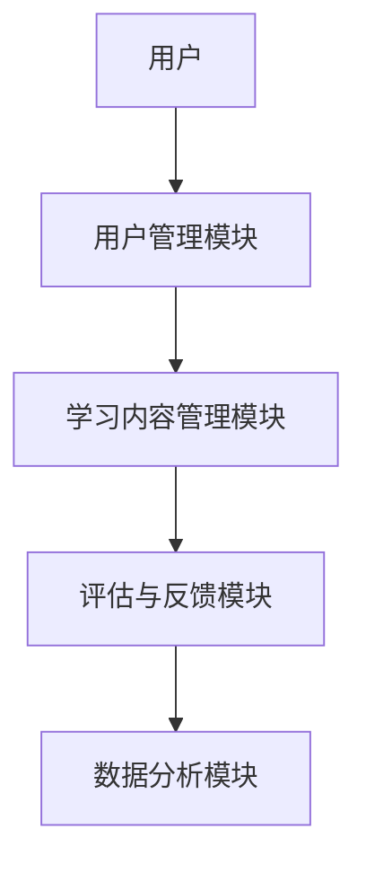
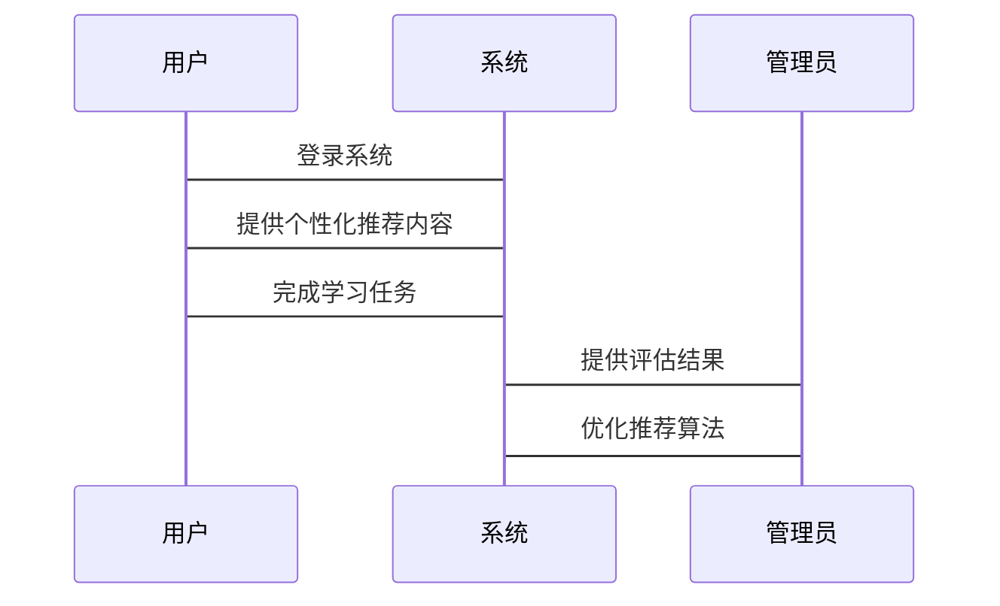

                 


# 构建智能企业合规培训系统：个性化学习内容与评估的自动化

## 关键词：智能企业合规培训系统、个性化学习、自动化评估、推荐算法、系统架构设计

## 摘要：  
本文详细探讨了构建智能企业合规培训系统的各个方面，包括个性化学习内容的设计与实现，以及自动化评估机制的构建。通过分析企业合规培训的背景与挑战，提出了一套基于人工智能的解决方案，涵盖了从学习者特征分析到内容推荐算法，再到自动化评估模型的实现。本文还提供了系统架构设计和项目实战案例，展示了如何将理论应用于实际场景中，最终构建一个高效、智能的企业合规培训系统。

---

# 第一部分：背景与挑战

## 第1章：企业合规培训的背景与挑战

### 1.1 企业合规培训的重要性  
合规培训是企业在法律框架下运作的基础，确保员工了解并遵守相关法规、政策和企业内部制度。随着法律法规的不断变化，企业合规培训的频率和深度也在不断增加。然而，传统的合规培训模式存在以下问题：  
1. **内容单一化**：统一的培训内容难以满足不同岗位员工的需求。  
2. **效率低下**：传统的面授或视频培训方式难以实现个性化学习路径。  
3. **评估滞后**：评估结果通常在培训结束后才能得出，难以及时反馈和优化学习过程。  

### 1.2 智能化合规培训的必要性  
为了应对上述挑战，智能化合规培训系统应运而生。其核心目标是通过人工智能技术，实现以下功能：  
1. **个性化学习内容推荐**：根据员工的岗位需求、学习进度和知识掌握程度，推荐适合的学习材料。  
2. **自动化评估与反馈**：实时评估员工的学习效果，并提供针对性的反馈和建议。  
3. **数据驱动的优化**：通过分析学习数据，不断优化培训内容和评估策略。  

### 1.3 智能企业合规培训系统的概念  
智能企业合规培训系统是一种基于人工智能技术的培训管理平台，通过数据采集、分析和应用，实现个性化学习内容推荐和自动化评估。其核心要素包括：  
- **学习者特征分析**：基于员工的岗位需求、学习风格和知识水平，构建个性化学习模型。  
- **内容推荐算法**：通过协同过滤、深度学习等算法，实现精准的内容推荐。  
- **自动化评估机制**：基于规则引擎和机器学习模型，实时评估学习效果并提供反馈。  

---

# 第二部分：核心概念与算法原理

## 第2章：个性化学习内容的设计

### 2.1 学习者特征分析  
个性化学习的核心在于了解学习者的特征。以下是关键分析维度：  
1. **岗位需求**：不同岗位的员工需要掌握不同的合规知识。  
2. **学习风格**：部分员工适合视频学习，而另一些人则更适合文本阅读。  
3. **知识水平**：通过测试评估员工的知识掌握程度，制定个性化学习计划。  

### 2.2 内容推荐算法  
个性化推荐算法是实现内容推荐的核心技术。以下是几种常见的推荐算法：  

#### 2.2.1 基于协同过滤的推荐算法  
协同过滤是一种经典的推荐算法，通过分析用户的行为数据，找到相似的用户群体，推荐相似的内容。  
- **实现步骤**：  
  1. 收集用户的行为数据（如点击、收藏、完成课程等）。  
  2. 计算用户之间的相似度（如余弦相似度）。  
  3. 根据相似用户的偏好，推荐相关内容。  

#### 2.2.2 基于内容的推荐算法  
基于内容的推荐算法通过分析内容本身的特征，推荐与当前内容相似的其他内容。  
- **实现步骤**：  
  1. 提取内容的特征（如关键词、主题标签等）。  
  2. 计算内容之间的相似度。  
  3. 根据相似度推荐相关内容。  

#### 2.2.3 混合推荐算法  
混合推荐算法结合了协同过滤和基于内容的推荐算法，利用两者的优势，提高推荐的准确性和多样性。  

### 2.3 个性化学习路径规划  
根据学习者的特征和推荐结果，系统会自动生成个性化学习路径。例如，对于知识水平较低的员工，系统会优先推荐基础课程；而对于已经掌握基础知识的员工，则推荐高级课程。  

---

## 第3章：自动化评估机制

### 3.1 评估指标的设计  
自动化评估的核心在于设计合理的评估指标。以下是常用的评估指标：  
1. **知识掌握度**：通过测试评估员工对知识点的掌握程度。  
2. **学习完成度**：通过记录学习进度，评估员工是否完成推荐的学习任务。  
3. **反馈响应度**：通过收集员工的反馈，评估推荐内容的满意度。  

### 3.2 自动化评估的实现  
自动化评估的实现需要结合规则引擎和机器学习模型。以下是具体实现步骤：  

#### 3.2.1 基于规则引擎的评估模型  
规则引擎是一种基于预定义规则的评估模型，适用于简单的评估场景。  
- **实现步骤**：  
  1. 定义评估规则（如“完成所有推荐课程的员工评为优秀”）。  
  2. 根据规则引擎的判断，输出评估结果。  

#### 3.2.2 基于机器学习的评估模型  
机器学习模型能够根据历史数据，学习评估规律，并预测未来的评估结果。  
- **实现步骤**：  
  1. 收集历史评估数据。  
  2. 训练机器学习模型（如逻辑回归、支持向量机等）。  
  3. 使用模型预测未来的评估结果。  

#### 3.2.3 深度学习评估模型  
深度学习模型通过多层神经网络，能够捕捉复杂的评估规律。  
- **实现步骤**：  
  1. 收集大量历史评估数据。  
  2. 构建深度学习模型（如LSTM、Transformer等）。  
  3. 使用模型进行评估预测。  

### 3.3 评估结果的反馈与优化  
评估结果需要及时反馈给学习者，并根据反馈结果优化推荐算法和评估模型。例如，如果员工对推荐内容不满意，系统需要重新调整推荐策略；如果评估结果与实际表现不符，需要优化评估模型。  

---

# 第三部分：系统架构设计

## 第4章：系统架构设计

### 4.1 系统功能模块  
智能企业合规培训系统主要包括以下功能模块：  
1. **用户管理模块**：管理用户信息（如员工ID、岗位信息、学习记录等）。  
2. **学习内容管理模块**：管理合规培训内容（如课程、文档、视频等）。  
3. **评估与反馈模块**：实现自动化评估和反馈功能。  
4. **数据分析模块**：分析学习数据，优化推荐算法和评估模型。  

### 4.2 系统架构图  
以下是系统的整体架构图：  


### 4.3 系统接口设计  
系统需要设计以下接口：  
1. **用户接口**：供员工访问学习内容和评估结果的界面。  
2. **管理接口**：供管理员管理用户和内容的界面。  
3. **数据接口**：供第三方系统接入学习数据的接口。  

### 4.4 系统交互流程  
以下是系统的交互流程图：  


---

# 第四部分：项目实战

## 第5章：项目实战

### 5.1 环境配置与工具安装  
#### 5.1.1 开发环境搭建  
- 操作系统：建议使用Linux或macOS。  
- 开发工具：推荐使用PyCharm或VS Code。  

#### 5.1.2 工具安装与配置  
- 安装Python和相关库（如pandas、numpy、scikit-learn等）。  
- 配置数据库（如MySQL、MongoDB等）。  

### 5.2 核心代码实现  
#### 5.2.1 个性化推荐算法实现  

```python
import numpy as np
from sklearn.metrics.pairwise import cosine_similarity

def collaborative_filtering(user_ratings, user_id):
    # 计算用户之间的相似度
    user_similarity = cosine_similarity(user_ratings.T)
    
    # 去除对角线上的1（自身相似度）
    user_similarity[user_similarity > 0] = 1
    
    # 找出与目标用户最相似的k个用户
    k = 5
    similar_users = np.argsort(user_similarity[user_id])[-k-1:-1]
    
    # 推荐目标用户未评分的内容
    recommendations = []
    for similar_user in similar_users:
        for item in range(len(user_ratings)):
            if user_ratings[similar_user][item] > 0 and user_ratings[user_id][item] == 0:
                recommendations.append(item)
    return recommendations
```

#### 5.2.2 自动化评估模型实现  

```python
from sklearn.linear_model import LogisticRegression

def automated_assessment(train_data, train_labels, test_data):
    # 训练模型
    model = LogisticRegression()
    model.fit(train_data, train_labels)
    
    # 预测评估结果
    predictions = model.predict(test_data)
    return predictions
```

### 5.3 项目小结  
通过本章的项目实战，我们实现了一个基于协同过滤和逻辑回归的智能企业合规培训系统。该系统能够根据员工的特征推荐个性化学习内容，并通过自动化评估模型实时反馈学习效果。  

---

# 第五部分：总结与展望

## 第6章：总结与展望

### 6.1 项目小结  
智能企业合规培训系统的构建是一个复杂的工程，需要结合人工智能技术、系统架构设计和项目实战经验。通过本文的探讨，我们实现了一个能够满足企业需求的智能合规培训系统。  

### 6.2 注意事项  
在实际应用中，需要注意以下几点：  
1. **数据隐私**：确保员工数据的安全性和隐私性。  
2. **系统稳定性**：确保系统的高可用性和稳定性。  
3. **用户体验**：优化用户界面和交互流程，提升用户体验。  

### 6.3 未来展望  
未来，智能企业合规培训系统将朝着以下几个方向发展：  
1. **深度学习应用**：进一步探索深度学习技术在推荐和评估中的应用。  
2. **多模态学习**：结合文本、图像、视频等多种形式的学习内容。  
3. **实时反馈**：实现更实时的学习反馈和动态调整推荐策略。  

### 6.4 拓展阅读  
- **推荐算法**：深入学习协同过滤、矩阵分解等推荐算法。  
- **机器学习模型**：研究深度学习模型在自然语言处理和图像识别中的应用。  
- **系统架构设计**：学习微服务架构、分布式系统的设计与实现。  

---

通过本文的详细探讨，我们希望读者能够全面了解智能企业合规培训系统的构建过程，并能够在实际工作中应用这些技术，提升企业的合规培训效率和效果。

