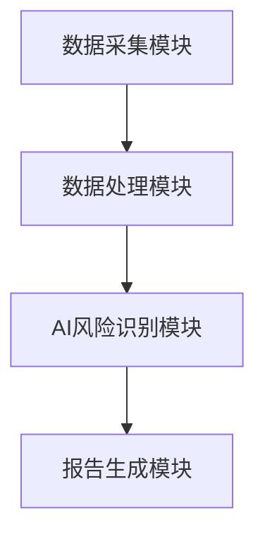

                 


# 构建智能企业合规管理平台：AI辅助风险识别

> **关键词**：企业合规管理，人工智能，风险识别，系统架构，机器学习，数据处理，模型训练

> **摘要**：随着企业规模的不断扩大和业务的复杂化，合规管理变得越来越重要。传统的合规管理方法依赖于人工操作，效率低且容易出错。引入人工智能技术可以显著提高合规管理的效率和准确性。本文详细探讨了如何利用AI技术构建智能企业合规管理平台，并通过风险识别模块的实现，展示了AI在合规管理中的强大能力。文章从背景介绍、核心概念、系统架构、算法原理、项目实战到最佳实践，全面解析了构建智能企业合规管理平台的各个方面。

---

## 第1章: 企业合规管理与AI辅助风险识别背景

### 1.1 企业合规管理的重要性

#### 1.1.1 合规管理的定义与范围

企业合规管理是指企业在经营过程中，遵守相关法律法规、行业规范以及企业内部规章制度的管理活动。其范围涵盖企业运作的各个方面，包括财务、税务、反腐败、数据隐私、劳动法等。

#### 1.1.2 企业合规管理的核心目标

合规管理的核心目标是确保企业行为的合法性、合规性和透明性，降低企业因违规行为而面临的风险，如罚款、法律责任和声誉损失。

#### 1.1.3 企业合规管理对企业的影响

合规管理不仅是企业合法经营的基础，也是企业风险管理的重要组成部分。有效的合规管理能够提升企业形象，增强客户信任，降低经营风险，并为企业创造长期价值。

---

### 1.2 AI技术在企业合规管理中的应用

#### 1.2.1 AI技术的基本概念与特点

人工智能（AI）是指计算机系统模拟人类智能的活动，包括学习、推理、识别、语言理解等。AI技术的特点包括数据驱动、自动化、高效率和自我优化。

#### 1.2.2 AI在企业合规管理中的优势

AI技术能够快速处理大量数据，识别潜在风险，提供实时监控和预警，显著提高合规管理的效率和准确性。此外，AI还能通过学习不断优化模型，适应新的法规和业务变化。

#### 1.2.3 企业合规管理中的AI技术现状

目前，AI技术在企业合规管理中的应用主要集中在风险识别、数据处理和自动化报告生成等方面。然而，AI在合规管理中的应用仍处于发展阶段，存在一些技术瓶颈和挑战。

---

### 1.3 企业合规管理中的风险识别挑战

#### 1.3.1 风险识别的复杂性

合规风险可能涉及多个领域，如财务、税务、数据隐私等，具有高度复杂性。传统的风险识别方法往往依赖人工经验，效率低且容易遗漏。

#### 1.3.2 传统风险识别方法的局限性

传统方法通常基于规则和经验判断，难以应对复杂多变的法规和业务环境。此外，人工识别容易受到主观因素的影响，导致误判或漏判。

#### 1.3.3 AI辅助风险识别的必要性

AI技术能够通过大数据分析和机器学习，识别潜在风险，提供实时监控和预警，帮助企业在复杂环境中保持合规。

---

## 第2章: 智能企业合规管理平台的核心概念

### 2.1 企业合规管理平台的定义与组成

#### 2.1.1 平台的定义

智能企业合规管理平台是指利用人工智能技术构建的，用于企业合规管理的信息化平台，能够实现风险识别、数据处理、自动化报告生成等功能。

#### 2.1.2 平台的主要组成部分

智能企业合规管理平台通常包括以下几个组成部分：
1. 数据采集模块：负责采集企业内外部数据。
2. 数据处理模块：对数据进行清洗、转换和分析。
3. AI风险识别模块：利用机器学习模型识别潜在合规风险。
4. 报告生成模块：生成合规报告和风险预警。

#### 2.1.3 平台的核心功能模块

智能企业合规管理平台的核心功能模块包括：
1. 数据采集与处理
2. 风险识别与评估
3. 报告生成与预警

---

### 2.2 AI辅助风险识别的原理

#### 2.2.1 风险识别的基本原理

AI辅助风险识别的基本原理是通过机器学习算法，从企业数据中识别出潜在的合规风险。这包括数据预处理、模型训练、风险评估和预警生成等步骤。

#### 2.2.2 AI在风险识别中的作用

AI技术在风险识别中的作用主要体现在以下几个方面：
1. 数据分析与处理
2. 模型训练与优化
3. 风险评估与预警生成

#### 2.2.3 风险识别的流程与步骤

风险识别的流程包括以下几个步骤：
1. 数据采集
2. 数据预处理
3. 模型训练
4. 模型评估
5. 风险评估
6. 风险预警生成

---

### 2.3 平台与AI技术的结合方式

#### 2.3.1 数据采集与处理

数据采集是智能企业合规管理平台的第一步，需要从企业内外部获取相关数据。数据预处理是关键步骤，包括数据清洗、转换和特征提取。

#### 2.3.2 AI模型的训练与部署

AI模型的训练需要使用大量的数据，并通过机器学习算法进行训练。模型部署后，可以实时处理企业数据，识别潜在风险。

#### 2.3.3 平台的用户界面设计

平台的用户界面设计需要简洁直观，方便用户操作。用户可以通过界面查看风险评估结果、生成报告，并进行必要的调整和优化。

---

## 第3章: 智能企业合规管理平台的系统架构

### 3.1 系统架构设计

#### 3.1.1 系统模块划分

智能企业合规管理平台的系统架构通常包括以下几个模块：
1. 数据采集模块
2. 数据处理模块
3. AI风险识别模块
4. 报告生成模块

#### 3.1.2 模块之间的关系

各模块之间的关系如下：
- 数据采集模块负责获取数据
- 数据处理模块对数据进行清洗和转换
- AI风险识别模块利用处理后的数据进行模型训练和风险识别
- 报告生成模块根据识别结果生成报告和预警

#### 3.1.3 系统的整体架构图



---

### 3.2 数据流与信息交互

#### 3.2.1 数据采集流程

数据采集流程包括以下几个步骤：
1. 确定数据来源
2. 采集数据
3. 数据预处理

#### 3.2.2 数据处理与分析

数据处理与分析包括数据清洗、特征提取和数据转换等步骤。

#### 3.2.3 风险识别与报告生成

风险识别是通过机器学习模型实现的，报告生成模块根据识别结果生成报告和预警。

---

### 3.3 系统功能设计

#### 3.3.1 数据采集模块

数据采集模块负责从企业内外部获取相关数据，包括财务数据、合同数据、员工数据等。

#### 3.3.2 风险评估模块

风险评估模块利用机器学习模型，对采集到的数据进行分析，识别潜在的合规风险。

#### 3.3.3 报告生成模块

报告生成模块根据风险评估结果，生成合规报告和风险预警，并提供改进建议。

---

## 第4章: AI辅助风险识别的算法原理

### 4.1 算法选择与实现

#### 4.1.1 基于规则的分类算法

基于规则的分类算法通过预定义的规则进行分类，适用于规则明确的场景。

#### 4.1.2 基于机器学习的分类算法

基于机器学习的分类算法（如逻辑回归、支持向量机、随机森林等）能够自动学习数据中的模式，适用于复杂场景。

#### 4.1.3 算法的优缺点对比

| 算法类型       | 优点                           | 缺点                           |
|----------------|--------------------------------|--------------------------------|
| 基于规则的分类 | 易于理解和解释                   | 需要手动定义规则               |
| 基于机器学习的分类 | 能够自动学习数据中的模式         | 黑箱问题，解释性差               |

---

### 4.2 算法实现的详细步骤

#### 4.2.1 数据预处理

数据预处理是机器学习模型训练的关键步骤，包括数据清洗、特征提取和数据转换。

#### 4.2.2 模型训练

模型训练包括选择算法、调整参数和训练模型。

#### 4.2.3 模型评估与优化

模型评估与优化包括验证模型性能、调整参数和优化模型。

---

### 4.3 算法实现的数学模型与公式

#### 4.3.1 逻辑回归模型

逻辑回归是一种常用的分类算法，其数学公式为：

$$ P(y=1|x) = \frac{1}{1 + e^{-\beta x}} $$

其中，$\beta$ 是模型参数，$x$ 是输入特征。

#### 4.3.2 支持向量机模型

支持向量机（SVM）是一种常用的分类算法，其数学公式为：

$$ y = \text{sign}(\beta x + b) $$

其中，$\beta$ 是模型参数，$b$ 是截距项。

---

## 第5章: 项目实战与最佳实践

### 5.1 项目实战

#### 5.1.1 环境安装与配置

项目实战需要安装Python、NumPy、Scikit-learn等工具。

#### 5.1.2 核心代码实现

以下是一个简单的逻辑回归模型实现代码：

```python
import numpy as np
from sklearn.linear_model import LogisticRegression

# 数据准备
X = np.array([[1, 2], [3, 4], [5, 6]])
y = np.array([0, 1, 0])

# 模型训练
model = LogisticRegression()
model.fit(X, y)

# 模型预测
print(model.predict(X))
```

#### 5.1.3 项目总结与优化

通过项目实战，我们可以验证算法的可行性，并根据实际需求进行优化。

---

### 5.2 最佳实践与注意事项

#### 5.2.1 数据质量的重要性

数据质量直接影响模型的性能，因此在数据采集和处理过程中需要高度重视数据的准确性和完整性。

#### 5.2.2 模型的可解释性

在企业合规管理中，模型的可解释性非常重要，以便在出现问题时能够进行有效的调整和优化。

#### 5.2.3 系统的可扩展性

为了应对未来的变化和扩展，系统设计需要具备良好的可扩展性。

---

## 总结

通过本文的介绍，我们详细探讨了如何利用AI技术构建智能企业合规管理平台，并通过风险识别模块的实现，展示了AI在合规管理中的强大能力。希望本文能够为企业的合规管理提供新的思路和方法，帮助企业在复杂多变的环境中保持合规，实现可持续发展。

