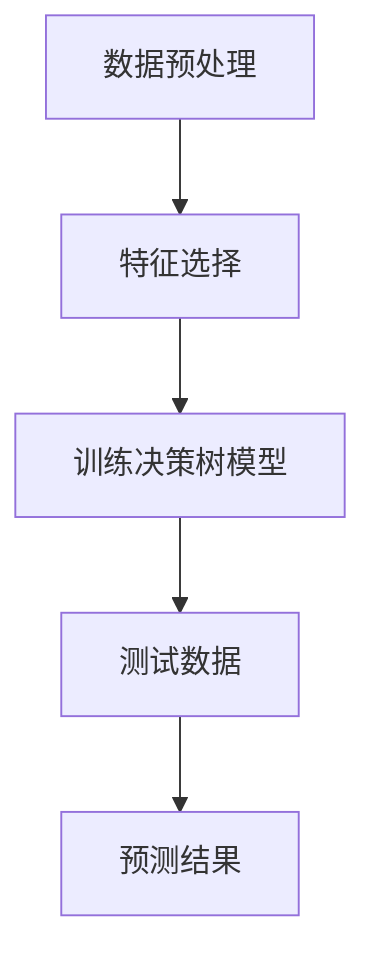
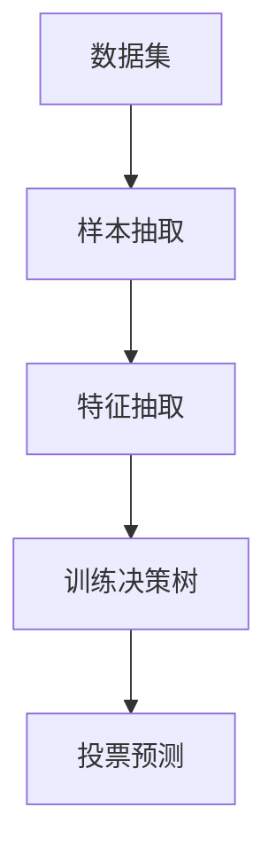
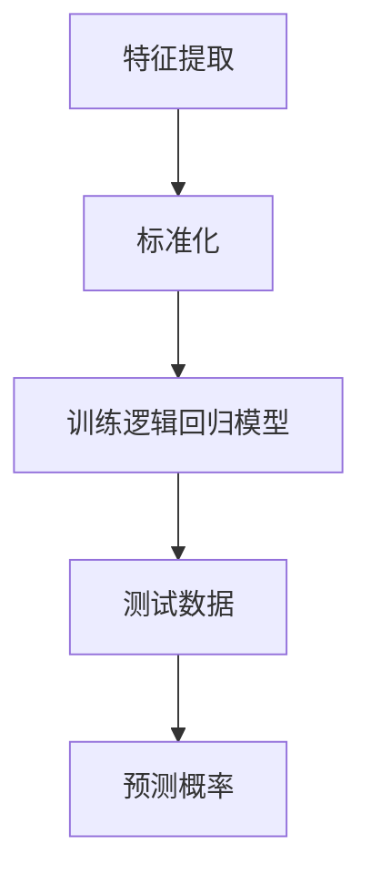
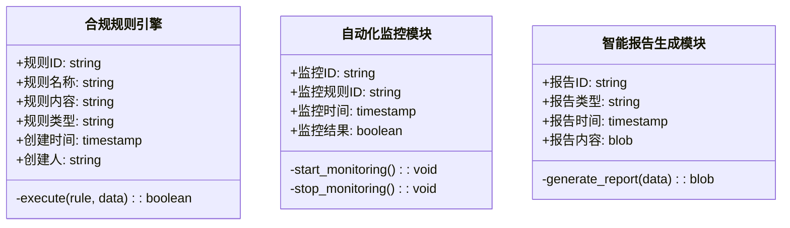
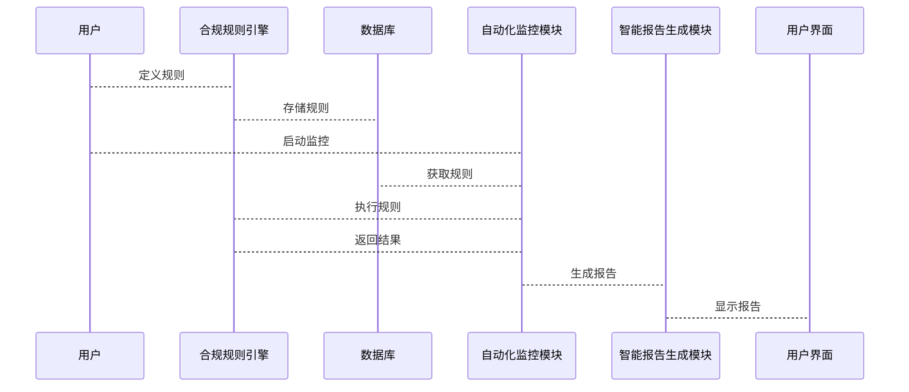

                 


```markdown
# 构建智能企业合规管理平台：自动化监控与报告

> 关键词：企业合规管理，自动化监控，智能报告，数据合规，风险管理，算法原理

> 摘要：随着企业合规管理的需求日益增长，智能化、自动化的合规管理平台成为企业的必备工具。本文详细介绍了如何构建一个智能企业合规管理平台，涵盖背景介绍、核心概念、算法原理、系统架构、项目实战和最佳实践，帮助读者理解并实现高效的企业合规管理。

---

## 第1章：企业合规管理平台的背景介绍

### 1.1 问题背景

#### 1.1.1 合规管理的重要性
企业合规管理是确保企业行为符合相关法律法规和行业标准的关键。随着法律法规的不断变化和业务复杂性的增加，传统的手动合规管理方式已难以应对日益复杂的监管要求。合规管理不仅关系到企业的合法运营，还直接影响企业的声誉和风险敞口。

#### 1.1.2 传统合规管理的局限性
- **效率低下**：手动检查和报告耗费大量时间和资源。
- **错误率高**：人为操作容易出错，影响合规性。
- **滞后性**：传统报告通常基于历史数据，无法实时反映当前状态。

#### 1.1.3 智能化合规管理的必要性
通过引入人工智能和自动化技术，企业可以实时监控合规状态，快速生成报告，显著提高效率和准确性。

### 1.2 问题描述

#### 1.2.1 合规管理的核心目标
- 确保企业行为符合相关法律法规。
- 提高合规检查的效率和准确性。
- 实现合规问题的快速响应和处理。

#### 1.2.2 当前企业合规管理的主要挑战
- 数据分散，难以集中管理。
- 合规规则复杂，难以快速调整。
- 缺乏实时监控和自动报告功能。

#### 1.2.3 自动化监控与报告的需求
企业需要一个自动化平台，能够实时监控合规状态，自动触发预警，并生成动态报告。

### 1.3 问题解决

#### 1.3.1 智能化合规管理的解决方案
引入智能合规管理平台，利用AI算法和自动化技术实现合规监控和报告生成。

#### 1.3.2 自动化监控与报告的核心作用
- 实时监控企业行为，确保合规性。
- 自动触发预警，快速响应问题。
- 自动生成报告，提高效率。

#### 1.3.3 平台设计的总体思路
1. **数据采集**：从企业系统中获取相关数据。
2. **规则引擎**：定义和管理合规规则。
3. **自动化监控**：实时检查数据是否符合规则。
4. **智能报告**：生成动态报告，提供改进建议。

### 1.4 边界与外延

#### 1.4.1 合规管理平台的边界
- 仅处理企业内部数据，不涉及外部数据。
- 专注于合规性检查，不处理业务逻辑。

#### 1.4.2 平台功能的外延
- 支持多法规、多行业的合规检查。
- 提供数据可视化功能，帮助用户更好地理解合规状态。

#### 1.4.3 与其他系统的接口关系
- 与企业ERP系统集成，获取业务数据。
- 与邮件系统集成，发送预警通知。

### 1.5 核心要素组成

#### 1.5.1 合规规则引擎
- **定义**：一组用于检查数据是否符合特定规则的引擎。
- **功能**：定义、管理和执行合规规则。
- **示例**：检查合同金额是否超过审批权限。

#### 1.5.2 自动化监控模块
- **定义**：实时监控企业行为，触发预警。
- **功能**：数据采集、规则检查、预警触发。
- **示例**：实时监控员工考勤，触发加班预警。

#### 1.5.3 智能报告生成模块
- **定义**：自动生成合规报告，提供改进建议。
- **功能**：数据汇总、报告生成、趋势分析。
- **示例**：生成月度合规报告，分析违规趋势。

---

## 第2章：核心概念与联系

### 2.1 核心概念原理

#### 2.1.1 合规规则引擎
- **工作原理**：接收数据，执行预定义规则，返回合规结果。
- **关键点**：规则可配置，支持动态调整。

#### 2.1.2 自动化监控
- **实现机制**：通过API或数据库触发，实时检查数据。
- **关键点**：多线程处理，确保实时性。

#### 2.1.3 智能报告生成
- **算法基础**：使用分类算法（如决策树、随机森林）进行数据挖掘，生成报告。

### 2.2 核心概念属性对比

| 比较项 | 合规规则引擎 | 自动化监控 | 智能报告生成 |
|-------|--------------|------------|---------------|
| **功能** | 定义和执行规则 | 实时检查数据 | 生成报告 |
| **输入** | 数据和规则 | 数据流 | 数据和分析结果 |
| **输出** | 合规结果 | 预警信息 | 报告 |
| **目标** | 确保数据符合规则 | 及时发现问题 | 提供改进建议 |

### 2.3 ER实体关系图

```mermaid
erd
  entity 合规规则引擎 {
    [规则ID] string
    [规则名称] string
    [规则内容] string
    [规则类型] string
    [创建时间] timestamp
    [创建人] string
  }

  entity 自动化监控模块 {
    [监控ID] string
    [监控规则ID] string
    [监控时间] timestamp
    [监控结果] boolean
  }

  entity 智能报告生成模块 {
    [报告ID] string
    [报告类型] string
    [报告时间] timestamp
    [报告内容] blob
  }
```

---

## 第3章：算法原理讲解

### 3.1 分类算法

#### 3.1.1 决策树



- **数学模型**：使用熵和信息增益进行特征选择。
  $$ \text{熵} = -\sum_{i=1}^{n} p_i \log p_i $$
  $$ \text{信息增益} = \text{熵}(parent) - \text{期望熵}(child) $$

- **代码实现**：
  ```python
  from sklearn.tree import DecisionTreeClassifier
  model = DecisionTreeClassifier()
  model.fit(X_train, y_train)
  ```

#### 3.1.2 随机森林



- **数学模型**：使用袋装法生成多个决策树，投票决定结果。
- **代码实现**：
  ```python
  from sklearn.ensemble import RandomForestClassifier
  model = RandomForestClassifier(n_estimators=100)
  model.fit(X_train, y_train)
  ```

#### 3.1.3 逻辑回归



- **数学模型**：使用sigmoid函数和交叉熵损失函数。
  $$ P(y=1|x) = \frac{1}{1 + e^{-\beta x}} $$
- **代码实现**：
  ```python
  from sklearn.linear_model import LogisticRegression
  model = LogisticRegression()
  model.fit(X_train, y_train)
  ```

---

## 第4章：系统分析与架构设计

### 4.1 项目介绍

#### 4.1.1 项目背景
随着企业规模的扩大和法规的日益严格，企业需要一个高效的合规管理平台来实时监控和报告合规状态。

### 4.2 系统功能设计

#### 4.2.1 领域模型



#### 4.2.2 系统架构

```mermaid
archi
  component 合规规则引擎
  component 自动化监控模块
  component 智能报告生成模块
  component 数据库
  component 用户界面
  合规规则引擎 --> 自动化监控模块
  自动化监控模块 --> 智能报告生成模块
  智能报告生成模块 --> 数据库
  自动化监控模块 --> 用户界面
```

### 4.3 系统接口设计

#### 4.3.1 接口说明
- **规则引擎接口**：提供定义和执行规则的API。
- **监控模块接口**：提供启动和停止监控的API。
- **报告生成接口**：提供生成和下载报告的API。

### 4.4 系统交互



---

## 第5章：项目实战

### 5.1 环境安装

#### 5.1.1 安装Python
```bash
python --version
pip install --upgrade pip
```

#### 5.1.2 安装依赖
```bash
pip install numpy scikit-learn mermaid4jupyter jupyter
```

### 5.2 系统核心实现源代码

#### 5.2.1 合规规则引擎
```python
class ComplianceRuleEngine:
    def __init__(self):
        self.rules = []

    def add_rule(self, rule):
        self.rules.append(rule)

    def execute(self, rule_id, data):
        for rule in self.rules:
            if rule['id'] == rule_id:
                return eval(rule['content'], data)
        return False
```

#### 5.2.2 自动化监控模块
```python
class AutomationMonitor:
    def __init__(self):
        self.running = False

    def start_monitoring(self):
        self.running = True
        while self.running:
            # 获取数据
            data = get_data()
            # 执行规则
            result = engine.execute(rule_id, data)
            # 触发预警
            if not result:
                send_alarm()

    def stop_monitoring(self):
        self.running = False
```

#### 5.2.3 智能报告生成模块
```python
class SmartReportGenerator:
    def __init__(self):
        self.reports = []

    def generate_report(self, data):
        # 使用分类算法生成报告
        model = train_model(data)
        predictions = model.predict(data)
        report = self._generate_pdf(predictions)
        self.reports.append(report)
        return report

    def _generate_pdf(self, predictions):
        # 使用ReportLab生成PDF报告
        pass
```

### 5.3 代码应用解读与分析

#### 5.3.1 合规规则引擎
- **功能**：管理合规规则，执行规则检查。
- **实现细节**：规则存储在数据库中，通过ID查找规则并执行。

#### 5.3.2 自动化监控模块
- **功能**：实时监控数据，触发预警。
- **实现细节**：使用多线程处理，确保实时性。

#### 5.3.3 智能报告生成模块
- **功能**：生成动态报告，提供改进建议。
- **实现细节**：使用机器学习算法进行数据挖掘，生成报告。

### 5.4 实际案例分析

#### 5.4.1 案例分析
- **背景**：某企业需要监控合同合规性。
- **实施步骤**：
  1. 定义合规规则。
  2. 实时监控合同数据。
  3. 自动生成合规报告。

#### 5.4.2 问题剖析
- **问题**：合同金额超过审批权限。
- **解决方案**：触发预警，通知相关人员处理。

### 5.5 项目小结

#### 5.5.1 项目总结
- 成功构建了一个智能合规管理平台。
- 实现了自动化监控和智能报告生成。

#### 5.5.2 项目意义
- 提高了企业合规管理的效率和准确性。
- 降低了合规风险，提升了企业声誉。

---

## 第6章：最佳实践与小结

### 6.1 最佳实践

#### 6.1.1 合规管理实施策略
- **制定明确的合规目标**：确保目标与企业战略一致。
- **选择合适的工具和技术**：根据企业需求选择合适的平台。
- **建立合规文化**：通过培训和宣传，增强员工的合规意识。

#### 6.1.2 系统维护与优化
- **定期更新规则**：根据法规变化调整合规规则。
- **优化算法模型**：通过反馈不断优化分类算法。
- **监控系统性能**：确保系统稳定运行，及时处理故障。

### 6.2 小结

#### 6.2.1 合规管理的重要性
- 合规管理是企业合法运营的基础。
- 智能化合规管理是未来发展的趋势。

#### 6.2.2 平台设计的关键点
- 明确需求，合理设计系统架构。
- 选择合适的算法和工具，确保系统高效运行。

#### 6.2.3 持续优化与改进
- 根据反馈不断优化系统功能。
- 关注法规变化，及时调整合规策略。

### 6.3 注意事项

#### 6.3.1 系统设计中的注意事项
- 确保数据安全，防止数据泄露。
- 设计可扩展的系统架构，方便后续优化和升级。

#### 6.3.2 实施过程中的注意事项
- 充分培训相关人员，确保系统顺利上线。
- 建立完善的应急预案，应对系统故障。

### 6.4 拓展阅读

#### 6.4.1 推荐书籍
- 《企业合规管理与法律风险防控》
- 《数据科学实战：从理论到应用》

#### 6.4.2 推荐技术博客
- [AI和数据科学博客](https://towardsdatascience.com/)
- [技术架构博客](https://www.smashingmagazine.com/)

---

## 附录

### 附录A：术语表

- **合规规则引擎**：用于定义和执行合规规则的引擎。
- **自动化监控模块**：实时监控数据，触发预警的模块。
- **智能报告生成模块**：自动生成合规报告的模块。

### 附录B：工具与资源

- **数据可视化工具**：Matplotlib、Seaborn、Tableau。
- **机器学习框架**：Scikit-learn、XGBoost、TensorFlow。
- **数据库**：MySQL、PostgreSQL、MongoDB。

### 附录C：进一步阅读

- [企业合规管理](https://www.iso.org/committee/6673280.html)
- [数据科学与机器学习](https://towardsdatascience.com/)
- [技术架构设计](https://www.smashingmagazine.com/)
```

---

# 总结

通过以上详细的内容，我们构建了一个智能企业合规管理平台，涵盖了从背景介绍到项目实战的各个方面。希望这篇文章能为读者提供有价值的参考和指导，帮助他们在实际应用中高效地进行企业合规管理。

