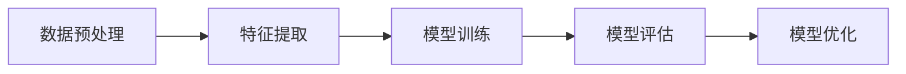
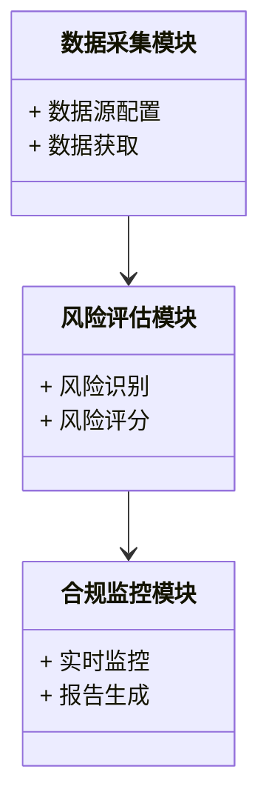
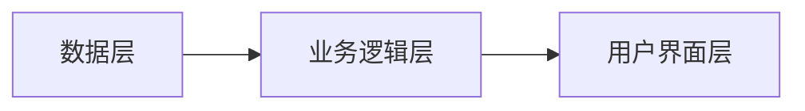
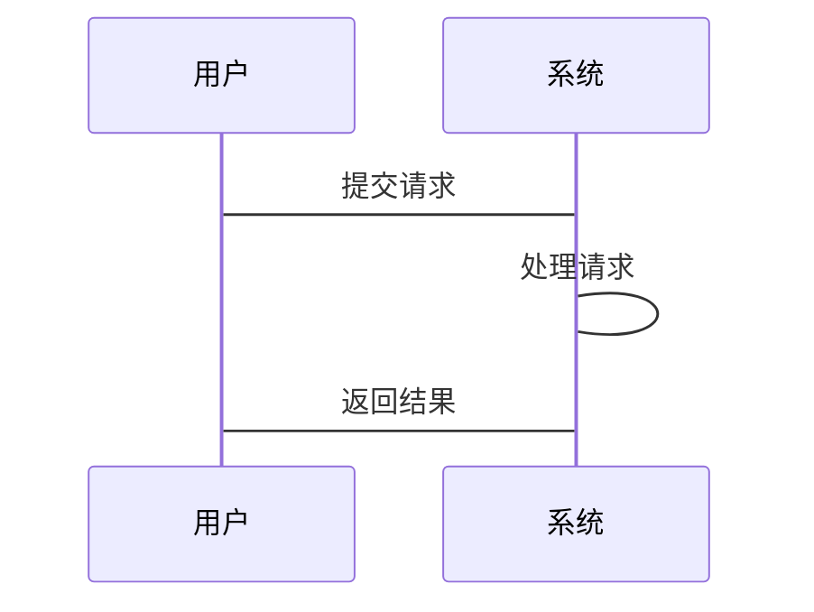

                 


# 构建智能企业合规管理系统：AI辅助风险识别与控制

**关键词**：企业合规管理、人工智能、风险识别、风险控制、系统架构、数学模型

**摘要**：随着企业规模的不断扩大和业务的复杂化，合规管理变得日益重要。传统的合规管理依赖人工审核，效率低下且容易出现疏漏。本文探讨如何利用人工智能技术构建智能企业合规管理系统，通过AI辅助进行风险识别与控制，提升企业合规管理的效率和准确性。文章将详细阐述AI在合规管理中的应用价值、核心算法原理、系统架构设计以及实际项目实施案例，为企业在数字化转型中提供有效的合规管理解决方案。

---

# 企业合规管理系统的背景与价值

## 第1章: 企业合规管理的现状与挑战

### 1.1 合规管理的定义与重要性

合规管理是指企业为了遵守相关法律法规、行业标准及内部规章制度，确保企业行为合法、合规而进行的一系列管理活动。其重要性体现在以下几个方面：

1. **法律风险防控**：合规管理能够帮助企业避免因违规行为导致的法律纠纷和处罚。
2. **声誉风险降低**：合规管理有助于维护企业的良好形象，增强市场信任度。
3. **运营效率提升**：通过合规管理，企业能够优化流程，减少因违规导致的额外成本。

合规管理的边界和外延包括但不限于法律法规、行业标准、企业内部制度等多个方面，其核心是确保企业行为的合法性。

### 1.2 传统企业合规管理的痛点

传统合规管理主要依赖人工审核，存在以下痛点：

1. **效率低下**：人工审核需要处理大量文件和数据，耗时且效率低。
2. **数据孤岛**：不同部门和系统之间的数据分散，难以有效整合和分析。
3. **主观性问题**：人工审核容易受到主观因素影响，存在判断偏差。

### 1.3 AI技术在合规管理中的应用价值

AI技术通过自动化处理和智能分析，能够显著提升合规管理的效率和准确性：

1. **提高效率**：AI可以快速处理大量数据，自动识别潜在风险点。
2. **降低错误率**：AI算法能够精准分析数据，减少人为疏漏。
3. **实时监控**：AI可以实现实时数据监控，及时发现并处理问题。

---

## 第2章: 智能企业合规管理系统的AI技术核心与实现

### 2.1 AI技术在合规管理中的核心应用

AI技术在合规管理中的应用主要体现在风险识别、文档分析和预测预警等方面：

| **技术**       | **应用场景**                     | **优势**                           |
|----------------|----------------------------------|------------------------------------|
| 机器学习       | 风险预测、分类                   | 高效、精准                         |
| 自然语言处理   | 文档分析、信息提取               | 快速、准确                         |

### 2.2 基于机器学习的风险识别模型

#### 2.2.1 机器学习算法原理

机器学习通过训练模型识别数据中的模式，用于分类、回归等任务。例如，使用逻辑回归模型进行风险分类：

$$ P(y=1|x) = \frac{1}{1 + e^{-\beta x}} $$

其中，$x$ 是输入特征，$\beta$ 是模型参数。

#### 2.2.2 模型训练流程



#### 2.2.3 风险评分模型

风险评分模型将多个特征（如交易金额、时间、地点）进行加权求和，计算风险评分：

$$ \text{风险评分} = \sum_{i=1}^{n} w_i x_i $$

其中，$w_i$ 是特征权重，$x_i$ 是特征值。

### 2.3 基于自然语言处理的文档分析

#### 2.3.1 文本预处理

文本预处理步骤包括分词、去除停用词、词干提取等。例如，使用Python代码进行文本处理：

```python
import nltk
from nltk.corpus import stopwords

text = "This is a sample text for NLP processing."
tokens = nltk.word_tokenize(text)
stop_words = set(stopwords.words('english'))
filtered_tokens = [word for word in tokens if word not in stop_words]
print(filtered_tokens)
```

#### 2.3.2 文本分析流程


---

## 第3章: 企业合规管理系统的架构设计与实现

### 3.1 合规管理系统的功能设计

系统功能模块包括数据采集、风险评估、合规监控等：



### 3.2 系统架构设计

系统采用分层架构，包括数据层、业务逻辑层和用户界面层：



### 3.3 系统接口与交互设计

系统交互流程包括用户请求、数据处理、结果反馈：



---

## 第4章: 智能企业合规管理系统的项目实战

### 4.1 项目实施步骤

1. **需求分析**：明确合规管理目标和范围。
2. **数据准备**：收集和整理相关数据。
3. **模型训练**：基于数据训练AI模型。
4. **系统开发**：实现系统功能模块。
5. **测试优化**：进行系统测试和优化。
6. **部署上线**：部署系统并监控运行。

### 4.2 核心代码实现

#### 4.2.1 数据处理代码

```python
import pandas as pd

data = pd.read_csv('input.csv')
print(data.head())
```

#### 4.2.2 模型训练代码

```python
from sklearn.model_selection import train_test_split
from sklearn.linear_model import LogisticRegression

X = data.drop('label', axis=1)
y = data['label']

X_train, X_test, y_train, y_test = train_test_split(X, y, test_size=0.2)
model = LogisticRegression()
model.fit(X_train, y_train)
print("Accuracy:", model.score(X_test, y_test))
```

### 4.3 案例分析与应用解读

通过实际案例分析，展示系统的应用效果和优势，如风险识别准确率的提升和人工成本的降低。

---

## 第5章: 企业合规管理系统的最佳实践与未来发展

### 5.1 合规管理系统的最佳实践

1. **数据质量管理**：确保数据的准确性和完整性。
2. **模型可解释性**：选择易于解释的模型，便于问题排查。
3. **持续优化**：定期更新模型和规则，适应新的法规变化。

### 5.2 系统应用中的注意事项

1. **数据隐私保护**：确保数据处理符合隐私保护法规。
2. **模型维护**：定期更新模型，避免过时导致的误判。
3. **团队协作**：合规管理需要多部门协作，确保信息共享。

### 5.3 合规管理系统的未来发展

随着AI技术的不断进步，合规管理系统将更加智能化和自动化。未来可能的发展方向包括：

1. **智能化决策**：通过AI实现更复杂的决策支持。
2. **实时监控与预测**：利用实时数据进行风险预测和控制。
3. **多模态分析**：结合文本、图像等多种数据源进行分析。

---

**总结**：AI技术的应用为合规管理带来了新的可能性，通过构建智能企业合规管理系统，企业能够更高效、更准确地进行风险识别与控制，提升整体合规管理水平。

