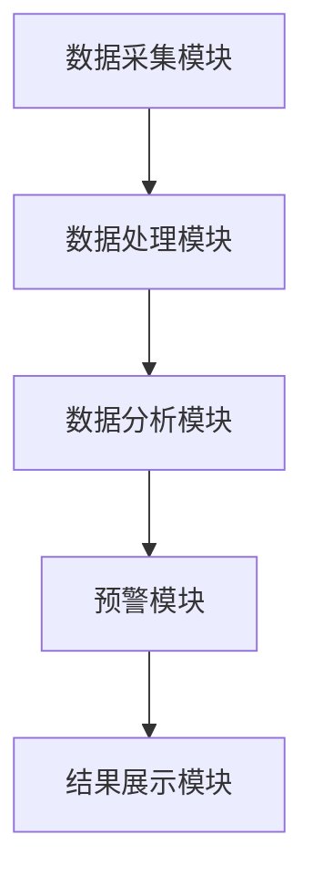
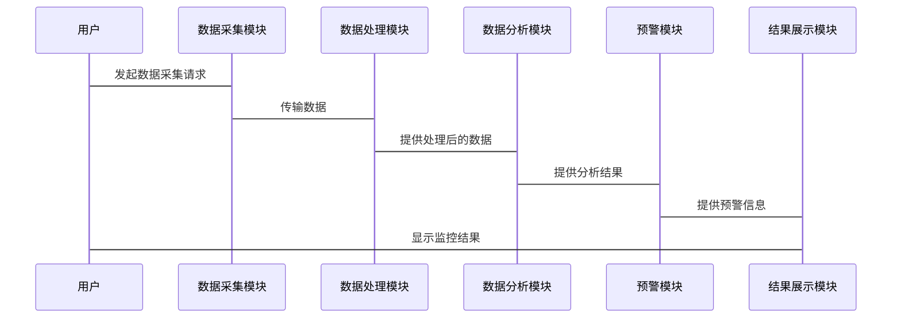

                 


# 构建智能企业合规管理系统：实时监控与预警机制

**关键词：** 企业合规管理、实时监控、预警机制、人工智能、系统架构、算法原理

**摘要：**  
随着企业数字化转型的加速，合规管理的重要性日益凸显。传统的合规管理方式面临着效率低下、响应不及时等问题，难以适应现代企业的复杂需求。智能企业合规管理系统通过结合实时监控与预警机制，利用人工智能技术实现自动化、智能化的合规管理，为企业提供了高效、可靠的解决方案。本文将详细探讨智能企业合规管理系统的构建过程，包括实时监控与预警机制的核心算法、系统架构设计、项目实战以及最佳实践。

---

## 第1章: 企业合规管理概述

### 1.1 企业合规管理的背景与意义

#### 1.1.1 合规管理的定义与内涵
合规管理是指企业为了确保其经营活动符合相关法律法规、行业标准和企业内部规章制度而进行的一系列管理活动。合规管理的核心目标是降低经营风险、避免法律纠纷、提升企业信誉。

#### 1.1.2 企业合规管理的重要性
- 避免法律风险：合规管理能够帮助企业识别和规避潜在的法律风险。
- 提升企业信誉：合规经营是企业获得客户信任和社会认可的重要基础。
- 优化业务流程：通过合规管理，企业可以发现并优化业务流程中的不合理部分。

#### 1.1.3 智能化合规管理的必要性
- 数据量大：现代企业产生的数据量巨大，传统的人工合规管理方式效率低下。
- 实时性要求高：企业需要对经营活动进行实时监控，及时发现和处理问题。
- 复杂性高：合规管理涉及的法律法规和行业标准繁多，人工处理容易出错。

### 1.2 企业合规管理的现状与挑战

#### 1.2.1 传统合规管理的局限性
- 人工依赖性强：传统合规管理主要依赖人工审查，效率低且容易出错。
- 响应不及时：传统合规管理无法实现实时监控，发现问题时往往已经造成损失。
- 缺乏智能化：传统合规管理无法充分利用大数据和人工智能技术，难以应对复杂多变的合规要求。

#### 1.2.2 数字化转型中的合规需求
- 数据驱动的合规：企业需要通过对海量数据的分析，发现潜在的合规风险。
- 实时监控的需求：数字化转型要求企业能够实时监控经营活动，确保合规性。
- 智能化合规工具的需求：企业需要借助智能化工具提高合规管理效率。

#### 1.2.3 智能化合规管理的技术挑战
- 数据隐私与安全：合规管理涉及企业的敏感数据，如何确保数据的安全性是一个重要挑战。
- 多法规适应性：企业需要满足多个法规和标准的要求，如何实现多法规的智能化管理是一个难题。
- 算法准确性：预警机制的准确性直接影响合规管理的效果，如何提高算法的准确性是关键。

### 1.3 智能企业合规管理的概念与特点

#### 1.3.1 智能合规管理的定义
智能合规管理是指利用人工智能技术，通过实时数据采集、分析和处理，实现对企业经营活动的自动化、智能化合规监控和预警。

#### 1.3.2 智能合规管理的核心特点
- **自动化**：通过算法自动识别合规风险，减少人工干预。
- **实时性**：能够实时监控企业的经营活动，及时发现和处理问题。
- **智能化**：利用机器学习等技术，不断优化合规监控的准确性。

#### 1.3.3 智能合规管理与传统合规管理的对比
| **对比维度** | **传统合规管理** | **智能合规管理** |
|--------------|------------------|------------------|
| **效率**      | 低               | 高               |
| **响应时间**  | 长               | 实时             |
| **准确性**    | 依赖人工经验     | 基于算法模型     |
| **扩展性**    | 有限             | 强               |

### 1.4 本章小结
本章介绍了企业合规管理的背景、意义以及智能化合规管理的必要性，分析了传统合规管理的局限性和数字化转型中的合规需求，总结了智能企业合规管理的核心特点和优势。

---

## 第2章: 实时监控与预警机制的核心概念

### 2.1 实时监控的定义与实现

#### 2.1.1 实时监控的定义
实时监控是指通过对企业的经营活动进行实时数据采集和分析，及时发现和处理潜在的合规风险。

#### 2.1.2 实时监控的关键技术
- 数据采集技术：包括日志采集、API接口采集等。
- 数据处理技术：包括数据清洗、数据转换等。
- 数据分析技术：包括统计分析、机器学习分析等。

#### 2.1.3 实时监控的实现方式
实时监控可以通过流数据处理技术实现，例如使用Apache Kafka进行数据采集，使用Flink进行实时计算。

### 2.2 预警机制的原理与设计

#### 2.2.1 预警机制的定义
预警机制是指通过设定阈值和规则，当某些指标或行为触发预警条件时，系统自动发出预警通知。

#### 2.2.2 预警机制的核心原理
- 预警规则：基于法律法规和企业内部政策设定的规则。
- 预警模型：通过机器学习模型预测潜在的合规风险。

#### 2.2.3 预警规则的设计与实现
预警规则的设计需要考虑以下因素：
- **阈值设定**：根据历史数据和业务需求设定合理的阈值。
- **规则优先级**：根据风险程度设定预警规则的优先级。
- **动态调整**：根据实际情况动态调整预警规则。

### 2.3 实时监控与预警机制的结合

#### 2.3.1 实时监控与预警的关系
实时监控是预警机制的基础，预警机制是实时监控的结果。

#### 2.3.2 实时监控与预警的协同工作
- 实时监控负责采集和分析数据。
- 预警机制负责根据分析结果触发预警。

#### 2.3.3 实时监控与预警的优化策略
- **数据优化**：提高数据采集的准确性和完整性。
- **规则优化**：根据实际效果动态调整预警规则。
- **模型优化**：通过机器学习不断优化预警模型的准确性。

### 2.4 本章小结
本章详细介绍了实时监控和预警机制的核心概念，分析了其实现方式和优化策略，为后续的算法设计和系统实现奠定了基础。

---

## 第3章: 智能企业合规管理的算法原理

### 3.1 实时监控的算法原理

#### 3.1.1 数据采集与处理
- 数据采集：通过API接口、日志文件等方式采集企业经营活动数据。
- 数据清洗：对采集到的数据进行去重、补全等处理。
- 数据转换：将数据转换为适合分析的格式。

#### 3.1.2 数据分析与特征提取
- 数据分析：使用统计分析、机器学习等技术对数据进行分析。
- 特征提取：提取与合规风险相关的特征，例如交易金额、交易频率等。

#### 3.1.3 实时监控的算法实现
- 使用流数据处理框架（如Flink）进行实时计算。
- 通过滑动窗口技术处理实时数据。

#### 3.1.4 实时监控的数学模型
$$y = f(x)$$  
其中，$x$ 表示输入数据，$y$ 表示输出结果。

### 3.2 预警机制的算法原理

#### 3.2.1 预警规则的制定
- 根据法律法规和企业政策制定预警规则。
- 设定阈值和触发条件。

#### 3.2.2 预警模型的构建
- 使用机器学习算法（如逻辑回归、随机森林）构建预警模型。
- 通过训练数据对模型进行优化。

#### 3.2.3 预警结果的输出
- 当模型预测结果达到预警条件时，系统自动发出预警通知。

#### 3.2.4 预警模型的数学公式
$$P(y|x) = \prod_{i=1}^{n} P(y|x_i)$$  
其中，$P(y|x_i)$ 表示在特征 $x_i$ 下，结果 $y$ 的概率。

### 3.3 本章小结
本章详细讲解了实时监控和预警机制的算法原理，包括数据处理、特征提取、模型构建等关键步骤，并通过数学公式展示了模型的实现过程。

---

## 第4章: 系统架构与设计方案

### 4.1 系统架构设计

#### 4.1.1 系统模块划分
- 数据采集模块：负责采集企业经营活动数据。
- 数据处理模块：对采集到的数据进行清洗和转换。
- 数据分析模块：对数据进行分析和特征提取。
- 预警模块：根据分析结果触发预警。
- 结果展示模块：展示监控结果和预警信息。

#### 4.1.2 系统架构图


### 4.2 系统功能设计

#### 4.2.1 数据采集功能
- 支持多种数据源的采集，例如数据库、API接口、日志文件等。
- 支持实时数据采集和批量数据采集。

#### 4.2.2 数据处理功能
- 数据清洗：去除重复数据、处理缺失值。
- 数据转换：将数据转换为适合分析的格式。

#### 4.2.3 数据分析功能
- 统计分析：计算关键指标，例如交易金额、交易频率等。
- 机器学习分析：使用算法模型预测合规风险。

#### 4.2.4 预警功能
- 根据预警规则和模型结果触发预警。
- 支持多种预警方式，例如邮件通知、短信通知等。

#### 4.2.5 结果展示功能
- 展示实时监控结果。
- 展示预警信息和历史数据。

### 4.3 系统交互设计

#### 4.3.1 系统交互流程


### 4.4 本章小结
本章详细设计了智能企业合规管理系统的架构和功能，包括模块划分、系统架构图和交互流程图，为系统的实现提供了清晰的指导。

---

## 第5章: 项目实战与代码实现

### 5.1 环境安装与配置

#### 5.1.1 环境要求
- 操作系统：Linux/Windows/MacOS
- JDK版本：Java 8+
- Python版本：Python 3.6+
- 依赖工具：Flink、Kafka、TensorFlow等。

#### 5.1.2 环境配置
- 安装必要的软件和工具。
- 配置环境变量，例如设置Java_HOME、Python_PATH。

### 5.2 核心代码实现

#### 5.2.1 数据采集模块代码
```python
from kafka import KafkaProducer

producer = KafkaProducer(bootstrap_servers='localhost:9092')
for message in messages:
    producer.send('compliance-topic', message)
```

#### 5.2.2 数据处理模块代码
```python
from pyspark.sql import SparkSession

spark = SparkSession.builderappName("data_processing").getOrCreate()
data = spark.read.csv('input.csv')
data_cleaned = data.drop('duplicate_column')
data_cleaned.write.csv('output.csv')
```

#### 5.2.3 数据分析模块代码
```python
from tensorflow.keras import layers

model = tf.keras.Sequential()
model.add(layers.Dense(64, activation='relu', input_dim=64))
model.add(layers.Dense(1, activation='sigmoid'))
model.compile(optimizer='adam', loss='binary_crossentropy', metrics=['accuracy'])
model.fit(x_train, y_train, epochs=10, batch_size=32)
```

#### 5.2.4 预警模块代码
```python
import pandas as pd

df = pd.read_csv('risk_scores.csv')
threshold = 0.8
df[df['score'] > threshold].to_csv('alerts.csv', index=False)
```

#### 5.2.5 结果展示模块代码
```python
import matplotlib.pyplot as plt

plt.figure(figsize=(10,6))
plt.plot(time_series_data, label='Compliance Score')
plt.xlabel('Time')
plt.ylabel('Score')
plt.legend()
plt.show()
```

### 5.3 实际案例分析

#### 5.3.1 案例背景
某企业发现其交易数据中存在异常交易行为，需要通过智能合规管理系统进行实时监控和预警。

#### 5.3.2 数据分析与处理
- 数据采集：采集最近一周的交易数据。
- 数据处理：清洗和转换数据，提取交易金额、交易时间等特征。
- 数据分析：使用机器学习模型预测交易风险。

#### 5.3.3 预警结果
- 系统检测到多笔高风险交易，触发预警通知。
- 预警信息通过邮件和短信通知相关人员。

### 5.4 项目小结
本章通过实际案例展示了智能企业合规管理系统的实现过程，包括环境配置、核心代码实现、数据分析与处理以及预警结果展示。

---

## 第6章: 最佳实践与总结

### 6.1 最佳实践

#### 6.1.1 数据安全与隐私保护
- 确保数据在采集、处理和分析过程中的安全性。
- 遵守数据隐私保护法规，例如GDPR。

#### 6.1.2 系统可扩展性
- 设计模块化架构，方便功能扩展和升级。
- 支持多种数据源和多种预警方式。

#### 6.1.3 系统性能优化
- 使用分布式计算技术提高处理效率。
- 优化算法模型，提高预测准确性。

### 6.2 小结

#### 6.2.1 本项目的核心成果
- 构建了一个基于人工智能的智能企业合规管理系统。
- 实现了实时监控和预警机制，能够高效识别和处理合规风险。

#### 6.2.2 未来展望
- 进一步优化算法模型，提高预警准确性。
- 推动智能合规管理技术在更多领域的应用。

### 6.3 注意事项

#### 6.3.1 数据隐私与安全
- 严格遵守数据隐私保护法规。
- 加强数据加密和访问控制。

#### 6.3.2 系统稳定性
- 确保系统的高可用性，避免因系统故障导致监控中断。
- 定期进行系统备份和恢复演练。

### 6.4 拓展阅读

#### 6.4.1 推荐书籍
- 《Data Mining: Concepts and Techniques》
- 《Machine Learning: A Probabilistic Perspective》

#### 6.4.2 推荐博客与资源
- [大数据技术博客](https://example.com)
- [人工智能技术博客](https://example.com)

---

## 附录: 参考文献

1. Apache Kafka官方文档
2. Apache Flink官方文档
3. TensorFlow官方文档
4. PySpark官方文档
5. 相关法律法规和行业标准

---

以上是《构建智能企业合规管理系统：实时监控与预警机制》的技术博客文章的完整目录大纲和内容概要。通过分章节详细讲解，结合实际案例和代码实现，帮助读者全面理解智能企业合规管理系统的构建过程和关键技术。

