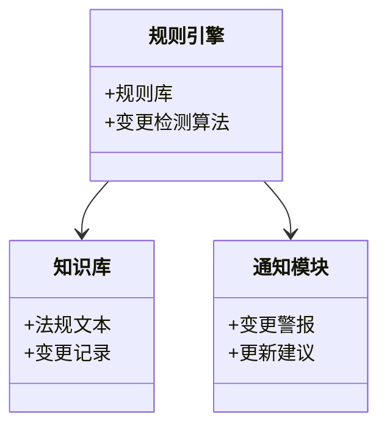
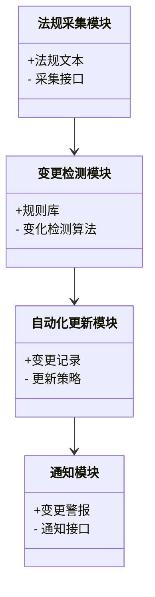

                 


# 构建智能企业合规管理系统：法规变更追踪与自动化更新

> 关键词：智能合规管理，法规变更追踪，自动化更新，企业合规，系统架构，人工智能

> 摘要：  
本文将深入探讨如何构建一个智能企业合规管理系统，重点聚焦于法规变更的追踪与自动化更新。通过结合人工智能、大数据和自动化技术，我们能够帮助企业高效应对法规变化，确保合规性。本文将从背景、核心概念、算法原理、系统架构到项目实战，全面解析智能合规管理系统的构建过程，为企业提供一套可行的解决方案。

---

# 第一部分: 智能企业合规管理系统的背景与价值

## 第1章: 企业合规管理的重要性

### 1.1 合规管理的核心概念

#### 1.1.1 合规管理的定义与内涵  
合规管理是指企业在经营过程中，遵循相关法律法规、行业标准和企业内部政策的行为。它是企业风险管理的重要组成部分，旨在确保企业行为的合法性和规范性。

#### 1.1.2 企业合规管理的必要性  
随着全球化和数字化的加速，企业面临的法规环境日益复杂。合规管理不仅是企业避免法律风险的关键，也是提升企业信誉和竞争力的重要因素。

#### 1.1.3 合规管理对企业的影响  
合规管理直接影响企业的运营成本、法律责任和市场机会。合规良好的企业更容易获得客户信任和合作伙伴支持，同时降低因违规导致的罚款和声誉损失。

---

### 1.2 法规变更对企业合规的挑战

#### 1.2.1 法规变更的复杂性  
法律法规的变更频繁且复杂，企业需要及时了解并调整其业务流程和系统。然而，手动追踪和更新法规不仅耗时，且容易出错。

#### 1.2.2 企业合规管理的痛点  
- **信息分散**：法规信息分布在不同渠道，难以统一管理。  
- **人工依赖**：依赖人工更新和检查，效率低且成本高。  
- **滞后性**：传统合规管理难以实时响应法规变化。

#### 1.2.3 法规变更对企业运营的影响  
法规变更可能导致企业业务流程调整、合同修订或系统改造。未能及时应对法规变化可能导致合规失败，甚至引发法律纠纷。

---

### 1.3 智能化合规管理的优势

#### 1.3.1 提高合规效率  
通过智能化系统，企业可以实现法规变更的自动识别和推送，减少人工干预，提高合规效率。

#### 1.3.2 减少人为错误  
智能化系统能够自动处理复杂的法规信息，避免人为操作中的疏漏和错误。

#### 1.3.3 实时追踪与更新  
智能合规管理系统可以实时监控法规变化，确保企业始终符合最新的法规要求。

---

## 第2章: 智能企业合规管理系统的价值

### 2.1 提升企业合规能力

#### 2.1.1 实现自动化合规检查  
智能系统能够自动对企业内部的业务流程、合同和文档进行合规性检查，确保所有操作符合法规要求。

#### 2.1.2 降低合规成本  
通过自动化技术和智能化算法，企业可以显著降低合规管理的人力和时间成本。

#### 2.1.3 提高合规管理的透明度  
智能系统提供完整的记录和追踪功能，确保合规过程的透明和可追溯。

---

### 2.2 企业合规管理的智能化趋势

#### 2.2.1 人工智能在合规管理中的应用  
人工智能技术可以用于法规文本的自动解析、变更识别和影响评估，帮助企业在复杂环境中快速响应法规变化。

#### 2.2.2 大数据技术对合规管理的支撑  
大数据技术可以整合分散的法规信息，建立统一的法规知识库，为企业提供全面的合规支持。

#### 2.2.3 智能合规管理系统的未来发展方向  
随着技术的进步，智能合规管理系统将更加智能化和自动化，实现从法规变更识别到自动调整的端到端流程。

---

### 2.3 本章小结  
本章从企业合规管理的重要性入手，分析了传统合规管理的痛点和智能化合规管理的优势，为企业构建智能合规管理系统提供了背景和价值支持。

---

# 第二部分: 智能企业合规管理系统的核心概念与原理

## 第3章: 法规变更追踪的核心原理

### 3.1 法规变更的检测机制

#### 3.1.1 基于规则的变更检测  
基于规则的变更检测是通过预定义的规则来匹配法规文本的变化。例如，可以使用正则表达式匹配新增或删除的内容。

#### 3.1.2 基于自然语言处理的变更识别  
自然语言处理（NLP）技术可以用于分析法规文本的变化。通过词袋模型或词嵌入模型，系统可以识别文本中的新增、删除或修改部分。

#### 3.1.3 变化点分析方法  
变化点分析是一种基于时间序列的分析方法，可以用于检测法规文本的变化点。这种方法可以帮助系统快速定位法规变更的关键部分。

---

### 3.2 法规变更的影响评估

#### 3.2.1 影响范围的确定  
通过分析法规变更的内容，确定哪些业务流程、合同或系统会受到变更的影响。

#### 3.2.2 影响程度的评估  
根据变更的范围和重要性，评估其对企业的潜在影响，例如高优先级变更需要立即调整，低优先级变更可以延后处理。

#### 3.2.3 影响优先级的排序  
基于影响程度和紧急程度，对变更进行优先级排序，确保企业能够优先处理最重要的变更。

---

### 3.3 法规变更的自动化更新机制

#### 3.3.1 自动化更新的触发条件  
当检测到法规变更时，系统会自动触发更新流程。触发条件可以是变更的类型、优先级或时间阈值。

#### 3.3.2 更新策略的制定  
根据变更的影响范围和优先级，制定不同的更新策略。例如，对于高优先级变更，系统可以立即生成调整建议；对于低优先级变更，可以安排在特定时间进行调整。

#### 3.3.3 更新结果的验证  
在更新完成后，系统需要验证变更是否成功应用，并确保合规性。如果发现异常，系统会自动回滚或发出警报。

---

## 第4章: 合规管理系统的核心架构

### 4.1 系统功能模块划分

#### 4.1.1 数据采集模块  
数据采集模块负责从各种来源（如官方网站、数据库）获取法规信息，并将其存储在知识库中。

#### 4.1.2 规则引擎模块  
规则引擎模块负责根据预定义的规则，对法规文本进行解析和变更检测。

#### 4.1.3 知识库模块  
知识库模块存储所有相关的法规信息、变更记录和业务规则，为系统提供数据支持。

#### 4.1.4 通知模块  
通知模块在检测到法规变更时，通过邮件、短信或消息队列通知相关人员。

---

### 4.2 系统架构设计

#### 4.2.1 分层架构设计  
智能合规管理系统采用分层架构，包括数据层、业务逻辑层和用户界面层。每一层都有明确的功能划分，便于开发和维护。

#### 4.2.2 微服务架构设计  
采用微服务架构可以将系统划分为多个独立的服务，例如法规采集服务、变更检测服务和通知服务。这种架构具有良好的扩展性和灵活性。

#### 4.2.3 数据流与控制流设计  
数据流从数据采集模块进入系统，经过规则引擎模块的处理后，生成变更信息并传递给通知模块。控制流则根据变更的优先级和类型，决定系统的响应方式。

---

### 4.3 系统核心算法与实现

#### 4.3.1 基于规则匹配的变更检测算法  
```python
def detect_changes(rule, text):
    matches = re.findall(rule, text)
    return matches
```

#### 4.3.2 基于机器学习的变更预测模型  
```python
model = load_model('change_detection_model')
predicted_changes = model.predict(new_text)
```

#### 4.3.3 自动化更新算法  
```python
def apply_update(change, current_state):
    new_state = current_state.apply(change)
    return new_state
```

---

## 第5章: 系统核心算法的实现与优化

### 5.1 基于规则匹配的变更检测算法

#### 5.1.1 正则表达式的应用  
通过正则表达式匹配法规文本中的变化部分，例如匹配新增或删除的内容。

#### 5.1.2 算法优化  
为了提高检测效率，可以对正则表达式进行优化，例如减少重复匹配和增加优先级。

---

### 5.2 基于机器学习的变更预测模型

#### 5.2.1 数据准备  
将法规文本和变更信息作为训练数据，构建词袋模型或词嵌入模型。

#### 5.2.2 模型训练  
使用训练数据对机器学习模型进行训练，例如使用随机森林或支持向量机（SVM）进行分类。

#### 5.2.3 模型优化  
通过调整模型参数和增加特征工程，提高模型的准确性和召回率。

---

## 第6章: 系统架构与实现

### 6.1 问题场景介绍

#### 6.1.1 合规管理的典型问题  
企业在合规管理中可能面临的问题包括法规变更频繁、信息分散、人工成本高等。

#### 6.1.2 系统目标  
通过构建智能合规管理系统，实现法规变更的自动检测和更新，确保企业合规性。

---

### 6.2 项目介绍

#### 6.2.1 项目目标  
本项目旨在开发一个智能合规管理系统，能够实时追踪法规变更并自动化更新。

#### 6.2.2 项目范围  
系统将涵盖法规采集、变更检测、影响评估和自动化更新等功能。

---

### 6.3 系统功能设计

#### 6.3.1 领域模型设计  


---

### 6.4 系统架构设计

#### 6.4.1 微服务架构设计  
```mermaid
serviceDiagram
    service 法规采集服务 {
        - 采集法规文本
    }
    service 变更检测服务 {
        - 检测法规变更
    }
    service 通知服务 {
        - 发送变更警报
    }
```

---

## 第7章: 项目实战

### 7.1 环境安装

#### 7.1.1 安装Python  
需要安装Python 3.8或更高版本。

#### 7.1.2 安装依赖库  
安装以下依赖库：
```bash
pip install requests beautifulsoup4 scikit-learn
```

---

### 7.2 系统核心实现

#### 7.2.1 法规采集模块  
```python
import requests
from bs4 import BeautifulSoup

def fetch_regulations(url):
    response = requests.get(url)
    soup = BeautifulSoup(response.text, 'html.parser')
    regulations = soup.find_all('div', class_='regulation-text')
    return [text.get_text() for text in regulations]
```

#### 7.2.2 变更检测模块  
```python
import re

def detect_changes(rule, text):
    return re.findall(rule, text)
```

---

### 7.3 实际案例分析

#### 7.3.1 案例背景  
假设某企业需要遵守《数据保护法》的最新变更，系统需要自动检测并更新相关法规。

#### 7.3.2 检测过程  
系统通过规则引擎模块检测到法规文本的变化，并生成变更警报。

#### 7.3.3 自动化更新  
系统根据变更的影响程度，自动生成调整建议并通知相关人员。

---

### 7.4 项目小结  
本章通过实际案例展示了智能合规管理系统的实现过程，包括环境安装、核心代码实现和案例分析。

---

# 第三部分: 最佳实践与未来展望

## 第8章: 最佳实践

### 8.1 小结  
智能合规管理系统通过自动化技术解决了传统合规管理的痛点，显著提高了企业的合规效率和能力。

---

### 8.2 注意事项  
- 确保系统数据的安全性和隐私性。  
- 定期更新规则库和模型，以应对法规变化。  
- 提供用户友好的界面和良好的用户体验。

---

## 第9章: 未来展望

### 9.1 智能合规管理的未来发展  
随着人工智能和大数据技术的不断进步，智能合规管理系统将更加智能化和自动化。未来，系统可以实现从法规变更识别到自动调整的端到端流程。

---

### 9.2 拓展阅读  
建议读者进一步阅读以下内容：  
- 《机器学习在法律领域的应用》  
- 《企业合规管理的数字化转型》  

---

# 附录: 系统架构图



---

# 结语  
通过本文的深入解析，读者可以全面了解智能企业合规管理系统的构建过程，并掌握其核心技术和最佳实践。希望本文能够为企业在数字化转型中提供有价值的参考和指导。

