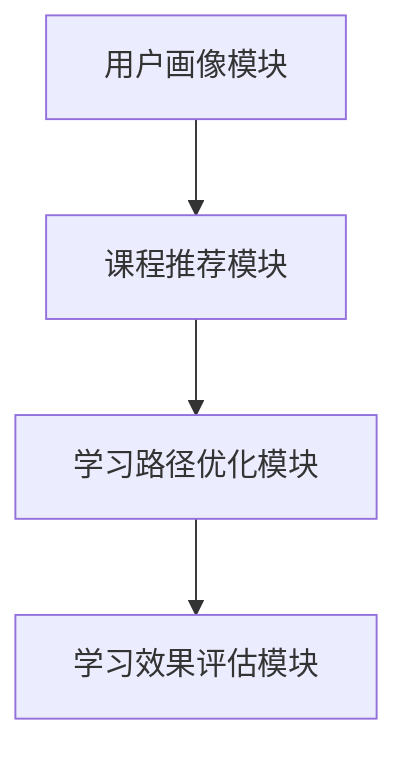
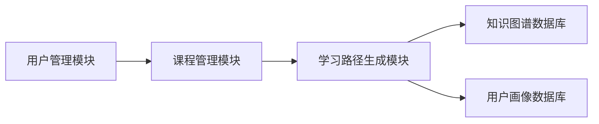
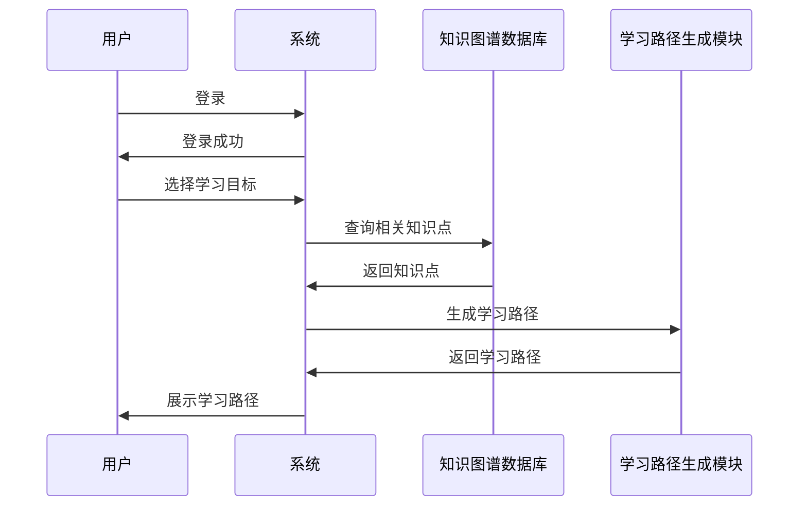

                 


# 构建智能企业培训系统：AI个性化学习路径

> 关键词：人工智能、个性化学习、企业培训系统、知识图谱、推荐算法

> 摘要：本文详细探讨了如何利用人工智能技术构建智能企业培训系统，实现个性化学习路径的设计与优化。通过分析系统的核心模块、算法原理和系统架构，结合实际项目案例，展示了AI在企业培训中的应用价值和未来发展方向。

---

## 第1章: AI与个性化学习概述

### 1.1 AI在企业培训中的应用背景

#### 1.1.1 传统企业培训的局限性
传统的企业培训系统往往采用统一的课程安排和教学方式，难以满足不同学习者的个性化需求。学习者的学习进度、兴趣点和知识掌握程度存在显著差异，而传统系统缺乏动态调整的能力，导致学习效果参差不齐。

#### 1.1.2 AI技术对企业培训的革新作用
人工智能技术的快速发展为企业培训带来了新的可能性。通过AI技术，企业可以实现学习者的个性化需求分析、动态知识推荐和学习路径优化，从而提升培训效果和效率。

#### 1.1.3 个性化学习路径的核心价值
个性化学习路径能够根据学习者的特点和需求，定制专属的学习计划，帮助他们高效掌握所需知识和技能。通过AI技术实现个性化学习路径，不仅提升了学习者的学习体验，还为企业节省了培训资源。

### 1.2 智能企业培训系统的定义与特点

#### 1.2.1 系统定义
智能企业培训系统是一种基于人工智能技术的培训管理平台，能够根据学习者的需求和特征，动态生成个性化学习路径，并实时调整学习内容和进度。

#### 1.2.2 系统核心特点
- **个性化推荐**：基于学习者的特点和需求，推荐最适合的学习内容。
- **动态调整**：根据学习效果和反馈，实时优化学习路径。
- **知识图谱支持**：构建领域知识图谱，帮助学习者高效掌握知识点。
- **数据驱动**：利用学习数据进行分析和优化，提升系统智能性。

#### 1.2.3 与传统培训系统的对比分析
| 特性                | 传统培训系统                  | 智能培训系统                  |
|---------------------|-----------------------------|-----------------------------|
| 学习路径设计        | 固定、统一                   | 动态、个性化                 |
| 内容推荐方式        | 预设、人工                   | 智能、自动                   |
| 学习效果评估        | 单一、固定                   | 细化、动态                   |
| 系统灵活性          | 较低                        | 较高                        |

### 1.3 个性化学习路径的实现目标

#### 1.3.1 学习者需求精准匹配
通过分析学习者的学习目标、兴趣和知识盲点，系统能够精准匹配最合适的课程和学习内容。

#### 1.3.2 知识点智能推荐
基于知识图谱和推荐算法，系统能够智能推荐相关的知识点，帮助学习者高效学习。

#### 1.3.3 学习效果动态优化
根据学习者的学习进度和效果反馈，系统能够动态调整学习路径，优化学习效果。

### 1.4 本章小结
本章介绍了AI在企业培训中的应用背景，详细阐述了智能企业培训系统的定义、特点以及个性化学习路径的核心价值。通过对比分析，展示了智能培训系统的优越性。

---

## 第2章: 智能企业培训系统的核心模块

### 2.1 用户画像模块

#### 2.1.1 用户画像的构建方法
用户画像是基于学习者的特征数据构建的，包括学习目标、兴趣爱好、知识水平、学习风格等。

#### 2.1.2 用户画像的数据来源
用户画像的数据来源包括：
- **学习者基本信息**：年龄、职业、学历等。
- **学习行为数据**：学习时间、学习进度、课程偏好等。
- **知识掌握情况**：通过测试评估的知识点掌握程度。

#### 2.1.3 用户画像的更新机制
系统会定期更新用户画像，基于新的学习行为和反馈，动态调整学习路径。

### 2.2 课程推荐模块

#### 2.2.1 基于协同过滤的推荐算法
协同过滤是一种常用的推荐算法，分为基于用户的协同过滤和基于物品的协同过滤。

#### 2.2.2 基于内容的推荐算法
基于内容的推荐算法通过分析课程内容的特征，推荐与学习者兴趣相符的课程。

#### 2.2.3 混合推荐算法的应用
混合推荐算法结合了协同过滤和基于内容的推荐方法，能够提高推荐的准确性和多样性。

### 2.3 学习路径优化模块

#### 2.3.1 知识图谱构建
知识图谱是系统的核心知识结构，描述了各个知识点之间的关系和依赖。

#### 2.3.2 学习路径生成算法
学习路径生成算法基于知识图谱和用户画像，生成个性化的学习路径。

#### 2.3.3 学习路径动态调整机制
系统会根据学习者的反馈和学习效果，动态调整学习路径，确保学习目标的实现。

### 2.4 系统模块关系图



---

## 第3章: 个性化推荐算法原理

### 3.1 协同过滤算法

#### 3.1.1 基于用户的协同过滤
基于用户的协同过滤算法通过寻找与目标用户相似的其他用户，推荐这些用户喜欢的内容。

#### 3.1.2 基于物品的协同过滤
基于物品的协同过滤算法通过分析物品的特征，推荐与目标用户已选择物品相似的其他物品。

#### 3.1.3 混合协同过滤的实现
混合协同过滤算法结合了基于用户和基于物品的协同过滤方法，能够提高推荐的准确性和多样性。

### 3.2 基于内容的推荐算法

#### 3.2.1 文本特征提取方法
文本特征提取方法包括TF-IDF、Word2Vec等，用于提取课程内容的特征向量。

#### 3.2.2 基于向量空间模型的推荐
基于向量空间模型的推荐算法通过计算目标用户与课程内容的相似度，推荐最相关的课程。

#### 3.2.3 基于深度学习的推荐
基于深度学习的推荐算法（如神经网络）能够捕捉更复杂的内容特征，提高推荐的准确性。

### 3.3 算法实现代码示例

```python
def collaborative_filtering(user_id, user_similarity):
    # 获取与目标用户相似的用户
    similar_users = [user for user in range(len(user_similarity)) if user_similarity[user_id][user] > 0.5]
    # 推荐目标用户喜欢的课程
    recommended_courses = []
    for user in similar_users:
        recommended_courses.extend(users_courses[user])
    return recommended_courses
```

---

## 第4章: 系统架构与设计

### 4.1 系统功能设计

#### 4.1.1 用户管理模块
用户管理模块负责管理学习者的注册、登录和信息维护。

#### 4.1.2 课程管理模块
课程管理模块负责课程的添加、删除和更新，以及课程内容的管理。

#### 4.1.3 学习路径生成模块
学习路径生成模块基于用户画像和知识图谱，生成个性化的学习路径。

### 4.2 系统架构设计



### 4.3 系统接口设计

#### 4.3.1 用户接口
用户可以通过Web或移动端界面进行课程选择和学习。

#### 4.3.2 管理接口
管理员可以通过管理界面进行课程管理和用户管理。

### 4.4 系统交互流程



---

## 第5章: 项目实战与案例分析

### 5.1 项目背景

#### 5.1.1 项目目标
本项目旨在构建一个智能企业培训系统，实现个性化学习路径的设计与优化。

#### 5.1.2 项目需求
- 实现用户画像构建
- 实现课程推荐功能
- 实现学习路径生成和动态调整

### 5.2 核心代码实现

#### 5.2.1 知识图谱构建

```python
from networkx import DiGraph

# 创建知识图谱
knowledge_graph = DiGraph()
knowledge_graph.add_edges_from([("A", "B"), ("B", "C"), ("A", "D")])
```

#### 5.2.2 学习路径生成

```python
def generate_learning_path(user_id, knowledge_graph):
    # 获取起点节点
    start_node = "A"
    # 生成学习路径
    path = []
    current_node = start_node
    while True:
        path.append(current_node)
        if current_node == "C":
            break
        current_node = knowledge_graph.neighbors(current_node)[0]
    return path
```

### 5.3 实际案例分析

#### 5.3.1 案例背景
某企业希望提升员工的编程能力，选择使用智能企业培训系统进行培训。

#### 5.3.2 系统应用
系统根据员工的学习目标和兴趣，推荐相关课程，并生成个性化学习路径。

#### 5.3.3 学习效果
通过系统的学习，员工的编程能力得到了显著提升，学习效率也大幅提高。

### 5.4 项目小结
本项目展示了AI技术在企业培训中的应用价值，通过实际案例分析，验证了系统的有效性和实用性。

---

## 第6章: 总结与展望

### 6.1 本章总结
本文详细探讨了如何利用AI技术构建智能企业培训系统，实现了个性化学习路径的设计与优化。通过分析系统的核心模块、算法原理和系统架构，结合实际项目案例，展示了AI在企业培训中的应用价值。

### 6.2 未来展望
随着AI技术的不断发展，智能企业培训系统将具备更多功能和更高的智能性。未来的研究方向包括：
- 更加精准的知识图谱构建
- 更高效的推荐算法
- 更智能的学习路径优化

### 6.3 最佳实践 Tips
- 在构建知识图谱时，应结合领域专家的意见，确保知识的准确性和完整性。
- 在实现推荐算法时，应考虑算法的可解释性和可扩展性。
- 在系统设计时，应注重系统的灵活性和可维护性。

---

通过本文的探讨，我们相信AI技术将在企业培训领域发挥越来越重要的作用，为学习者和企业带来更大的价值。

