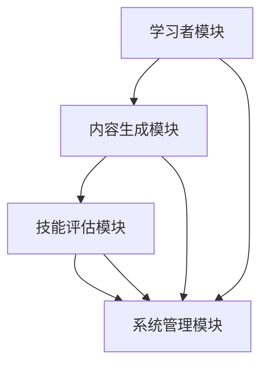

                 


# 构建智能企业培训系统：自适应学习内容生成与技能评估

---

## 关键词：智能企业培训系统, 自适应学习, 技能评估, 机器学习, 知识图谱, 系统架构

---

## 摘要：  
智能企业培训系统通过自适应学习内容生成和技能评估，帮助企业实现个性化的员工培训和高效的技能提升。本文从背景、核心概念、算法原理、系统架构到项目实战，详细阐述了智能企业培训系统的构建过程，结合实际案例分析，为读者提供系统的理论支持和实践指导。

---

## 第一章: 智能企业培训系统概述

### 1.1 传统企业培训的痛点
传统企业培训模式存在以下问题：
- **学习内容固定**：无法根据员工的个性化需求和能力水平动态调整学习内容。
- **学习效果难以评估**：缺乏有效的技能评估机制，难以量化学习效果。
- **培训成本高**：传统培训模式需要大量的人力和时间投入，且效果难以保证。

### 1.2 智能企业培训系统的概念
智能企业培训系统是一种基于人工智能技术的培训系统，能够根据员工的学习需求和能力水平，动态生成个性化学习内容，并通过技能评估模型对员工的学习效果进行量化评估。

### 1.3 系统的目标与价值
系统的目标是通过智能化手段，实现以下功能：
- **个性化学习路径**：根据员工的技能水平和学习目标，动态生成学习内容和学习计划。
- **精准技能评估**：通过技能评估模型，对员工的学习效果进行量化评估，并提供改进建议。
- **数据驱动的优化**：通过分析学习数据和评估结果，不断优化学习内容和评估模型，提升培训效果。

---

## 第二章: 自适应学习的原理与实现

### 2.1 自适应学习的核心原理
自适应学习的核心原理是通过分析学习者的特征和学习需求，动态生成个性化学习内容和学习路径。具体包括以下步骤：
1. **学习者画像**：通过收集学习者的基本信息、学习历史、兴趣偏好等数据，构建学习者画像。
2. **学习目标设定**：根据学习者的学习目标和能力水平，设定个性化学习目标。
3. **内容推荐**：基于学习者画像和学习目标，推荐适合的学习内容和学习路径。
4. **学习反馈**：通过学习反馈机制，不断优化学习内容和学习路径。

### 2.2 技能评估的实现机制
技能评估的核心是通过评估模型对学习者的学习效果进行量化评估。具体包括以下步骤：
1. **评估指标设计**：根据学习目标和技能要求，设计评估指标。
2. **评估模型构建**：基于机器学习算法，构建技能评估模型。
3. **评估结果分析**：通过对评估结果的分析，生成改进建议和学习反馈。

### 2.3 自适应学习与技能评估的关联
自适应学习和技能评估是相辅相成的。自适应学习通过动态生成个性化学习内容和学习路径，提高学习效果；技能评估通过量化学习效果，为学习者提供反馈和改进建议，进一步优化学习过程。

---

## 第三章: 自适应学习内容生成算法

### 3.1 基于协同过滤的推荐算法
协同过滤是一种常用的推荐算法，通过分析学习者的行为数据和偏好，推荐适合的学习内容。具体步骤如下：
1. **数据收集**：收集学习者的行为数据，包括学习内容的选择、学习时间、学习效果等。
2. **相似性计算**：基于余弦相似度计算学习者之间的相似性。
3. **推荐生成**：根据相似学习者的偏好，推荐适合的学习内容。

### 3.2 基于深度学习的内容生成算法
深度学习是一种更复杂的推荐算法，能够通过学习数据的特征，生成更精准的推荐结果。具体步骤如下：
1. **数据预处理**：对学习内容进行特征提取，构建内容向量。
2. **模型训练**：基于深度学习模型（如BERT）进行训练，生成学习内容的表示向量。
3. **推荐生成**：根据学习者的画像和内容向量，生成个性化推荐结果。

### 3.3 技能评估模型
技能评估模型通过分析学习者的学习数据，量化其技能水平。具体包括以下步骤：
1. **特征提取**：提取学习者的学习数据特征，包括学习时间、学习效果、学习内容等。
2. **模型训练**：基于机器学习算法（如随机森林、神经网络等），训练技能评估模型。
3. **评估结果生成**：根据评估模型，生成学习者的技能评估结果。

---

## 第四章: 技能评估与学习效果反馈

### 4.1 技能评估模型的设计
技能评估模型的设计需要考虑以下因素：
1. **评估指标**：根据学习目标和技能要求，设计评估指标。
2. **模型选择**：选择适合的机器学习算法，构建评估模型。
3. **模型优化**：通过交叉验证和调参，优化评估模型的性能。

### 4.2 学习效果反馈机制
学习效果反馈机制是自适应学习的重要组成部分，通过分析学习者的学习数据，提供实时反馈和改进建议。具体包括以下步骤：
1. **数据采集**：采集学习者的学习数据，包括学习时间、学习内容、学习效果等。
2. **数据分析**：通过数据分析，识别学习者的学习瓶颈和薄弱环节。
3. **反馈生成**：根据分析结果，生成个性化反馈和改进建议。

### 4.3 技能提升路径优化
技能提升路径优化是通过分析学习者的学习数据，优化学习路径，提高学习效果。具体包括以下步骤：
1. **路径分析**：分析学习者的学习路径，识别学习路径中的瓶颈和薄弱环节。
2. **路径优化**：根据分析结果，优化学习路径，生成新的学习内容和学习计划。
3. **路径实施**：将优化后的学习路径实施，实时监控学习效果，不断优化学习路径。

---

## 第五章: 智能企业培训系统的架构设计

### 5.1 系统模块划分
智能企业培训系统的架构设计需要考虑以下模块：
1. **学习者模块**：负责学习者画像和学习需求的分析。
2. **内容生成模块**：负责个性化学习内容的生成和推荐。
3. **技能评估模块**：负责学习者技能的评估和反馈。
4. **系统管理模块**：负责系统的配置和管理。

### 5.2 系统功能设计
系统功能设计需要考虑以下方面：
1. **用户界面设计**：设计直观易用的用户界面，方便学习者使用。
2. **系统交互设计**：设计高效的系统交互流程，提升用户体验。
3. **数据存储设计**：设计合理的数据存储结构，确保数据的安全性和可靠性。

### 5.3 系统架构图
以下是智能企业培训系统的架构图：



---

## 第六章: 项目实战与案例分析

### 6.1 环境安装与配置
以下是项目实战所需的环境安装步骤：
1. **安装Python**：安装Python 3.8及以上版本。
2. **安装依赖库**：安装必要的依赖库，如TensorFlow、Scikit-learn、Numpy等。
3. **安装开发工具**：安装IDE（如PyCharm）和版本控制工具（如Git）。

### 6.2 系统核心功能实现
以下是系统核心功能的实现代码示例：

#### 学习者画像生成代码：
```python
import pandas as pd

def generate_user_profile(user_data):
    # 数据预处理
    df = pd.DataFrame(user_data)
    # 特征提取
    user_profile = df.describe()
    return user_profile
```

#### 内容推荐算法代码：
```python
from sklearn.metrics.pairwise import cosine_similarity

def content_recommendation(user_profile, content_features):
    # 计算相似性
    similarity = cosine_similarity(user_profile, content_features)
    # 推荐结果
    recommendations = similarity.argsort()
    return recommendations
```

#### 技能评估模型代码：
```python
from sklearn.ensemble import RandomForestClassifier

def skill_assessment_model(train_data, test_data):
    # 模型训练
    model = RandomForestClassifier().fit(train_data)
    # 模型预测
    predictions = model.predict(test_data)
    return predictions
```

### 6.3 实际案例分析
以下是一个实际案例的分析：
1. **案例背景**：某企业希望通过智能培训系统，提升员工的编程能力。
2. **系统实施**：根据员工的学习需求和能力水平，动态生成个性化学习内容和学习计划。
3. **评估结果**：通过技能评估模型，评估员工的学习效果，并提供改进建议。

---

## 第七章: 总结与展望

### 7.1 总结
智能企业培训系统通过自适应学习内容生成和技能评估，帮助企业实现个性化的员工培训和高效的技能提升。本文详细阐述了系统的构建过程，包括背景、核心概念、算法原理、系统架构和项目实战。

### 7.2 最佳实践 tips
- **数据隐私保护**：在处理学习者数据时，需要注意数据隐私保护，确保数据的安全性。
- **模型优化**：定期优化模型，提升系统的准确性和响应速度。
- **用户反馈**：及时收集用户反馈，不断优化系统功能和用户体验。

### 7.3 未来展望
未来，随着人工智能技术的不断发展，智能企业培训系统将更加智能化和个性化。我们可以期待更多基于深度学习和知识图谱的创新应用，为企业培训带来更大的价值。

---

## 参考文献
1. 《机器学习实战》
2. 《深度学习入门》
3. 《系统架构设计》

---

希望这篇文章能够为读者提供系统的理论支持和实践指导，帮助大家更好地理解和构建智能企业培训系统。

