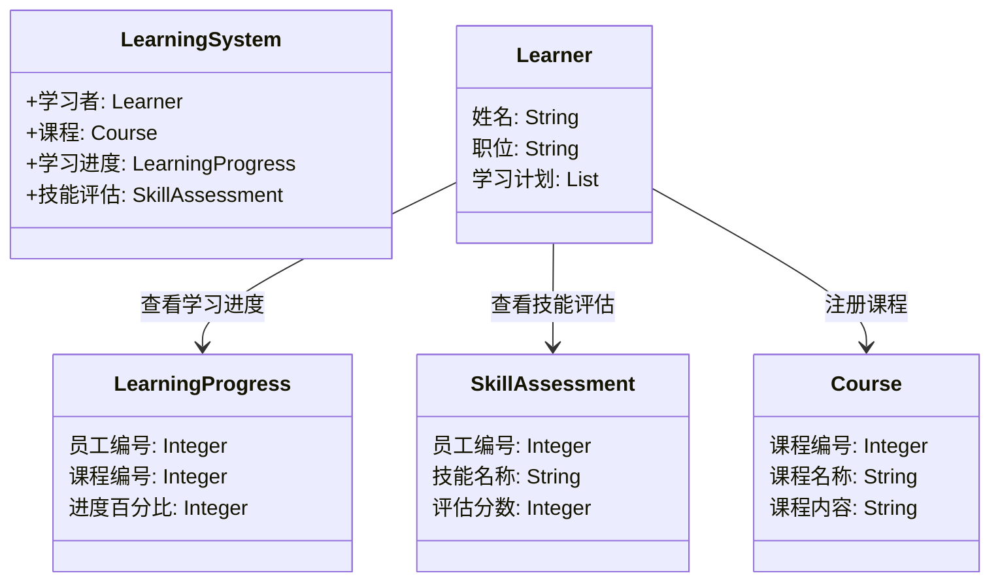
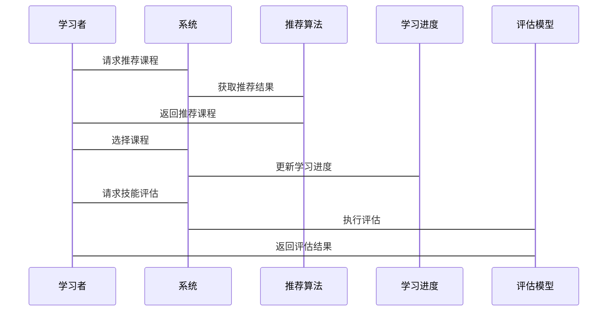

                 


# 构建智能企业培训系统：自适应学习路径与技能评估

**关键词：**智能企业培训系统、自适应学习路径、技能评估、人工智能、机器学习

**摘要：**  
随着企业对员工培训需求的不断增加，传统的培训系统逐渐暴露出其局限性。本文将深入探讨如何利用人工智能和机器学习技术，构建一个智能企业培训系统，通过自适应学习路径和技能评估，为员工提供个性化的学习体验，从而提高培训效果和企业竞争力。本文将从问题背景、核心概念、算法原理、系统架构到项目实战，逐步展开分析，为读者提供一个全面的解决方案。

---

## 第一章: 问题背景与核心概念

### 1.1 问题背景

#### 1.1.1 传统企业培训系统的局限性
传统的企业培训系统通常采用固定的学习路径和统一的教学内容，难以满足员工的个性化需求。例如，员工的学习速度、兴趣点和知识掌握程度各不相同，但传统系统无法根据这些差异进行调整。此外，传统系统往往缺乏实时反馈机制，无法及时发现和解决学习过程中遇到的问题，导致培训效果不佳。

#### 1.1.2 当前企业培训面临的挑战
- **员工需求多样化**：不同员工有不同的学习目标和节奏。
- **知识更新速度快**：企业需要不断引入新的技能和知识。
- **学习数据孤岛**：学习数据分散，难以进行有效分析和利用。
- **培训效果难以量化**：缺乏科学的评估体系，难以衡量培训的实际效果。

#### 1.1.3 智能化培训系统的必要性
通过引入人工智能和机器学习技术，智能化企业培训系统能够实时分析学习者的行为数据，动态调整学习路径，提供个性化的学习建议，从而提升培训效果和员工满意度。

### 1.2 核心概念

#### 1.2.1 自适应学习路径
自适应学习路径是指根据学习者的学习进度、兴趣和能力，动态调整学习内容、顺序和难度的一种学习方式。例如，系统可以根据员工的知识水平推荐适合的课程，或者根据学习者的薄弱环节提供针对性的练习。

#### 1.2.2 技能评估系统
技能评估系统是通过多种方式（如测试、任务完成情况、学习数据等）对员工的技能水平进行量化评估的系统。评估结果可以为学习者提供反馈，帮助他们了解自己的学习进展，也可以为企业提供决策依据。

#### 1.2.3 个性化学习体验
个性化学习体验是指根据每个学习者的特点（如学习风格、兴趣爱好、知识水平等）提供定制化的学习内容和方式，从而提高学习效率和满意度。

### 1.3 核心概念对比分析

#### 1.3.1 自适应学习路径与传统学习路径对比
| 对比维度         | 自适应学习路径               | 传统学习路径               |
|------------------|------------------------------|----------------------------|
| 学习路径调整      | 动态调整                     | 固定不变                   |
| 学习者参与度      | 高                          | 中                          |
| 个性化程度        | 高                          | 低                          |
| 适应性           | 强                          | 弱                          |

#### 1.3.2 技能评估与传统考核方式对比
| 对比维度         | 技能评估                   | 传统考核方式               |
|------------------|----------------------------|----------------------------|
| 评估频率         | 实时或定期                 | 定期                       |
| 评估内容         | 知识、技能、行为表现       | 知识点                    |
| 评估结果         | 数据驱动，动态调整         | 固定标准                   |
| 评估方式         | 多维度（测试、任务、数据） | 单一方式（测试、问卷）     |

### 1.4 实体关系图（ER图）

```mermaid
erd
  title 实体关系图
  Employee (员工编号, 姓名, 职位)
  Course (课程编号, 课程名称, 课程内容)
  LearningProgress (学习进度编号, 员工编号, 课程编号, 进度百分比)
  SkillAssessment (评估编号, 员工编号, 技能名称, 评估分数)
  Enrollment (注册编号, 员工编号, 课程编号, 注册时间)
  Employee --> LearningProgress: 学习进度
  Employee --> SkillAssessment: 技能评估
  Employee --> Enrollment: 注册课程
  Course --> Enrollment: 注册课程
  LearningProgress --> SkillAssessment: 学习进度影响技能评估
```

---

## 第二章: 核心概念与联系

### 2.1 自适应学习路径的核心原理

#### 2.1.1 学习者模型
学习者模型是自适应学习路径的核心，它通过收集和分析学习者的行为数据（如学习时间、课程完成情况、测试成绩等），构建学习者的知识图谱，从而了解学习者的需求和能力。

#### 2.1.2 内容推荐算法
内容推荐算法是实现自适应学习路径的关键技术，常见的算法包括协同过滤、基于内容的推荐和混合推荐。例如，协同过滤可以通过分析其他学习者的相似性，推荐适合的学习内容。

#### 2.1.3 学习路径动态调整
根据学习者的知识掌握情况，系统会动态调整学习内容的难度和顺序。例如，如果学习者在某个知识点上表现不佳，系统会推荐更多的练习或相关课程。

### 2.2 技能评估的核心原理

#### 2.2.1 评估指标
技能评估的指标包括知识掌握度、任务完成能力、问题解决能力等。这些指标可以通过测试、任务完成情况和学习数据来衡量。

#### 2.2.2 评估模型
评估模型是技能评估的核心，它通常采用机器学习算法（如支持向量机、随机森林）对学习者的多维度数据进行分析，从而量化其技能水平。

#### 2.2.3 评估结果反馈
评估结果需要实时反馈给学习者，帮助其了解自己的学习进展，并根据反馈结果调整学习计划。

### 2.3 核心概念的联系

#### 2.3.1 自适应学习路径与技能评估的关系
自适应学习路径依赖于技能评估的结果，通过评估数据调整学习路径。而技能评估的结果又依赖于自适应学习路径的执行情况，确保评估的准确性。

#### 2.3.2 数据驱动的闭环
自适应学习路径和技能评估形成了一个数据驱动的闭环：学习者的行为数据 → 学习者模型 → 内容推荐 → 学习路径调整 → 评估结果 → 学习路径优化。

---

## 第三章: 算法原理

### 3.1 协同过滤算法

#### 3.1.1 算法原理
协同过滤是一种基于用户相似性推荐内容的算法。通过计算用户之间的相似度，推荐与之相似的用户的喜好内容。

#### 3.1.2 算法流程图

```mermaid
graph TD
    A[学习者A] --> B[学习者B]: 相似度高
    B --> C[学习者C]: 相似度高
    C --> D[课程D]: 推荐课程
    A --> D: 推荐课程
```

#### 3.1.3 算法实现
以下是协同过滤算法的Python实现示例：

```python
import numpy as np
from sklearn.metrics.pairwise import cosine_similarity

# 示例数据：用户-课程评分矩阵
user_course = np.array([
    [4, 3, 0, 0],
    [3, 5, 2, 1],
    [0, 2, 4, 5],
    [0, 0, 3, 2]
])

# 计算余弦相似度
similarity = cosine_similarity(user_course)

# 推荐课程
def recommend_courses(user_index, similarity_matrix, threshold=0.5):
    similar_users = np.where(similarity_matrix[user_index] > threshold)[0]
    recommended_courses = []
    for u in similar_users:
        recommended_courses.extend(np.where(user_course[u] > 0)[1])
    return np.unique(recommended_courses)

# 示例：为用户0推荐课程
recommended_courses = recommend_courses(0, similarity)
print("Recommended courses for user 0:", recommended_courses)
```

#### 3.1.4 应用场景
协同过滤常用于推荐系统，例如为学习者推荐相似学习者的热门课程。

---

## 第四章: 系统分析与架构设计

### 4.1 问题场景介绍

#### 4.1.1 系统目标
构建一个智能企业培训系统，实现自适应学习路径和技能评估功能，提升员工的学习效果和企业竞争力。

#### 4.1.2 系统范围
系统适用于企业内部员工培训，支持在线学习、学习进度跟踪和技能评估。

### 4.2 项目介绍

#### 4.2.1 系统功能设计
- 学习者注册与登录
- 个性化学习路径推荐
- 技能评估与反馈
- 学习进度跟踪
- 知识点测试与练习

#### 4.2.2 领域模型类图



#### 4.2.3 系统架构设计


### 4.3 接口设计与交互流程

#### 4.3.1 接口设计
- **API 1**: `/api/register`：用户注册
- **API 2**: `/api/recommend_courses`：推荐课程
- **API 3**: `/api/assess_skill`：技能评估

#### 4.3.2 交互流程图



---

## 第五章: 项目实战

### 5.1 环境安装

#### 5.1.1 安装Python
```bash
# 安装Python
# 在终端中运行以下命令：
python --version
# 如果未安装，请使用以下命令：
# ( MacOS: brew install python )
# ( Linux: sudo apt-get install python3 )
```

#### 5.1.2 安装依赖库
```bash
pip install numpy scikit-learn
```

### 5.2 系统核心实现

#### 5.2.1 推荐算法实现
```python
from sklearn.metrics.pairwise import cosine_similarity
import numpy as np

def recommend_courses(user_ratings, new_user_ratings, threshold=0.5):
    # 计算相似度
    similarity = cosine_similarity(new_user_ratings.reshape(1, -1), user_ratings)
    # 找出相似度高于阈值的用户
    similar_users = np.where(similarity[0] > threshold)[0]
    # 收集这些用户的推荐课程
    recommended_courses = []
    for u in similar_users:
        recommended_courses.extend(np.where(user_ratings[u] > 0)[1])
    # 去重并排序
    recommended_courses = np.unique(recommended_courses)
    return recommended_courses

# 示例数据
user_ratings = np.array([
    [4, 3, 0, 0],
    [3, 5, 2, 1],
    [0, 2, 4, 5],
    [0, 0, 3, 2]
])

# 新用户评分
new_user_ratings = np.array([0, 3, 0, 0])

# 推荐课程
recommended_courses = recommend_courses(user_ratings, new_user_ratings)
print("Recommended courses:", recommended_courses)
```

#### 5.2.2 评估模型实现
```python
from sklearn.ensemble import RandomForestClassifier
import numpy as np

# 示例数据：特征矩阵
X = np.array([
    [4, 3, 0, 0],
    [3, 5, 2, 1],
    [0, 2, 4, 5],
    [0, 0, 3, 2]
])

y = np.array([85, 90, 75, 70])  # 技能评估分数

# 训练模型
model = RandomForestClassifier()
model.fit(X, y)

# 预测新用户的评估分数
new_user = np.array([[0, 3, 0, 0]])
predicted_score = model.predict(new_user)
print("Predicted skill score:", predicted_score)
```

### 5.3 项目小结
通过以上代码实现，我们可以看到自适应学习路径和技能评估的具体实现方式。推荐算法和评估模型的结合，能够为学习者提供个性化的学习体验，同时帮助企业量化员工的技能水平。

---

## 第六章: 最佳实践与小结

### 6.1 最佳实践

#### 6.1.1 数据隐私保护
在实际应用中，必须注意学习者数据的隐私保护，确保数据的安全性和合规性。

#### 6.1.2 模型迭代
定期更新和优化推荐算法和评估模型，以适应学习者需求和企业培训目标的变化。

#### 6.1.3 用户体验
设计友好的用户界面，确保学习者能够轻松使用系统，并及时获得反馈。

### 6.2 小结
本文详细介绍了构建智能企业培训系统的各个方面，从问题背景到核心概念，再到算法实现和系统架构，最后通过项目实战展示了具体的应用场景。通过自适应学习路径和技能评估的结合，企业可以显著提升员工的学习效果和培训效率。

### 6.3 注意事项
- 数据质量和多样性直接影响模型的准确性，必须重视数据的采集和清洗。
- 系统的实时性和响应速度需要优化，确保良好的用户体验。
- 在实际应用中，需要根据企业的具体需求进行定制化开发。

### 6.4 拓展阅读
- 《推荐系统实战：基于Python的机器学习算法》
- 《技能评估与学习分析：数据驱动的方法》

---

## 第七章: 未来展望

### 7.1 技术发展趋势
随着人工智能和大数据技术的不断发展，未来的企业培训系统将更加智能化和个性化。例如，结合自然语言处理技术，系统可以自动生成学习内容；利用区块链技术，可以实现学习证书的可信认证。

### 7.2 新的挑战与机遇
- **挑战**：如何应对数据隐私和模型可解释性的问题。
- **机遇**：通过与其他企业系统的集成，进一步提升企业培训的效果和效率。

### 7.3 未来应用场景
未来的智能企业培训系统将不仅仅局限于内部员工培训，还可以扩展到合作伙伴和客户的培训，形成一个完整的知识共享和能力提升平台。

---

**结语：**  
通过本文的分析和实践，我们看到了人工智能技术在企业培训系统中的巨大潜力。随着技术的不断进步，智能企业培训系统将为企业和员工带来更加高效和个性化的学习体验，推动企业竞争力的全面提升。

