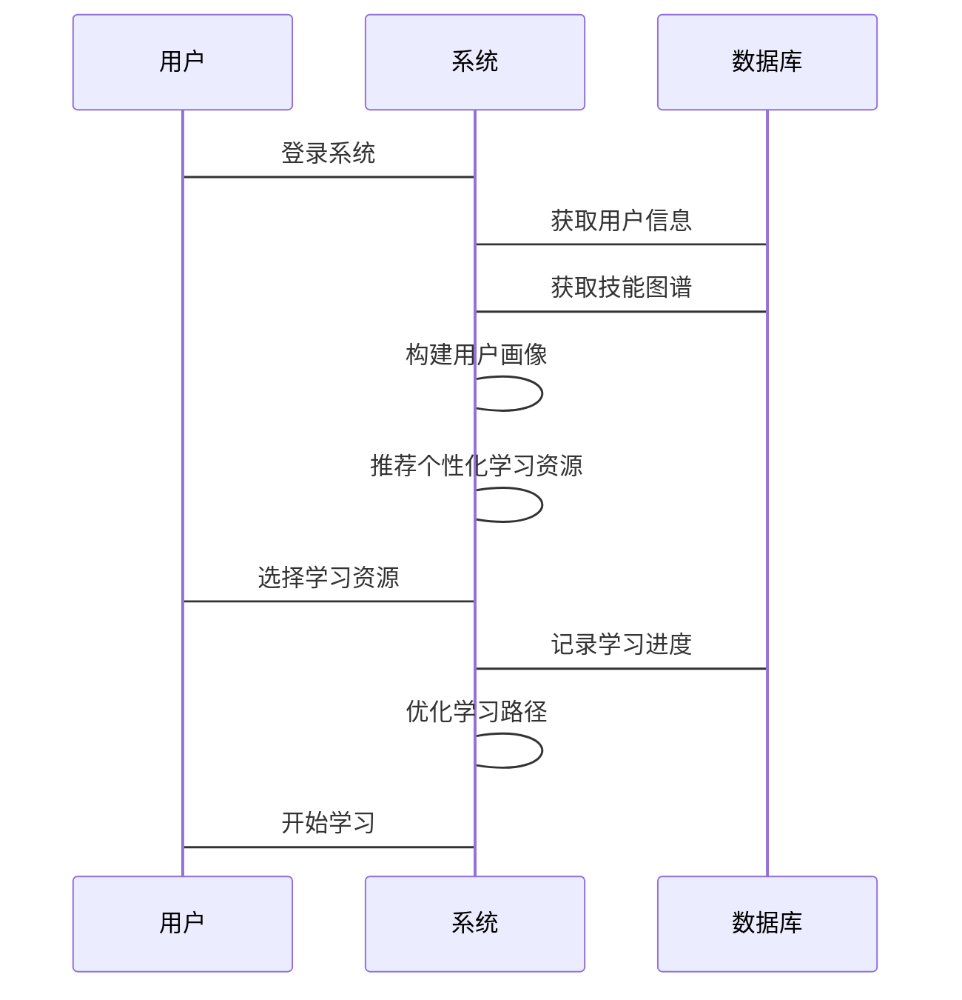

                 


# 构建智能企业学习管理系统：技能图谱与个性化发展规划

## 关键词：智能学习管理系统、技能图谱、个性化学习、协同过滤、系统架构、机器学习、企业培训

## 摘要：本文将深入探讨如何构建一个智能企业学习管理系统，重点介绍技能图谱与个性化学习规划的核心概念、算法原理及系统架构。通过结合理论与实践，本文将详细讲解如何利用协同过滤推荐算法和系统架构设计，实现个性化学习路径推荐和技能图谱动态更新，从而为企业提供高效、精准的学习管理解决方案。

---

# 第一部分：背景介绍

## 第1章：智能企业学习管理系统概述

### 1.1 问题背景与挑战
#### 1.1.1 传统企业学习管理的局限性
传统的企业学习管理系统主要依赖于固定课程和简单的学习路径推荐，难以满足员工个性化学习需求。学习资源分散、学习路径单一、学习效果难以评估等问题普遍存在。

#### 1.1.2 智能化学习管理的需求
随着人工智能技术的发展，企业学习管理系统需要具备智能化能力，能够根据员工的学习行为、技能水平和职业目标，动态调整学习计划，推荐个性化学习资源。

#### 1.1.3 技能图谱与个性化学习的重要性
技能图谱是将企业所需技能进行结构化表示的工具，通过构建技能图谱，可以清晰地展示技能之间的关系和依赖，为个性化学习规划提供基础。

---

## 第2章：技能图谱与个性化学习的核心概念

### 2.1 技能图谱的构建原理
#### 2.1.1 技能节点与关系
技能节点是技能图谱的基本单位，每个节点代表一种具体的技能。节点之间的关系可以是“依赖”或“并列”。

#### 2.1.2 技能图谱的构建方法
技能图谱的构建可以通过以下步骤进行：
1. 收集企业所需的所有技能。
2. 确定技能之间的关系。
3. 构建技能图谱的结构化数据。

#### 2.1.3 技能图谱的动态更新机制
技能图谱需要根据企业的变化（如新技能的引入、技能关系的调整）进行动态更新，以保持其准确性和实用性。

### 2.2 个性化学习规划的算法原理
#### 2.2.1 基于用户画像的学习需求分析
通过收集用户的背景信息、学习记录和职业目标，构建用户画像，分析用户的学习需求。

#### 2.2.2 基于技能图谱的路径推荐
根据用户的当前技能水平和目标技能，结合技能图谱中的关系，推荐最优的学习路径。

#### 2.2.3 个性化学习计划的生成与优化
基于推荐的学习路径，生成个性化学习计划，并根据用户的学习反馈进行动态优化。

### 2.3 技能图谱与个性化学习的关系
#### 2.3.1 技能图谱作为学习规划的基础
技能图谱为个性化学习规划提供了结构性的知识基础，帮助学习管理系统理解技能之间的关系。

#### 2.3.2 个性化学习驱动技能图谱的优化
通过分析用户的个性化学习行为，技能图谱可以不断优化和调整，更好地满足用户的学习需求。

#### 2.3.3 技能图谱与个性化学习的协同进化
技能图谱和个性化学习之间存在相互促进的关系，技能图谱为个性化学习提供支持，个性化学习反过来推动技能图谱的完善。

### 2.4 技能图谱的ER实体关系图
```mermaid
erDiagram
    user {
        id : int
        name : string
        skills : set of skill
    }
    skill {
        id : int
        name : string
        level : int
        prerequisites : set of skill
    }
    user -> skill : "学习"
```

### 2.5 本章小结
本章介绍了技能图谱和个性化学习的核心概念，并通过ER图展示了技能图谱的实体关系。技能图谱为个性化学习提供了结构化知识基础，而个性化学习则通过动态调整技能图谱，使其更加精准和实用。

---

# 第二部分：算法原理讲解

## 第3章：基于协同过滤的推荐算法

### 3.1 协同过滤推荐算法概述
协同过滤是一种基于用户行为数据的推荐算法，通过分析用户之间的相似性或物品之间的相似性，推荐用户可能感兴趣的内容。

#### 3.1.1 基于用户的协同过滤
基于用户的协同过滤算法通过计算用户之间的相似性，找到与目标用户相似的其他用户，然后推荐这些用户喜欢的技能或课程。

#### 3.1.2 基于物品的协同过滤
基于物品的协同过滤算法通过计算技能或课程之间的相似性，找到与目标用户已学习技能相似的其他技能或课程，进行推荐。

#### 3.1.3 混合推荐算法
混合推荐算法结合了基于用户和基于物品的协同过滤算法，利用两者的优势，提高推荐的准确性和多样性。

### 3.2 协同过滤推荐算法的实现
#### 3.2.1 数据预处理
需要对学习数据进行清洗和标准化处理，提取用户的学习行为数据。

#### 3.2.2 相似度计算
使用余弦相似度或杰卡德相似度等方法，计算用户或技能之间的相似度。

#### 3.2.3 推荐生成
根据相似度排序，选择最相关的技能或课程进行推荐。

### 3.3 协同过滤推荐算法的数学模型
协同过滤推荐算法的数学模型可以用以下公式表示：
$$
similarity(u, v) = \frac{\sum_{i=1}^{n} (r_{ui} - \bar{r_u})(r_{vi} - \bar{r_v})}{\sqrt{\sum_{i=1}^{n} (r_{ui} - \bar{r_u})^2} \sqrt{\sum_{i=1}^{n} (r_{vi} - \bar{r_v})^2}}
$$

其中：
- $similarity(u, v)$ 表示用户 $u$ 和用户 $v$ 之间的相似度。
- $r_{ui}$ 表示用户 $u$ 对物品 $i$ 的评分。
- $\bar{r_u}$ 表示用户 $u$ 的平均评分。

### 3.4 协同过滤推荐算法的实现步骤
#### 3.4.1 数据收集与预处理
收集用户的学习数据，包括学习记录、技能掌握程度等。

#### 3.4.2 构建用户-技能矩阵
将用户和技能的关系表示为矩阵，其中矩阵元素表示用户对技能的掌握程度。

#### 3.4.3 计算相似度
使用协同过滤算法计算用户之间的相似度或技能之间的相似度。

#### 3.4.4 生成推荐列表
根据相似度排序，生成推荐的技能列表。

### 3.5 协同过滤推荐算法的优缺点
#### 优点
- 能够发现用户的潜在需求。
- 实现相对简单，易于理解。

#### 缺点
- 对数据稀疏性敏感，难以处理冷启动问题。
- 计算复杂度较高，不适合大规模数据。

### 3.6 协同过滤推荐算法的应用案例
通过一个简单的Python代码示例，展示如何实现基于用户的协同过滤推荐算法：

```python
import numpy as np

def compute_similarity(user_matrix):
    # 计算用户之间的相似度
    user_num, skill_num = user_matrix.shape
    similarity = np.zeros((user_num, user_num))
    for i in range(user_num):
        for j in range(user_num):
            if i == j:
                similarity[i][j] = 0
                continue
            # 计算余弦相似度
            dot_product = np.dot(user_matrix[i], user_matrix[j])
            norm_i = np.linalg.norm(user_matrix[i])
            norm_j = np.linalg.norm(user_matrix[j])
            if norm_i == 0 or norm_j == 0:
                similarity[i][j] = 0
            else:
                similarity[i][j] = dot_product / (norm_i * norm_j)
    return similarity

# 示例数据：用户-技能矩阵
user_matrix = np.array([[4, 3, 2],
                         [2, 4, 5],
                         [1, 2, 3]])

similarity = compute_similarity(user_matrix)
print(similarity)
```

### 3.7 本章小结
本章详细讲解了协同过滤推荐算法的原理、实现步骤及其优缺点，并通过Python代码示例展示了算法的实现过程。协同过滤推荐算法是构建智能企业学习管理系统的重要工具，能够有效推荐个性化学习资源。

---

# 第三部分：系统架构设计

## 第4章：智能企业学习管理系统的架构设计

### 4.1 系统功能设计
智能企业学习管理系统需要实现以下核心功能：
1. **技能图谱管理**：构建和维护技能图谱。
2. **用户画像构建**：收集和分析用户数据，构建用户画像。
3. **个性化推荐**：基于技能图谱和用户画像，推荐个性化学习资源。
4. **学习路径规划**：根据用户的学习进度，动态调整学习路径。
5. **学习效果评估**：评估用户的学习效果，优化学习计划。

### 4.2 系统架构设计
系统架构设计分为以下几部分：
1. **数据层**：存储用户数据、技能数据和学习记录。
2. **服务层**：实现技能图谱构建、用户画像构建和推荐算法。
3. **界面层**：提供用户友好的操作界面。

#### 4.2.1 系统架构图


#### 4.2.2 接口设计
系统需要提供以下接口：
1. **用户数据接口**：用于获取用户的基本信息和学习记录。
2. **技能图谱接口**：用于获取和更新技能图谱数据。
3. **推荐接口**：用于获取个性化推荐结果。
4. **学习路径接口**：用于获取和更新学习路径。

#### 4.2.3 交互流程
1. 用户登录系统，系统获取用户的基本信息。
2. 系统根据用户的学习记录构建用户画像。
3. 系统基于技能图谱和用户画像，推荐个性化学习资源。
4. 用户选择学习资源，系统记录学习进度。
5. 系统根据学习进度优化学习路径。

#### 4.2.4 序列图


### 4.3 系统实现的注意事项
1. **数据安全**：确保用户数据的安全性，防止数据泄露。
2. **性能优化**：优化算法和数据库查询，提高系统响应速度。
3. **用户体验**：设计用户友好的界面，提升用户体验。

### 4.4 本章小结
本章详细介绍了智能企业学习管理系统的架构设计，包括系统功能设计、架构设计、接口设计和交互流程。通过合理的架构设计，可以实现高效的系统运行和良好的用户体验。

---

# 第四部分：项目实战

## 第5章：智能企业学习管理系统的实现

### 5.1 环境安装与配置
#### 5.1.1 安装Python和必要的库
需要安装以下Python库：
- `numpy`
- `pandas`
- `scikit-learn`
- `mermaid`

安装命令：
```bash
pip install numpy pandas scikit-learn mermaid
```

#### 5.1.2 安装数据库
选择一个合适的数据库，如MySQL或MongoDB，并安装相应的驱动。

### 5.2 系统核心功能实现
#### 5.2.1 技能图谱构建
实现技能图谱的构建，包括技能节点和关系的定义。

```python
from collections import defaultdict

class SkillGraph:
    def __init__(self):
        self.skills = defaultdict(list)

    def add_skill(self, skill_name, prerequisites):
        self.skills[skill_name] = prerequisites

    def get_prerequisites(self, skill_name):
        return self.skills[skill_name]

# 示例技能图谱
skill_graph = SkillGraph()
skill_graph.add_skill("数据分析", ["数据处理", "统计学"])
skill_graph.add_skill("机器学习", ["数据分析", "线性代数"])
skill_graph.add_skill("深度学习", ["机器学习", "神经网络"])
```

#### 5.2.2 用户画像构建
基于用户的学习记录，构建用户画像。

```python
import pandas as pd

# 示例用户数据
data = {
    "用户ID": [1, 2, 3],
    "姓名": ["张三", "李四", "王五"],
    "技能水平": [ {"数据分析": 3, "机器学习": 2}, {"数据分析": 4, "机器学习": 3}, {"数据分析": 2, "机器学习": 1} ]
}

df = pd.DataFrame(data)
```

#### 5.2.3 个性化推荐实现
基于协同过滤算法，实现个性化推荐。

```python
from sklearn.metrics.pairwise import cosine_similarity

# 示例用户-技能矩阵
user_skill_matrix = np.array([
    [4, 3, 2],
    [2, 4, 5],
    [1, 2, 3]
])

# 计算相似度矩阵
similarity_matrix = cosine_similarity(user_skill_matrix)

# 推荐技能
def recommend_skills(similarity_matrix, user_id, top_n=3):
    sorted_indices = np.argsort(similarity_matrix[user_id])[::-1]
    recommended_skills = []
    for idx in sorted_indices:
        if idx != user_id:
            recommended_skills.append(idx)
            if len(recommended_skills) == top_n:
                break
    return recommended_skills

# 示例推荐
user_id = 0
recommended = recommend_skills(similarity_matrix, user_id)
print(f"推荐结果：{recommended}")
```

### 5.3 项目实战案例分析
通过一个具体的案例，展示如何利用技能图谱和个性化推荐算法，为用户制定个性化学习计划。

#### 5.3.1 案例背景
假设企业需要培养数据分析师，用户是一名新员工，需要掌握数据分析、机器学习等技能。

#### 5.3.2 技能图谱构建
构建数据分析相关的技能图谱，包括数据处理、统计学、机器学习等技能。

#### 5.3.3 用户画像构建
基于用户的背景信息和学习记录，构建用户画像，分析用户的学习需求。

#### 5.3.4 个性化推荐
根据技能图谱和用户画像，推荐适合用户的学习路径，如先学习数据处理，再学习统计学，最后学习机器学习。

### 5.4 代码实现与解读
详细解读上述代码实现，说明每部分代码的功能和作用。

### 5.5 项目总结
总结项目实现的关键点和成功经验，提出改进建议。

---

# 第五部分：总结与展望

## 第6章：总结与展望

### 6.1 本项目总结
通过本项目的实现，我们成功构建了一个智能企业学习管理系统，实现了技能图谱构建、用户画像构建和个性化推荐功能。

### 6.2 项目最佳实践
1. **数据质量管理**：确保数据的准确性和完整性。
2. **算法优化**：根据实际需求，优化推荐算法，提高推荐准确率。
3. **系统维护**：定期更新技能图谱，优化系统性能。

### 6.3 未来展望
1. **引入深度学习技术**：利用深度学习技术，进一步提高推荐算法的准确性。
2. **多模态学习**：结合文本、视频等多种形式的学习资源，提供更丰富的学习体验。
3. **实时反馈机制**：建立实时反馈机制，动态调整学习计划。

### 6.4 本章小结
本章总结了项目的实现成果，并提出了未来的发展方向。智能企业学习管理系统具有广阔的应用前景，随着技术的进步，系统将更加智能化和个性化。

---

# 附录

## 附录A：技能图谱构建工具

- **工具1**：手动构建工具
- **工具2**：基于规则的自动构建工具
- **工具3**：基于机器学习的自动构建工具

## 附录B：协同过滤推荐算法的Python代码

```python
import numpy as np
from sklearn.metrics.pairwise import cosine_similarity

# 示例数据：用户-技能矩阵
user_skill_matrix = np.array([
    [4, 3, 2],
    [2, 4, 5],
    [1, 2, 3]
])

# 计算相似度矩阵
similarity_matrix = cosine_similarity(user_skill_matrix)

# 推荐技能
def recommend_skills(similarity_matrix, user_id, top_n=3):
    sorted_indices = np.argsort(similarity_matrix[user_id])[::-1]
    recommended_skills = []
    for idx in sorted_indices:
        if idx != user_id:
            recommended_skills.append(idx)
            if len(recommended_skills) == top_n:
                break
    return recommended_skills

# 示例推荐
user_id = 0
recommended = recommend_skills(similarity_matrix, user_id)
print(f"推荐结果：{recommended}")
```

---

# 参考文献

1. 《协同过滤推荐算法原理与实现》
2. 《技能图谱构建方法研究》
3. 《智能企业学习管理系统设计》

---

通过以上目录和内容，您可以系统地学习和实现智能企业学习管理系统的构建。

